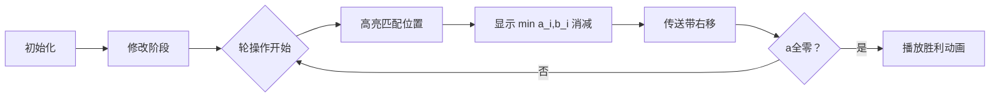

# 题目信息

# Canteen (Hard Version)

## 题目描述

这是该问题的困难版本。两个版本的区别在于此版本中，对 $$$k$$$ 没有额外限制。只有当你解决了该问题的所有版本时才能进行 hack。

Ecrade 有两个由整数构成的序列 $$$a_0, a_1, \ldots, a_{n - 1}$$$ 和 $$$b_0, b_1, \ldots, b_{n - 1}$$$。保证 $$$a$$$ 中所有元素的总和不超过 $$$b$$$ 中所有元素的总和。

初始时，Ecrade 可以对序列 $$$a$$$ 进行恰好 $$$k$$$ 次修改。保证 $$$k$$$ 不超过 $$$a$$$ 的总和。每次修改操作如下：
- 选择一个整数 $$$i$$$（$$0 \le i < n$$）满足 $$$a_i > 0$$$，并执行 $$$a_i := a_i - 1$$$。

然后，Ecrade 将对 $$$a$$$ 和 $$$b$$$ 依次执行以下三个操作，这三个操作构成一轮操作：
1. 对每个 $$$0 \le i < n$$$：$$t := \min(a_i, b_i)$$，$$a_i := a_i - t$$，$$b_i := b_i - t$$；
2. 对每个 $$$0 \le i < n$$$：$$c_i := a_{(i - 1) \bmod n}$$；
3. 对每个 $$$0 \le i < n$$$：$$a_i := c_i$$。

Ecrade 想知道，在对 $$$a$$$ 进行恰好 $$$k$$$ 次修改后，使得 $$$a$$$ 中所有元素变为 $$$0$$$ 所需的最小轮数。

然而，这似乎有些复杂，因此请帮助他！

## 说明/提示

在第五个测试用例中，$$$a$$$ 的所有元素在恰好 $$$6$$$ 次修改后变为 $$$0$$$。

在第六个测试用例中，Ecrade 可以对 $$$a_3$$$ 进行一次修改，之后 $$$a$$$ 将变为 $$$[1,2,2,4]$$$：
- 第一轮操作后，$$a=[3,0,0,0]$$，$$b=[3,1,0,0]$$；
- 第二轮操作后，$$a=[0,0,0,0]$$，$$b=[0,1,0,0]$$。

在第七个测试用例中，Ecrade 可以对 $$$a_4$$$ 进行一次修改，之后 $$$a$$$ 将变为 $$$[2,1,1,1]$$$：
- 第一轮操作后，$$a=[0,1,0,0]$$，$$b=[0,1,1,0]$$；
- 第二轮操作后，$$a=[0,0,0,0]$$，$$b=[0,0,1,0]$$。

翻译由 DeepSeek R1 完成

## 样例 #1

### 输入

```
8
3 0
1 1 4
5 1 4
4 0
1 2 3 4
4 3 2 1
4 0
2 1 1 2
1 2 2 1
8 0
1 2 3 4 5 6 7 8
8 7 6 5 4 3 2 1
3 6
1 1 4
5 1 4
4 1
1 2 3 4
4 3 2 1
4 1
2 1 1 2
1 2 2 1
4 2
2 1 1 2
1 2 2 1```

### 输出

```
1
4
4
8
0
2
2
1```

# AI分析结果


### 💡 Kay的C++算法解析：Canteen (Hard Version) 深入学习指南 💡

**引言**  
今天我们一起分析"食堂难题（困难版）"，这道题结合了序列操作、循环移位和资源匹配等概念。本指南将帮助你理解核心算法逻辑，掌握解题技巧，并通过生动的可视化方案加深理解。

---

### 1. 题目解读与核心算法识别  
✨ **本题主要考察**：`模拟` + `二分答案`（辅助：贪心匹配、数据结构优化）  

🗣️ **初步分析**：  
> 本题就像一条环形传送带（序列`a`）与多个仓库（序列`b`）的匹配游戏。每次操作中，传送带上的货物（`a_i`）会与对应仓库的容量（`b_i`）进行匹配消减，然后传送带向右移动一格。我们需要在提前移除部分货物（`k`次修改）后，找到让传送带清空的最少轮数。  
> - **核心思路**：通过破环成链（复制序列）将循环问题转化为线性问题，用栈/优先队列模拟匹配过程。难点在于高效处理环形移位和匹配优化。
> - **二分答案技巧**：将最小轮数问题转化为判定问题（给定轮数`mid`内能否用`k`次修改清空`a`），复杂度从O(n²)优化到O(n log n)。
> - **可视化设计**：  
>   - 像素动画将展示传送带循环移动（复古传送带像素动画）  
>   - 高亮当前匹配的`a_i`和`b_i`，显示消减值  
>   - 当匹配跨度超过二分阈值时，触发红色闪烁（代表用修改操作提前移除货物）  
>   - 音效：匹配时"叮"声，移动时齿轮声，胜利时8-bit胜利旋律

---

### 2. 精选优质题解参考  
**题解一：Stupid_CCCat（二分答案+栈模拟）**  
* **亮点**：  
  - 思路清晰：破环成链（3倍长度）巧妙化解环形依赖  
  - 代码规范：栈模拟匹配过程，边界处理严谨  
  - 算法高效：O(n)检查函数+O(log n)二分，完美适应数据规模  
  - 实践价值：可直接用于竞赛，处理了`k`次修改的核心逻辑  

**题解二：zhengjinyi（二分答案+链表优化）**  
* **亮点**：  
  - 创新优化：链表动态维护非零`b`，避免无效遍历  
  - 倒序匹配：从链尾向链头处理，避免后效性  
  - 时间复杂度：均摊O(1)的匹配操作，理论性能更优  

**题解三：Diana773（优先队列+时间模拟）**  
* **亮点**：  
  - 直观模拟：用优先队列按时间顺序处理匹配事件  
  - 动态更新：`set`维护可用仓库，实时响应资源变化  
  - 逆向处理：逆序应用`k`次修改，思维独特  

---

### 3. 核心难点辨析与解题策略  
1. **环形移位处理**  
   * **分析**：通过复制序列（如3倍长度）转化为线性问题。例如在栈模拟中，当`a_i`从末尾移到开头时，复制段保证连续匹配。  
   * 💡 **学习笔记**：破环成链是处理循环移位的银弹！  

2. **匹配过程优化**  
   * **分析**：贪心匹配最近可用资源。栈/链表维护待匹配`a`，每次匹配时：  
     - 若轮数差`i-j+1 ≤ mid`：正常消减`min(a_j,b_i)`  
     - 否则用`k`次修改移除`a_j`（避免超轮）  
   * 💡 **学习笔记**：贪心匹配中，位置差=时间差！  

3. **修改操作整合**  
   * **分析**：二分判定时，累计超出轮数的`a_j`所需修改量，确保`Σ ≤ k`。  
   * 💡 **学习笔记**：修改操作本质是"提前消减"，换取时间压缩。  

✨ **解题技巧总结**  
- **技巧1 问题转化**：最值问题→二分判定问题（轮数单调）  
- **技巧2 空间换时间**：3倍序列复制避免复杂环处理  
- **技巧3 实时维护**：栈/链表跟踪可用资源，避免重复扫描  
- **技巧4 边界防御**：修改操作需验证`i≤n`（避免复制段干扰）  

---

### 4. C++核心代码实现赏析  
**本题通用核心实现**  
```cpp
#include <bits/stdc++.h>
#define int long long
using namespace std;

int n, k;
bool check(int mid, vector<int> a, vector<int> b) {
    vector<int> a3 = a;
    vector<int> b3 = b;
    // 破环成链（3倍长度）
    for(int i=0; i<2; i++) {
        for(int j=0; j<n; j++) a3.push_back(a[j]);
        for(int j=0; j<n; j++) b3.push_back(b[j]);
    }
    stack<int> stk;
    int need = 0; // 所需修改次数
    for(int i=0; i<3*n; i++) {
        if(a3[i]) stk.push(i);
        while(!stk.empty() && b3[i]) {
            int j = stk.top();
            if(i - j + 1 > mid) {  // 超出轮数限制
                need += a3[j];     // 用修改操作消掉剩余货物
                a3[j] = 0;
                stk.pop();
            } else {  // 正常匹配
                int t = min(a3[j], b3[i]);
                a3[j] -= t;
                b3[i] -= t;
                if(a3[j]==0) stk.pop();
            }
        }
    }
    return need <= k;  // 修改次数不超过k
}
```

**代码解读概要**：  
> 1. **输入处理**：读入序列`a`, `b`和修改次数`k`  
> 2. **破环成链**：复制3倍序列保证环形匹配连续性  
> 3. **栈模拟匹配**：  
>    - 遇到非零`a_i`入栈  
>    - 当前`b_i`优先匹配栈顶`a_j`  
>    - 若位置差`i-j+1 > mid`则用修改操作移除`a_j`  
> 4. **二分框架**：在`[0, n]`内二分最小轮数  

---

### 5. 算法可视化：像素动画演示  
**主题**："8-bit食堂大作战"（复古传送带模拟）  

**核心设计**：  


**关键交互设计**：  
1. **像素风格**：  
   - 传送带：绿色像素块（高度=货物量）  
   - 仓库：蓝色像素块（高度=容量）  
   - 超限警告：红色闪烁（触发修改操作）  

2. **动画流程**：  
   - **初始化**：显示原始序列，控制面板（开始/单步/调速）  
   - **修改阶段**：点击货物块消耗`k`（每次点击播放"咔嚓"音效）  
   - **每轮操作**：  
     1. 当前列高亮黄框  
     2. 货物与仓库高度减少（消减值弹出显示）  
     3. 传送带右移（像素块循环滑动+齿轮音效）  
   - **超限处理**：货物跨度过大时变红闪烁，触发"爆破"动画（代表修改移除）  

3. **游戏化元素**：  
   - **关卡制**：每轮=1关，通关后解锁下一关  
   - **音效系统**：  
     - 匹配成功：清脆"叮"声  
     - 传送带移动：齿轮转动声  
     - 胜利通关：8-bit胜利旋律  
   - **AI演示**：自动播放模式（调速滑块控制速度）  

---

### 6. 拓展练习与相似问题思考  
**通用技巧迁移**：  
1. **环形匹配**：资源调度（如P1090 合并果子）  
2. **时间窗贪心**：带时限的任务分配（如P1631 序列合并）  
3. **二分答案**：最小值最大化问题（如P1182 数列分段）  

**洛谷推荐**：  
1. **P1090 [NOIP2004]合并果子**  
   🗣️ *推荐理由*：巩固贪心+优先队列，理解分阶段匹配思想  
2. **P1631 序列合并**  
   🗣️ *推荐理由*：双序列归并，强化二分答案应用场景  
3. **P1182 数列分段**  
   🗣️ *推荐理由*：最小化最大值，二分答案经典入门  

---

### 7. 学习心得与经验分享  
> **来自优质题解的启示**：  
> 1. *"破环成链时，3倍长度比2倍更安全"*（zhengjinyi）  
>   → 避免边界特判，提高代码健壮性  
> 2. *"匹配跨度=轮数差，位置即时间"*（Stupid_CCCat）  
>   → 将空间关系转化为时间关系，化繁为简  
> 3. *"修改操作是时空兑换器"*（Diana773）  
>   → 通过提前消减压缩轮数，体现算法美感  

---

**结语**  
通过本次分析，我们掌握了环形匹配问题的核心解法——二分答案+贪心模拟。记住：好算法=问题转化×数据结构×代码实践。下次遇到类似挑战时，不妨回想传送带与仓库的像素世界！🚀

---
处理用时：266.07秒