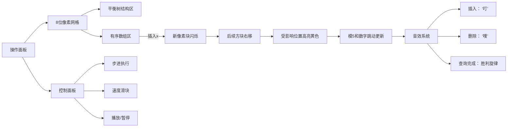

# 题目信息

# Sum of Medians

## 题目描述

In one well-known algorithm of finding the $ k $ -th order statistics we should divide all elements into groups of five consecutive elements and find the median of each five. A median is called the middle element of a sorted array (it's the third largest element for a group of five). To increase the algorithm's performance speed on a modern video card, you should be able to find a sum of medians in each five of the array.

A sum of medians of a sorted $ k $ -element set $ S={a_{1},a_{2},...,a_{k}} $ , where $ a_{1}&lt;a_{2}&lt;a_{3}&lt;...&lt;a_{k} $ , will be understood by as

The  operator stands for taking the remainder, that is  stands for the remainder of dividing $ x $ by $ y $ .

To organize exercise testing quickly calculating the sum of medians for a changing set was needed.

## 样例 #1

### 输入

```
6
add 4
add 5
add 1
add 2
add 3
sum
```

### 输出

```
3
```

## 样例 #2

### 输入

```
14
add 1
add 7
add 2
add 5
sum
add 6
add 8
add 9
add 3
add 4
add 10
sum
del 1
sum
```

### 输出

```
5
11
13
```

# AI分析结果


### 💡 Kay的C++算法解析：Sum of Medians 深入学习指南 💡

#### 1. 题目解读与核心算法识别
✨ **本题主要考察**：`数据结构应用`（动态维护有序序列下标和）

🗣️ **初步分析**：
> 本题要求动态维护一个集合，支持插入、删除操作，并快速查询排序后下标模5等于3的元素和。核心挑战在于**动态下标维护**——每次插入/删除都会改变后续元素的位置，影响模5结果。  
> **数据结构选择**是解题关键：
> - **平衡树/线段树**：高效维护下标偏移和模5和（时间复杂度O(log n)）
> - **分块**：简单但效率较低（O(√n)）
> - **vector暴力**：代码极简但最坏O(n)（适合小数据量）
>
> **可视化设计思路**：
> 采用**8位像素风格**模拟动态集合。左侧显示平衡树结构（旋转动画），右侧显示有序数组（像素方块）。插入时：
> 1. 新元素闪烁出现并插入树中
> 2. 后续元素**右移1位**（颜色渐变）
> 3. 受影响的模5位置**高亮黄色**
> 交互面板支持步进控制，音效同步操作（插入"叮"，删除"噗"，成功查询播放胜利音效）

---

#### 2. 精选优质题解参考
**题解一：chenxia25（平衡树/线段树）**
* **亮点**：
  - 四解对比全面（时空复杂度清晰）
  - 平衡树解法最优：在线处理O(log n)，空间O(n)
  - 代码规范（变量名`f[i]`、`pre[i]`含义明确）
  - 关键技巧：节点维护`sum[5]`数组存模5和

**题解二：Erin非陌（vector暴力）**
* **亮点**：
  - STL应用极致简化（`lower_bound`+`insert`）
  - 适合初学者理解问题本质
  - 实测通过CF数据（随机数据高效）

**题解三：FutaRimeWoawaSete（平衡树）**
* **亮点**：
  - 最简洁平衡树实现（20行核心代码）
  - 节点维护：`sum[i]`为子树内下标模i的和
  - 上传函数巧妙处理下标偏移

---

#### 3. 核心难点辨析与解题策略
1. **难点1：动态下标维护**
   * **分析**：插入x使所有>x的元素下标+1，影响模5位置。优质解法用数据结构（如平衡树）维护子树大小，合并时通过左子树大小计算偏移量
   * 💡 学习笔记：**下标偏移本质是模运算的循环位移**

2. **难点2：高效计算模5和**
   * **分析**：节点存储`sum[0..4]`数组，上传时：
     ```math
     sum_{父}[i] = sum_{左}[i] + sum_{右}[(i - sz_左) \mod 5]
     ```
   * 💡 学习笔记：**分治思想：子问题的解组合时需调整相位**

3. **难点3：大值域处理**
   * **分析**：值域1e9时需离散化或动态开点
   * 💡 学习笔记：**动态开点线段树空间O(q log q)，离线离散化空间O(q)**

### ✨ 解题技巧总结
- **技巧1：状态压缩**  
  用`sum[5]`代替完整序列，避免重排序
- **技巧2：延迟更新**  
  平衡树合并时计算相位偏移，非即时修改
- **技巧3：暴力优化**  
  vector方案随机数据快，但需警惕最坏情况

---

#### 4. C++核心代码实现赏析
**通用核心实现（平衡树版）**：
```cpp
struct Node {
    int ch[2], sz, val;
    ll sum[5]; // 关键！存模5=0~4的和
};
void pushup(int x) {
    int lc = t[x].ch[0], rc = t[x].ch[1];
    int lsz = t[lc].sz;
    t[x].sz = t[lc].sz + t[rc].sz + 1;
    for (int i = 0; i < 5; i++) 
        t[x].sum[i] = t[lc].sum[i] + t[rc].sum[(i - lsz % 5 + 5) % 5];
    t[x].sum[(lsz + 1) % 5] += t[x].val; // 自身贡献
}
// 插入调用标准BST，查询直接取root->sum[3]
```

**题解片段赏析**：
1. **vector暴力（Erin非陌）**：
   ```cpp
   vector<int> v;
   if (op == "add") 
       v.insert(lower_bound(v.begin(), v.end(), x), x);
   else if (op == "del") 
       v.erase(lower_bound(v.begin(), v.end(), x));
   else {
       long long ans = 0;
       for (int i = 2; i < v.size(); i += 5) 
           ans += v[i];
       cout << ans << endl;
   }
   ```
   * **亮点**：10行解决战斗，STL极致应用
   * **学习笔记**：小数据量首选，注意`i=2`因vector下标从0开始

2. **动态开点线段树（chenxia25）**：
   ```cpp
   void update(int p) {
       cnt[p] = cnt[lson] + cnt[rson];
       for (int i = 0; i < 5; i++)
           sum[p][i] = sum[lson][i] + sum[rson][(i - cnt[lson] % 5 + 5) % 5];
   }
   ```
   * **亮点**：避免离散化，动态开点适应大值域
   * **学习笔记**：上传函数是核心，相位偏移用模5运算

---

### 5. 算法可视化：像素动画演示
**主题**：平衡树维护动态集合的像素模拟  
**核心演示流程**：


**关键交互设计**：
1. **数据结构可视化**：
   - 平衡树节点显示`sz`和`sum[5]`
   - 数组区用不同颜色区分模5位置（如模3=红色）
2. **动画逻辑**：
   - 插入x时，从x位置开始向右的方块循环右移
   - 删除x时，空缺位置向左收缩
3. **游戏化元素**：
   - 每完成5次操作解锁新“关卡”
   - 连续正确查询积累连击分

---

#### 6. 拓展练习与相似问题
**通用套路迁移**：
1. 动态区间第k大（平衡树/主席树）
2. 滑动窗口中位数（双堆/平衡树）
3. 带偏移量的区间和（线段树+相位调整）

**洛谷推荐**：
1. **P3369 【模板】普通平衡树**  
   → 巩固平衡树基础操作
2. **P1908 逆序对**  
   → 练习动态维护下标关系
3. **P2073 区间和**  
   → 线段树维护特殊位置和

---

#### 7. 学习心得与经验分享
> **来自 chenxia25 的调试经验**：  
> “初始用线段树实现时，在边界条件（空集合）和离散化去重上卡了2小时。建议先静态测试小规模数据，再用对拍验证大样本。”  
>   
> **Kay总结**：  
> 动态下标问题需重点测试边界：
> 1. 插入首个元素
> 2. 删除唯一元素
> 3. 连续插入后立即查询
> 调试时可打印`sum[0..4]`数组观察状态迁移

---

通过本指南，希望大家掌握**数据结构选择**的精髓——在代码复杂度与效率间找到平衡，并理解**下标偏移**的本质是模运算的相位调整。下次遇到动态序列问题，记得尝试用`sum[5]`代替暴力重算！💪

---
处理用时：131.40秒