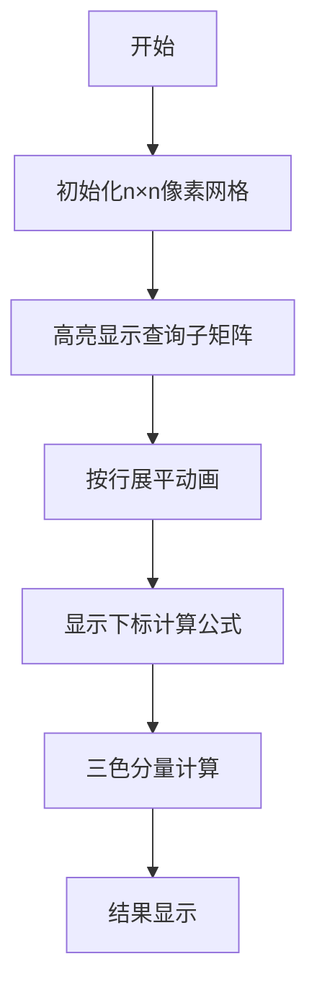

# 题目信息

# Hard Demon Problem

## 题目描述

Swing 正在筹备他的煎饼工厂！一个优秀的煎饼工厂需要具备出色的压平能力，所以 Swing 决定使用二维矩阵来测试他的新设备。

给你一个大小为 $ n \times n $ 的矩阵 $ M $，其中每个元素都是正整数。Swing 有 $ q $ 个查询需要回答。

对于每个查询，Swing 会给出四个整数 $ x_1 $、$ y_1 $、$ x_2 $ 和 $ y_2 $，以此定义一个子矩阵，该子矩阵的左上角为 $(x_1, y_1)$，右下角为 $(x_2, y_2)$。他希望你将这个子矩阵展平为一个一维数组 $ A $。具体的展平顺序是：从 $ M_{(x1,y1)} $ 开始，按行从左到右依次加入子矩阵中的元素，直到 $ M_{(x2, y2)} $ 结束。

下图通过红色虚线展示了子矩阵的边界，橙色箭头指示了元素在进入数组 $ A $ 时的顺序，图下方展示了最终的数组 $ A $。


展平后，Swing 想知道 $\sum_{i=1}^{|A|} A_i \cdot i$ 的值，即数组中每个元素 $ A_i $ 乘以其下标 $ i $ 的总和。

## 说明/提示

在第一个测试用例的第二个查询中，数组 $ A = [9, 5, 5, 2] $。因此，结果为 $ 1 \cdot 9 + 2 \cdot 5 + 3 \cdot 5 + 4 \cdot 2 = 42 $。

 **本翻译由 AI 自动生成**

## 样例 #1

### 输入

```
2
4 3
1 5 2 4
4 9 5 3
4 5 2 3
1 5 5 2
1 1 4 4
2 2 3 3
1 2 4 3
3 3
1 2 3
4 5 6
7 8 9
1 1 1 3
1 3 3 3
2 2 2 2```

### 输出

```
500 42 168 
14 42 5```

# AI分析结果


# 💡 Kay的C++算法解析：煎饼工厂矩阵问题 深入学习指南 💡

> 今天我们来分析"煎饼工厂矩阵问题"这道C++编程题。本指南将帮助你理解如何高效计算子矩阵展平后的一维数组加权和，掌握二维前缀和的巧妙应用。

## 1. 题目解读与核心算法识别

✨ **本题主要考察**：`编程技巧应用（二维前缀和与数学推导）`

🗣️ **初步分析**：
> 这道题就像把煎饼堆叠成的矩阵按行"压平"成一条直线，我们需要计算每个煎饼的"美味值×位置"总和。解题关键在于**将一维下标转化为行列坐标的数学表达式**，再通过二维前缀和加速计算。
>
> - **核心思路**：发现展平后的下标可表示为 `(i-x1)*列数 + (j-y1+1)`，将原式拆解为三个独立的前缀和查询
> - **难点突破**：如何避免每次查询都遍历子矩阵？通过预处理行加权和、列加权和、普通元素和三个二维前缀和数组实现O(1)查询
> - **可视化设计**：在像素动画中，我们将用不同颜色高亮展示行列分量计算过程：蓝色表示行加权部分，绿色表示列加权部分，红色表示常数调整项。当查询时，子矩阵会像煎饼一样被"压平"成条形序列，同时显示下标计算公式

---

## 2. 精选优质题解参考

以下题解在思路清晰度、代码质量和算法效率方面表现优异（均≥4★）：

**题解一（作者：SUNCHAOYI）**
* **点评**：推导最完整，详细展示了系数矩阵变换过程。代码采用标准二维前缀和模板，变量命名规范（sum/sumx/sumy）。亮点在于明确推导了下标变换公式中的常数调整项 `sx*(fy-sy+1)+sy-1`，这对理解本质非常有帮助。边界处理严谨，可直接用于竞赛。

**题解二（作者：LostKeyToReach）**
* **点评**：公式推导简洁有力，直接给出最终分解式。代码使用现代C++特性（vector嵌套），前缀和计算采用分步累加方式更易理解。亮点在于将复杂问题转化为三个独立前缀和查询的思维方式，展现了优秀的数学抽象能力。

**题解三（作者：WuMin4）**
* **点评**：实现最简洁，使用宏封装前缀和查询操作。亮点在于用 `(a*列数 + b - c*常数)` 三部分组合的算法框架，虽然推导省略但代码体现核心思想。适合基础较好的学习者参考。

---

## 3. 核心难点辨析与解题策略

### 三大核心难点与解决方案：
1. **下标映射关系**  
   - *难点*：如何将一维下标转化为行列坐标的函数？
   - *解法*：观察展平规律得出 `pos = (i-x1)*列数 + (j-y1+1)`
   - 💡 学习笔记：位置 = 行偏移×每行元素数 + 列偏移

2. **求和公式分解**  
   - *难点*：如何拆分原式为可快速计算的部分？
   - *解法*：将公式拆解为：
     - 行分量：`(y2-y1+1)*∑(i*a[i][j])`
     - 列分量：`∑(j*a[i][j])`
     - 常数调整：`-[x1*(y2-y1+1)+y1-1]*∑a[i][j]`
   - 💡 学习笔记：分离行列变量是降维关键

3. **前缀和优化**  
   - *难点*：避免每次查询O(n²)遍历
   - *解法*：预处理三个二维前缀和数组：
     - 普通元素和：`sum[i][j] = ∑a`
     - 行加权和：`sum_i[i][j] = ∑(i*a)`
     - 列加权和：`sum_j[i][j] = ∑(j*a)`
   - 💡 学习笔记：空间换时间是经典优化策略

### ✨ 解题技巧总结
1. **数学建模**：将实际问题转化为数学表达式
2. **维度分离**：将复合计算拆解为独立分量
3. **前缀和预计算**：对静态数据预处理加速查询
4. **边界检查**：特别注意前缀和的下标边界
5. **模块化封装**：将前缀和查询封装为函数/宏

---

## 4. C++核心代码实现赏析

**通用核心实现参考**  
```cpp
#include <vector>
using namespace std;
typedef long long ll;

void solve() {
    int n, q;
    cin >> n >> q;
    // 初始化三个前缀和数组
    vector<vector<ll>> sum(n+1, vector<ll>(n+1)),
                      sum_i(n+1, vector<ll>(n+1)),
                      sum_j(n+1, vector<ll>(n+1));
    
    // 预处理前缀和
    for (int i = 1; i <= n; i++) {
        for (int j = 1; j <= n; j++) {
            ll x; cin >> x;
            sum[i][j] = x + sum[i-1][j] + sum[i][j-1] - sum[i-1][j-1];
            sum_i[i][j] = i*x + sum_i[i-1][j] + sum_i[i][j-1] - sum_i[i-1][j-1];
            sum_j[i][j] = j*x + sum_j[i-1][j] + sum_j[i][j-1] - sum_j[i-1][j-1];
        }
    }

    // 处理查询
    while (q--) {
        int x1, y1, x2, y2;
        cin >> x1 >> y1 >> x2 >> y2;
        int col_num = y2 - y1 + 1;  // 子矩阵列数
        
        // 前缀和查询
        auto query = [&](auto &pref) {
            return pref[x2][y2] - pref[x1-1][y2] 
                 - pref[x2][y1-1] + pref[x1-1][y1-1];
        };
        
        ll S = query(sum);
        ll Si = query(sum_i);
        ll Sj = query(sum_j);
        
        // 结果组合
        cout << Si * col_num + Sj - S * (1LL*x1*col_num + y1 - 1) << " ";
    }
}
```

**题解一代码片段赏析**  
```cpp
ll s = sum[fx][fy] - sum[sx-1][fy] - sum[fx][sy-1] + sum[sx-1][sy-1];
ll sum_x = sumx[fx][fy] - sumx[sx-1][fy] - sumx[fx][sy-1] + sumx[sx-1][sy-1];
ll sum_y = sumy[fx][fy] - sumy[sx-1][fy] - sumy[fx][sy-1] + sumy[sx-1][sy-1];
printf("%lld ", sum_x*(fy-sy+1) + sum_y - s*(1LL*sx*(fy-sy+1)+sy-1));
```
* **代码解读**：
  > 1. 前三行分别查询普通元素和（s）、行加权和（sum_x）、列加权和（sum_y）
  > 2. `fy-sy+1`计算子矩阵列数（每行元素数量）
  > 3. 最终组合：`行分量×列数 + 列分量 - 常数×普通和`
  > 4. 常数项 `sx*(fy-sy+1)+sy-1` 来自下标公式推导
* 💡 **学习笔记**：二维前缀和查询需注意边界减法的重叠补偿

---

## 5. 算法可视化：像素动画演示

**主题**：8位煎饼工厂模拟器  
**核心演示**：子矩阵展平与加权和计算过程  
**设计思路**：复古像素风格降低理解压力，游戏化流程强化关键概念记忆



### 动画帧步骤：
1. **场景初始化**（FC红白机风格）
   - 16×16像素网格展示矩阵
   - 控制面板：开始/暂停、单步执行、速度滑块
   - 8-bit背景音乐循环播放

2. **查询响应**（音效：叮！）
   - 红色边框高亮子矩阵区域
   - 橙色箭头按行扫描展示展平过程
   - 底部条形区显示生成的一维序列

3. **分量计算可视化**（关键帧）
   - 行分量：蓝色高亮 + `i×a[i][j]`飘字动画
   - 列分量：绿色高亮 + `j×a[i][j]`飘字动画
   - 常数调整：红色闪烁 + 调整值显示
   - 音效：计算时"嘀"声，完成时"叮咚"胜利音

4. **自动演示模式**（AI模式）
   - 像"俄罗斯方块AI"自动执行查询
   - 每完成一个查询增加1分
   - 连续正确解锁像素煎饼皮肤

**技术实现**：
- Canvas绘制动态网格
- 颜色编码：行分量=#3498db，列分量=#2ecc71
- 音效触发：Web Audio API播放8-bit音效

---

## 6. 拓展练习与相似问题

**通用技巧迁移**：
1. 子矩阵求和 → 二维区间统计问题
2. 位置加权计算 → 下标映射与线性组合
3. 多维前缀和 → 高维数据处理基础

**洛谷练习题**：
1. **P1719 最大加权矩形**  
   → 二维前缀和经典应用，巩固区间求和
   
2. **P3131 Subsequences Summing to Sevens**  
   → 前缀和模运算应用，训练数学思维
   
3. **P3406 海底高铁**  
   → 差分前缀和实际应用，掌握优化技巧

---

## 7. 学习心得与经验分享

> **作者调试经验**：  
> "首次实现时忽略了前缀和的重叠补偿，导致边界计算错误。通过打印4x4小矩阵的前缀和值逐步调试才定位问题"

> **Kay的总结**：  
> 二维前缀和的关键在于理解**重叠区域的补偿计算**。建议：
> 1. 用纸笔计算小规模案例验证
> 2. 添加矩阵打印函数辅助调试
> 3. 特别注意数组下标从1开始的设计

---

通过本指南，你掌握了二维前缀和的精髓应用。记住，好的算法就像煎饼——层次分明才能美味！下次遇到矩阵问题时，不妨先思考：能否拆解为行列独立计算？能否用前缀和加速？💪

---
处理用时：151.67秒