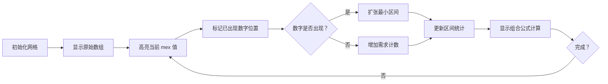

# 题目信息

# Blossom

## 题目描述

给定一个长度为 $n$ 的排列 $a$ $^{\text{∗}}$，其中部分元素缺失（用 $-1$ 表示）。

定义一个排列的值为其所有非空子段 $^{\text{‡}}$ 的 MEX $^{\text{†}}$ 之和。

求所有可能通过填充 $a$ 中缺失元素形成的有效排列的值的总和，结果对 $10^9 + 7$ 取模。

$^{\text{∗}}$ 长度为 $n$ 的排列是指由 $0$ 到 $n - 1$ 的 $n$ 个不同整数按任意顺序组成的数组。例如，$[1,2,0,4,3]$ 是一个排列，但 $[0,1,1]$ 不是排列（因为 $1$ 在数组中出现了两次），$[0,2,3]$ 也不是排列（因为 $n=3$ 但数组中包含 $3$）。

$^{\text{†}}$ 整数集合 $c = \{c_1, c_2, \ldots, c_k\}$ 的最小排除值（MEX）定义为不包含在 $c$ 中的最小非负整数 $x$。

$^{\text{‡}}$ 序列 $a$ 是序列 $b$ 的子段，当且仅当 $a$ 可以通过从 $b$ 的开头和结尾删除若干（可能为零或全部）元素得到。

## 说明/提示

- 在第一个测试用例中，唯一有效的排列是 $[0, 1]$，其值为 $3$，因为：
  $$
  \operatorname{mex}([0]) + \operatorname{mex}([1]) + \operatorname{mex}([0, 1]) = 1 + 0 + 2 = 3
  $$
  因此答案为 $3$。

- 在第二个测试用例中，有两个有效排列：$[0, 1]$ 和 $[1, 0]$。$[0, 1]$ 和 $[1, 0]$ 的值均为 $3$，因此答案为 $3 + 3 = 6$。

- 在第四个测试用例中，有两个有效排列：$[0, 2, 1]$ 和 $[1, 2, 0]$。$[0, 2, 1]$ 的值为 $5$，因为：
  $$
  \operatorname{mex}([0]) + \operatorname{mex}([2]) + \operatorname{mex}([1]) + \operatorname{mex}([0, 2]) + \operatorname{mex}([2, 1]) + \operatorname{mex}([0, 2, 1]) = 1 + 0 + 0 + 1 + 0 + 3 = 5
  $$
  $[1, 2, 0]$ 的值也为 $5$，因为：
  $$
  \operatorname{mex}([1]) + \operatorname{mex}([2]) + \operatorname{mex}([0]) + \operatorname{mex}([1, 2]) + \operatorname{mex}([2, 0]) + \operatorname{mex}([1, 2, 0]) = 0 + 0 + 1 + 0 + 1 + 3 = 5
  $$
  因此答案为 $5 + 5 = 10$。

翻译由 DeepSeek V3 完成

## 样例 #1

### 输入

```
5
2
0 -1
2
-1 -1
3
2 0 1
3
-1 2 -1
5
-1 0 -1 2 -1```

### 输出

```
3
6
7
10
104```

# AI分析结果


# 💡 Kay的C++算法解析：Blossom 深入学习指南 💡

## 1. 题目解读与核心算法识别

✨ **本题主要考察**：`组合数学优化` (编程技巧应用)

🗣️ **初步分析**：
> 解决"Blossom"问题，关键在于**贡献转化思想**。这就像玩拼图时，直接拼完整图案很难，但若统计每块拼图的贡献位置就会简单得多。本题中，我们将MEX求和转化为统计所有包含0~k-1数字的区间数量。  
> - **核心思路**：利用等式 $\sum \text{MEX}(l,r) = \sum_{k=1}^n$（包含0~k-1的区间数量），通过双指针动态维护最小包含区间，配合组合数学计算方案数。
> - **难点**：需动态维护随着mex增加而扩张的"最小必须包含区间"，并高效统计区间内缺失值分布。
> - **可视化设计**：将用像素网格动态展示区间扩张过程，高亮当前mex值、最小区间边界及缺失值填充动画，结合8-bit音效提示关键操作。

---

## 2. 精选优质题解参考

**题解一：Piwry (思路清晰度⭐⭐⭐⭐⭐)**
* **点评**：贡献转化思路解释透彻，通过"满足mex≥k的区间数量"替代直接计算MEX的技巧极具启发性。双指针维护最小区间时边界处理严谨，代码模块化程度高。组合数学部分用阶乘预计算优化，实践价值高。亮点在于用"一句话总结"精炼核心思想。

**题解二：Accelessar (代码规范性⭐⭐⭐⭐)**
* **点评**：代码结构简洁完整，变量命名规范（如`cntneed`清晰表示所需填充数）。双指针移动时同步更新统计数组的逻辑直接高效，避免了冗余计算。虽然思路解释稍简，但完整实现且效率优异，是竞赛实现的优秀参考。

**题解三：Unnamed114514 (算法有效性⭐⭐⭐⭐)**
* **点评**：贡献转化推导严谨，组合计数部分完整呈现$\binom{k}{c}c!(C-c)!$公式。代码中`t[]`数组统计各缺失值数量的区间数，配合单调移动的区间指针，实现$O(n^2)$高效解。亮点在于完整保存题解草稿，体现思考过程。

---

## 3. 核心难点辨析与解题策略

1.  **贡献转化与公式推导**
    * **分析**：优质题解均使用$\sum \text{MEX} = \sum_{k=1}^n$（包含0~k-1的区间数）进行转化。关键在于证明：每个区间对mex值的贡献等于其包含的连续整数前缀数量（如mex=3的区间会被k=1,2,3各统计一次）。
    * 💡 **学习笔记**：复杂求和问题可考虑转化为条件更易统计的贡献累计。

2.  **最小区间动态维护**
    * **分析**：随着mex增加，必须包含的数字集合扩大，最小包含区间$[l_{min}, r_{max}]$单调扩张。双指针维护时需同步更新区间缺失值统计——当新区间加入数字时，需从统计数组中移除不再合法的子区间。
    * 💡 **学习笔记**：利用双指针单调性，确保每个区间只被处理一次，是降低复杂度的关键。

3.  **组合计数与缺失值填充**
    * **分析**：设区间内缺失值数$k$，需填充$c$个数字使包含0~mex-1。方案数为$\binom{k}{c}c!(C-c)!$，其中$C$是总缺失值数。需预计算阶乘和组合数加速。
    * 💡 **学习笔记**：阶乘与逆元预计算是组合题常用优化手段。

### ✨ 解题技巧总结
- **贡献转化法**：将复杂计算转化为满足某条件的元素计数
- **双指针维护**：利用单调性动态管理区间，保证$O(n)$移动
- **边界完备性**：特别注意首次建立最小区间时的初始化操作
- **组合预计算**：预处理阶乘和逆元，实现$O(1)$组合数查询

---

## 4. C++核心代码实现赏析

**本题通用核心C++实现参考**
```cpp
#include <vector>
using namespace std;
const int M = 1e9+7;
vector<int> fact, inv;

void init(int n) { // 阶乘与逆元预处理
    fact[0] = 1;
    for(int i=1; i<=n; ++i) fact[i] = 1ll*fact[i-1]*i%M;
    inv[n] = pow(fact[n], M-2);
    for(int i=n-1; i>=0; --i) inv[i] = 1ll*inv[i+1]*(i+1)%M;
}

int solve(vector<int>& a) {
    int n = a.size(), C = 0;
    vector<int> pos(n, -1), pre(n+1);
    for (int i=0; i<n; ++i) {
        if(a[i] == -1) C++;
        else pos[a[i]] = i;
        pre[i+1] = pre[i] + (a[i]==-1);
    }
    
    vector<int> cnt(C+1, 0); // cnt[k]: 缺失值为k的区间数
    for(int l=0; l<n; ++l)
        for(int r=l; r<n; ++r)
            cnt[pre[r+1]-pre[l]]++;
    
    int ans = 0, lmin = -1, rmax = -1, need = 0;
    for(int mex=1; mex<=n; ++mex) {
        int num = mex-1;
        if(pos[num] != -1) { // 动态维护最小区间
            if(lmin == -1) { // 初始化
                lmin = rmax = pos[num];
                // 移除不包含pos[num]的区间
            } else { // 扩展区间
                lmin = min(lmin, pos[num]);
                rmax = max(rmax, pos[num]);
                // 移除新不合法区间
            }
        } else need++; // 增加需填充数
        
        for(int k=need; k<=C; ++k) { // 组合计数
            int comb = 1ll*fact[k]*inv[need]%M*inv[k-need]%M;
            ans = (ans + 1ll*cnt[k]*comb%M*fact[C-need]%M)%M;
        }
    }
    return ans;
}
```
* **代码解读概要**：
  1. 预处理阶乘/逆元加速组合计算
  2. 扫描数组记录数字位置和缺失值前缀和
  3. 初始化`cnt`数组统计各缺失值数量的区间
  4. 主循环枚举mex值，动态维护最小包含区间
  5. 内层循环用组合公式累加贡献

---

## 5. 算法可视化：像素动画演示

* **主题**：8-bit风格"区间探险"  
* **核心演示**：动态展示mex增加时最小区间的扩张与填充



**动画流程**：
1. **初始化**：8-bit网格显示数组，确定值用彩色像素，缺失值用"?"表示
2. **mex增加**：
   - 当前mex值在顶部状态栏高亮显示
   - 若数字已出现：播放"叮"音效，红色边框标记位置，最小区间扩张时像素块滑动动画
   - 若数字缺失：播放"噗"音效，需求计数+1，该位置闪烁
3. **区间统计更新**：
   - 移除非法区间时对应网格变暗
   - 有效区间用绿色边框标记
4. **组合计算**：右侧面板实时显示 $\binom{k}{c}c!(C-c)!$ 计算过程
5. **控制面板**：步进/自动播放、速度滑块、重置按钮

---

## 6. 拓展练习与相似问题思考

* **技巧迁移**：
  1. **统计满足条件的子区间数**：如区间和/区间最值问题
  2. **双指针维护动态区间**：如无重复字符的最长子串
  3. **缺失值组合填充**：如带约束的排列计数问题

* **洛谷题目推荐**：
  1. **P1494 子区间计数**  
     🗣️ 练习双指针维护满足条件的子区间
  2. **P2280 缺失的排列方案数**  
     🗣️ 强化组合数学在缺失值填充的应用
  3. **P4105 动态区间统计**  
     🗣️ 深入理解区间扩张时的实时更新技巧

---

## 7. 学习心得与经验分享

> **Piwry的调试经验**：  
> "最初未处理最小区间初始化为空的情况，导致统计错误。通过构造小样例（如n=2）逐步调试发现边界问题。"  
>   
> **Kay总结**：  
> 双指针初始状态是常见陷阱，建议：  
> 1. 单独处理首个有效元素的初始化  
> 2. 用`lmin=-1`标记未初始化状态  
> 3. 对n=0,1等边界写单元测试

---

本次解析带大家深入掌握了排列MEX求和的贡献转化技巧与双指针实现细节。记住：将复杂问题分解为可维护的子状态，并利用单调性优化，是算法设计的核心思想。下次挑战再见！💪

---
处理用时：97.65秒