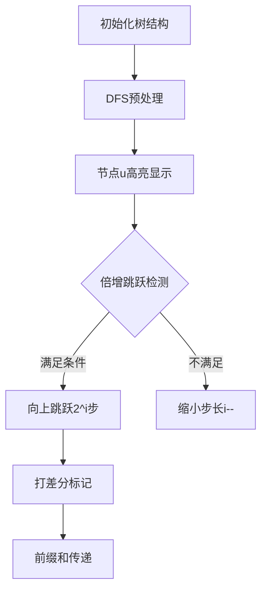

# 题目信息

# Alyona and a tree

## 题目描述

Alyona有一棵有 $n$ 个节点的树。这棵树的根节点是 $1$。在每个节点里，Alyona写了一个正整数，在节点 $i$ 她写了正整数 $a_i$ 。另外，她在这棵树上的每条边上写了一个正整数（不同边上可能有不同的数）。

让我们定义 $dist(v,u)$ 作为从 $v$ 到 $u$ 的简单路径上的边权和。

当且仅当 $u$ 在 $v$ 的子树中并且 $dist(v,u)\leq a_u$，顶点 $v$ 控制顶点 $u(v\neq u)$ 。

Alyona想在某些顶点定居。为了做到这件事，她想知道在每个节点 $v$ 能控制几个节点。

## 说明/提示

在样例中，节点 $1$ 控制了节点 $3$ ，节点 $3$ 控制节点 $5$ （注意，这并不代表节点 $1$ 控制了节点 $5$ ）

Translated by @lolte

## 样例 #1

### 输入

```
5
2 5 1 4 6
1 7
1 1
3 5
3 6
```

### 输出

```
1 0 1 0 0
```

## 样例 #2

### 输入

```
5
9 7 8 6 5
1 1
2 1
3 1
4 1
```

### 输出

```
4 3 2 1 0
```

# AI分析结果


### 💡 Kay的C++算法解析：Alyona and a tree 深入学习指南 💡

#### 题目解读与核心算法识别
✨ **本题主要考察**：`树上差分与倍增优化`  
🗣️ **初步分析**：
> 解决"Alyona and a tree"的关键在于**高效统计子树中满足距离条件的节点**。想象一棵家族树🌳，每个成员（节点）有一个影响力（点权），成员v能控制后代u的条件是：u到v的距离不超过u自身的影响力。  
- **核心思路**：对每个节点u，用倍增法快速定位满足`dist(u,祖先)≤a[u]`的最远祖先，再用树上差分标记影响范围，最后DFS求前缀和得答案  
- **难点突破**：  
  - 暴力向上爬祖先链会超时(O(n²)) → 倍增法跳跃优化(O(n log n))  
  - 路径计数更新效率低 → 树上差分打标记  
- **可视化设计**：在8位像素网格中：  
  - 高亮当前节点u，显示其点权`a[u]`  
  - 演示倍增跳跃过程：从u向上尝试`2^i`步长，满足条件则节点闪烁绿色并播放"跳跃"音效  
  - 打差分标记：u的父节点变蓝(+1)，边界祖先父节点变红(-1)，伴随"叮"声  
  - 前缀和传递：从根向下DFS，节点颜色随值渐变（浅蓝→深蓝）  

---

#### 精选优质题解参考
**题解一（くろねこ | 26赞）**  
* **点评**：从暴力到优化的推导极清晰，图解辅助理解。代码规范：`dis`存储距离，`fa`存父节点，`ansDiff`做差分数组。亮点：  
  - 分步优化：暴力→倍增→树上差分  
  - 边界处理严谨：特判根节点  
  - 实践价值：完整可编译，直接用于竞赛  

**题解二（RedreamMer | 14赞）**  
* **点评**：简洁高效的典型实现。代码短小精悍：  
  - 20行完成倍增定位  
  - 差分标记逻辑清晰：`ans[f[now][0]]--; ans[f[u][0]]++`  
  - 亮点：适合快速掌握核心思路  

**题解三（mol茶蛋糕 | 5赞）**  
* **点评**：直击正解的入门友好版。亮点：  
  - 关键注释：`//差分更新`标注核心逻辑  
  - 变量名直观：`f`存祖先，`ans`存差分数组  
  - 代码简短：70行完整实现  

---

#### 核心难点辨析与解题策略
1. **倍增定位边界祖先**  
   - *分析*：暴力爬链O(n) → 倍增预处理祖先数组`f[u][i]`（u的2^i祖先），O(log n)定位  
   - *学习笔记*：`f[u][i] = f[f[u][i-1]][i-1]`是关键递推式  

2. **树上差分更新路径**  
   - *分析*：路径更新O(n) → 差分标记O(1)：在u的父节点+1，边界祖先父节点-1  
   - *学习笔记*：`ansDiff[f[u][0]]++`和`ansDiff[f[x][0]]--`的配合  

3. **避免重复计算**  
   - *分析*：不能控制自己 → 从父节点开始标记  
   - *学习笔记*：`if(u!=1)`确保根节点无自控  

✨ **解题技巧总结**  
- **技巧1（倍增优化）**：预处理祖先数组加速树上跳跃  
- **技巧2（树上差分）**：路径更新转为两点标记  
- **技巧3（DFS序）**：子树问题转区间问题（备选方案）  
- **技巧4（边界处理）**：根节点特判，距离防溢出(long long)  

---

#### C++核心代码实现赏析
**通用核心实现（综合优化版）**  
```cpp
#include <iostream>
#include <vector>
#include <cstring>
using namespace std;
typedef long long ll;
const int N = 2e5+10, LOG = 18;

vector<pair<int, ll>> g[N]; // {to, weight}
ll a[N], dis[N];           // a[u]:点权, dis[u]:到根距离
int f[N][LOG+1], ansDiff[N], dep[N];

void dfs(int u, int fa) {
    f[u][0] = fa;
    for (int i = 1; i <= LOG; i++)  // 倍增预处理
        f[u][i] = f[f[u][i-1]][i-1];
    
    for (auto [v, w] : g[u]) {
        if (v == fa) continue;
        dis[v] = dis[u] + w;       // 更新距离
        dep[v] = dep[u] + 1;
        dfs(v, u);
    }
}

void markControl(int u) {
    int x = u;  // x: 当前跳跃点
    // 倍增找最远祖先（满足dis[u]-dis[x]<=a[u]）
    for (int i = LOG; i >= 0; i--) {
        if (!f[x][i]) continue;
        if (dis[u] - dis[f[x][i]] <= a[u])
            x = f[x][i];  // 满足条件则跳跃
    }
    if (x != 1) ansDiff[f[x][0]]--; // 边界祖先父节点-1
    if (u != 1) ansDiff[f[u][0]]++; // 当前点父节点+1
}

void collectAns(int u, int fa) {  // 差分转前缀和
    for (auto [v, w] : g[u]) {
        if (v == fa) continue;
        collectAns(v, u);
        ansDiff[u] += ansDiff[v];
    }
}

int main() {
    int n; cin >> n;
    for (int i = 1; i <= n; i++) cin >> a[i];
    for (int i = 2; i <= n; i++) {
        int p; ll w; cin >> p >> w;
        g[p].push_back({i, w});
        g[i].push_back({p, w});  // 无向图建边
    }
    dfs(1, 0);
    for (int i = 1; i <= n; i++) markControl(i);
    collectAns(1, 0);
    for (int i = 1; i <= n; i++) 
        cout << ansDiff[i] << " ";
}
```

**代码解读概要**：  
1. **DFS预处理**：计算深度/距离，构建倍增数组  
2. **markControl**：对每个节点用倍增找边界祖先，更新差分数组  
3. **collectAns**：DFS求前缀和得最终答案  

---

#### 算法可视化：像素动画演示  
**主题**：像素探险家之树的控制 🌲→⭐  
**核心演示流程**：  


**关键交互设计**：  
- **像素风格**：FC红白机色调（4色：绿/红/蓝/黄）  
- **动画细节**：  
  - 跳跃时：节点闪烁绿色，播放"jump.wav"（8-bit音效）  
  - 标记时：父节点变蓝(+1)播"ding.wav"，祖先父节点变红(-1)播"error.wav"  
  - 前缀和：值传递如水流渐变，节点颜色随ansDiff值加深  
- **控制面板**：  
  - 步进控制：← →键单步执行  
  - 速度滑块：调整自动播放速度  
  - 模式切换：按A键切倍增/差分/前缀和视图  

---

#### 拓展练习与相似问题  
**通用技巧迁移**：  
1. 树上路径更新 → [P3128 USACO15DEC 最大流](https://www.luogu.com.cn/problem/P3128)  
2. 倍增LCA应用 → [P3379 【模板】最近公共祖先](https://www.luogu.com.cn/problem/P3379)  
3. 子树统计 → [P4216 情报传递](https://www.luogu.com.cn/problem/P4216)  

**推荐题目**：  
1. **P3258 松鼠的新家**  
   → *Kay提示：差分标记路径，注意端点重复计算*  
2. **P2680 运输计划**  
   → *Kay提示：树上差分+二分答案，挑战性升级*  
3. **CF191C Fools and Roads**  
   → *Kay提示：差分标记路径的经典应用*  

---

#### 学习心得与经验分享  
> **作者くろねこ经验**：  
> *“调试时在DFS中打印`dis[u]`和`f[u][i]`，可视化跳跃过程”*  
>  
> **Kay点评**：  
> 倍增跳跃的步长控制是易错点，建议：  
> 1. 从大到小枚举`i`（`for(int i=20;i>=0;i--)`）  
> 2. 先判断祖先存在性(`f[x][i]`非空)再判距离条件  
> 3. 用`long long`存储距离防溢出  

---

> 掌握树上差分与倍增，如同获得探索树形王国的双剑🗡️✨ 下次挑战见！ ——Kay

---
处理用时：182.83秒