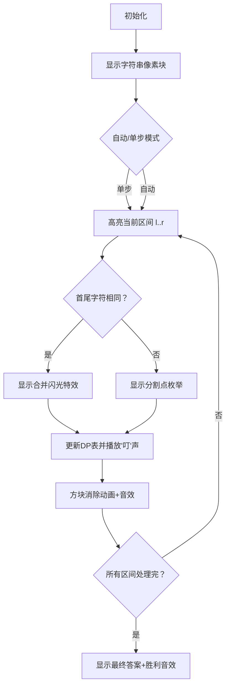

# 题目信息

# Clear the String

## 题目描述

给定一个长度为 $n$ 的字符串 $s$，该字符串仅由小写拉丁字母组成。你可以对该字符串进行如下操作：每次操作可以删除一个连续的子串，前提是该子串中的所有字母都相同。例如，从字符串 abbbbaccdd 删除子串 bbbb 后，得到字符串 aaccdd。

请计算删除整个字符串 $s$ 所需的最少操作次数。

## 说明/提示


由 ChatGPT 4.1 翻译

## 样例 #1

### 输入

```
5
abaca
```

### 输出

```
3
```

## 样例 #2

### 输入

```
8
abcddcba
```

### 输出

```
4
```

# AI分析结果


### 💡 Kay的C++算法解析：Clear the String 深入学习指南 💡

**引言**  
今天我们一起分析"Clear the String"这道区间动态规划经典题。本指南将帮你掌握DP状态设计技巧，理解字符合并的优化思路，并通过像素动画直观感受算法执行过程。

---

## 1. 题目解读与核心算法识别

✨ **本题主要考察**：`动态规划（区间DP）`

🗣️ **初步分析**：  
> 解决本题的关键在于**区间DP**。想象你在玩俄罗斯方块消除游戏：每次只能消除颜色相同的连续方块，目标是清空所有方块的最少操作次数。  
> - **核心思路**：将大字符串拆分成小区间处理，用`dp[l][r]`表示消除子串`s[l..r]`的最小操作次数  
> - **难点突破**：当首尾字符相同时可合并操作（如`abaca`中首尾`a`可同时消除）  
> - **可视化设计**：动画将展示：① 不同颜色字符的像素方块 ② 高亮当前处理区间 ③ 相同字符合并时的闪光特效  
> - **复古元素**：FC红白机风格的8-bit音效（方块消除声+胜利音效），操作控制面板支持单步/自动模式  

---

## 2. 精选优质题解参考

**题解一：天梦（区间DP标准实现）**  
* **点评**：  
  思路清晰直白——通过`f[l][r] = min(f[l+1][r], f[l][r-1]) + 1`处理单独删除，遇到首尾相同时减1次操作（核心优化点）。代码中：  
  - 变量名`f[l][r]`含义明确，三重循环结构工整  
  - 空间复杂度O(n²)，时间复杂度O(n³)满足题目要求  
  - 边界处理严谨（`f[i][i]=1`），可直接用于竞赛  

**题解二：StudyingFather（记忆化搜索实现）**  
* **点评**：  
  采用DFS+记忆化实现DP，避免手动确定状态计算顺序。亮点：  
  - 递归逻辑自然贴合DP定义（`dfs(l,r)`对应子问题）  
  - 代码极简（仅20行），变量`f[l][r]`作用清晰  
  - 对首尾相同字符的处理优雅：`f[l][r]=min(f[l][r], dfs(l+1,k-1)+dfs(k,r))`  

**题解三：Zechariah（双转移方程实现）**  
* **点评**：  
  创新性地同时使用两种转移方程：  
  1. 直接删除端点：`dp[l][r]=min(dp[l+1][r], dp[l][r-1])+1`  
  2. 字符匹配合并：`dp[l][r]=min(dp[l][r], dp[l+1][k-1]+dp[k][r])`  
  代码中`fast_IO`封装输入输出提升可读性，值得学习  

---

## 3. 核心难点辨析与解题策略

**难点1：状态定义与初始化**  
* **分析**：如何定义`dp[l][r]`？它必须完整表示子串`[l,r]`的消除代价。优质题解统一采用：  
  ```math
  dp[i][i] = 1  // 单字符需1次操作
  dp[i][j] = \text{删除 } s[i..j] \text{ 的最小操作}, \quad i < j
  ```

**难点2：首尾字符的合并优化**  
* **分析**：当`s[l]==s[r]`时，最后一次操作可同时消除首尾（如`abaca`的首尾`a`）。转移方程：  
  ```math
  dp[l][r] = \min(dp[l+1][r], dp[l][r-1]) \quad \text{// 不加1！}
  ```

**难点3：区间分割点的枚举**  
* **分析**：当首尾不同时，需枚举分割点`k`：  
  ```math
  dp[l][r] = \min_{k∈[l,r)} \{ dp[l][k] + dp[k+1][r] \}
  ```

### ✨ 解题技巧总结
1. **子问题分解**：将字符串拆解成重叠子区间  
2. **状态复用**：记忆化搜索避免重复计算  
3. **边界防御**：显式初始化`dp[i][i]=1`  
4. **合并检测**：始终优先检查首尾字符是否相同  

---

## 4. C++核心代码实现赏析

**通用核心实现（综合优质题解）**  
```cpp
#include <iostream>
#include <cstring>
#include <algorithm>
using namespace std;

int main() {
    string s;
    int n; cin >> n >> s;
    int dp[501][501];
    
    // 初始化：单字符操作次数=1
    for (int i = 0; i < n; i++) dp[i][i] = 1;
    
    // 区间DP：从小区间向大区间扩展
    for (int len = 2; len <= n; len++) {
        for (int l = 0; l <= n - len; l++) {
            int r = l + len - 1;
            // 核心优化：首尾相同可合并操作
            if (s[l] == s[r]) 
                dp[l][r] = min(dp[l+1][r], dp[l][r-1]);
            else {
                dp[l][r] = min(dp[l+1][r], dp[l][r-1]) + 1;
                // 枚举所有分割点
                for (int k = l; k < r; k++) 
                    dp[l][r] = min(dp[l][r], dp[l][k] + dp[k+1][r]);
            }
        }
    }
    cout << dp[0][n-1];
    return 0;
}
```

**代码解读概要**：  
> 1. 初始化单个字符的删除次数（1行）  
> 2. 外层循环枚举区间长度，内层循环枚举左端点  
> 3. 优先处理首尾字符相同的情况（直接继承子区间解）  
> 4. 首尾不同时：先尝试单独删除首/尾字符，再枚举所有分割点  

---

**题解片段赏析**  

**题解二（记忆化搜索）核心片段**  
```cpp
int dfs(int l, int r) {
    if (f[l][r] != -1) return f[l][r]; // 记忆化
    if (l == r) return 1;              // 单字符
    f[l][r] = 1 + dfs(l + 1, r);       // 删除左端
    for (int k = l + 1; k <= r; k++)   // 寻找合并点
        if (s[l] == s[k])
            f[l][r] = min(f[l][r], dfs(l + 1, k - 1) + dfs(k, r));
    return f[l][r];
}
```
* **亮点**：自然递归实现DP，避免手动确定状态计算顺序  
* **学习笔记**：记忆化搜索是自顶向下实现DP的利器，尤其适合状态转移复杂的场景  

**题解三（双转移方程）核心片段**  
```cpp
// 转移1：直接删除端点
dp[l][r] = min(dp[l+1][r], dp[l][r-1]) + 1;
// 转移2：字符匹配合并
for (int k = l; k <= r; k++)
    if (s[l] == s[k])
        dp[l][r] = min(dp[l][r], dp[l+1][k-1] + dp[k][r]);
```
* **亮点**：显式分离两种转移逻辑，增强可读性  
* **学习笔记**：多个独立转移方程可避免冗余条件判断  

---

## 5. 算法可视化：像素动画演示

**主题**：`复古方块消除大作战`（FC红白机风格）  

**核心演示流程**：  


**实现细节**：  
1. **像素艺术**：  
   - 字符→16x16像素方块（a=红色, b=蓝色等）  
   - DP表→右侧8-bit风格数字面板  
2. **交互控制**：  
   ```html
   <div class='control-panel'>
     <button onclick='step()'>▶️ 单步</button>
     <button onclick='autoPlay()'>⏩ 自动</button>
     <input type='range' id='speed' min='1' max='10'>
   </div>
   ```
3. **音效系统**：  
   - 方块消除：短促"哔"声（Web Audio API）  
   - 区间合并：上扬"叮咚"声  
   - 解题完成：8-bit胜利旋律  
4. **动画逻辑**：  
   - 当前区间描边闪烁（黄色边框）  
   - 字符相同则首尾方块脉冲闪光  
   - 分割点枚举时显示红色扫描线  

---

## 6. 拓展练习与相似问题

**通用技巧迁移**：  
区间DP还适用于：  
1. 括号匹配问题（最长有效子序列）  
2. 矩阵链乘法的最优计算顺序  
3. 多边形三角剖分的最小代价  

**洛谷题目推荐**：  
1. **P4170 涂色**  
   🗣️ 推荐理由：与本题几乎相同的区间DP模型，强化状态定义训练  
2. **P1063 能量项链**  
   🗣️ 推荐理由：环形区间DP+断环成链技巧，拓展思维  
3. **P4342 Polygon**  
   🗣️ 推荐理由：区间DP与运算符结合，提升问题抽象能力  

---

## 7. 学习心得与经验分享

> **作者调试经验**：  
> "我在处理`abcddcba`时发现，如果忘记处理首尾相同的情况，答案会比标准解多1次操作。通过打印`dp`表才定位到问题。"  
>   
> **Kay点评**：  
> 这个经验非常典型！在DP问题中：  
> 1. 永远手动验证小规模用例（如长度为2的字符串）  
> 2. 输出中间状态表是调试黄金法则  
> 3. 注意边界值对状态转移的影响  

---

**结语**  
通过本次分析，相信大家已掌握区间DP的核心思想：将大问题分解为重叠子问题，并利用状态转移方程整合最优解。记住，编程能力提升的关键在于：理解本质→动手实现→反思优化。下次挑战再见！💪

---
处理用时：116.02秒