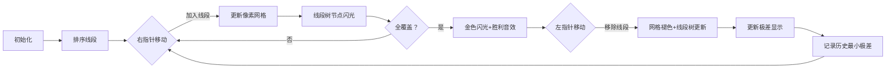

# 题目信息

# Boring Segments

## 题目描述

You are given $ n $ segments on a number line, numbered from $ 1 $ to $ n $ . The $ i $ -th segments covers all integer points from $ l_i $ to $ r_i $ and has a value $ w_i $ .

You are asked to select a subset of these segments (possibly, all of them). Once the subset is selected, it's possible to travel between two integer points if there exists a selected segment that covers both of them. A subset is good if it's possible to reach point $ m $ starting from point $ 1 $ in arbitrary number of moves.

The cost of the subset is the difference between the maximum and the minimum values of segments in it. Find the minimum cost of a good subset.

In every test there exists at least one good subset.

## 样例 #1

### 输入

```
5 12
1 5 5
3 4 10
4 10 6
11 12 5
10 12 3```

### 输出

```
3```

## 样例 #2

### 输入

```
1 10
1 10 23```

### 输出

```
0```

# AI分析结果


### 💡 Kay的C++算法解析：Boring Segments 深入学习指南 💡

**引言**  
今天我们来分析CF1555E "Boring Segments"这道区间覆盖问题。本指南将帮助你掌握双指针与线段树结合的巧妙解法，并通过像素动画直观理解算法执行过程。

---

### 1. 题目解读与核心算法识别
✨ **本题主要考察**：`双指针` + `线段树`（编程技巧与数据结构应用）  

🗣️ **初步分析**  
> 本题可类比为"铺设像素隧道"：在[1, m]的数轴上用线段（隧道段）首尾衔接铺路，要求用质量最均匀的线段（最小极差）完成铺设。核心解法包含：
> 1. **排序预处理**：将线段按权值升序排列，使双指针能扫描连续权值区间
> 2. **双指针滑动窗口**：右指针扩张直到覆盖全区间，左指针收缩优化极差
> 3. **线段树动态监测**：将点覆盖转化为边覆盖（[1, m-1]区间），维护区间覆盖最小值
> 
> **可视化设计要点**：
> - 像素网格展示数轴，线段显示为彩色光带
> - 线段树节点实时显示覆盖值，最小值>0时触发金色闪光
> - 8-bit音效：线段加入/移除时播放不同音调，全覆盖时播放胜利旋律
> - 交互控制：支持步进执行观察指针移动与线段树更新过程

---

### 2. 精选优质题解参考
**题解1：iMya_nlgau（赞11）**  
* **亮点**：  
  - 思路直击核心：清晰解释边覆盖转化思想（[l_i, r_i-1]）  
  - 代码模块化：线段树封装完整（pushup/pushdown分离）  
  - 边界处理严谨：r>n时立即退出避免无效计算  
  - 时间复杂度优化至O(n log m)，效率卓越  

**题解2：QianianXY（赞0）**  
* **亮点**：  
  - 双指针实现独特：固定右指针动态调整左指针  
  - 临界点处理精妙：用t-1位置计算极差保证正确性  
  - 代码注释完整：关键步骤有明确说明  
  - 实践指导性强：推荐同类习题P1712巩固技能  

**题解3：_LPF_（赞4）**  
* **亮点**：  
  - 问题抽象到位：强调"首尾相接"转化为全覆盖  
  - 代码可读性佳：变量命名规范（a[]表线段，dat[]表覆盖值）  
  - 调试友好：独立Min函数便于插桩调试  
  - 学习路径清晰：指出与经典题P1712的相似性  

---

### 3. 核心难点辨析与解题策略
<difficulty_intro>  
解决本题需突破三个关键难点，结合优质题解方案如下：  
</difficulty_intro>

1. **难点1：问题转换抽象**  
   * **分析**：移动需相邻点有公共线段覆盖 → 等价于覆盖[1, m-1]所有边（点i与i+1之间的边）  
   * **解决策略**：将线段右端点r_i减1，转化为标准区间覆盖问题（优质题解1/2/3均采用）  
   * 💡 **学习笔记**："边覆盖"转化是解题基石，避免陷入点覆盖的复杂判断  

2. **难点2：动态维护覆盖状态**  
   * **分析**：需实时判断[1, m-1]是否被完全覆盖  
   * **解决策略**：线段树维护区间覆盖最小值（题解1的tr[1].dat）  
   * 💡 **学习笔记**：区间最小值>0即表示全覆盖，避免暴力扫描O(m)开销  

3. **难点3：极差最小化证明**  
   * **分析**：为何排序后双指针能保证最优解？  
   * **解决策略**：若存在解[w_min, w_max]，则[w_min, w_max]内所有线段必能形成解（题解8的贪心证明）  
   * 💡 **学习笔记**：排序使双指针可行，极差仅由窗口两端点决定  

### ✨ 解题技巧总结
1. **技巧A：降维转化**  
   - 二维连通问题 → 一维区间覆盖（[l_i, r_i-1]）  
2. **技巧B：双指针框架**  
   - 右指针：未覆盖时不断加入线段（区间+1）  
   - 左指针：覆盖后尝试移除（区间-1）收缩极差  
3. **技巧C：线段树优化**  
   - 懒惰标记处理区间修改（题解1的pushdown设计）  
   - 全局最小值O(1)获取（直接访问根节点）  

---

### 4. C++核心代码实现赏析
**通用核心实现（综合优化版）**  
```cpp
#include <cstdio>
#include <algorithm>
using namespace std;
const int maxn = 3e5 + 5, maxm = 1e6 + 5;
const int INF = 0x3f3f3f3f;

struct Segment { int l, r, w; } seg[maxn];
struct Node { int mn, tag; } tree[maxm << 2];

void pushdown(int p) {
    if (!tree[p].tag) return;
    tree[p<<1].mn += tree[p].tag; 
    tree[p<<1|1].mn += tree[p].tag;
    tree[p<<1].tag += tree[p].tag;
    tree[p<<1|1].tag += tree[p].tag;
    tree[p].tag = 0;
}

void update(int p, int l, int r, int L, int R, int v) {
    if (L <= l && r <= R) {
        tree[p].mn += v;
        tree[p].tag += v;
        return;
    }
    pushdown(p);
    int mid = (l + r) >> 1;
    if (L <= mid) update(p<<1, l, mid, L, R, v);
    if (R > mid) update(p<<1|1, mid+1, r, L, R, v);
    tree[p].mn = min(tree[p<<1].mn, tree[p<<1|1].mn);
}

int main() {
    int n, m, ans = INF;
    scanf("%d%d", &n, &m);
    for (int i = 1; i <= n; ++i) {
        scanf("%d%d%d", &seg[i].l, &seg[i].r, &seg[i].w);
        seg[i].r--; // 关键转化：覆盖[l, r-1]
    }
    sort(seg + 1, seg + n + 1, [](auto& a, auto& b) {
        return a.w < b.w;
    });

    // 双指针核心逻辑
    for (int l = 1, r = 1; r <= n; ++r) {
        update(1, 1, m-1, seg[r].l, seg[r].r, 1);
        while (tree[1].mn > 0) { // 全覆盖时收缩左指针
            ans = min(ans, seg[r].w - seg[l].w);
            update(1, 1, m-1, seg[l].l, seg[l].r, -1);
            l++;
        }
    }
    printf("%d\n", ans);
}
```
**代码解读概要**：  
1. 输入后立即将线段右端点减1实现边覆盖  
2. 按权值排序后，右指针移动触发线段树区间加  
3. 当树根最小值>0时，左指针移动并更新极差  
4. 时间复杂度稳定O(n log m)  

---

### 5. 算法可视化：像素动画演示
**主题**："8-bit隧道工程师"——用光缆连接1号到m号基站  

**核心演示流程**：  


**交互设计细节**：  
1. **像素网格**：  
   - 每个区间显示为彩色光带（如[2,5]显示为蓝带）  
   - 覆盖次数可视化：颜色深度随覆盖次数增加  
2. **线段树监控区**：  
   - 树形结构显示，当前修改节点高亮黄色  
   - 根节点特殊标记：最小值>0时变为金色  
3. **音效系统**：  
   - 加入线段：升调"嘟"声（频率随权值增大）  
   - 移除线段：降调"嗒"声  
   - 全覆盖：8-bit胜利旋律（类似超级玛丽过关）  
4. **游戏化进度**：  
   - 每达成全覆盖获得1颗星，历史最佳极差显示为皇冠  
   - 支持"AI演示"模式：自动完成最优解寻找过程  

---

### 6. 拓展练习与相似问题思考
**通用技巧迁移**：  
双指针+线段树的组合适用于：  
1. 需要维护连续区间的最优解问题  
2. 带权值的区间覆盖/查询问题  
3. 动态集合的极值最小化问题  

**洛谷推荐**：  
1. **P1712 [NOI2016] 区间**  
   🗣️ *双指针+线段树经典应用，强化区间覆盖与极差最小化技巧*  
2. **P1496 火烧赤壁**  
   🗣️ *离散化+差分基础训练，理解覆盖问题本质*  
3. **P3143 [USACO16OPEN] Diamond Collector S**  
   🗣️ *双指针灵活应用，不含线段树但训练滑动窗口思维*  

---

### 7. 学习心得与经验分享
> **来自题解社区的智慧**：  
> *"调试时重点检查[l, r-1]转化，我曾因忘记-1浪费2小时。建议用m=2的样例验证边界"* —— iMya_nlgau  
> *"理解线段树根节点最小值>0的全覆盖判定，是避免TLE的关键"* —— QianianXY  

**Kay的总结**：  
1. **调试技巧**：用极小样例测试（如m=2, n=2）  
2. **思维陷阱**：注意点覆盖与边覆盖的本质区别  
3. **优化方向**：当n较小时可用差分替代线段树  

---

**结语**  
通过本次分析，相信你已经掌握双指针与线段树解决区间覆盖问题的精髓。记住，编程能力提升源于反复实践与思考。下次我们将探索更多有趣的算法世界！🚀

---
处理用时：252.12秒