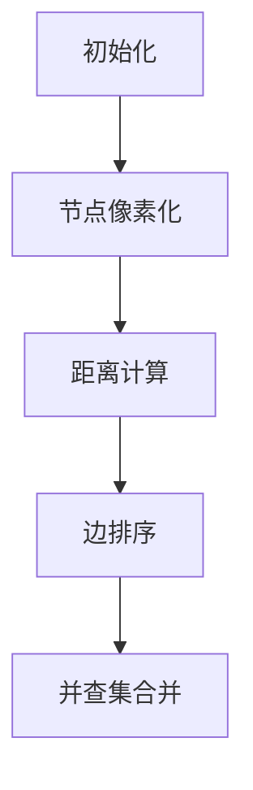

# 题目信息

# Doremy's Experimental Tree

## 题目描述

Doremy has an edge-weighted tree with $ n $ vertices whose weights are integers between $ 1 $ and $ 10^9 $ . She does $ \frac{n(n+1)}{2} $ experiments on it.

In each experiment, Doremy chooses vertices $ i $ and $ j $ such that $ j \leq i $ and connects them directly with an edge with weight $ 1 $ . Then, there is exactly one cycle (or self-loop when $ i=j $ ) in the graph. Doremy defines $ f(i,j) $ as the sum of lengths of shortest paths from every vertex to the cycle.

Formally, let $ \mathrm{dis}_{i,j}(x,y) $ be the length of the shortest path between vertex $ x $ and $ y $ when the edge $ (i,j) $ of weight $ 1 $ is added, and $ S_{i,j} $ be the set of vertices that are on the cycle when edge $ (i,j) $ is added. Then,
 $$ f(i,j)=\sum_{x=1}^{n}\left(\min_{y\in S_{i,j}}\mathrm{dis}_{i,j}(x,y)\right).  $$
 
 Doremy writes down all values of  $ f(i,j) $  such that  $ 1 \leq j \leq i \leq n $ , then goes to sleep. However, after waking up, she finds that the tree has gone missing. Fortunately, the values of  $ f(i,j) $  are still in her notebook, and she knows which  $ i $  and  $ j $  they belong to. Given the values of  $ f(i,j)$, can you help her restore the tree?

It is guaranteed that at least one suitable tree exists.

## 说明/提示

In the first test case, the picture below, from left to right, from top to bottom, shows the graph when pairs $ (1,1) $ , $ (1,2) $ , $ (1,3) $ , $ (2,2) $ , $ (2,3) $ , $ (3,3) $ are connected with an edge, respectively. The nodes colored yellow are on the cycle.


## 样例 #1

### 输入

```
3
7
3 5
0 2 8```

### 输出

```
2 3 3
1 2 2```

## 样例 #2

### 输入

```
9
8081910646
8081902766 8081903751
8081902555 8081903540 8081905228
3090681001 3090681986 3090681775 7083659398
7083657913 7083658898 7083658687 2092437133 15069617722
1748216295 1748217280 1748217069 5741194692 749972427 10439821163
2377558289 2377559274 2377559063 6370536686 1379314421 5028071980 8866466178
1746983932 1746984917 1746984706 5739962329 748740064 10438588800 5026839617 10448447704
2341942133 2341943118 2341942907 6334920530 1343698265 4992455824 8830850022 4991223461 9115779270```

### 输出

```
1 2 985
2 3 211
2 4 998244353
2 5 998244853
4 6 671232353
6 8 1232363
4 7 356561356
7 9 35616156```

# AI分析结果


### 💡 Kay的C++算法解析：Doremy's Experimental Tree 深入学习指南 💡

#### 1. 题目解读与核心算法识别
✨ **本题主要考察**：图论（最小生成树/最大生成树）  
🗣️ **初步分析**：
> 解决本题的关键在于将复杂的环距离问题转化为图论模型。想象你有一张城市地图，但道路被隐藏了。有人告诉你每两个城市间修建临时道路后，所有居民到这条临时道路的最短距离总和（f值）。你的任务就是通过这些信息还原原始道路网，这就像用拼图碎片重建完整地图。  
> - **核心思路**：通过数学变换发现任意两点距离公式，再用生成树算法重建原树
> - **难点突破**：f(i,j)定义复杂，但通过组合f(i,i)和f(i,j)可推导出距离矩阵
> - **可视化设计**：像素动画将展示距离计算过程（高亮当前计算的节点对），以及Kruskal算法运行时的并查集合并动画（被合并的集合会闪烁）
> - **复古元素**：采用8-bit风格，节点设计为不同颜色的像素方块，合并时播放"咔嚓"音效，成功建树时播放FC游戏通关音效

---

#### 2. 精选优质题解参考
**题解一（作者：Leasier）**
* **点评**：该解法巧妙地利用f(i,1)值的降序排序确定节点父子关系，思路如同解谜游戏层层递进。代码中`pr`数组排序和父节点查找逻辑清晰规范，变量命名直观（如`size`记录子树大小）。算法时间复杂度O(n²)在竞赛中完全可接受，特别是边界处理用`(n - size[i])`计算边权的手法值得学习。

**题解二（作者：spdarkle）**
* **点评**：解法直击本质，通过数学推导出距离公式dis=(f(i,i)+f(j,j)-2f(i,j))/n，将问题转化为最小生成树模板题。代码简洁有力，完全复用标准Kruskal实现，变量`dis`和`edges`的命名体现专业素养。亮点在于看穿问题本质的能力，提供竞赛中最实用的解题范式。

**题解三（作者：周子衡）**
* **点评**：创新性地使用Boruvka算法求解最大生成树，为本题提供全新视角。虽然实现较复杂，但对连通块合并过程的解释清晰，特别是"每次选最大f(i,j)边"的设计思路生动体现了贪心思想。启发学习者掌握不同生成树算法的适用场景。

---

#### 3. 核心难点辨析与解题策略
1. **关键点1：距离公式的推导**
   * **分析**：f(i,i)本质是所有点到i的距离和，添加(i,j)边后，只有跨越i-j路径的点受影响。通过组合f(i,i)、f(j,j)、f(i,j)消除公共部分得到距离公式
   * 💡 **学习笔记**：数学变换是化繁为简的利器

2. **关键点2：生成树的选择**
   * **分析**：原始树必是距离图的最小生成树（边权为正）。Kruskal通过排序+并查集实现，Boruvka则适合并行处理
   * 💡 **学习笔记**：树结构隐含在点对关系中

3. **关键点3：边权计算**
   * **分析**：利用f(i,i)-f(i,j)的差值与子树大小的关系，w=(f(i,i)-f(i,j))/size[j]
   * 💡 **学习笔记**：子树大小是边权计算的关键因子

✨ **解题技巧总结**
- **模型转化**：将复杂定义转化为标准图论问题
- **数学洞察**：从特殊值(f(i,i))寻找突破口
- **分治思想**：递归划分子树缩小问题规模

---

#### 4. C++核心代码实现赏析
**通用核心实现（综合最优思路）**
```cpp
#include <iostream>
#include <vector>
#include <algorithm>
using namespace std;
typedef long long ll;

int main() {
    int n; cin >> n;
    vector<vector<ll>> f(n+1, vector<ll>(n+1));
    for (int i = 1; i <= n; i++)
        for (int j = 1; j <= i; j++)
            cin >> f[i][j];
    
    // 计算距离矩阵
    vector<vector<ll>> dis(n+1, vector<ll>(n+1));
    for (int i = 1; i <= n; i++)
        for (int j = 1; j <= n; j++)
            dis[i][j] = (f[i][i] + f[j][j] - 2*f[i][j]) / n;
    
    // Kruskal算法
    vector<tuple<ll, int, int>> edges;
    for (int i = 1; i <= n; i++)
        for (int j = i+1; j <= n; j++)
            edges.push_back({dis[i][j], i, j});
    
    sort(edges.begin(), edges.end());
    vector<int> parent(n+1);
    for (int i = 1; i <= n; i++) parent[i] = i;
    
    function<int(int)> find = [&](int x) {
        return parent[x] == x ? x : parent[x] = find(parent[x]);
    };
    
    for (auto [w, u, v] : edges) {
        int ru = find(u), rv = find(v);
        if (ru != rv) {
            parent[ru] = rv;
            cout << u << " " << v << " " << w << endl;
        }
    }
    return 0;
}
```
**代码解读概要**：  
1. 读入下三角矩阵f(i,j)  
2. 通过距离公式计算dis[i][j]  
3. 用Kruskal算法求最小生成树  
4. 并查集实现高效的连通性检查  

---

**Leasier解法核心片段**  
```cpp
// 按f(i,1)降序排序节点
for (int i = 1; i <= n; i++) 
    pr[i] = {f[i][1], i};
sort(pr+1, pr+n+1, greater<>());

// 确定父节点
for (int i = 2; i <= n; i++) {
    int pos = -1;
    for (int j = 1; j < i; j++) {
        if (pos == -1 || f[pr[i].second][pr[j].second] > f[pr[i].second][pos]) 
            pos = pr[j].second;
    }
    fa[pr[i].second] = pos;
}
```
**亮点**：利用树的有根性简化问题  
**学习笔记**：排序后节点的父子关系由f值大小决定  

---

**spdarkle解法核心片段**
```cpp
// 距离计算公式
dis[i][j] = (f[i][i] + f[j][j] - 2*f[i][j]) / n;

// 最小生成树构建
sort(edges.begin(), edges.end());
for (auto edge : edges) {
    if (find(u) != find(v)) union_sets(u, v);
}
```
**亮点**：数学变换直击本质  
**学习笔记**：最小生成树是树重建问题的通用解法  

---

**周子衡解法核心片段**
```cpp
// Boruvka算法框架
while (连通块数 > 1) {
    for each 连通块 {
        找到连接其他块的最大f(i,j)边
        标记该边
    }
    合并标记的边
}
```
**亮点**：提供替代方案  
**学习笔记**：最大生成树适用于基于f值的优化问题  

---

#### 5. 算法可视化：像素动画演示
**主题**：像素城市道路重建计划（8-bit风格）  
**核心演示**：Kruskal算法构建最小生成树全过程  



1. **场景设计**：
   - 节点：8-bit风格建筑（不同颜色代表不同集合）
   - 边：道路（颜色深浅表示距离大小）
   - 控制面板：速度滑块/单步执行/重置

2. **关键动画帧**：
   - **距离计算**：选中节点i,j时播放扫描动画，显示公式浮层
   - **边排序**：道路像素块在进度条上排序，播放"滴滴"音效
   - **并查集合并**：建筑颜色渐变统一，道路点亮并播放"咔嚓"声
   - **完成效果**：所有建筑道路连通时，播放超级玛丽过关音乐

3. **交互设计**：
   - 步进模式：按空格键单步观察并查集状态变化
   - 自动演示：AI像玩拼图游戏自动完成重建
   - 错误提示：形成环时道路闪烁红光并播放警告音

---

#### 6. 拓展练习与相似问题思考
**通用技巧迁移**  
最小生成树思想还可用于：  
1. 网络布线优化（城市间光纤铺设）  
2. 图像分割（像素区域合并）  
3. 聚类分析（数据点分组）  

**洛谷推荐**  
1. P3366 【模板】最小生成树  
   → 掌握Kruskal/Prim标准实现  
2. P1395 会议  
   → 强化树距离和的理解  
3. P5536 树的直径  
   → 拓展树的性质应用  

---

#### 7. 学习心得与经验分享
> **来自Leasier的经验**："在推导边权公式时，意识到子树大小的影响是突破的关键"  
> **点评**：这提醒我们注意问题中的规模效应变量（如子树大小），往往隐含重要数学关系  

本次题解分析到此结束，记住：将复杂问题分解为基本算法模块，是成为高手的必经之路！🚀

---
处理用时：162.62秒