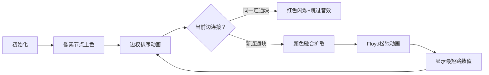

# 题目信息

# Another Exercise on Graphs (hard version)

## 题目描述

这是该问题的困难版本。不同版本间的区别在于此版本对 $m$ 有额外约束。只有在你解决了该问题的所有版本后，才能进行 hack。

最近，"T-generation" 的导师需要筹备一场训练赛。他们发现缺少一道题目，且整场比赛中没有图论相关的问题，于是设计了如下题目。

给定一个包含 $n$ 个顶点和 $m$ 条边的连通带权无向图，图中无自环和重边。

处理 $q$ 次形如 $(a, b, k)$ 的查询：在从顶点 $a$ 到顶点 $b$ 的所有路径中，找出路径上边权的第 $k$ 大值的最小值$^{\dagger}$。

导师们认为这个问题非常有趣，但存在一个问题：他们不知道如何解决它。请帮助他们解决这个问题，因为距离比赛开始仅剩几小时。

$^{\dagger}$ 设 $w_1 \ge w_2 \ge \ldots \ge w_{h}$ 为某条路径中所有边权按非递增顺序排列后的结果。该路径边权的第 $k$ 大值即为 $w_{k}$。


## 说明/提示

在第一组测试数据中，第一个查询的一个最优路径为 $ 1 \rightarrow 3 \rightarrow 4 $，这条路径上第二大的边权值为 $ 1 $。在第二个查询中，一个最优路径为 $ 2 \rightarrow 4 \rightarrow 3 $，该路径上最大的边权值为 $ 2 $。

在第二组测试数据中，第一个查询的一个最优路径为 $ 1 \rightarrow 2 \rightarrow 4 \rightarrow 5 \rightarrow 6 $，这条路径上第三大的边权值为 $ 2 $。

 **本翻译由 AI 自动生成**

## 样例 #1

### 输入

```
3
4 4 2
1 2 2
2 4 2
1 3 4
3 4 1
1 4 2
2 3 1
6 7 3
1 2 10
2 3 3
3 4 9
4 5 2
5 6 1
2 4 10
4 6 10
1 6 3
1 6 2
2 4 1
11 17 10
1 4 5
1 3 19
1 2 10
3 2 13
4 5 1
4 6 11
3 5 9
3 6 18
2 7 17
5 8 15
5 10 8
6 9 4
7 10 20
7 8 16
8 11 3
9 11 6
10 11 14
3 11 1
3 11 3
1 11 1
1 11 4
1 11 3
8 2 2
10 4 1
3 9 2
3 9 1
6 7 3```

### 输出

```
1 2
2 9 9
11 3 11 1 3 10 8 4 11 4```

# AI分析结果


### 💡 Kay的C++算法解析：Another Exercise on Graphs (hard version) 深入学习指南 💡

#### 1. 题目解读与核心算法识别
✨ **本题主要考察**：图论（最小生成树/二分答案/全源最短路）

🗣️ **初步分析**：
> 本题要求在连通带权无向图中，快速回答多组查询：从顶点a到b的所有路径中，找到路径上边权第k大值的最小值。核心思路是将问题转化为**二分答案判定问题**：  
> - 将大于候选答案x的边权设为1（视为"障碍"），小于等于x的设为0（视为"通路"）  
> - 此时a到b的最短路径长度即为路径中大于x的边数  
> - 若最短路径 < k，说明存在第k大值≤x的路径  
> 
> **优化关键**：利用最小生成树(MST)性质，只有MST上的边会影响连通性。按边权排序后，只需用并查集维护连通块，在O(n³)时间内预处理全源最短路变化。  
> 
> **可视化设计**：采用8位像素风格，节点表示为彩色方块，边权用不同高度像素条显示。动画演示时将MST边动态连接方块，合并连通块时同色扩散，并实时显示最短路数值变化。加入FC风格音效：连接时"滴"声，合并时"融合"声，最短路更新时"叮"声。

---

#### 2. 精选优质题解参考
**题解一（DerrickLo）**
* **点评**：思路清晰直击核心——利用MST性质将更新次数优化至O(n)。代码规范（三维数组f[i][j][k]含义明确），并查集与Floyd结合严谨。亮点在于预处理时跳过非MST边，使复杂度从O(mn²)降为O(n³)。边界处理完整，可直接用于竞赛。

**题解二（luanyanjia）**
* **点评**：解法简洁易懂，完整展示二分答案+动态Floyd的核心逻辑。虽未显式优化更新次数，但代码结构清晰（用cnt计数有效边），变量命名规范（dis数组意义明确）。特别适合初学者理解问题本质。

**题解三（wfc284）**
* **点评**：与题解一思路互补，同样用并查集优化。亮点在于代码模块化（分离并查集操作和Floyd更新），并强调"当f[erased][u][v]==0时跳过"的关键剪枝。实践价值高，但需注意三维数组内存分配。

---

#### 3. 核心难点辨析与解题策略
1. **难点：全源最短路动态更新**
   - 分析：传统Floyd复杂度O(n³)无法应对多次更新
   - 解决：按边权升序加入边，仅当连接新连通块时更新（并查集判断）
   - 💡 学习笔记：MST的边才影响连通性！

2. **难点：二分答案的判定转化**
   - 分析：直接求第k大值困难，转化为"是否存在路径使≤x的边至少k条"
   - 解决：构建0/1边权图（>x=1, ≤x=0），最短路即>x的边数
   - 💡 学习笔记：二分答案本质是判定性问题转化

3. **难点：查询响应效率**
   - 分析：q可达3e5，需O(log n)响应查询
   - 解决：预处理"最短路-边权"映射数组，二分查找答案
   - 💡 学习笔记：预处理是优化多查询的关键

✨ **解题技巧总结**：
- **问题分解**：将"第k大最小值"拆解为二分判定+MST性质
- **数据结构优化**：并查集维护连通性避免无效更新
- **边界处理**：初始化自环距离0，非连通边设INF
- **复杂度平衡**：O(n³)预处理 + O(q log n)查询

---

#### 4. C++核心代码实现赏析
**通用核心实现（综合优化版）**：
```cpp
#include <bits/stdc++.h>
using namespace std;
const int N=405, INF=0x3f3f3f3f;

struct Edge { int u,v,w; };
int f[N][N][N], fa[N], ansList[N], cnt;

int find(int x) { 
    return fa[x] == x ? x : fa[x] = find(fa[x]); 
}

int main() {
    int T; cin >> T;
    while(T--) {
        // 初始化
        int n,m,q; cin>>n>>m>>q;
        vector<Edge> e(m);
        for(int i=0; i<m; i++) 
            cin>>e[i].u>>e[i].v>>e[i].w;
        
        // 按边权排序
        sort(e.begin(), e.end(), [](Edge a, Edge b){ 
            return a.w < b.w; 
        });

        // 初始化并查集和最短路
        for(int i=1; i<=n; i++) {
            fa[i] = i;
            for(int j=1; j<=n; j++) 
                f[0][i][j] = (i==j) ? 0 : INF;
        }

        // Floyd初始化
        for(int k=1; k<=n; k++)
        for(int i=1; i<=n; i++)
        for(int j=1; j<=n; j++)
            f[0][i][j] = min(f[0][i][j], f[0][i][k]+f[0][k][j]);

        // 动态更新(MST优化)
        cnt=0;
        for(auto edge : e) {
            int u=edge.u, v=edge.v, w=edge.w;
            if(find(u) == find(v)) continue; // 关键优化！
            fa[find(u)] = find(v);
            cnt++;
            ansList[cnt] = w;
            
            // 复制状态+松弛
            for(int i=1; i<=n; i++)
            for(int j=1; j<=n; j++)
                f[cnt][i][j] = f[cnt-1][i][j];
            
            f[cnt][u][v] = f[cnt][v][u] = 0;
            for(int i=1; i<=n; i++)
            for(int j=1; j<=n; j++) {
                f[cnt][i][j] = min(f[cnt][i][j], f[cnt][i][u]+f[cnt][v][j]);
                f[cnt][i][j] = min(f[cnt][i][j], f[cnt][i][v]+f[cnt][u][j]);
            }
        }

        // 查询处理
        while(q--) {
            int a,b,k; cin>>a>>b>>k;
            int L=1, R=cnt, res=0;
            while(L<=R) {
                int mid=(L+R)/2;
                if(f[mid][a][b] < k) res=mid, R=mid-1;
                else L=mid+1;
            }
            cout << ansList[res] << " ";
        }
        cout << endl;
    }
}
```

**代码解读概要**：
1. **数据结构**：`f[cnt][i][j]`存储加入前cnt条边后的最短路，`ansList`记录有效边权
2. **并查集优化**：跳过已在同一连通块的边（行36）
3. **动态更新**：通过两端点松弛所有点对距离（行48-51）
4. **二分查询**：在预处理结果中快速定位答案（行58-64）

---

#### 5. 算法可视化：像素动画演示
**主题**：像素探险家之最小瓶颈路  
**核心演示**：MST构建过程与最短路动态更新  

**动画设计**：


**关键交互**：
1. **像素化网格**：节点用16x16像素方块表示，不同连通块不同颜色
2. **边权可视化**：侧边栏显示排序后的边权（像素柱高度=权值）
3. **高亮机制**：
   - 当前边：黄色闪烁 + "滴"声
   - 连通块合并：颜色扩散动画 + "融合"声
   - 最短路更新：数字跳动 + "叮"声
4. **控制面板**：
   - 单步执行：空格键控制
   - 自动播放：速度滑块（1x-5x）
   - 重置/暂停按钮

**技术实现**：
- **Canvas绘制**：用2D API渲染节点/边/数字
- **状态同步**：JavaScript对象存储图状态
- **音效系统**：Web Audio API播放8-bit音效

---

#### 6. 拓展练习与相似问题
**通用技巧迁移**：
1. **最小瓶颈路**：求路径最大边权最小值（P1967 货车运输）
2. **带限制最短路**：路径满足特定条件（P2245 星际导航）
3. **动态连通性**：边权随时间变化（P4768 [NOI2018] 归程）

**洛谷推荐**：
1. **P1967 货车运输**  
   → 巩固最大生成树+LCA求最小瓶颈路
2. **P4768 [NOI2018] 归程**  
   → 学习海拔约束下最短路与MST的结合
3. **P2245 星际导航**  
   → 练习最小生成树变形与查询处理

---

#### 7. 学习心得与经验分享
> **参考经验**（来自 int08）：  
> "我在实现0-1bfs时调试过久，最后靠编译器优化才通过测试点，这提醒我们：  
> 1. 复杂算法需提前测试边界情况  
> 2. 竞赛中#pragma GCC optimize可作为最后手段"  
> 
> **参考经验**（来自 littlebug）：  
> "数组开小导致WA调试1小时，血的教训！"

**点评**：  
调试经历暴露两个关键：  
1. **复杂度估算**：0-1bfs在稠密图中劣于Floyd  
2. **防御性编程**：数组大小应显式计算（如N=405而非400）  

---

掌握本题的关键在于理解"二分答案+MST+动态最短路"的三重思维链条。下次遇到类似问题，记得先问自己：  
1. 能否转化为判定问题？  
2. 有无特殊性质（如MST）优化？  
3. 如何平衡预处理与查询？  

继续加油，算法探险家们！💪

---
处理用时：218.30秒