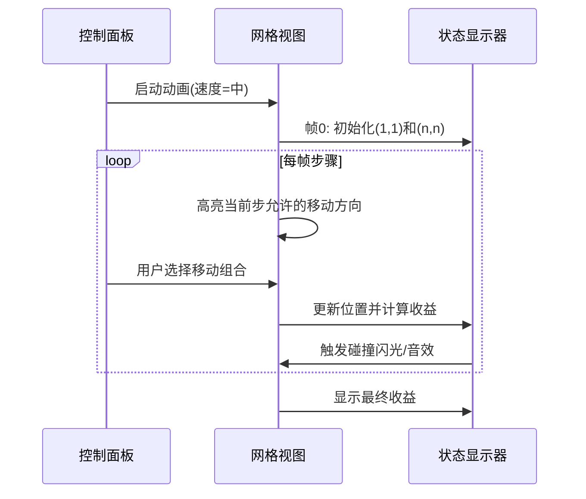

# 题目信息

# Relay Race

## 题目描述

Furik and Rubik take part in a relay race. The race will be set up on a large square with the side of $ n $ meters. The given square is split into $ n×n $ cells (represented as unit squares), each cell has some number.

At the beginning of the race Furik stands in a cell with coordinates $ (1,1) $ , and Rubik stands in a cell with coordinates $ (n,n) $ . Right after the start Furik runs towards Rubik, besides, if Furik stands at a cell with coordinates $ (i,j) $ , then he can move to cell $ (i+1,j) $ or $ (i,j+1) $ . After Furik reaches Rubik, Rubik starts running from cell with coordinates $ (n,n) $ to cell with coordinates $ (1,1) $ . If Rubik stands in cell $ (i,j) $ , then he can move to cell $ (i-1,j) $ or $ (i,j-1) $ . Neither Furik, nor Rubik are allowed to go beyond the boundaries of the field; if a player goes beyond the boundaries, he will be disqualified.

To win the race, Furik and Rubik must earn as many points as possible. The number of points is the sum of numbers from the cells Furik and Rubik visited. Each cell counts only once in the sum.

Print the maximum number of points Furik and Rubik can earn on the relay race.

## 说明/提示

Comments to the second sample: The profitable path for Furik is: $ (1,1) $ , $ (1,2) $ , $ (2,2) $ , and for Rubik: $ (2,2) $ , $ (2,1) $ , $ (1,1) $ .

Comments to the third sample: The optimal path for Furik is: $ (1,1) $ , $ (1,2) $ , $ (1,3) $ , $ (2,3) $ , $ (3,3) $ , and for Rubik: $ (3,3) $ , $ (3,2) $ , $ (2,2) $ , $ (2,1) $ , $ (1,1) $ . The figure to the sample:

  Furik's path is marked with yellow, and Rubik's path is marked with pink.

## 样例 #1

### 输入

```
1
5
```

### 输出

```
5
```

## 样例 #2

### 输入

```
2
11 14
16 12
```

### 输出

```
53
```

## 样例 #3

### 输入

```
3
25 16 25
12 18 19
11 13 8
```

### 输出

```
136
```

# AI分析结果


# 💡 Kay的C++算法解析：Relay Race 深入学习指南 💡

## 1. 题目解读与核心算法识别

✨ **本题主要考察**：`动态规划 (状态优化)`  
🗣️ **初步分析**：  
> 解决"Relay Race"这道题，关键在于运用**动态规划的状态优化技巧**。想象两个像素小人在网格上同步前进，每一步都共同决策如何最大化收集金币！  
> - **核心思路**：将往返路径转化为两人同时从(1,1)走到(n,n)，使用三维状态`f[k][i][j]`表示走了k步后，第一人在i行、第二人在j行时的最大收益（列坐标可通过`k-i+1`和`k-j+1`推算）。
> - **算法流程**：  
>   ```mermaid
>   graph LR
>   A[初始化f[2][1][1]=a[1][1]] --> B[遍历k从2到2n-1]
>   B --> C[遍历所有合法i,j]
>   C --> D[计算四种移动组合的最大值]
>   D --> E[累加当前格子价值]
>   E --> F[处理重复格子]
>   F --> B
>   ```
> - **可视化设计**：采用8位像素风格，用不同颜色方块表示两人位置，当路径重叠时触发闪光特效。控制面板支持单步执行/自动播放，音效系统在关键操作时播放复古电子音。

---

## 2. 精选优质题解参考

### 题解一（作者：珅肐）
* **点评**：思路直击降维本质——利用步数同步特性将四维状态优化为三维。代码中`i-j+1`计算列坐标的写法简洁高效，边界判断`(i-j+1>=1 && i-j+1<=n)`严谨。状态转移时四种移动组合的`max`比较完整覆盖决策空间，初始值`-0x3f`处理负值的技巧值得学习。

### 题解二（作者：Composite_Function）
* **点评**：通过关联经典题目（P1004/P1006）建立知识迁移，降低理解门槛。代码中`t`变量处理重复点计算的方式清晰体现了"重复格子只算一次"的核心约束。控制台输入改用`cin`加速却保持可读性，适合初学者借鉴。

### 题解三（作者：Garbage_fish）
* **点评**：以反例分析破除"两次独立DP"的认知误区极具启发性。状态转移方程中`(xa!=xb || ya!=yb)`的条件处理展现了严谨的边界思维。代码模块化（`fread`封装IO）和`INT_MIN`的使用体现了工程化思维。

---

## 3. 核心难点辨析与解题策略

1.  **状态维度爆炸**  
    * **分析**：直接四维DP（`f[i][j][k][l]`）空间复杂度达O(n⁴)，需利用"步数=横坐标+纵坐标-1"的特性降维。优质题解通过三维状态`f[k][i][j]`将空间压缩至O(n³)
    * 💡 **学习笔记**：降维的本质是发现状态间的隐含关系

2.  **路径重叠处理**  
    * **分析**：当两人坐标相同时需避免重复累加，题解中通过`if(j==k) t=a[j][i-j]`的条件分支优雅解决
    * 💡 **学习笔记**：状态转移时需显式处理实体碰撞

3.  **负值边界初始化**  
    * **分析**：因网格含负值，初始状态需设为`-0x3f`而非0，否则负路径可能被误认为最优解
    * 💡 **学习笔记**：DP初始化需结合数据范围特性

### ✨ 解题技巧总结
- **维数压缩术**：利用运动同步性（如步数相同）减少状态维度
- **碰撞检测法**：状态转移时实时判断位置重叠
- **负无穷屏障**：用足够小的负数屏蔽无效状态转移
- **坐标换算技巧**：`列坐标 = 步数 - 行坐标 + 1`

---

## 4. C++核心代码实现赏析

**本题通用核心C++实现参考**  
* **说明**：综合优质题解优化的标准实现，包含负值处理与边界防护
* **完整核心代码**：
```cpp
#include <iostream>
#include <cstring>
using namespace std;
const int N=305;

int main() {
    int n, a[N][N], f[2*N][N][N];
    cin >> n;
    for(int i=1; i<=n; ++i)
        for(int j=1; j<=n; ++j)
            cin >> a[i][j];
    
    memset(f, -0x3f, sizeof f); // 负无穷初始化
    f[2][1][1] = a[1][1];      // 初始状态
    
    for(int k=3; k<=2*n; ++k)  // 从第3步开始
    for(int i=1; i<=n; ++i)    // 第一人行号
    for(int j=1; j<=n; ++j) {  // 第二人行号
        int col1 = k - i, col2 = k - j; // 列坐标计算
        if(col1<1 || col1>n || col2<1 || col2>n) continue;
        
        int gain = a[i][col1];
        if(i != j || col1 != col2) gain += a[j][col2];
        
        f[k][i][j] = max(max(f[k-1][i][j], f[k-1][i-1][j]), 
                      max(f[k-1][i][j-1], f[k-1][i-1][j-1])) + gain;
    }
    cout << f[2*n][n][n];
    return 0;
}
```
* **代码解读概要**：  
  > 1. 输入处理：读入n*n网格  
  > 2. 状态初始化：`f[2][1][1]`锚定起点价值  
  > 3. 三重循环：外层遍历步数，内层双循环遍历两人行号  
  > 4. 列坐标计算：通过`k-i`/`k-j`动态推算  
  > 5. 价值累加：处理位置重叠的特殊情况  
  > 6. 状态转移：取四种移动方案的最大值  

---

### 题解一核心片段（珅肐）
```cpp
if(j!=k) t=a[j][i-j+1]+a[k][i-k+1];
else t=a[j][i-j+1];
f[i][j][k]=max(f[i][j][k],f[i-1][j][k]+t);
```
* **亮点**：用简洁的t变量处理重复点计算
* **代码解读**：  
  > 通过`j!=k`判断位置是否重叠，非重叠时累加两点价值。状态转移采用"当前状态=上一步状态+当前收益"的经典DP结构，`max`比较实现最优子结构选择
* 💡 **学习笔记**：条件运算符能优雅处理状态分支

### 题解二核心片段（Composite_Function）
```cpp
f[i][j][k]=max(f[i][j][k],f[i-1][j-1][k-1]+t);
```
* **亮点**：对角线移动的状态转移
* **代码解读**：  
  > `i-1,j-1`对应两人都向下移动的操作，该状态转移覆盖了所有可能的移动组合，确保最优解不被遗漏
* 💡 **学习笔记**：DP状态转移需完备覆盖决策空间

### 题解三核心片段（Garbage_fish）
```cpp
if(xa!=xb || ya!=yb) sum+=a[xb][yb];
```
* **亮点**：显式坐标比较确保逻辑严谨
* **代码解读**：  
  > 通过横纵坐标双重验证位置重叠，比单纯比较行号更稳健。这种写法可处理特殊网格结构中的边界情况
* 💡 **学习笔记**：稳健性>简洁性时可采用显式判断

---

## 5. 算法可视化：像素动画演示

**主题**：`双人金币收集大冒险`  
**核心演示**：两人在8位像素网格中同步移动，实时显示状态值与累计收益  

### 关键帧设计


**技术实现**：  
1. **Canvas绘制**：  
   - 网格线：`ctx.strokeRect(x*30, y*30, 30, 30)`  
   - 角色精灵：第一人黄色像素块，第二人蓝色像素块  
   - 重叠特效：`ctx.fillStyle='rgba(255,0,0,0.5)'`半透明红色覆盖  
2. **交互控制**：  
   ```javascript
   document.getElementById('stepBtn').addEventListener('click', nextFrame);
   document.getElementById('autoToggle').addEventListener('change', toggleAuto);
   ```
3. **音效系统**：  
   - 移动：8-bit短促"嘀"声  
   - 碰撞：合成器"哔卟"声  
   - 成功：马里奥式金币收集音  

---

## 6. 拓展练习与相似问题思考

### 通用技巧迁移
三维DP状态压缩技巧还可用于：
1. 双向BFS最短路优化  
2. 平行时空场景的决策模拟  
3. 多人协同的路径规划问题  

### 洛谷推荐
1. **P1004 方格取数**  
   🗣️ *同类二维状态压缩DP入门，巩固基础状态设计*
2. **P1006 传纸条**  
   🗣️ *强化三维状态转移训练，理解价值累加机制*
3. **P7077 函数调用**  
   🗣️ *进阶状态维护训练，掌握多层决策依赖*

---

## 7. 学习心得与经验分享
> **参考经验 (来自 Garbage_fish)**："最初尝试两次独立DP，直到反例证明局部最优≠全局最优。这让我意识到**DP的全局状态完整性**至关重要。"  
> **点评**：该经验揭示了动态规划的核心理念——状态设计必须捕获问题的全局约束条件。在类似问题中，可先构造小规模反例验证算法正确性。

---

通过本次分析，我们深入掌握了三维DP的状态优化技巧。记住：好的状态设计能让复杂问题迎刃而解！下次挑战再见！💪

---
处理用时：106.60秒