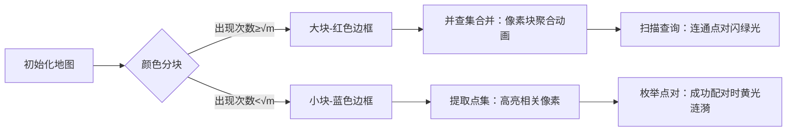

# 题目信息

# Mr. Kitayuta's Colorful Graph

## 题目描述

给出一个 $n$ 个点，$m$ 条边的无向图，每条边上是有颜色的。有 $q$ 组询问

对于第 $i$ 组询问，给出点对 $u_i,v_i$， 求有多少种颜色 $c$，满足存在至少一条从 $u_i$ 到 $v_i$ 的路径，使得该路径上的所有边的颜色均为 $c$。

## 说明/提示

$2 \le n \le 10^5$  
$1 \le m,q \le 10^5$  
$1\le x_i,y_i,u_i,v_i \le n$  
$1 \le c_i \le m$

## 样例 #1

### 输入

```
4 5
1 2 1
1 2 2
2 3 1
2 3 3
2 4 3
3
1 2
3 4
1 4
```

### 输出

```
2
1
0
```

## 样例 #2

### 输入

```
5 7
1 5 1
2 5 1
3 5 1
4 5 1
1 2 2
2 3 2
3 4 2
5
1 5
5 1
2 5
1 5
1 4
```

### 输出

```
1
1
1
1
2
```

# AI分析结果


# 💡 Kay的C++算法解析：Mr. Kitayuta's Colorful Graph 深入学习指南 💡

## 1. 题目解读与核心算法识别

✨ **本题主要考察**：`图论与分治技巧`

🗣️ **初步分析**：
> 解决这道题的关键在于运用**根号分治**策略，就像在图书馆整理书籍：面对海量书籍（颜色），我们将它们分为高频使用（大块）和低频使用（小块）两类，采用不同整理方式提升效率。本题中，大块颜色（出现次数≥√m）数量少但影响广，我们为每种大块颜色建立独立通信网络（并查集），快速响应所有查询；小块颜色（出现次数<√m）内部点对有限，直接枚举点对更新答案。

- **核心难点**：如何在10^5级数据下高效处理颜色连通性和查询？分治策略平衡了处理大块和小块的开销，避免极端情况下的性能瓶颈。
- **可视化设计**：采用8位像素风格展示图结构，大块颜色用红色边框高亮，小块颜色用蓝色边框标记。动画将展示并查集合并过程（像素块聚合效果）和查询响应（点对间绿色连线），配合操作音效（合并"叮"声，成功"胜利"音效）增强理解。

---

## 2. 精选优质题解参考

**题解一（henrytb）**
* **点评**：思路清晰直击分治本质，将颜色按出现次数分块处理：大块颜色全局扫描查询，小块颜色内部枚举点对。代码规范（`e[color]`存储同色边），变量名`blockSize`等含义明确，边界处理严谨（点对去重）。亮点在于复杂度分析透彻（O(n√n log n)），实践可直接用于竞赛场景。

**题解二（ahawzlc）**
* **点评**：同样采用根号分治但侧重离线处理，通过排序和去重优化空间。代码中`unique`去重操作和`map`记录点对贡献的实践值得学习，但变量命名略简略（如`tmp`）。亮点在于对小块颜色连通块内点对枚举的完整实现，为学习者提供清晰参考。

**题解三（FutaRimeWoawaSete）**
* **点评**：创新性使用可撤销并查集降低空间消耗，通过栈`stk`记录合并操作实现精准回撤。代码中`PP1`/`PP2`函数模块化设计合理，亮点在于处理大块颜色时避免重建并查集的开销优化，适合内存敏感场景。

---

## 3. 核心难点辨析与解题策略

1.  **难点：海量颜色与查询的平衡处理**
    * **分析**：直接处理所有颜色会导致O(mq)复杂度。优质题解通过√m分块，将颜色分为O(√m)个大块和O(m)个小块，大块全局扫描(O(q√m))，小块内部枚举(O(m√m))，达到平衡。
    * 💡 学习笔记：根号分治是处理大规模数据的黄金分割点。

2.  **难点：连通性维护与答案聚合**
    * **分析**：并查集高效维护同色连通性，但需注意每次处理后的重置——大块颜色可即时重置，小块颜色需在颜色内部重置避免影响其他颜色。答案聚合用`map<pair<int,int>,int>`存储点对答案。
    * 💡 学习笔记：并查集是动态连通性的首选，重置策略影响性能。

3.  **难点：避免重复计算与空间优化**
    * **分析**：小块颜色处理中需对点去重（`sort`+`unique`）避免无效枚举。可撤销并查集（题解三）通过操作栈节省空间，适合严格内存限制。
    * 💡 学习笔记：去重是优化枚举的关键，可撤销数据结构节省初始化开销。

### ✨ 解题技巧总结
- **分而治之**：按数据规模分块处理（如√m），对大数据和小数据采用不同策略
- **离线处理**：先存储查询再批量处理，避免重复计算（题解二）
- **懒重置技巧**：并查集仅重置涉及的点（题解三），避免全图重置
- **边界防御**：始终规范点对存储为(u,v)且u<v，防止哈希冲突

---

## 4. C++核心代码实现赏析

**本题通用核心C++实现**
```cpp
#include <bits/stdc++.h>
using namespace std;
const int N = 1e5 + 5;
vector<pair<int, int>> e[N]; // e[color]: edges
vector<pair<int, int>> queries;
map<pair<int, int>, int> ans;
int fa[N], sz[N], n, m, q;

int find(int x) {
    return fa[x] == x ? x : fa[x] = find(fa[x]);
}

void merge(int u, int v) {
    u = find(u), v = find(v);
    if (u == v) return;
    if (sz[u] > sz[v]) swap(u, v);
    fa[u] = v;
    sz[v] += (sz[u] == sz[v]);
}

void processBig(int color) {
    for (int i = 1; i <= n; ++i) fa[i] = i, sz[i] = 1;
    for (auto [u, v] : e[color]) merge(u, v);
    for (auto [u, v] : queries)
        if (find(u) == find(v)) ans[{u, v}]++;
}

void processSmall(int color) {
    vector<int> points;
    for (auto [u, v] : e[color]) {
        points.push_back(u);
        points.push_back(v);
    }
    sort(points.begin(), points.end());
    auto last = unique(points.begin(), points.end());
    points.erase(last, points.end());
    
    for (int x : points) fa[x] = x, sz[x] = 1;
    for (auto [u, v] : e[color]) merge(u, v);
    
    for (int i = 0; i < points.size(); ++i)
        for (int j = i + 1; j < points.size(); ++j)
            if (find(points[i]) == find(points[j]))
                ans[{min(points[i], points[j]), max(points[i], points[j])}]++;
}

int main() {
    cin >> n >> m;
    for (int i = 0; i < m; ++i) {
        int u, v, c;
        cin >> u >> v >> c;
        e[c].push_back({min(u, v), max(u, v)});
    }
    cin >> q;
    for (int i = 0; i < q; ++i) {
        int u, v; cin >> u >> v;
        if (u > v) swap(u, v);
        queries.push_back({u, v});
        ans[{u, v}] = 0;
    }
    
    int block = sqrt(m);
    for (int c = 1; c <= m; ++c) {
        if (e[c].empty()) continue;
        if (e[c].size() >= block) processBig(c);
        else processSmall(c);
    }
    
    for (auto [u, v] : queries)
        cout << ans[{u, v}] << '\n';
}
```
**代码解读概要**：
1. 按颜色存储边（`e[color]`），查询存储为`(u,v)`且`u<v`
2. `processBig`处理大块颜色：全图并查集后扫描所有查询
3. `processSmall`处理小块：提取颜色相关点→去重→局部并查集→枚举点对更新答案
4. 分块阈值`block = sqrt(m)`平衡性能

---

## 5. 算法可视化：像素动画演示

**主题**：像素探险家遍历彩色连通大陆  
**核心演示**：根号分治策略下大块/小块颜色的并查集构建与查询响应  

### 动画设计（8位像素风）


1. **控制面板**：
   - 速度滑块：调节动画帧率
   - 单步执行：逐步观察分块/合并/查询
   - 重置：恢复初始状态

2. **关键帧细节**：
   - **大块处理**：红色区域像素块向中心聚合（合并音效"叮"），随后所有查询点对间出现探测射线，连通则射线变绿（胜利音效）
   - **小块处理**：蓝色区域闪烁后内部点高亮，点对间尝试连接，成功时扩散黄色光环
   - **数据结构可视化**：右侧显示实时并查集树结构，合并时树枝延伸

3. **音效设计**：
   - 背景：8位芯片音乐循环
   - 合并："叮"（短促）
   - 查询连通：上扬音阶
   - 错误：低沉嗡鸣

---

## 6. 拓展练习与相似问题思考

1. **洛谷 P505B**  
   🗣️ 直接应用本题技巧的弱化版，巩固分治思想
2. **洛谷 P547D**  
   🗣️ 图论建模后需分块处理，练习问题转化能力
3. **洛谷 P4001**  
   🗣️ 网络流问题，可尝试分块优化增广路径搜索

---

## 7. 学习心得与经验分享
> **参考经验**（来自henrytb）："根号分治的关键在于平衡预处理和查询的开销，选择√m作阈值是实践验证的最优解"  
> **点评**：这提醒我们算法设计中需进行复杂度量化分析，阈值选取需严格推导而非随意估计。

---

通过本次分析，相信大家已掌握根号分治在图论问题中的核心应用。记住：优秀算法=深刻洞察+精妙平衡！下次挑战再见！💪

---
处理用时：147.29秒