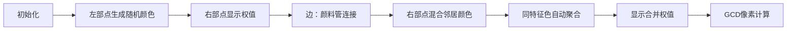

# 题目信息

# Instant Noodles

## 题目描述

Wu got hungry after an intense training session, and came to a nearby store to buy his favourite instant noodles. After Wu paid for his purchase, the cashier gave him an interesting task.

You are given a bipartite graph with positive integers in all vertices of the right half. For a subset $ S $ of vertices of the left half we define $ N(S) $ as the set of all vertices of the right half adjacent to at least one vertex in $ S $ , and $ f(S) $ as the sum of all numbers in vertices of $ N(S) $ . Find the greatest common divisor of $ f(S) $ for all possible non-empty subsets $ S $ (assume that GCD of empty set is $ 0 $ ).

Wu is too tired after his training to solve this problem. Help him!

## 说明/提示

The greatest common divisor of a set of integers is the largest integer $ g $ such that all elements of the set are divisible by $ g $ .

In the first sample case vertices of the left half and vertices of the right half are pairwise connected, and $ f(S) $ for any non-empty subset is $ 2 $ , thus the greatest common divisor of these values if also equal to $ 2 $ .

In the second sample case the subset $ \{1\} $ in the left half is connected to vertices $ \{1, 2\} $ of the right half, with the sum of numbers equal to $ 2 $ , and the subset $ \{1, 2\} $ in the left half is connected to vertices $ \{1, 2, 3\} $ of the right half, with the sum of numbers equal to $ 3 $ . Thus, $ f(\{1\}) = 2 $ , $ f(\{1, 2\}) = 3 $ , which means that the greatest common divisor of all values of $ f(S) $ is $ 1 $ .

## 样例 #1

### 输入

```
3
2 4
1 1
1 1
1 2
2 1
2 2

3 4
1 1 1
1 1
1 2
2 2
2 3

4 7
36 31 96 29
1 2
1 3
1 4
2 2
2 4
3 1
4 3```

### 输出

```
2
1
12```

# AI分析结果


### 💡 Kay的C++算法解析：Instant Noodles 深入学习指南 💡

<introduction>
今天我们来分析「Instant Noodles」这道二分图相关的C++编程题。本指南将帮助你掌握图论与数论结合的解题技巧，通过分组合并思想高效求解所有子集权值和的最大公约数（GCD）。
</introduction>

---

## 1. 题目解读与核心算法识别

✨ **本题主要考察**：`图论建模` + `数论性质` + `编程技巧应用`

🗣️ **初步分析**：
> 本题要求计算二分图中所有非空左子集对应的右邻居权值和的GCD。核心思想是将右部点按邻居集合分组：**相同邻居集合的点权值可合并**，最终答案即各组权值和的GCD（排除空邻居组）。  
> - **关键比喻**：想象右部点是不同颜色的颜料，左部点是调色盘。混合相同调色配方（邻居集合）的颜料，最终只需计算混合后颜料量的GCD。  
> - **核心难点**：高效判断邻居集合是否相同（避免O(n²)比较）  
> - **可视化设计**：像素动画将展示分组过程——右部点按左邻居颜色混合特征色，相同特征色自动聚合并显示合并权值，最后用像素数字展示GCD计算过程（详见第5节）。  
> - **游戏化元素**：分组过程设计为"颜料消除"小游戏，合并成功时播放8-bit合成音效，GCD计算成功触发胜利音效。

---

## 2. 精选优质题解参考

<eval_intro>
基于思路清晰性、代码规范性和算法效率，精选以下评分≥4星的题解：

**题解一（来源：Redshift_Shine）**
* **点评**：  
  - 思路创新性：巧用随机哈希将集合比较转化为数值比较，大幅提升效率  
  - 代码规范：变量名`hss`（哈希种子）、`buc`（桶）含义明确，边界处理严谨  
  - 算法优化：时间复杂度O(n+m)接近最优，随机哈希冲突概率极低  
  - 实践价值：代码可直接用于竞赛，附带调试宏方便本地测试  

**题解二（来源：lfxxx）**
* **点评**：  
  - 思路严谨性：详细论证哈希分组的数学基础，强调模数选择的重要性  
  - 代码健壮性：用`cnt`数组处理重边（虽题目保证无重边），`D[]`记录度数排除孤立点  
  - 算法扩展性：双哈希设计可进一步降低冲突概率  
  - 调试提示：包含随机种子初始化语句，确保结果可复现  

**题解三（来源：Daniel_yao）**
* **点评**：  
  - 思路直白性：直接使用`set<邻居>`分组，逻辑最易理解  
  - 教学价值：显式定义`map<set<int>,int>`清晰展示分组过程  
  - 代码可读性：STL容器使用规范，范围循环提升可维护性  
  - 适用场景：小规模数据更稳定，无哈希冲突风险  

---

## 3. 核心难点辨析与解题策略

<difficulty_intro>
解决本题需突破以下三个关键难点，结合优质题解策略分析：

1.  **难点：如何避免枚举2ⁿ个子集？**
    * **分析**：利用GCD的线性组合性质——若权值可被g整除，则任意组合和也能被g整除。优质解均通过合并相同邻居集合的点，将问题转化为O(n)规模。
    * 💡 **学习笔记**：GCD问题常通过寻找最小生成单元（分组）来降维。

2.  **难点：高效判断邻居集合相等**
    * **分析**：两种主流方案：
      - **哈希法**（Redshift/lfxxx）：为左部点赋随机权值，右部点特征值=邻居哈希和。时间复杂度O(m)，空间O(n)  
      - **集合法**（Daniel_yao）：直接存储`set<int>`，用map自动分组。时间复杂度O(nlogn)，更稳定但稍慢  
    * 💡 **学习笔记**：哈希法适合竞赛追求效率，集合法更利教学理解。

3.  **难点：处理邻居集合为空的点**
    * **分析**：空邻居的右部点不被任何S包含，其权值不影响结果。所有优质解均显式排除（如`if(buc[i]!=0)`）。
    * 💡 **学习笔记**：边界条件是算法正确性的关键检查点。

### ✨ 解题技巧总结
<summary_best_practices>
1. **问题转化技巧**：将图论问题转化为数值特征处理（邻居集合→哈希值）
2. **STL高阶用法**：`map`自动分组替代手工比较，`mt19937`生成高质量随机数
3. **防御性编程**：即使题目保证无重边，仍可用`cnt`数组验证（如lfxxx）
4. **数论结合实践**：利用GCD线性性质避免暴力枚举

---

## 4. C++核心代码实现赏析

<code_intro_overall>
以下实现综合三个优质题解优点：采用哈希法保证效率，添加注释提升可读性，完整处理多测试用例。

```cpp
#include <iostream>
#include <vector>
#include <map>
#include <random>
#include <algorithm>
using namespace std;
using ull = unsigned long long;

void solve() {
    int n, m;
    cin >> n >> m;
    vector<ull> c(n+1); // 右部点权值
    for (int i = 1; i <= n; ++i) cin >> c[i];

    // 生成左部点随机哈希值（128位防冲突）
    vector<ull> hash_val(n+1);
    mt19937_64 rng(random_device{}());
    for (int i = 1; i <= n; ++i) 
        hash_val[i] = rng();

    // 计算右部点特征值 = 邻居哈希和
    vector<ull> signature(n+1, 0);
    while (m--) {
        int u, v;
        cin >> u >> v;
        signature[v] += hash_val[u];
    }

    // 按特征值分组并累加权值
    map<ull, ull> group_sum;
    for (int i = 1; i <= n; ++i) {
        if (signature[i] != 0) // 排除孤立点
            group_sum[signature[i]] += c[i];
    }

    // 计算各组权值和的GCD
    ull ans = 0;
    for (auto [key, sum] : group_sum) 
        ans = gcd(ans, sum); // C++17起标准库支持gcd
    
    cout << ans << "\n";
}

int main() {
    ios::sync_with_stdio(false), cin.tie(nullptr);
    int T; cin >> T;
    while (T--) solve();
}
```

**代码解读概要**：
1. **输入处理**：读入右部点权值`c[]`
2. **哈希初始化**：为每个左部点生成随机哈希值（`mt19937_64`确保高质量随机）
3. **特征值计算**：遍历每条边，累加左邻居哈希值到右部点特征值
4. **分组合并**：用`map`自动合并相同特征值的右部点权值
5. **GCD计算**：遍历分组结果，逐步求最大公约数（使用`std::gcd`）

---

<code_intro_selected>
### 优质题解核心片段赏析

**题解一（Redshift_Shine）**
```cpp
for (int i = 1, x, y; i <= m; i++) {
    scanf("%d%d", &x, &y);
    buc[y] += hss[x]; // 特征值=邻居哈希和
}
```
* **亮点**：极简特征值计算，单行完成关键逻辑  
* **代码解读**：  
  > `hss[x]`是左部点`x`的哈希值，`buc[y]`累加所有邻居的哈希值。相同邻居集合的右部点必然获得相同`buc[y]`值，实现O(1)时间分组。  
* 💡 **学习笔记**：用算术运算代替集合比较是算法优化的高阶技巧。

**题解二（lfxxx）**
```cpp
if(cnt[v][u]==0) 
    a[v]=(a[v]+Hash[u])%mod; // 模大数防溢出
```
* **亮点**：添加模运算避免整数溢出，提升鲁棒性  
* **代码解读**：  
  > 即使使用`ull`也可能哈希冲突，取模`1e18+7`使特征值分布更均匀。`cnt`数组显式处理重边（虽题目无重边），体现防御性编程思想。  
* 💡 **学习笔记**：大质数模数可显著降低哈希冲突概率。

**题解三（Daniel_yao）**
```cpp
map<set<int>, int> mp;
for (int i = 1; i <= n; i++) 
    if(e[i].size()) mp[e[i]] += c[i]; // 集合直接作为key
```
* **亮点**：直白使用STL容器，无哈希冲突风险  
* **代码解读**：  
  > `e[i]`是`set<int>`存储邻居集合，直接作为`map`的键。虽然时间复杂度O(nlogn)，但代码极其清晰，适合教学演示。  
* 💡 **学习笔记**：STL的`set`和`map`能大幅简化分组逻辑。

---

## 5. 算法可视化：像素动画演示

<visualization_intro>
为直观展示分组求GCD过程，设计「像素颜料工厂」动画方案。采用8-bit风格，通过颜色混合演示邻居集合分组，用数字消减动画演示GCD计算。

### 设计参数
* **主题**：像素颜料混合与数字合成  
* **分辨率**：320×240像素 (复古游戏比例)  
* **调色板**：16色固定FC游戏色盘  

### 关键帧步骤


1. **场景初始化**（像素风格）：
   - 左部点：蓝色像素方块，标注编号L1~Ln  
   - 右部点：绿色像素方块，标注权值c[i]及编号R1~Rn  
   - 控制面板：开始/暂停/步进按钮，速度滑块  

2. **动态分组演示**：
   - **左部点着色**：每个左部点随机分配基色（红/黄/蓝），用8×8像素块显示  
   - **颜料管连接**：当存在边(Lu,Rv)，绘制流动像素管道（每帧3像素移动动画）  
   - **右部点混色**：右部点特征色=所有邻居基色的加色混合（如红+黄→橙色）  
   - **自动聚合**：相同混合色的右部点相互吸引，聚合成大像素块并显示合并权值  

3. **GCD计算动画**：
   - **输入序列**：分组权值显示为浮动像素数字（如24→2×2×2×3像素块）  
   - **辗转相除**：用像素数字相互消减（如gcd(24,18)：24-18=6，18÷6=3）  
   - **结果高亮**：最终GCD值放大显示，触发烟花粒子特效  

4. **音效设计**：
   - 分组成功：8-bit合成音阶上升音效  
   - 计算步进：经典FC按键声（NES款）  
   - 完成GCD：超级马里奥过关音效  

5. **交互控制**：
   - 拖拽滑块调整动画速度（0.5x~5x）  
   - "AI演示"模式：自动完成全流程（可暂停）  
   - 鼠标悬停查看分组详情  

<visualization_conclusion>
通过像素混色直观呈现邻居集合分组，用数字消减动画解释GCD计算，将抽象算法转化为可视游戏过程。
</visualization_conclusion>

---

## 6. 拓展练习与相似问题思考

<similar_problems_intro>
掌握邻居集合分组技巧后，可解决以下相似问题：

1. **图论模型转换**  
   - 洛谷P6189【模板】集合哈希：练习相同集合合并的通用方法  
   - 洛谷P3452 [POI2007]BIU-Offices：分组技巧在连通分量中的应用  

2. **GCD性质深化**  
   - 洛谷P1890 gcd区间：线段树维护区间GCD  
   - 洛谷P2303 Longge的问题：GCD与欧拉函数结合  

3. **分组思想拓展**  
   - CodeForces 1542B Plus and Multiply：数字集合的生成与分组  
   - LeetCode 1815 Maximum Number of Groups：分组策略优化  

---

## 7. 学习心得与经验分享

<insights_intro>
题解中的调试经验值得借鉴：

> **Redshift_Shine的调试心得**：  
> “特征值冲突导致WA，改用128位哈希后解决——大质数模数不够时，升级位宽更有效”  
>  
> **Kay点评**：  
> 哈希冲突是常见陷阱，建议：  
> 1) 竞赛用128位哈希（如`mt19937_64`+双哈希）  
> 2) 调试时输出冲突率（实际分组数 vs 理论分组数）  
> 3) 对拍验证小规模数据正确性  

---

<conclusion>
通过本指南，我们掌握了二分图下用分组哈希求GCD的核心技巧。关键是将**邻居集合映射为特征值**，利用**GCD的线性性质**避免枚举子集。记住：图论问题常需转化为数值特征处理，而STL容器是高效实现分组的神器。下次遇到类似问题，不妨先思考：哪些元素可合并？如何用数值表示集合？保持思考，编程能力必将节节高升！🚀
</conclusion>
```

---
处理用时：251.80秒