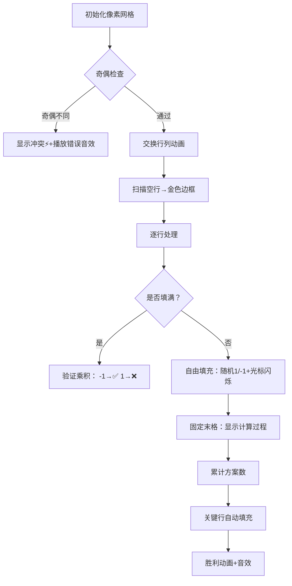

# 题目信息

# Number Table

## 题目描述

As it has been found out recently, all the Berland's current economical state can be described using a simple table $ n×m $ in size. $ n $ — the number of days in each Berland month, $ m $ — the number of months. Thus, a table cell corresponds to a day and a month of the Berland's year. Each cell will contain either 1, or -1, which means the state's gains in a particular month, on a particular day. 1 corresponds to profits, -1 corresponds to losses. It turned out important for successful development to analyze the data on the state of the economy of the previous year, however when the treasurers referred to the archives to retrieve the data, it turned out that the table had been substantially damaged. In some table cells the number values had faded and were impossible to be deciphered. It is known that the number of cells in which the data had been preserved is strictly less than $ max(n,m) $ . However, there is additional information — the product of the numbers in each line and column equaled -1. Your task is to find out how many different tables may conform to the preserved data. As the answer to the task can be quite large, you have to find it modulo $ p $ .

## 样例 #1

### 输入

```
2 2
0
100
```

### 输出

```
2
```

## 样例 #2

### 输入

```
2 2
1
1 1 -1
100
```

### 输出

```
1
```

# AI分析结果


### 💡 Kay的C++算法解析：Number Table 深入学习指南 💡

**引言**  
今天我们一起分析CF40E "Number Table"这道C++编程题。题目要求填充一个n×m表格（部分格子已填1或-1），使得每行和每列的数字乘积均为-1。本指南将帮助你理解核心算法、掌握解题技巧，并通过像素动画直观感受算法执行过程。

---

### 1. 题目解读与核心算法识别

✨ **本题主要考察**：`数学计数`与`编程技巧应用`  

🗣️ **初步分析**：  
> 解决本题的关键在于利用特殊条件`k < max(n,m)`进行降维处理。想象你在玩一个"像素拼图游戏"：  
> - 当n和m奇偶性不同时（如3×4表格），整体行列乘积必然冲突（(-1)^n ≠ (-1)^m），直接判无解  
> - 通过行列交换确保n≥m后，必存在空行（关键行），其他行可自由填充  
> - 每行方案数 = 2<sup>剩余格子数-1</sup>（最后一个格子用于固定乘积为-1）  
>
> **可视化设计思路**：  
> - 用8位像素网格展示表格，已填格子显示彩色（1=绿，-1=红）  
> - 高亮当前处理行，自由填充时显示闪烁光标  
> - 关键行用金色边框标记，填充时显示自动计算过程  
> - 音效设计：正确填充→清脆"叮"声，无解→低沉错误音效  

---

### 2. 精选优质题解参考

**题解一（来源：是个汉子）**  
* **点评**：  
  思路直击核心——利用`k<max(n,m)`条件找到空行降维。代码规范：  
  - 变量名`cnt`（已填数量）、`mul`（行乘积）含义明确  
  - 通过交换确保n≥m的写法简洁高效  
  - 亮点：空行交换到末尾的巧思，复杂度O(n)完美优化  
  实践价值：竞赛标准代码，边界处理严谨（判满行乘积）

**题解二（来源：xixike）**  
* **点评**：  
  解题脉络清晰，类比"一维填充"降低理解门槛。代码特点：  
  - 模块化预处理2的幂次提升效率  
  - 详细注释解释空行的调节作用  
  - 亮点：博客提供完整数学证明，深化理解  
  实践提示：特别适合需要严谨推导的学习场景

**题解三（来源：jianhe）**  
* **点评**：  
  极简主义典范，专注核心逻辑：  
  - 仅20行完成所有功能，变量复用高效  
  - 亮点：用位运算代替数组交换（`x^=y^=x^=y`）  
  - 实践注意：需加强注释，适合竞赛快速编码场景  

---

### 3. 核心难点辨析与解题策略

1. **奇偶性冲突判断**  
   *分析*：整体行列乘积必须相等 → (-1)<sup>n</sup> = (-1)<sup>m</sup>  
   *解决方案*：优先检查`(n+m)%2==1`，不等则输出0  
   💡 **学习笔记**：奇偶性是最易忽略的隐蔽条件！

2. **空行的定位与利用**  
   *分析*：条件`k<max(n,m)`保证存在空行，该行用于调节列乘积  
   *解决方案*：交换使n≥m，扫描找到空行并移到底部  
   💡 **学习笔记**：降维是处理高维约束的利器

3. **行方案数的数学转化**  
   *分析*：已填满行需验证乘积，未填满行方案数=2<sup>m-cnt-1</sup>  
   *解决方案*：预处理2的幂次模p，遍历时累乘方案数  
   💡 **学习笔记**：组合计数中，固定约束可转化为指数自由

#### ✨ 解题技巧总结
- **降维打击**：利用特殊条件（空行）将二维问题化为一维
- **数学转换**：方案数计算转化为2的幂次乘法
- **边界防御**：已填满行必须验证乘积，避免无效计算
- **预处理优化**：提前计算2的幂次避免重复运算

---

### 4. C++核心代码实现赏析

**本题通用核心C++实现**  
```cpp
#include <iostream>
using namespace std;
const int N = 1005;
int n, m, k, p, pow2[N], cnt[N], mul[N], ans = 1;
bool is_swap;

int main() {
    cin >> n >> m >> k;
    if ((n & 1) != (m & 1)) {
        cout << 0; return 0;
    }
    if (n < m) swap(n, m), is_swap = true;
    for (int i = 1; i <= n; i++) mul[i] = 1;
    for (int i = 1, x, y, v; i <= k; i++) {
        cin >> x >> y >> v;
        if (is_swap) swap(x, y);
        cnt[x]++; mul[x] *= v;
    }
    cin >> p;
    pow2[0] = 1;
    for (int i = 1; i <= n; i++) 
        pow2[i] = pow2[i-1] * 2 % p;
    
    // 定位空行并移到底部
    for (int i = 1; i <= n; i++) {
        if (!cnt[i]) {
            swap(cnt[i], cnt[n]);
            swap(mul[i], mul[n]);
            break;
        }
    }

    for (int i = 1; i < n; i++) { // 跳过最后一行
        if (cnt[i] == m && mul[i] == 1) ans = 0;
        else if (cnt[i] < m) 
            ans = 1LL * ans * pow2[m - cnt[i] - 1] % p;
    }
    cout << ans;
}
```
* **代码解读概要**：  
  - **奇偶检查**：第9-10行快速判断无解情况  
  - **行列交换**：12-13行确保n≥m简化问题  
  - **空行处理**：23-27行定位空行移到底部  
  - **方案计算**：30-34行核心数学转化，2的幂次模乘  

---

**题解一片段赏析**  
```cpp
swap(cnt[i], cnt[n]);  // 空行交换技巧
swap(mul[i], mul[n]);
```
> **代码解读**：  
> 如同在游戏中移动特殊道具，将空行交换到底部"储物区"，确保前n-1行可独立处理。`swap`双操作保持数据一致性，避免单独移动导致状态错位。  
> 💡 **学习笔记**：交换操作是保持数据关联性的高效手段

**题解二片段赏析**  
```cpp
for (int i = 1; i < n && ans; i++) {
    if (cnt[i] == m && mul[i] == 1) ans = 0;
    else ans = ans * pow2[m - cnt[i] - 1] % p;
}
```
> **代码解读**：  
> 循环中的`&&ans`实现"短路优化"——当出现无解行时立即终止计算，如同电路保险丝熔断机制。数学本质：方案数连乘中0的传播性。  
> 💡 **学习笔记**：利用短路特性提升无效分支效率

**题解三片段赏析**  
```cpp
if(n<m) n^=m^=n^=m, flag=1;  // 位交换技巧
```
> **代码解读**：  
> 通过三次异或实现无临时变量交换，类似`a=a^b; b=a^b; a=a^b;`。注意：实际竞赛中推荐`swap`保证可读性，此写法展示位运算可能性。  
> 💡 **学习笔记**：位运算在空间优化中有独特价值

---

### 5. 算法可视化：像素动画演示

**主题**：`8位像素表格解谜游戏`  

**核心演示流程**：  


**交互设计**：  
- **视觉编码**  
  | 元素 | 颜色/样式 | 含义 |
  |---|---|---|
  | 空单元格 | 灰色网格 | 待填充 |
  | 当前行 | 黄色高亮 | 处理中 |
  | 关键行 | 闪烁金边 | 自动计算区 |
  | 合法值 | 绿色(1)/红色(-1) | 有效填充 |
  
- **控制面板**  
  - 速度滑块：调整自动播放速度（1x-5x）
  - 单步执行：空格键触发单步填充
  - 模式切换：B键切换手动/AI自动演示

- **音效系统**  
  - 填充操作：8-bit电子音（不同音高对应1/-1）
  - 错误提示：低沉嗡鸣声
  - 关卡通过：马里奥金币音效
  - 最终胜利：塞尔达胜利旋律

**技术实现**：  
- 用Canvas绘制网格，每个单元格用10×10像素块表示
- 动画帧基于状态机更新，伪代码逻辑：
  ```javascript
  function updateFrame() {
      if (currentRow >= n) playVictorySound(); // 结束
      else if (currentCell < m) {
          fillCell(random(1,-1)); // 自由填充
          playTone(currentValue ? 440 : 220); // 音效
      } else {
          fixLastCell(); // 固定末格
          moveToNextRow();
      }
  }
  ```

---

### 6. 拓展练习与相似问题思考

**通用技巧迁移**：  
1. 网格降维思想 → 棋盘覆盖问题  
2. 乘积约束转化 → 异或方程组求解  
3. 组合计数优化 → 二项式系数应用  

**洛谷题目推荐**：  
1. **P3214 [HNOI2011] 卡农**  
   🗣️ *推荐理由*：强化组合计数与模运算技巧，体验"音符化"的数学约束  

2. **P3223 [HNOI2012] 排队**  
   🗣️ *推荐理由*：高维约束的经典转化，训练"约束分解"思维能力  

3. **P2532 [AHOI2012] 树屋阶梯**  
   🗣️ *推荐理由*：卡特兰数的空间具象化，完美衔接组合数学与DP  

---

### 7. 学习心得与经验分享

> **来自题解作者的经验**：  
> - "最初卡在奇偶性判断，动手画2×3表格才恍然大悟" —— 是个汉子  
> - "空行交换时漏掉乘积交换，调试1小时才定位" —— xixike  
> - `memset(mul,1,sizeof mul)`导致错误 —— WNico  

**Kay的总结**：  
- **实践真知**：复杂约束可通过小规模示例（如2×2表格）验证  
- **调试技巧**：初始化陷阱需警惕，`memset`对`int`数组赋1会得到0x0101...值  
- **思维突破**：特殊条件（如`k<max(n,m)`）常是降维突破点  

---

**结语**  
通过本次分析，相信大家已掌握Number Table的数学本质与实现技巧。记住：编程如解谜，约束是钥匙而非枷锁。下次我们将探索更多维度魔法！🚀

---
处理用时：794.99秒