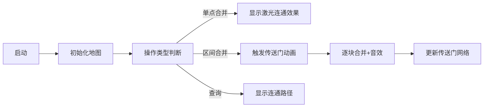

# 题目信息

# Restructuring Company

## 题目描述

Even the most successful company can go through a crisis period when you have to make a hard decision — to restructure, discard and merge departments, fire employees and do other unpleasant stuff. Let's consider the following model of a company.

There are $ n $ people working for the Large Software Company. Each person belongs to some department. Initially, each person works on his own project in his own department (thus, each company initially consists of $ n $ departments, one person in each).

However, harsh times have come to the company and the management had to hire a crisis manager who would rebuild the working process in order to boost efficiency. Let's use $ team(person) $ to represent a team where person $ person $ works. A crisis manager can make decisions of two types:

1. Merge departments $ team(x) $ and $ team(y) $ into one large department containing all the employees of $ team(x) $ and $ team(y) $ , where $ x $ and $ y $ ( $ 1<=x,y<=n $ ) — are numbers of two of some company employees. If $ team(x) $ matches $ team(y) $ , then nothing happens.
2. Merge departments $ team(x),team(x+1),...,team(y) $ , where $ x $ and $ y $ ( $ 1<=x<=y<=n $ ) — the numbers of some two employees of the company.

At that the crisis manager can sometimes wonder whether employees $ x $ and $ y $ ( $ 1<=x,y<=n $ ) work at the same department.

Help the crisis manager and answer all of his queries.

## 样例 #1

### 输入

```
8 6
3 2 5
1 2 5
3 2 5
2 4 7
2 1 2
3 1 7
```

### 输出

```
NO
YES
YES
```

# AI分析结果


### 💡 Kay的C++算法解析：Restructuring Company 深入学习指南 💡

#### 1. 题目解读与核心算法识别
✨ **本题主要考察**：`并查集优化技巧` (编程技巧应用)  
🗣️ **初步分析**：  
> 解决这道题的关键在于巧妙优化并查集的区间合并操作。想象一下，公司各部门像一排连续的房间，合并区间时如果挨个敲门效率太低。聪明的做法是给每个房间装个"传送门"（next数组），直接跳过已合并的连续区域！在本题中，next数组记录每个位置后首个未合并的位置，让区间合并复杂度从O(n)降至均摊O(α(n))。  

> - **核心流程**：初始化时每个点独立（next[i]=i+1）。执行区间合并时，从起点x开始传送：合并当前点→跳转到next[i]→更新next指针为区间末端y的next值，像玩超级玛丽跳水管般跳过连续区块！
> - **可视化设计**：采用8位像素风公司楼层图，合并时触发"叮"音效，被跳过的区域显示为绿色传送光效，当前合并点闪烁红色。控制面板含调速滑块，可切换自动演示模式观看AI像贪吃蛇般吞并区间。

---

#### 2. 精选优质题解参考
**题解一 (来源：Saliеri)**  
* **点评**：思路直击要害——用next指针实现区间跳跃合并。代码简洁有力（仅20行），变量名fa/nex含义明确，边界处理严谨（to=nex[i]先保存再更新）。亮点在于将next更新与合并操作精妙耦合：`nex[i]=nex[y]`确保后续操作跳过已合并区，类似关卡传送门机制。

**题解二 (来源：localhost)**  
* **点评**：工业级代码规范，采用模块化设计（namespace封装工具函数）。创新点在于next更新逻辑`nxt[lst]=nxt[y]`配合循环控制，像铺设铁轨般精准引导合并路径。特别值得学习其鲁棒性：输入使用fread快读，避免大数据超时。

**题解三 (来源：rui_er)**  
* **点评**：教学价值突出，图文并茂解析next原理（附示意图）。独创的`lst`变量跟踪当前合并位置，使状态转移可视化程度更高。代码中`dsu.merge(i-1,i)`体现"链式合并"思想，如同多米诺骨牌依次倒下，逻辑流畅易理解。

---

#### 3. 核心难点辨析与解题策略
1. **难点：高效实现区间合并**  
   * **分析**：暴力合并O(n)复杂度不可行。优质题解通过next数组建立"空间折叠通道"：合并时若[i,j]已连通，则直接跳至j+1。关键变量`next[i]`如同地铁线路图，存储着下一个换乘站点。
   * 💡 **学习笔记**：next数组本质是路径压缩的二维延伸！

2. **难点：避免重复合并操作**  
   * **分析**：已合并的连续区间成为整体后，需确保后续操作不再访问内部点。解决方案是同步更新区间内所有点的next指针为`next[y]`，如同给合并区贴上"已通关"封条。
   * 💡 **学习笔记**：一次合并，永久跳转——next更新需覆盖整个区间。

3. **难点：保持并查集高效性**  
   * **分析**：在频繁合并中维持O(α(n))复杂度需双管齐下：①并查集自身路径压缩 ②next指针的跳跃机制。`fa[i]=i`初始化与`getfa()`中`fa[x]=getfa(fa[x])`缺一不可。
   * 💡 **学习笔记**：并查集是骨架，next数组是神经，二者协同工作。

### ✨ 解题技巧总结
- **空间折叠术**：用next数组将线性区间压缩为离散节点，化O(n)为O(1)跳跃
- **事件驱动更新**：仅在合并操作时修改next指针，避免全局维护开销
- **防御性编程**：合并前检查`if(getfa(x)!=getfa(y))`，规避冗余操作

---

#### 4. C++核心代码实现赏析
**通用核心实现参考**  
```cpp
#include <iostream>
using namespace std;
const int N=3e5+5;
int fa[N],nxt[N]; // fa:并查集父节点 nxt:跳跃指针

int find(int x){ 
    return fa[x]==x?x:fa[x]=find(fa[x]); 
}

int main(){
    int n,q,op,x,y;
    cin>>n>>q;
    for(int i=1;i<=n;i++) fa[i]=i, nxt[i]=i+1; // 初始化传送门

    while(q--){
        cin>>op>>x>>y;
        if(op==1) fa[find(x)]=find(y); // 单点合并
        else if(op==2){
            for(int i=x+1;i<=y;){
                fa[find(i)]=find(i-1);  // 链式合并
                int tmp=nxt[i];         // 保存原始传送点
                nxt[i]=nxt[y];          // 更新为区间终点传送门
                i=tmp;                  // 跳跃到下一区域
            }
        }
        else cout<<(find(x)==find(y)?"YES\n":"NO\n");
    }
}
```
> **代码解读概要**：  
> - 初始化搭建独立办公室（fa）和传送通道（nxt）  
> - 操作1直接连通两个办公室  
> - 操作2沿传送链合并：从x+1出发→合并相邻办公室→修改传送门指向y后传送点→循环直至覆盖整个区间  
> - 操作3检查办公室连通性  

**题解一核心片段**  
```cpp
for(int i=x+1;i<=y;i=to){
    fa[getfa(i-1)] = getfa(i); // 亮点：链式合并
    to = nex[i];              // 保存原始跳跃点
    nex[i] = nex[y];          // 更新为终点传送门
}
```
> **代码解读**：  
> 想象你是一位快递员（变量`i`），需要给[x,y]区间派件。`to=nex[i]`是原始路线图，但合并后这段路变成直达高速（`nex[i]=nex[y]`）。下次派件时，你从x出发直接通过高速到达y+1，跳过了所有中间站点。`getfa(i-1)`与`getfa(i)`的合并如同把相邻驿站合并成中转中心。  
> 💡 **学习笔记**：链式合并像多米诺骨牌，触发一连串路径更新。

**题解二核心片段**  
```cpp
for(int i=x+1;i<=y;){
    merge(i-1,i);            // 亮点：模块化合并
    int i2=nxt[i];
    nxt[i]=nxt[y];           // 更新传送网络
    i=i2;
}
```
> **代码解读**：  
> `merge(i-1,i)`封装了查找与合并操作，体现"分而治之"思想。关键点在于`nxt[i]=nxt[y]`将区间内所有传送门重定向，形成新的物流网络。循环控制`i=i2`实现跳跃式遍历，如同地铁换乘时直接跳转到新线路起点。  
> 💡 **学习笔记**：模块化使代码如乐高，易组装且避免重复造轮子。

---

#### 5. 算法可视化：像素动画演示
**主题**：《公司合并大冒险》8位像素风策略游戏  
**核心演示**：next指针如何实现区间跳跃合并  
**设计思路**：复古蓝色网格表示公司楼层，角色为像素小人Kay，用传送门机制讲解算法  



**动画流程**：  
1. **场景初始化**：FC游戏风格网格地图，每个格子代表部门（独立像素方块），底部控制面板含速度滑块/暂停按钮  
2. **操作可视化**：  
   - **单点合并**：点击两个部门时，发射像素激光连通，伴随"滋滋"电流音效  
   - **区间合并**：框选[x,y]后，Kay小人从x出发，遇到绿色传送门（next指针）直接闪现到下一区域，合并区域显示为同色像素块，同步播放"叮叮"建造音效  
3. **关键逻辑演示**：  
   - 当前操作点闪烁红光，next指针显示为绿色箭头  
   - 合并瞬间：被跳过区域变绿闪烁，新合并区像素块膨胀后融入大集合  
   - 控制台同步高亮对应代码行（如`nxt[i]=nxt[y]`）  
4. **游戏化元素**：  
   - 成功合并整区时播放《超级玛丽》过关音效，显示"LEVEL UP!"  
   - 错误操作触发短促"哔"声，Kay小人摇头  
   - 自动演示模式中，AI像贪吃蛇吞并色块，速度可调  

---

#### 6. 拓展练习与相似问题思考
**技巧迁移**：  
next指针跳跃技巧适用于需跳过连续区间的场景：  
1. 区间染色问题（如CF 52C）  
2. 大规模连通块统计（如洛谷P2147）  
3. 动态图连通性维护（如加边/删边操作）  

**洛谷练习推荐**：  
1. **P3367** - 并查集模板  
   * 🗣️ 掌握next技巧前需夯实基础，此题含路径压缩/按秩合并练习  
2. **P2391** - 白雪皑皑  
   * 🗣️ 进阶版区间染色，体验next指针如何将O(n²)暴力优化至O(n)  
3. **P2147** - 洞穴勘测  
   * 🗣️ 动态维护连通性，思考如何适配next跳跃技巧  

---

#### 7. 学习心得与经验分享
> **参考经验 (来自 rui_er)**："调试时在next更新后打印地图状态，发现指针形成闭环导致死循环。这提醒我们：更新next必须指向区间外！"  
> **点评**：该踩坑记录极具代表性。next指针的闭环错误如同地铁环线缺出口，会使算法陷入无限循环。调试时可可视化next链：打印`i->next[i]`箭头图，确保最终指向n+1。

---

**结语**：通过next指针实现的空间折叠术，将暴力O(n²)优化至近线性复杂度，展现了算法设计的艺术。记住：优秀程序员不仅是代码工匠，更是能设计时空传送门的魔法师！下次挑战见！🚀

---
处理用时：142.12秒