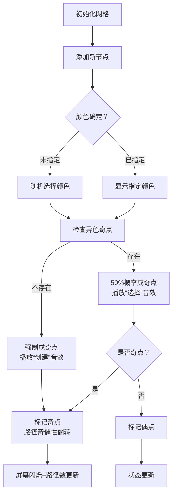

# 题目信息

# Kuro and Topological Parity

## 题目描述

给定 $n$ 个点，每个点有黑白两种颜色（如果没有颜色，那么你可以把它任意涂成黑色或白色），同时你可以在这个图上任意加入一些边（当然不能加入重边或自环），要求：加入的边必须从编号小的点指向编号大的点

我们称一条好的路径为经过的点为黑白相间的路径，如果一个图好的路径的总数 $\bmod 2=p$，那么我们称这个图为好的图，现在给定你 $n$ 个点的情况，求这 $n$ 个点能组成的好的图的个数，答案对 $10^9+7$ 取模。

## 样例 #1

### 输入

```
3 1
-1 0 1
```

### 输出

```
6```

## 样例 #2

### 输入

```
2 1
1 0
```

### 输出

```
1```

## 样例 #3

### 输入

```
1 1
-1
```

### 输出

```
2```

# AI分析结果


# 💡 Kay的C++算法解析：Kuro and Topological Parity 深入学习指南 💡

## 1. 题目解读与核心算法识别

✨ **本题主要考察**：`动态规划（状态压缩）`与`组合计数`

🗣️ **初步分析**：
> 解决"Kuro and Topological Parity"这道题，关键在于运用动态规划和状态压缩技巧。想象一下，你正在建造一座只能单向通行（小到大）的彩虹桥，每座桥必须相邻颜色不同（黑白相间）。动态规划就像是在建桥过程中，用魔法笔记本记录下所有可能的建桥方案和路径奇偶性。
   - 核心思路是按节点顺序逐个处理，维护路径总数奇偶性和关键状态（是否存在奇黑/奇白点）。状态压缩技巧将指数级状态简化为常数大小。
   - 核心难点在于状态设计和转移方程推导：如何捕捉影响路径奇偶性的关键信息？如何高效计算转移系数？
   - 在像素动画中，我们将用闪烁的方块表示"奇点"，普通方块表示"偶点"。添加节点时，若存在异色奇点会触发"控制开关"动画（像素闪电特效），路径奇偶性翻转时播放8-bit音效。自动演示模式将展示AI如何逐步构建最优解。

---

## 2. 精选优质题解参考

**题解一（da32s1da）**
* **点评**：该题解采用四维状态压缩DP（路径奇偶性+奇黑/奇白存在性），思路清晰直击问题本质。代码中预处理2的幂次优化计算，变量名`f[i][j][ob][ow]`含义明确，边界处理严谨（特别处理i=1的情况）。亮点在于用存在性代替具体数量，将复杂度优化到O(n)，是状态压缩的典范。作者提到"挑出奇黑点控制奇偶性"的洞察是核心突破点。

**题解二（joke3579）**
* **点评**：题解详细推导了从O(n⁴)到O(n)的优化过程，具有优秀的教学价值。代码使用宏简化循环但保持可读性，转移方程推导中"异色奇点对方案奇偶性的控制"解释透彻。亮点在于展示优化思维链条，帮助理解状态压缩的本质，虽然宏定义略影响可读性，但整体实现高效实用。

**题解三（Booksnow）**
* **点评**：题解变量命名清晰（`exist_ob`替代`ob`），注释充分，特别适合初学者。状态设计与其他优质题解一致但解释更细致，推导了"2^(i-2)"系数的组合意义。亮点在于代码模块化和教学性注释，如"存在异色奇点时方案对半分"的直观解释。

---

## 3. 核心难点辨析与解题策略

1.  **状态设计维度爆炸**
    * **分析**：直接记录四类点数量导致O(n⁴)状态。优质题解发现只需记录"是否存在"奇黑/奇白点，因为只要存在就能控制新点奇偶性
    * 💡 **学习笔记**：状态压缩的关键是识别"影响结果的最小信息集"

2.  **转移系数推导**
    * **分析**：当存在异色奇点时，新点成为奇/偶点的方案各占一半（系数2^(i-2)）；否则只能成为奇点（系数2^(i-1)）。这源于组合数学定理：从m元素选偶/奇子集方案数均为2^(m-1)
    * 💡 **学习笔记**：善用组合恒等式简化计算是DP优化利器

3.  **未指定颜色处理**
    * **分析**：颜色未定节点需同时考虑涂黑/涂白两种情况。优质题解在转移时用`a[i]!=0`和`a[i]!=1`优雅处理三种情况
    * 💡 **学习笔记**：多选项问题可通过独立转移分支处理

### ✨ 解题技巧总结
-   **状态压缩艺术**：用存在性代替计数，将指数状态降至常数级
-   **组合数学优化**：利用$\binom{m}{even}=\binom{m}{odd}=2^{m-1}$简化转移系数
-   **顺序处理优势**：按节点编号顺序处理，利用DAG性质（边只能小→大）消除后效性
-   **模块化转移**：将颜色选择、奇偶性影响分解为独立转移分支

---

## 4. C++核心代码实现赏析

**本题通用核心C++实现参考**
* **说明**：综合自优质题解的状态压缩DP，采用四维数组表示[节点数, 路径奇偶性, 奇黑存在性, 奇白存在性]
* **完整核心代码**：
```cpp
#include <cstdio>
const int mod = 1e9 + 7;
const int N = 60;
int n, p, a[N], power2[N];
int f[N][2][2][2]; // f[i][parity][exist_odd_black][exist_odd_white]

inline void add(int &x, int y) {
    x += y;
    if (x >= mod) x -= mod;
}

int main() {
    scanf("%d%d", &n, &p);
    for (int i = 1; i <= n; i++) scanf("%d", &a[i]);
    
    // 预处理2的幂次
    power2[0] = 1;
    for (int i = 1; i <= n; i++) 
        power2[i] = (power2[i - 1] << 1) % mod;
    
    // 初始状态：0个节点，奇偶性0，无奇点
    f[0][0][0][0] = 1;
    
    // DP转移
    for (int i = 1; i <= n; i++) {
        for (int parity = 0; parity < 2; parity++) {
            for (int exist_ob = 0; exist_ob < 2; exist_ob++) {
                for (int exist_ow = 0; exist_ow < 2; exist_ow++) {
                    long long cur = f[i - 1][parity][exist_ob][exist_ow];
                    if (!cur) continue;
                    
                    // 当前点涂白的情况
                    if (a[i] != 0) {
                        if (exist_ob) { // 存在奇黑点
                            add(f[i][parity][exist_ob][exist_ow], cur * power2[i - 2] % mod);
                            add(f[i][parity ^ 1][exist_ob][1], cur * power2[i - 2] % mod); // 新增奇白点
                        } else { // 无奇黑点
                            add(f[i][parity ^ 1][exist_ob][1], cur * power2[i - 1] % mod);
                        }
                    }
                    
                    // 当前点涂黑的情况
                    if (a[i] != 1) {
                        if (exist_ow) { // 存在奇白点
                            add(f[i][parity][exist_ob][exist_ow], cur * power2[i - 2] % mod);
                            add(f[i][parity ^ 1][1][exist_ow], cur * power2[i - 2] % mod); // 新增奇黑点
                        } else { // 无奇白点
                            add(f[i][parity ^ 1][1][exist_ow], cur * power2[i - 1] % mod);
                        }
                    }
                }
            }
        }
    }
    
    // 统计结果
    int ans = 0;
    for (int exist_ob = 0; exist_ob < 2; exist_ob++)
        for (int exist_ow = 0; exist_ow < 2; exist_ow++)
            add(ans, f[n][p][exist_ob][exist_ow]);
    printf("%d\n", ans);
    return 0;
}
```
* **代码解读概要**：
  > 1. **预处理**：计算2的幂次避免重复计算
  > 2. **状态初始化**：0个节点时只有1种方案
  > 3. **四重循环转移**：遍历所有状态组合
  > 4. **颜色分支处理**：分别处理涂白/涂黑情况
  > 5. **存在性检查**：根据是否存在异色奇点确定转移系数
  > 6. **结果统计**：累加满足最终奇偶性p的所有状态

**题解一（da32s1da）核心实现**
* **亮点**：状态设计精炼，转移系数计算优化
* **核心代码片段**：
  ```cpp
  if(a[i]!=0){//白点
      if(ob){//存在奇黑
          add(f[i][_][ob][ow], 1ll*qwq*_2[i-2]%mod);
          add(f[i][_^1][ob][ow|1], 1ll*qwq*_2[i-2]%mod);
      }else add(f[i][_^1][ob][ow|1], 1ll*qwq*_2[i-1]%mod);
  }
  ```
* **代码解读**：
  > 当处理白点时：  
  > 1. 若存在奇黑(`ob=1`)，新点可成为偶白（不改变奇偶性）或奇白（奇偶性翻转，`ow|1`标记）  
  > 2. 系数`_2[i-2]`源于：从`i-1`个前驱中选边时，用1个奇黑控制奇偶性，其余任意  
  > 3. 若无奇黑，只能成为奇白（系数`_2[i-1]`）
* 💡 **学习笔记**：位运算`ow|1`高效实现状态更新

**题解二（joke3579）关键技巧**
* **亮点**：状态转移与题解一相同，但使用宏简化循环
* **学习笔记**：`rep`宏提升代码简洁性，但需平衡可读性

**题解三（Booksnow）教学价值**
* **亮点**：详细注释和直观变量名（如`exist_ob`）
* **学习笔记**：清晰的命名和注释是调试的关键

---

## 5. 算法可视化：像素动画演示

**主题**："奇偶路径建造者"（8-bit像素风格）

**核心演示**：节点逐个加入时状态变化，重点展示：
1. 节点颜色选择（白/黑像素块）
2. 奇点产生时闪烁动画+音效
3. 路径奇偶性翻转时的屏幕震动效果
4. 控制面板显示当前状态（奇黑/奇白存在性）

**动画帧步骤**：


**交互设计**：
1. **控制面板**：开始/暂停、单步执行、速度滑块
2. **视觉编码**：
   - 黑色方块：黑点
   - 白色方块：白点
   - 闪烁方块：奇点
   - 金色边框：当前处理节点
3. **音效方案**：
   - 奇点产生：短促"叮！"(440Hz)
   - 路径奇偶翻转：上升音阶(220Hz→880Hz)
   - 完成：8-bit胜利旋律
4. **AI演示模式**：自动以最优路径演示，每步显示决策原因

---

## 6. 拓展练习与相似问题思考

**通用技巧迁移**：
1. 状态压缩DP可用于各类计数问题（如网格路径、子集选择）
2. 奇偶性计数技巧适用于模数小的约束条件（如mod 2/3）
3. 存在性状态优化可处理带约束的路径计数

**推荐练习**：
1. **洛谷 P1357** 花园  
   🗣️ *巩固状态压缩DP，处理循环结构*
   
2. **洛谷 P2602** 数字计数  
   🗣️ *练习数位DP中的计数技巧*
   
3. **洛谷 P6218** 销售基因  
   🗣️ *状态压缩与子集DP的结合应用*

---

## 7. 学习心得与经验分享

> **来自 da32s1da 的洞察**：  
> "关键在控制奇黑点调整奇偶性——存在异色奇点时，新点的奇偶性可自由控制；否则只能成为奇点"

**点评**：这个发现揭示了状态压缩的核心——用存在性代替具体数量。在调试类似问题时，可通过打印状态转移表验证该性质。当方案数不符合预期时，重点检查转移系数的推导是否正确应用了该原理。

---

本次关于"Kuro and Topological Parity"的解析就到这里。记住，掌握状态压缩就像获得编程超能力——它能将复杂问题化繁为简！下次挑战再见！🚀

---
处理用时：212.77秒