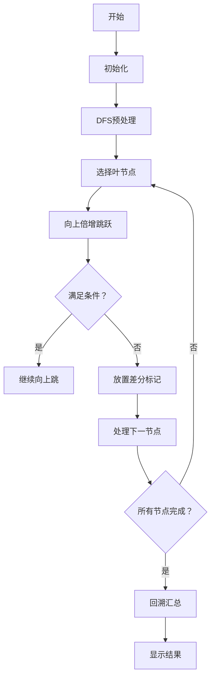

# 题目信息

# Alyona and a tree

## 题目描述

Alyona有一棵有 $n$ 个节点的树。这棵树的根节点是 $1$。在每个节点里，Alyona写了一个正整数，在节点 $i$ 她写了正整数 $a_i$ 。另外，她在这棵树上的每条边上写了一个正整数（不同边上可能有不同的数）。

让我们定义 $dist(v,u)$ 作为从 $v$ 到 $u$ 的简单路径上的边权和。

当且仅当 $u$ 在 $v$ 的子树中并且 $dist(v,u)\leq a_u$，顶点 $v$ 控制顶点 $u(v\neq u)$ 。

Alyona想在某些顶点定居。为了做到这件事，她想知道在每个节点 $v$ 能控制几个节点。

## 说明/提示

在样例中，节点 $1$ 控制了节点 $3$ ，节点 $3$ 控制节点 $5$ （注意，这并不代表节点 $1$ 控制了节点 $5$ ）

Translated by @lolte

## 样例 #1

### 输入

```
5
2 5 1 4 6
1 7
1 1
3 5
3 6
```

### 输出

```
1 0 1 0 0
```

## 样例 #2

### 输入

```
5
9 7 8 6 5
1 1
2 1
3 1
4 1
```

### 输出

```
4 3 2 1 0
```

# AI分析结果


# 💡 Kay的C++算法解析：Alyona and a tree 深入学习指南 💡

> 今天我们来分析CF739B "Alyona and a tree"这道树形结构编程题。本指南将帮助大家掌握树上差分与倍增算法的核心思想，通过清晰的讲解和复古像素动画演示，带大家直观理解算法执行过程。

## 1. 题目解读与核心算法识别

✨ **本题主要考察**：`树上差分` + `倍增算法` + `DFS遍历`

🗣️ **初步分析**：
> 想象一棵家族树，每个节点代表一个人，点权a[u]代表u的能力值。问题要求：对每个人v，统计他控制的后代u的数量（控制条件：v到u的距离≤u的能力值）
> - **核心思路**：对每个u，向上寻找最远能控制他的祖先v，然后给v到u的父节点这条链上的所有节点计数+1（用差分优化）
> - **关键技巧**：用倍增法快速定位最远祖先（O(log n)时间），用树上差分高效更新路径计数
> - **可视化设计**：我们将用像素动画展示DFS遍历过程（绿色节点移动）、倍增跳跃（黄色高亮）、差分标记（红/绿信号灯）和前缀和汇总（蓝色波纹）
> - **复古游戏化**：8-bit风格树形迷宫，角色从叶节点向上跳跃，伴随"跳跃音效"和"信号灯音效"，完成所有节点后播放胜利BGM

---

## 2. 精选优质题解参考

**题解一（RedreamMer）**
* **亮点**：思路最清晰直白，直接点出"每个u作用于祖先链"的核心。倍增查找逻辑严谨（高位优先尝试），差分标记位置精确（u的父节点+1，最远祖先父节点-1）。代码变量命名规范（fa/dis），边界处理完整（根节点特判）

**题解二（くろねこ）**
* **亮点**：展示从暴力（TLE）到倍增差分优化的完整思考过程，含调试心得。差分部分巧妙结合递归DFS，代码结构模块化（dfs1预处理，process处理每个节点，dfs2汇总）

**题解三（mol茶蛋糕）**
* **亮点**：代码最简洁高效，倍增循环用位运算优化。差分更新直接集成在倍增查找后，适合竞赛实践（仅31行核心逻辑）

---

## 3. 核心难点辨析与解题策略

1. **难点：如何快速定位最远合格祖先？**
   * **分析**：暴力向上检查需O(n²)。利用距离单调性（边权正），用倍增法每次尝试跳2^k步，从高位向低位调整
   * 💡 **学习笔记**：倍增法本质是二进制拆分，适用于单调性问题

2. **难点：如何高效更新祖先链计数？**
   * **分析**：直接更新路径需O(n²)。树上差分在u的父节点+1，在最远祖先v的父节点-1，最后DFS求前缀和
   * 💡 **学习笔记**：差分把路径更新转为端点操作，复杂度O(1)

3. **难点：如何整合距离计算与祖先关系？**
   * **分析**：DFS预处理每个节点到根的距离dis[u]和倍增数组。关键公式：dist(v,u)=dis[u]-dis[v]
   * 💡 **学习笔记**：树问题中，预处理到根的距离可快速计算任意两点距离

### ✨ 解题技巧总结
- **技巧1：树上差分套路**  
  路径更新时：起点+1，终点下一位置-1，DFS回溯求前缀和
- **技巧2：倍增查找四步法**  
  初始化指针→高位到低位循环→满足条件则跳跃→调整步长
- **技巧3：树形数据预处理**  
  DFS同时计算dis和fa数组，避免重复遍历

---

## 4. C++核心代码实现赏析

**通用核心实现参考**（综合优化版）：
```cpp
#include <iostream>
#include <vector>
using namespace std;

typedef long long LL;
const int N = 2e5+5, K = 20;
vector<pair<int, LL>> g[N];
LL a[N], dis[N];
int f[K][N], ans[N]; // f[k][i]: i的2^k级祖先

void dfs1(int u, int fa) {
    f[0][u] = fa;
    for (int k = 1; k < K; k++)  // 构建倍增数组
        f[k][u] = f[k-1][f[k-1][u]];
    
    for (auto [v, w] : g[u]) {
        if (v == fa) continue;
        dis[v] = dis[u] + w;     // 更新到根距离
        dfs1(v, u);
    }
}

void process(int u) {
    int x = u;  // 从u开始向上跳
    for (int k = K-1; k >= 0; k--) 
        if (f[k][x] && dis[u] - dis[f[k][x]] <= a[u])
            x = f[k][x];         // 满足条件则跳跃
    
    ans[f[0][u]]++;    // u的父节点+1
    if (f[0][x]) ans[f[0][x]]--; // 最远祖先的父节点-1
}

void dfs2(int u, int fa) {  // 差分汇总
    for (auto [v, w] : g[u]) {
        if (v == fa) continue;
        dfs2(v, u);
        ans[u] += ans[v];  // 累加子节点值
    }
}

int main() {
    int n; cin >> n;
    for (int i = 1; i <= n; i++) cin >> a[i];
    for (int i = 2; i <= n; i++) {
        int p; LL w; cin >> p >> w;
        g[p].push_back({i, w});
        g[i].push_back({p, w});
    }
    dfs1(1, 0);
    for (int i = 1; i <= n; i++) process(i);
    dfs2(1, 0);
    for (int i = 1; i <= n; i++) cout << ans[i] << " ";
}
```

**题解一（RedreamMer）核心片段**：
```cpp
// 在dfs中集成倍增与差分
void dfs(int u) {
    for(int k=1; k<=19; k++) 
        fa[u][k] = fa[fa[u][k-1]][k-1];  // 构建倍增表
    
    int now = u;
    for(int k=19; k>=0; k--)              // 高位优先尝试
        if(fa[now][k] && dis[u]-dis[fa[now][k]] <= a[u])
            now = fa[now][k];              // 跳跃
    
    dif[fa[now][0]]--;    // 最远祖先父节点-1 (差分)
    dif[fa[u][0]]++;      // u的父节点+1
    
    for(auto v : children) 
        dfs(v), dif[u] += dif[v];  // 回溯累加
}
```
* **亮点**：紧凑集成倍增查找和差分更新
* **学习笔记**：DFS回溯时自然完成差分汇总

---

## 5. 算法可视化：像素动画演示

**主题**：8-bit树形迷宫探险  
**核心演示**：从叶节点向上跳跃找最远祖先，放置差分信号灯，最后汇总部落能量



**动画帧详解**：
1. **场景初始化**（复古绿调）
   - 像素树：根节点在顶部（城堡图标），叶节点在底部（宝藏图标）
   - 控制面板：开始/暂停/步进按钮，速度滑块
   - 8-bit BGM循环播放

2. **DFS预处理**（蓝色波纹动画）
   - 角色从根节点出发，向下探索
   - 经过的边显示距离值，节点显示dis[u]
   - 伴随"滴答"音效（每次距离更新）

3. **倍增跳跃**（黄色高亮）
   - 选择叶节点u（闪烁），显示a[u]值
   - 从u向上尝试跳2^k步：成功跳跃显示绿色箭头，失败显示红色阻挡
   - 音效：跳跃时"嗖"，落地时"砰"

4. **差分标记**（信号灯动画）
   - 找到最远祖先v：u的父节点处放置绿色↑（+1）
   - v的父节点处放置红色↓（-1）
   - 音效：放置时"叮"

5. **结果汇总**（能量汇聚）
   - 从叶节点向上回溯，差分值像波纹一样向上传递
   - 每个节点的最终答案以蓝色数字浮现
   - 完成时播放胜利音效+烟花动画

---

## 6. 拓展练习与相似问题思考

**通用技巧迁移**：
- 树上差分：解决路径更新/子树查询问题（如：P3258 松鼠的新家）
- 倍增法：应用在LCA查询/路径统计（如：P3379 LCA模板）
- 树上前缀和：结合DFS序转化区间问题（如：P4211 LNOI2014 LCA）

**洛谷推荐**：
1. **P3258 [JLOI2014]松鼠的新家**  
   → 练习树上差分基础应用，巩固路径更新技巧
2. **P3379 【模板】最近公共祖先**  
   → 熟练掌握倍增法求LCA，本题的重要基础
3. **P4211 [LNOI2014]LCA**  
   → 强化树结构问题抽象能力，学习离线查询技巧

---

## 7. 学习心得与经验分享

> **作者くろねこ的调试经验**：  
> "最初用Dijkstra求距离（错误），后改用DFS。暴力方法TLE后，通过打印中间变量发现距离计算错误，最终用倍增+差分优化成功AC"

**Kay总结**：  
1. 树问题优先考虑DFS/BFS遍历，避免Dijkstra
2. 调试时打印关键变量（dis/fa数组）是定位错误的有效手段
3. 遇到链式更新要想到差分技巧

---

通过本指南，大家不仅掌握了树上差分与倍增的实战应用，还通过复古像素动画直观理解了算法执行过程。记住，算法学习就像探险——先理解地图（问题分析），再选择工具（算法设计），最后优化路线（代码实现）！下次挑战见！🚀

---
处理用时：186.72秒