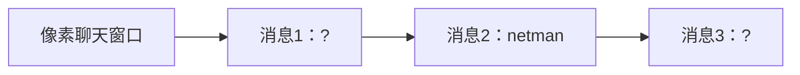

# 题目信息

# Vladik and chat

## 题目描述

Recently Vladik discovered a new entertainment — coding bots for social networks. He would like to use machine learning in his bots so now he want to prepare some learning data for them.

At first, he need to download $ t $ chats. Vladik coded a script which should have downloaded the chats, however, something went wrong. In particular, some of the messages have no information of their sender. It is known that if a person sends several messages in a row, they all are merged into a single message. It means that there could not be two or more messages in a row with the same sender. Moreover, a sender never mention himself in his messages.

Vladik wants to recover senders of all the messages so that each two neighboring messages will have different senders and no sender will mention himself in his messages.

He has no idea of how to do this, and asks you for help. Help Vladik to recover senders in each of the chats!

## 样例 #1

### 输入

```
1
2
Vladik netman
2
?: Hello, Vladik!
?: Hi
```

### 输出

```
netman: Hello, Vladik!
Vladik: Hi
```

## 样例 #2

### 输入

```
1
2
netman vladik
3
netman:how are you?
?:wrong message
vladik:im fine
```

### 输出

```
Impossible
```

## 样例 #3

### 输入

```
2
3
netman vladik Fedosik
2
?: users are netman, vladik, Fedosik
vladik: something wrong with this chat
4
netman tigerrrrr banany2001 klinchuh
4
?: tigerrrrr, banany2001, klinchuh, my favourite team ever, are you ready?
klinchuh: yes, coach!
?: yes, netman
banany2001: yes of course.
```

### 输出

```
Impossible
netman: tigerrrrr, banany2001, klinchuh, my favourite team ever, are you ready?
klinchuh: yes, coach!
tigerrrrr: yes, netman
banany2001: yes of course.
```

# AI分析结果


### 💡 Kay的C++算法解析：Vladik and chat 深入学习指南 💡

#### 1. 题目解读与核心算法识别
✨ **本题主要考察**：`约束满足问题与回溯搜索`  
🗣️ **初步分析**：  
> 这道题可看作"消息链染色问题"——每条消息是一个节点，用户是颜色，相邻节点需不同色且节点内容不能包含自身颜色名。核心解法采用**约束传播+回溯搜索**：  
> 1. **约束表构建**：预处理每条消息禁止的用户（含自身名/相邻冲突）  
> 2. **回溯染色**：DFS尝试为每条消息分配合法用户  
> - 可视化设计：像素聊天窗口展示消息链，高亮当前处理消息；用户用不同颜色像素块表示，冲突时显示❌；回溯时播放"倒带"音效  

---

#### 2. 精选优质题解参考
**题解一（来源：Ryzen_9_9950X3D）**  
* **点评**：  
  思路清晰度★★★★☆ - 独创性提出约束表（`s_o_c`）概念，用二维状态表精炼表达"消息-用户"禁止关系  
  代码规范性★★★☆☆ - 核心逻辑封装在`solve()`，但变量名`o/s_o_c`可读性待提升  
  算法有效性★★★★☆ - 约束传播大幅剪枝，但回溯未优化（最坏O(n!)）  
  实践价值★★★★☆ - 独立单词检测函数`f()`处理边界情况严谨  

---

#### 3. 核心难点辨析与解题策略
1. **难点：独立单词检测**  
   * **分析**：需精确判断"Vladik"在"Hi Vladik!"中合法，但在"Vladika"中非法。题解用分隔符数组`wc`和`isalnum()`实现单词边界检测  
   * 💡 **学习笔记**：字符串匹配必须考虑子串独立性  

2. **难点：约束冲突传导**  
   * **分析**：当消息i确定用户u后，需立即标记i-1和i+1消息禁止u（相邻消息不同用户）  
   * 💡 **学习笔记**：状态变化需实时传播，避免后序无效尝试  

3. **难点：回溯剪枝策略**  
   * **分析**：优先选择禁止用户少的消息处理，题解按顺序尝试存在优化空间  
   * 💡 **学习笔记**：最小剩余值（MRV）启发式可加速搜索  

**✨ 解题技巧总结**  
- **约束先行**：先构建禁止表再搜索，避免无效分支  
- **边界防御**：字符串匹配必须处理首尾边界（如`parent[x-1]`和`parent[x+len]`)  
- **状态压缩**：可用位运算替代二维表`s_o_c`优化空间  

---

#### 4. C++核心代码实现赏析
**本题通用核心实现参考**  
```cpp
#include <cctype>
#include <vector>
using namespace std;

// 检测独立单词存在
bool containsWord(string text, string name) {
    size_t pos = text.find(name);
    while (pos != string::npos) {
        // 检查左边界
        bool leftOK = (pos == 0 || !isalnum(text[pos-1]));
        // 检查右边界
        bool rightOK = (pos+name.size() == text.size() 
                        || !isalnum(text[pos+name.size()]));
        if (leftOK && rightOK) return true;
        pos = text.find(name, pos+1);
    }
    return false;
}

// 回溯搜索主函数
bool assignUsers(int msgIdx, vector<string>& users, 
                vector<int>& assignment, 
                vector<vector<bool>>& forbidden) {
    if (msgIdx == forbidden.size()) return true; // 所有消息分配完成
    
    for (int u = 0; u < users.size(); ++u) {
        if (!forbidden[msgIdx][u] && 
            (msgIdx == 0 || assignment[msgIdx-1] != u)) {
            
            assignment[msgIdx] = u;
            // 提前检查下条消息是否可能无解
            if (msgIdx+1 < forbidden.size()) {
                bool nextHasOption = false;
                for (int nextU = 0; nextU < users.size(); ++nextU) {
                    if (!forbidden[msgIdx+1][nextU] && nextU != u) {
                        nextHasOption = true;
                        break;
                    }
                }
                if (!nextHasOption) continue; // 剪枝：下条消息无合法用户
            }
            
            if (assignUsers(msgIdx+1, users, assignment, forbidden)) 
                return true;
        }
    }
    return false;
}
```

**题解片段赏析**  
1. **独立单词检测函数**  
```cpp
bool f(string parent, string son) {
    auto x = parent.find(son);
    bool a = (x != parent.npos);
    bool b = (x == 0 || !isalnum(parent[x-1]));
    bool c = !isalnum(parent[x+son.size()]); // 原文此处有笔误
    return a && b && c;
}
```
* **亮点**：简洁实现单词边界检测  
* **解读**：通过三重判断确保`son`是独立单词：  
  - `a`：子串存在  
  - `b`：左侧是文本开头或非字母数字  
  - `c`：右侧是非字母数字（注：原代码`c`条件有误，应为`x+son.size()`索引）  
* 💡 **学习笔记**：字符串边界检测需同时考虑左右两侧  

2. **约束表构建逻辑**  
```cpp
for (int i = 1; i <= b; i++) {
    if (record[i].user == "?") {
        for (int j = 1; j <= a; j++) {
            for (char sepL : {' ','.',',','!','?',':','\0'}) 
            for (char sepR : {' ','.',',','!','?',':','\0'}) {
                s_o_c[i][j] |= f(record[i].text, sepL + users[j] + sepR);
            }
        }
    }
    // ...已知用户处理
}
```
* **亮点**：通过分隔符组合覆盖所有边界情况  
* **解读**：检查用户是否在消息中以独立单词形式出现时，遍历7种分隔符组合：  
  `空格+用户名+逗号`、`句号+用户名+问号`等  
* 💡 **学习笔记**：灵活使用分隔符枚举处理边界场景  

---

#### 5. 算法可视化：像素动画演示
**🎮 设计主题**：复古聊天室消息链染色  
**🖥️ 核心演示**：  

**🎨 动态流程**：  
1. **初始化**：8-bit风格聊天窗口，消息用灰色像素框，用户用颜色块（Vladik=🔵，netman=🟢）
2. **约束传播**：
   - 消息1输入"Hello, Vladik!" → 自动检测"Vladik" → 🔵像素块显示❌
   - 消息2确定netman → 🟢像素块高亮 → 相邻消息1自动标记🟢❌
3. **回溯搜索**：
   - 消息3尝试🔵 → 成功 → 播放"叮!"音效
   - 若失败 → 像素块闪烁红色 → 播放"错误"音效 → 回溯动画（消息3清空，消息1重新尝试）
4. **游戏化元素**：
   - 每分配成功一条消息 +100分，连续成功触发连击特效
   - 完全求解时播放FC胜利音乐，聊天窗口彩色闪烁

---

#### 6. 拓展练习与相似问题
1. **洛谷 P1351** [联合权值]  
   → 练习点：图论约束传播，相邻节点关系处理  
2. **洛谷 P1120** [单词方阵]  
   → 练习点：二维字符串搜索+独立单词检测  
3. **洛谷 P1074** [靶形数独]  
   → 练习点：高级回溯剪枝+约束满足优化  

---

#### 7. 学习心得分享
> **作者经验**："调了二十多天才调出来...字符串边界检测极易出错"  
> **Kay点评**：  
> 此教训揭示两个关键：  
> 1. **字符串匹配陷阱**：子串检测必须考虑单词完整性（如"Vladik" vs "Vladika")  
> 2. **防御性测试**：构造包含前缀/后缀的测试用例（如"aVladik", "Vladikb"）  

--- 
算法之路如同像素游戏闯关，每次调试都是升级经验值！🎮💻

---
处理用时：107.89秒