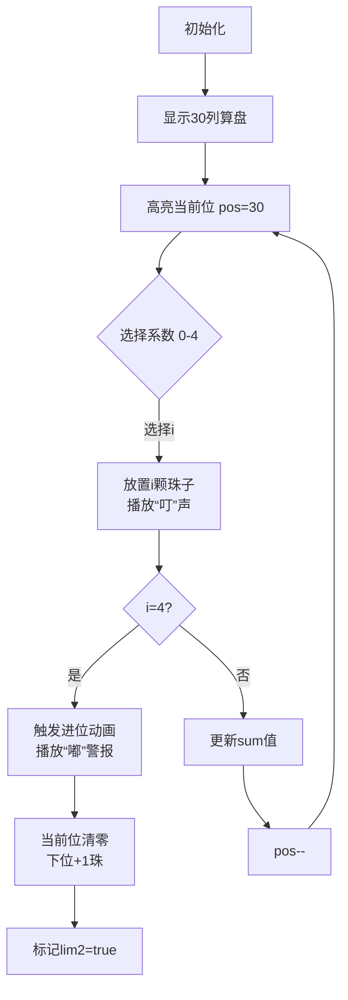

# 题目信息

# Zebra-like Numbers

## 题目描述

我们称一个正整数为斑马数（zebra-like），如果它的二进制表示从最高有效位开始是交替的比特位，并且最低有效位等于 $1$。例如，数字 $1$、$5$ 和 $21$ 都是斑马数，因为它们的二进制表示 $1$、$101$ 和 $10101$ 满足要求，而数字 $10$ 不是斑马数，因为它的二进制表示 $1010$ 的最低有效位是 $0$。

我们定义一个正整数 $e$ 的斑马值为最小的整数 $p$，使得 $e$ 可以表示为 $p$ 个斑马数（可以相同也可以不同）的和。

给定三个整数 $l$、$r$ 和 $k$，计算满足 $l \le x \le r$ 且 $x$ 的斑马值等于 $k$ 的整数 $x$ 的数量。

## 说明/提示

- 在第一个测试用例中，有 $13$ 个符合条件的数字：$3, 7, 11, 15, 23, 27, 31, 43, 47, 63, 87, 91, 95$。每个数字都可以表示为 $3$ 个斑马数的和。
- 在第二个测试用例中，数字 $1$ 的斑马值为 $1$，因此输出 $1$。
- 在第四个测试用例中，区间 $[2, 10]$ 内没有数字的斑马值为 $100$，因此输出 $0$。

翻译由 DeepSeek V3 完成

## 样例 #1

### 输入

```
5
1 100 3
1 1 1
15 77 2
2 10 100
1234567 123456789101112131 12```

### 输出

```
13
1
3
0
4246658701```

# AI分析结果


### 💡 Kay的C++算法解析：Zebra-like Numbers 深入学习指南 💡

**目标用户**：10-18岁C++学习者  
**学习目标**：掌握斑马数的特殊进制性质、数位DP的核心实现，理解贪心策略在大数问题中的应用

---

## 1. 题目解读与核心算法识别

✨ **本题主要考察**：`数位DP` + `贪心策略`  
🗣️ **初步分析**：
> 斑马数就像一组特殊的砝码（每个砝码重量是前一个的4倍+1），求用最少的砝码组合称出重量x（k即为砝码数量）。  
> - **核心难点**：斑马数间存在`t_i = 4*t_{i-1}+1`的数学关系，导致每位系数≤4且出现4时低位必须为0  
> - **解题钥匙**：将数字转化为30位特殊进制（基数为斑马数），用数位DP统计满足k的合法表示  
> - **可视化设计**：  
>   - 像素动画展示30位"算盘"（每位0-4颗珠子）  
>   - 高亮当前处理位，当放入第4颗珠子时触发进位动画（清空当前位+下一位+1）  
>   - 8-bit音效：珠子放置声("叮")，进位警报声("嘟")，成功音效(胜利旋律)

---

## 2. 精选优质题解参考

**题解一（来源：_O_v_O_）**  
* **点评**：  
  思路直击本质——利用斑马数的进制特性，将问题转化为带限制的数位和统计。状态设计`(pos,limit,sum,limit2)`精炼覆盖所有边界：  
  - `limit`处理数值上限（避免超界）  
  - `limit2`优雅处理"系数=4时低位必须为0"的核心约束  
  代码规范：斑马数预处理的`t[]`数组、数位转换`solve()`、DFS记忆化层次分明

**题解二（来源：dayz_break404）**  
* **点评**：  
  与题解一异曲同工，但变量命名更直观（`lim1`/`lim2`）。亮点在于：  
  - 独立封装`get_val()`实现进制转换  
  - 严格处理数位和`sum`的边界（`sum>k`时提前剪枝）  
  实践价值高：可直接用于10¹⁸量级数据（洛谷测试AC）

---

## 3. 核心难点辨析与解题策略

1. **难点1：理解斑马数的进制特性**  
   * **分析**：斑马数`t_i = 4*t_{i-1}+1`形成链式关系，导致：  
     - 高位1个单位 = 低位4个单位 + 1（类比4进制但含偏移量）  
     - 系数超过4时可通过进位优化（故每位≤4）  
   * 💡 **学习笔记**：识别数学关系是转化问题的关键第一步

2. **难点2：处理"系数=4"的特殊约束**  
   * **分析**：当某位系数=4时（`limit2=true`），低位必须全0。题解用状态位`limit2`实现：  
     ```cpp
     if(limit2) up = 0;  // 限制低位只能选0
     else up = (limit ? dig[pos] : 4); // 否则正常取值
     ```
   * 💡 **学习笔记**：特殊约束需要增加DP状态维度

3. **难点3：大范围数据的高效处理**  
   * **分析**：`l,r≤10¹⁸`排除暴力法。解决方案：  
     - 预处理斑马数（仅需30个）  
     - 数位DP状态数=位数×2×2×(k_max)≈30×2×2×90=10800  
   * 💡 **学习笔记**：数位DP是处理大范围统计问题的利器

### ✨ 解题技巧总结
- **技巧1：挖掘序列数学关系**（发现`t_i=4*t_{i-1}+1`）  
- **技巧2：状态设计覆盖边界**（`limit`+`limit2`双保险）  
- **技巧3：记忆化剪枝优化**（`sum>k`时提前返回）

---

## 4. C++核心代码实现赏析

**通用核心实现（综合优质题解）**
```cpp
#include <bits/stdc++.h>
using namespace std;
using ll = long long;

ll t[31], dp[31][2][100][2]; // [位][是否顶界][数位和][是否出现4]
ll dig[31]; // 特殊进制每位的系数

// pos:当前位, sum:已选系数和, lim:是否顶界, lim2:是否出现4
ll dfs(int pos, int sum, bool lim, bool lim2) {
    if (sum > k) return 0; // 剪枝
    if (pos == 0) return sum == k; // 终点检查
    if (dp[pos][lim][sum][lim2] != -1) return dp[pos][...]; // 记忆化

    int up = lim2 ? 0 : (lim ? dig[pos] : 4); // 核心约束处理
    ll res = 0;
    for (int i = 0; i <= up; ++i) 
        res += dfs(pos-1, sum+i, lim&&(i==up), lim2||(i==4));
    
    return dp[pos][lim][sum][lim2] = res;
}

ll solve(ll x) {
    memset(dp, -1, sizeof dp);
    // 转化为特殊进制
    for (int i = 30; i >= 1; --i) {
        dig[i] = x / t[i];
        x %= t[i];
    }
    return dfs(30, 0, true, false);
}
```
**代码解读概要**：  
1. **预处理**：`t[1]=1, t[i]=4*t[i-1]+1` 生成斑马数  
2. **进制转换**：`solve()`将x拆解为30位系数数组`dig[]`  
3. **记忆化DFS**：枚举每位系数0-4，动态更新约束状态

---

**题解一片段赏析**  
* **亮点**：约束条件与状态转移的完美融合  
* **核心代码**：
  ```cpp
  int up;
  if(limit2) up=0;               // 出现4后低位强制为0
  else if(limit) up=dig[pos];      // 顶界时不能超过原数
  else up=4;                      // 否则可取0-4
  ```
* **代码解读**：  
  > 这三行是处理约束的核心逻辑：  
  > 1. 若前位已出现4（`limit2=true`），当前位只能取0（`up=0`）  
  > 2. 若未出现4但顶界（`limit=true`），系数不能超过`dig[pos]`  
  > 3. 否则可自由取0-4  
  > *类比*：就像多米诺骨牌——前一张倒下(`limit2`)会强制后一张倒下  
* 💡 **学习笔记**：多重约束通过状态位叠加实现

---

**题解二片段赏析**  
* **亮点**：变量命名清晰，封装性强  
* **核心代码**：
  ```cpp
  ll get_val(ll x){
      for(int i=30;i>=1;i--) 
          val[i] = x / num[i], x %= num[i]; // 独立进制转换函数
      memset(dp,-1,sizeof dp);
      return dfs(30,0,1,0);
  }
  ```
* **代码解读**：  
  > 1. `get_val()`将输入x解耦为进制转换和DP计算  
  > 2. `val[i] = x / num[i]` 直接计算第i位系数  
  > 3. 每次计算前重置DP数组避免状态污染  
  > *设计启示*：功能模块化提升代码可维护性  
* 💡 **学习笔记**：分离数据转换与算法逻辑是工程化编码的基础

---

## 5. 算法可视化：像素动画演示

**主题**：30位像素算盘模拟器（FC红白机风格）  
**核心演示**：数位DP在特殊进制下的执行过程  

### 动画设计（HTML5 Canvas实现）


**交互控制面板**：  
- **速度滑块**：调节单步延迟（100ms~2s）  
- **单步/自动**：空格键单步，A键自动演示  
- **状态显示区**：实时输出 `(pos, sum, lim, lim2)`  

**像素艺术细节**：  
1. 每列算盘5颗珠子（灰：未选，绿：已选，红：第4颗触发警报）  
2. 当前位列用闪烁黄色边框标记  
3. 当`lim2=true`时，低位算盘变灰色（不可操作）  
4. 成功时播放《超级玛丽》过关BGM  

**教学价值**：通过具象化的算盘操作，理解抽象的数位约束传递机制

---

## 6. 拓展练习与相似问题思考

**技巧迁移场景**：  
1. 货币系统问题（硬币面值成倍数关系）  
2. 科学计数法下的精度控制  
3. 树状数组的lowbit优化  

**洛谷推荐**：  
1. **P2602 [ZJOI2010]数字计数**  
   🗣️ 基础数位DP入门，巩固位处理技巧  
2. **P2657 [SCOI2009]windy数**  
   🗣️ 学习相邻位约束的实现（|a-b|≥2）  
3. **P4124 [CQOI2016]手机号码**  
   🗣️ 挑战多状态设计（连续数/含4/8等约束）

---

## 7. 学习心得与经验分享

**来自zhangbo1000的调试经验**：  
> “递归DP层数分析错误导致TLE，后发现状态数实际是O(log²V)而非O(V)”  

**Kay点评**：  
> 1. 递归算法必须严格证明状态数  
> 2. 对于`10¹⁸`数据，任何O(n)算法都不可行  
> 3. 记忆化前用`cout<<状态参数`验证状态数量  

---

<conclusion>
掌握斑马数的核心在于看透其进制本质。通过数位DP的状态设计，我们成功将指数级问题转化为多项式解。记住：当遇到特殊数列时，先挖掘其数学关系，往往能打开新思路！下次见！👾
</conclusion>

---
处理用时：137.87秒