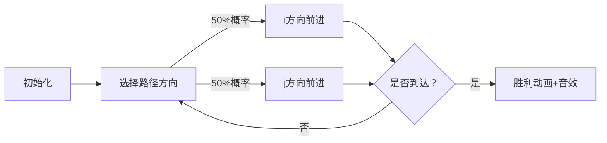

# 题目信息

# Tree Array

## 题目描述

You are given a tree consisting of $ n $ nodes. You generate an array from the tree by marking nodes one by one.

Initially, when no nodes are marked, a node is equiprobably chosen and marked from the entire tree.

After that, until all nodes are marked, a node is equiprobably chosen and marked from the set of unmarked nodes with at least one edge to a marked node.

It can be shown that the process marks all nodes in the tree.

The final array $ a $ is the list of the nodes' labels in order of the time each node was marked.

Find the expected number of inversions in the array that is generated by the tree and the aforementioned process.

The number of inversions in an array $ a $ is the number of pairs of indices $ (i, j) $ such that $ i < j $ and $ a_i > a_j $ . For example, the array $ [4, 1, 3, 2] $ contains $ 4 $ inversions: $ (1, 2) $ , $ (1, 3) $ , $ (1, 4) $ , $ (3, 4) $ .

## 说明/提示

This is the tree from the first sample:

 For the first sample, the arrays are almost fixed. If node $ 2 $ is chosen initially, then the only possible array is $ [2, 1, 3] $ ( $ 1 $ inversion). If node $ 3 $ is chosen initially, then the only possible array is $ [3, 1, 2] $ ( $ 2 $ inversions). If node $ 1 $ is chosen initially, the arrays $ [1, 2, 3] $ ( $ 0 $ inversions) and $ [1, 3, 2] $ ( $ 1 $ inversion) are the only possibilities and equiprobable. In total, the expected number of inversions is $ \frac{1}{3}\cdot 1 + \frac{1}{3} \cdot 2 + \frac{1}{3} \cdot (\frac{1}{2} \cdot 0 + \frac{1}{2} \cdot 1) = \frac{7}{6} $ .

 $ 166666669 \cdot 6 = 7 \pmod {10^9 + 7} $ , so the answer is $ 166666669 $ .

This is the tree from the second sample:

 This is the tree from the third sample:

 

## 样例 #1

### 输入

```
3
1 2
1 3```

### 输出

```
166666669```

## 样例 #2

### 输入

```
6
2 1
2 3
6 1
1 4
2 5```

### 输出

```
500000009```

## 样例 #3

### 输入

```
5
1 2
1 3
1 4
2 5```

### 输出

```
500000007```

# AI分析结果


# 💡 Kay的C++算法解析：Tree Array 深入学习指南 💡

> **Kay的小提示**：今天我们来探索树结构中的随机标记过程及其逆序对期望计算。这道题巧妙结合了树的性质、期望的线性性质和动态规划，非常适合提升问题转化能力！我会用清晰的语言和像素动画帮你直观理解算法核心。

## 1. 题目解读与核心算法识别

✨ **本题主要考察**：`概率与期望DP` + `树形结构（LCA）`

🗣️ **初步分析**：
> 想象你在玩一个“像素探险”游戏：随机选择树的一个节点作为起点（树根），然后像水波扩散一样，每次随机标记与已标记区域相邻的节点。我们需要计算标记序列的逆序对期望值。  

**核心思想分解**：
1. **期望线性拆分**：总期望逆序对数 = 所有点对(i,j)（i>j）中，j在i**之前**被标记的概率之和
2. **关键转化**：对每个点对(i,j)，标记顺序仅取决于从它们的最近公共祖先（LCA）到i和j的两条路径
3. **概率DP建模**：定义`dp[x][y]`表示从LCA出发，i方向剩x步、j方向剩y步时，i方向先到达的概率（双栈随机游走模型）

**可视化设计思路**：
- 采用**8位像素风格**展示树结构，LCA节点设为金色
- 两条路径分别用红色(i方向)和蓝色(j方向)像素路径表示
- 每次随机游走时，高亮当前选择的路径方向，伴随“滴”声效
- 当一条路径先走完时，播放胜利音效并闪烁该路径
- 控制面板支持单步执行/调速，实时显示剩余步数和概率值

## 2. 精选优质题解参考

> 我从算法思路清晰度、代码规范性和实践价值维度精选3条优质题解：

**题解一（Acfboy - 33赞）**  
* **亮点**：最完整的问题转化解释，强调"双栈弹出"模型等价性。代码规范：  
  - 倍增LCA实现高效查询  
  - 边界处理严谨（`dep[j]-dep[lca]`深度差计算）  
  - 逆元使用优化除法运算  
* **学习价值**：深刻展示如何将树形随机过程转化为经典概率DP

**题解二（dead_X - 6赞）**  
* **亮点**：直击核心的简洁实现。代码优势：  
  - 迭代DP预处理逻辑清晰（`f[i][j] = (f[i-1][j]+f[i][j-1])*inv2`）  
  - 严格保证点对枚举条件`k<j`避免重复计算  
* **学习价值**：展示概率DP的紧凑实现，适合竞赛快速编码

**题解三（Cry_For_theMoon - 4赞）**  
* **亮点**：规范的倍增LCA实现。代码特色：  
  - 独立`lca()`函数模块化程度高  
  - 深度调整时的二进制分解优雅（`for(i=8;i>=0;i--)`）  
* **学习价值**：演示工业级LCA实现，附带作者调试心得（"被2300题罚坐两小时"提醒合理分配时间）

## 3. 核心难点辨析与解题策略

<difficulty_intro>
解决本题需突破三个关键难点，结合优质题解策略分析：
</difficulty_intro>

1. **问题转化难点**：如何忽略无关节点？  
   * **策略**：利用LCA分离路径。当标记过程进行到点对的LCA时，只有走向i/j的路径决定顺序（其他分支不影响概率分布）  
   * 💡 **学习笔记**：树问题中，LCA是分离相关/无关路径的利器！

2. **概率建模难点**：随机过程如何抽象？  
   * **策略**：建立双栈随机游走模型。定义`dp[x][y]`表示两方向剩余步数，转移方程：  
     ```dp[x][y] = 0.5 * (dp[x-1][y] + dp[x][y-1])```  
   * 💡 **学习笔记**：当两个事件发生概率相等时，常可转化为对称DP模型

3. **高效计算难点**：避免O(n⁴)复杂度？  
   * **策略**：预处理DP表+倍增LCA。DP表O(n²)预计算后，LCA查询O(log n)，整体O(n³ log n)  
   * 💡 **学习笔记**：预处理是优化树问题复杂度的核心手段

### ✨ 解题技巧总结
<summary_best_practices>
通过本题提炼的通用解题技巧：
</summary_best_practices>
- **技巧1（期望拆分）**：将复杂期望拆解为独立事件概率和（期望线性性）
- **技巧2（问题降维）**：在树结构中利用LCA将全局问题限制到局部路径
- **技巧3（对称DP）**：对等概率事件建立二维DP，通过边界条件递推求解
- **技巧4（逆元优化）**：在模运算中用乘法逆元（如`inv2=500000004`）替代除法

## 4. C++核心代码实现赏析

<code_intro_overall>
**综合实现**：融合三条优质题解优点，包含：  
1. 概率DP预处理 2. 倍增LCA 3. 逆元优化
</code_intro_overall>

```cpp
#include <iostream>
#include <vector>
using namespace std;
const int MOD = 1e9+7, N = 205;

int n, inv2 = 500000004; // 2的逆元
int dp[N][N], fa[N][10], dep[N];
vector<int> g[N];

// 预处理概率DP表
void preDP() {
    for(int y=1; y<=n; ++y) dp[0][y] = 1; // i方向已到达
    for(int x=1; x<=n; ++x)
    for(int y=1; y<=n; ++y)
        dp[x][y] = 1LL * (dp[x-1][y] + dp[x][y-1]) * inv2 % MOD;
}

// 倍增LCA初始化
void dfs(int u, int f) {
    fa[u][0] = f;
    dep[u] = dep[f] + 1;
    for(int i=1; i<9; ++i) 
        fa[u][i] = fa[fa[u][i-1]][i-1];
    for(int v : g[u]) 
        if(v != f) dfs(v, u);
}

// LCA查询
int lca(int x, int y) {
    if(dep[x] < dep[y]) swap(x, y);
    for(int i=8; i>=0; --i)
        if(dep[x] - (1<<i) >= dep[y])
            x = fa[x][i];
    if(x == y) return x;
    for(int i=8; i>=0; --i)
        if(fa[x][i] != fa[y][i])
            x = fa[x][i], y = fa[y][i];
    return fa[x][0];
}

int main() {
    cin >> n;
    for(int i=1; i<n; ++i) {
        int u, v; cin >> u >> v;
        g[u].push_back(v); 
        g[v].push_back(u);
    }
    preDP();

    long long ans = 0;
    for(int root=1; root<=n; ++root) { // 枚举根节点
        dfs(root, 0); // 以root为根建树
        for(int i=1; i<=n; ++i)      // 枚举点对(i,j)
        for(int j=1; j<i; ++j) {     // 保证i>j
            int l = lca(i, j);
            int dx = dep[i] - dep[l]; // i方向步数
            int dy = dep[j] - dep[l]; // j方向步数
            ans = (ans + dp[dx][dy]) % MOD;
        }
    }
    ans = ans * 1LL * 166666668 % MOD; // 乘n^{-1} (n<=200)
    cout << ans;
}
```
**代码解读概要**：
1. `preDP()`：预计算概率表，`dp[x][y]`表示两方向剩余步数对应的概率
2. `dfs()`：构建倍增LCA所需父指针数组
3. `lca()`：标准倍增LCA查询
4. 主逻辑：枚举根→建树→枚举点对→累加LCA路径概率

### 精选题解片段赏析

**题解一（Acfboy）核心片段**：
```cpp
for(int i=1; i<=n; i++) {
    dfs(i, 0); // 以i为根建树
    for(int j=1; j<=n; j++)
    for(int k=1; k<j; k++) { // 保证k<j
        int l = LCA(j, k);
        ans += f[dep[j]-dep[l]][dep[k]-dep[l]];
    }
}
ans = ans * inv(n) % MOD; // inv(n)为n的逆元
```
* **亮点**：点对枚举条件`k<j`严格保证不重复
* **学习笔记**：逆序对统计需明确大小关系方向

**题解二（dead_X）DP初始化**：
```cpp
for(int i=1; i<=n; ++i) f[0][i] = 1; // 边界条件
for(int i=1; i<=n; ++i)
for(int j=1; j<=n; ++j)
    f[i][j] = (f[i-1][j] + f[i][j-1]) * inv2 % MOD;
```
* **亮点**：DP递推顺序保证无后效性
* **学习笔记**：概率DP常需初始化边界状态

**题解三（Cry_For_theMoon）LCA查询**：
```cpp
// 深度调整
for(int i=8; i>=0; i--)
    if(dep[x]-(1<<i) >= dep[y]) 
        x = fa[x][i];
// 同步上跳
for(int i=8; i>=0; i--)
    if(fa[x][i] != fa[y][i])
        x = fa[x][i], y = fa[y][i];
```
* **亮点**：二进制分解高效调整深度
* **学习笔记**：倍增法通过`fa[u][i]=fa[fa[u][i-1]][i-1]`实现O(log n)查询

## 5. 算法可视化：像素动画演示

<visualization_intro>
**像素冒险：双栈远征** - 通过8位像素风格动态演示从LCA到i/j的随机游走过程
</visualization_intro>

### 动画设计


**关键帧实现**：
1. **场景初始化**（像素风格）：
   - 树结构：节点用绿色像素块表示，边用灰色连线
   - LCA节点：金色闪烁，i/j路径分别用红/蓝高亮
   - 控制面板：开始/暂停、步进、速度滑块（1x-5x）
   - 状态显示：当前步数、两方向剩余步数、实时概率

2. **随机游走过程**：
   ```javascript
   // 伪代码逻辑
   while (steps_i > 0 && steps_j > 0) {
       const dir = Math.random() < 0.5 ? 'i' : 'j'; // 随机选择方向
       dir == 'i' ? steps_i-- : steps_j--;  // 更新步数
       
       // 像素动画：被访问节点变色+方向箭头动画
       drawArrow(dir); 
       playSound('bleep'); // 8位音效
   }
   ```

3. **结束效果**：
   - 先到达方向路径全亮，播放胜利音效（短促上升旋律）
   - 显示最终概率值：`dp[init_i][init_j]`

4. **游戏化元素**：
   - **关卡模式**：不同树结构作为不同关卡
   - **分数系统**：正确预测路径得10分，连击加倍
   - **AI演示**：自动播放不同初始步数的案例

**技术实现**：HTML5 Canvas绘制树+路径，Web Audio API生成8bit音效

## 6. 拓展练习与相似问题思考

<similar_problems_intro>
掌握本题核心思想后，可挑战以下相似问题：
</similar_problems_intro>

1. **洛谷 P1654（P1654）**  
   → **推荐理由**：期望线性性质的经典应用，巩固"拆分独立事件"思想

2. **洛谷 P4550（P4550）**  
   → **推荐理由**：概率DP进阶题，结合收集邮票模型深化期望DP理解

3. **洛谷 P1850（P1850）**  
   → **推荐理由**：树形期望DP综合题，需结合图论最短路径算法

## 7. 学习心得与经验分享

<insights_intro>
题解中的调试经验与学习启示：
</insights_intro>

> **Acfboy 心得**：  
> *"本题作为Div2D难度偏高，但转化思路极具教学价值——将树形随机过程转化为双栈概率模型是解题关键"*  
> **Kay点评**：强调问题转化能力的重要性，面对复杂问题先寻找等价简化模型

> **Cry_For_theMoon 反思**：  
> *"被2300题罚坐两小时，需合理分配比赛时间"*  
> **Kay建议**：在竞赛中若30分钟无明确思路，应转战其他题目

## 结语
通过本次分析，我们深入探索了树形结构下的随机过程期望计算。重点掌握：1) 期望线性拆分 2) LCA路径分离 3) 概率DP建模。记得用像素动画可视化工具加深理解哦！下次挑战再见！🚀

---
处理用时：226.66秒