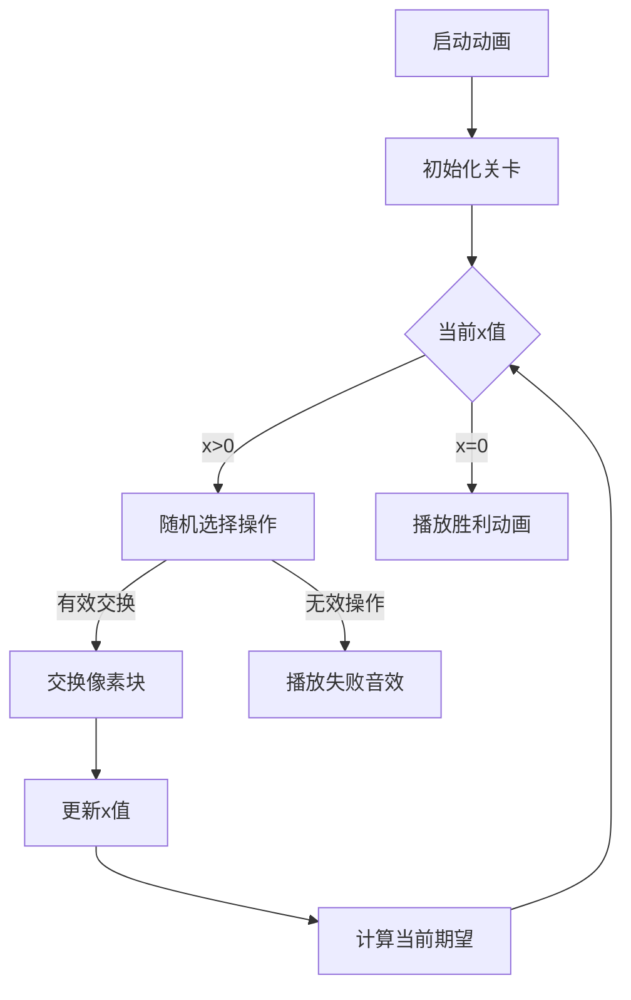

# 题目信息

# Wish I Knew How to Sort

## 题目描述

You are given a binary array $ a $ (all elements of the array are $ 0 $ or $ 1 $ ) of length $ n $ . You wish to sort this array, but unfortunately, your algorithms teacher forgot to teach you sorting algorithms. You perform the following operations until $ a $ is sorted:

1. Choose two random indices $ i $ and $ j $ such that $ i < j $ . Indices are chosen equally probable among all pairs of indices $ (i, j) $ such that $ 1 \le i < j \le n $ .
2. If $ a_i > a_j $ , then swap elements $ a_i $ and $ a_j $ .

What is the [expected number](https://en.wikipedia.org/wiki/Expected_value) of such operations you will perform before the array becomes sorted?

It can be shown that the answer can be expressed as an irreducible fraction $ \frac{p}{q} $ , where $ p $ and $ q $ are integers and $ q \not \equiv 0 \pmod{998\,244\,353} $ . Output the integer equal to $ p \cdot q^{-1} \bmod 998\,244\,353 $ . In other words, output such an integer $ x $ that $ 0 \le x < 998\,244\,353 $ and $ x \cdot q \equiv p \pmod{998\,244\,353} $ .

## 说明/提示

Consider the first test case. If the pair of indices $ (2, 3) $ will be chosen, these elements will be swapped and array will become sorted. Otherwise, if one of pairs $ (1, 2) $ or $ (1, 3) $ will be selected, nothing will happen. So, the probability that the array will become sorted after one operation is $ \frac{1}{3} $ , the probability that the array will become sorted after two operations is $ \frac{2}{3} \cdot \frac{1}{3} $ , the probability that the array will become sorted after three operations is $ \frac{2}{3} \cdot \frac{2}{3} \cdot \frac{1}{3} $ and so on. The expected number of operations is $ \sum \limits_{i=1}^{\infty} \left(\frac{2}{3} \right)^{i - 1} \cdot \frac{1}{3} \cdot i = 3 $ .

In the second test case the array is already sorted so the expected number of operations is zero.

In the third test case the expected number of operations equals to $ \frac{75}{4} $ so the answer is $ 75 \cdot 4^{-1} \equiv 249\,561\,107 \pmod {998\,244\,353} $ .

## 样例 #1

### 输入

```
3
3
0 1 0
5
0 0 1 1 1
6
1 1 1 0 0 1```

### 输出

```
3
0
249561107```

# AI分析结果


# 💡 Kay的C++算法解析：Wish I Knew How to Sort 深入学习指南 💡

> 大家好，我是Kay！今天我们来分析CF1753C「Wish I Knew How to Sort」这道有趣的期望问题。本指南将用清晰的解析和生动的可视化，帮助大家掌握期望值的计算技巧。

## 1. 题目解读与核心算法识别

✨ **本题主要考察**：`数学期望`与`概率计算`

🗣️ **初步分析**：
> 这道题的核心在于**洞察问题本质**。想象你在玩一个像素消除游戏：屏幕上有0和1组成的乱序阵列，你需要通过交换操作将它们排序。关键技巧在于发现——**只有特定交换能推动排序进程**！

- 最终有序状态是前`cnt0`个0后`cnt1`个1
- 定义关键变量`x`：前`cnt0`位置中1的数量（即需要消除的"错误点"）
- 有效操作概率：$p = \frac{x^2}{\binom{n}{2}}$（选择前段1和后段0的概率）
- 期望计算：$E = \sum_{i=1}^x \frac{\binom{n}{2}}{i^2}$（从x到0的期望步数和）

**可视化设计思路**：
> 采用**8位像素游戏风格**，设计"排序大作战"动画：
> - 0/1显示为蓝色/红色像素块
> - 有效交换时：高亮闪烁交换块，播放"叮"音效
> - 每次减少`x`时：显示当前$x$值和累积期望
> - 控制面板：步进/自动播放（带调速滑块），胜利时播放马里奥式胜利音效

---

## 2. 精选优质题解参考

### 题解一：Alex_Wei（思路最精炼）
* **点评**：直击问题本质，用极简的数学推导（$x$的定义和期望分解）替代复杂DP。代码实现干净利落（仅10行核心逻辑），变量命名精准（`cnt0`，`x`），复杂度$O(n)$完美达标。特别亮点：用"这题把我送走了"幽默表达洞察关键点的重要性，提醒我们解题需要跳出常规思维。

### 题解二：MusicBox（教学最系统）
* **点评**：采用**状态机思维**，明确定义$f_i$表示剩余$i$个错误的期望步数。推导中详细解释概率倒数关系，代码封装规范（独立逆元函数）。特别亮点：用"前cnt0中的w个0"等描述降低理解门槛，适合初学者逐步推演。

### 题解三：lxzy_（推导最直观）
* **点评**：从**线性期望**角度切入，将问题分解为$x$个独立阶段。代码实现高效（预处理逆元），关键公式$ \frac{\binom{n}{2}}{i^2} $突出展示。特别亮点：用"喜"等表情传递解题愉悦感，体现数学之美。

---

## 3. 核心难点辨析与解题策略

### 难点一：定义关键状态变量
* **分析**：多数同学纠结于整个数组的排序过程，而优质解法都聚焦前`cnt0`位中的1数量`x`。这是因为：
  - `x`减少到0时数组必然有序
  - `x`具有单调性（只减不增）
  - 💡 **学习笔记**：化简为繁——找到核心状态变量是优化期望问题的钥匙

### 难点二：计算阶段期望
* **分析**：从`x`到`x-1`的期望不是直观的$\frac{1}{p}$？因为：
  - 每次操作可能有多种选择
  - 但只有特定操作影响状态
  - 期望步数=有效操作概率的倒数
  - 💡 **学习笔记**：概率倒数=期望步数，这是期望问题的重要模型

### 难点三：避免过度设计
* **分析**：有同学尝试用DP数组递推，但最优解只需求和公式。区别在于：
  - 发现期望的线性可加性
  - 各阶段独立，无后效性
  - 直接求和避免冗余计算
  - 💡 **学习笔记**：识别独立子问题能大幅简化计算

### ✨ 解题技巧总结
1. **问题降维**：将排序问题转化为关键指标`x`的变化
2. **模型识别**：熟悉"几何分布"期望模型（成功概率$p$，期望步数$1/p$）
3. **逆元优化**：模运算下除法→乘逆元（$a/b ≡ a×b^{-1} \mod 998244353$）
4. **边界处理**：已排序情况（x=0）直接返回0

---

## 4. C++核心代码实现赏析

**本题通用核心C++实现参考**
```cpp
#include <bits/stdc++.h>
using namespace std;
const int MOD = 998244353;

long long qpow(long long a, long long b) {
    long long res = 1;
    while (b) {
        if (b & 1) res = res * a % MOD;
        a = a * a % MOD;
        b >>= 1;
    }
    return res;
}

int main() {
    int T; cin >> T;
    while (T--) {
        int n; cin >> n;
        vector<int> arr(n);
        int cnt0 = 0, x = 0;
        
        // 计算0的总数和初始错误位置
        for (int i = 0; i < n; i++) {
            cin >> arr[i];
            if (arr[i] == 0) cnt0++;
        }
        for (int i = 0; i < cnt0; i++) {
            if (arr[i] == 1) x++;
        }
        
        // 核心公式计算
        long long total = 1LL * n * (n - 1) / 2 % MOD;
        long long ans = 0;
        for (int i = 1; i <= x; i++) {
            ans = (ans + total * qpow(1LL * i * i, MOD - 2)) % MOD;
        }
        cout << ans << endl;
    }
}
```
**代码解读概要**：
1. 读入数组并统计`cnt0`（0的总数）
2. 计算`x`（前`cnt0`位中1的数量，即错误位置数）
3. 计算总可能操作数$\binom{n}{2}$
4. 对每个$i∈[1,x]$累加$\frac{\binom{n}{2}}{i^2}$（模逆元实现除法）
5. 输出期望值

---

**题解一：Alex_Wei**
* **亮点**：极致简洁，变量命名直指核心
```cpp
int cnt = 0, k = 0;
for (int i = 1; i <= n; i++) 
    if (a[i] == 0) cnt++;
for (int i = 1; i <= cnt; i++) 
    if (a[i]) k++;  // k即关键变量x
long long ans = 0;
for (int i = 1; i <= k; i++)
    ans += 1LL * n * (n-1) / 2 % MOD * qpow(1LL*i*i, MOD-2) % MOD;
```
> **代码解读**：  
> - 第一循环统计`cnt`（0的数量）  
> - 第二循环计算初始错误数`k`（即前`cnt`位中1的数量）  
> - 第三循环直接套用期望公式  
> 💡 **学习笔记**：优秀代码用最少的变量表达完整逻辑

**题解二：MusicBox**
* **亮点**：DP形式推导，教学友好
```cpp
f[fr] = 0;  // fr是初始正确0的数量
for (int i = fr + 1; i <= cnt0; i++) {
    f[i] = f[i-1] + total * inv(1LL*(cnt0-i+1)*(cnt0-i+1)) % MOD;
}
```
> **代码解读**：  
> - `f[i]`表示前`cnt0`位有`i`个0时的期望步数  
> - 从`fr`递推到`cnt0`（完全有序）  
> - 注意`(cnt0-i+1)`实际就是当前错误数  
> 💡 **学习笔记**：DP思维虽非最优，但体现期望的递推关系

**题解三：lxzy_**
* **亮点**：预处理逆元，效率优化
```cpp
for (int i = 1; i <= cnt1; i++) {
    ans += 1LL * n * (n-1) % MOD 
         * inv(2LL * i * i % MOD) % MOD;  // 预处理inv数组
}
```
> **代码解读**：  
> - `cnt1`即关键变量`x`  
> - 通过预处理逆元数组避免重复计算  
> - 合并公式项$\frac{n(n-1)}{2i^2}$为单步计算  
> 💡 **学习笔记**：预处理是模运算下的常用优化手段

---

## 5. 算法可视化：像素动画演示

### 像素排序大作战：期望之旅
**设计思路**：  
> 采用**FC红白机风格**，将算法转化为闯关游戏。每个`x`值对应一关，通关条件是将对应数量的"错误1"变"正确0"。复古元素降低学习压力，音效强化关键操作记忆。

**动画实现方案**：  


**关键交互设计**：
1. **像素网格**：8色调色板（深蓝=0，亮红=1）
2. **状态面板**：
   - 当前关卡：`初始x值 - 剩余x值`
   - 累积期望：实时显示$\sum \frac{\binom{n}{2}}{i^2}$
3. **操作效果**：
   - 有效交换：交换块闪烁黄色边框 + "叮"音效
   - 无效操作：灰色蒙版覆盖 + 低沉提示音
4. **游戏化元素**：
   - 每关通关：像素烟花绽放 + 8-bit胜利音效
   - 全程自动：AI演示模式（可调速）如吃豆人移动
5. **教学提示**：
   ```js
   // 伪代码：有效操作检测
   function isValidSwap(i, j) {
     return (i < cnt0 && j >= cnt0)  // 前段i后段j
            && arr[i] === 1 && arr[j] === 0;  // 1在前0在后
   }
   ```

---

## 6. 拓展练习与相似问题

### 期望问题三连击：
1. **洛谷 P6154** 游走  
   → 推荐理由：基础期望DP，理解状态转移的入门必做
   
2. **洛谷 P1365** WJMZBMR打osu!  
   → 推荐理由：连续成功期望模型，练习期望的线性分解
   
3. **洛谷 P1297** [国家集训队]单选错位  
   → 推荐理由：离散型期望计算，强化概率与期望的关系认知

---

## 7. 学习心得与经验分享

> **来自Alex_Wei的启示**：  
> *"这题把我送走了" → 反映从困惑到顿悟的解题历程*  
>  
> **Kay的总结**：  
> 本题教会我们两个重要思维：  
> 1. **降维攻击**：在复杂问题中寻找核心指标（如本题的`x`）  
> 2. **分治思想**：将总期望分解为独立阶段期望之和  
> 当你在其他期望问题中卡住时，不妨自问：  
> *"这里的x是什么？"*

---

> 本次解析就到这里！记住Kay的鼓励：**每个算法难题都是等待解锁的像素关卡**。保持好奇心，持续练习，你一定能成为期望问题大师！🚀

---
处理用时：137.65秒