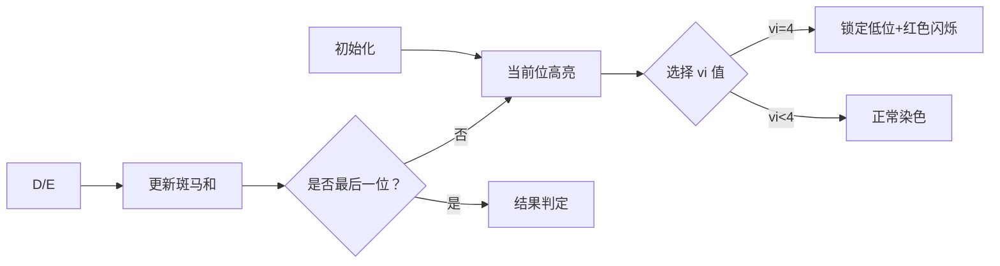

# 题目信息

# Zebra-like Numbers

## 题目描述

我们称一个正整数为斑马数（zebra-like），如果它的二进制表示从最高有效位开始是交替的比特位，并且最低有效位等于 $1$。例如，数字 $1$、$5$ 和 $21$ 都是斑马数，因为它们的二进制表示 $1$、$101$ 和 $10101$ 满足要求，而数字 $10$ 不是斑马数，因为它的二进制表示 $1010$ 的最低有效位是 $0$。

我们定义一个正整数 $e$ 的斑马值为最小的整数 $p$，使得 $e$ 可以表示为 $p$ 个斑马数（可以相同也可以不同）的和。

给定三个整数 $l$、$r$ 和 $k$，计算满足 $l \le x \le r$ 且 $x$ 的斑马值等于 $k$ 的整数 $x$ 的数量。

## 说明/提示

- 在第一个测试用例中，有 $13$ 个符合条件的数字：$3, 7, 11, 15, 23, 27, 31, 43, 47, 63, 87, 91, 95$。每个数字都可以表示为 $3$ 个斑马数的和。
- 在第二个测试用例中，数字 $1$ 的斑马值为 $1$，因此输出 $1$。
- 在第四个测试用例中，区间 $[2, 10]$ 内没有数字的斑马值为 $100$，因此输出 $0$。

翻译由 DeepSeek V3 完成

## 样例 #1

### 输入

```
5
1 100 3
1 1 1
15 77 2
2 10 100
1234567 123456789101112131 12```

### 输出

```
13
1
3
0
4246658701```

# AI分析结果


### 💡 Kay的C++算法解析：Zebra-like Numbers 深入学习指南 💡

**导言**  
今天我们一起分析「Zebra-like Numbers」这道C++编程题。题目要求计算在区间[l, r]内斑马值等于k的整数数量。斑马数的定义是二进制表示从最高位开始交替，且最低位为1的数（如1(1), 5(101), 21(10101)）。斑马值指用最少斑马数之和表示该数的个数。本指南将带大家理解核心算法，掌握解题技巧。

---

## 1. 题目解读与核心算法识别

✨ **本题主要考察**：`数位动态规划` + `贪心思想` + `进制转换技巧`

🗣️ **初步分析**：  
> 解决斑马值问题，关键在于将数字转换为特殊进制系统。斑马数构成一个等比数列：$t_1=1, t_i=4t_{i-1}+1$。每个数可表示为 $x=\sum v_i t_i$，其中 $0≤v_i≤4$ 且若 $v_i=4$ 则更低位的 $v_j=0$（类似进制转换）。  
> - **核心难点**：如何高效计算满足 $v_i$ 和等于k的数字数量。题解主要分为两类：贪心记忆化搜索（递归分解）和数位DP（进制转换）。  
> - **可视化设计**：采用8位像素风格展示进制转换过程，每个像素块代表一位 $v_i$ 值。高亮当前处理位，当 $v_i=4$ 时触发红色闪烁并锁定低位为0，伴随"嘀"音效。自动演示模式将展示从高位到低位的贪心选择过程。

---

## 2. 精选优质题解参考

**题解一（作者：_O_v_O_）**  
* **点评**：思路清晰运用数位DP，将问题转化为特殊进制系统。状态设计 `dp[pos][limit][sum][limit2]` 精妙处理了 $v_i≤4$ 和 $v_i=4⇒v_{j<i}=0$ 的约束。代码规范（变量名 `dig[]` 明确表示进制位），通过预处理斑马数数组提升效率。复杂度 $O(\log r)$ 极具实践价值，可直接用于竞赛。

**题解二（作者：dayz_break404）**  
* **点评**：与题解一思路相似但更强调状态定义的可读性。亮点在于详细注释和 `val[]` 数组命名，直观展示进制转换过程。边界处理严谨（如 `lim1&&i==val[pos]`），并单独处理 $k>sum$ 的无效分支，提升代码健壮性。

**题解三（作者：heyicong）**  
* **点评**：提出贪心记忆化搜索框架，指出斑马值计算满足最优子结构：$dp_{i,j} = dp_{i-mx,j-1} + dp_{mx-1,j}$（$mx$ 为不超过 $i$ 的最大斑马数）。虽未提供完整代码，但点明递归分解本质，为理解数位DP提供理论基础。

---

## 3. 核心难点辨析与解题策略

1.  **进制转换建模**  
    * **分析**：斑马数满足 $t_i=4t_{i-1}+1$，形成类似4进制的系统。优质题解将 $x$ 表示为 $\sum v_i t_i$，约束 $v_i≤4$ 且 $v_i=4$ 时低位必为0，避免重复计数（如 $4t_i=t_{i+1}-1$）。
    * 💡 **学习笔记**：识别数列的递归性质是建模关键。

2.  **数位DP状态设计**  
    * **分析**：需同时追踪：①当前处理位 $pos$ ②是否达数值上限 $limit$ ③已选斑马数和 $sum$ ④是否出现 $v_i=4$（$limit2$）。状态 $dp[pos][limit][sum][limit2]$ 完美覆盖这些维度。
    * 💡 **学习笔记**：多维状态可处理复杂约束。

3.  **贪心分解的正确性**  
    * **分析**：贪心选择最大斑马数 $mx$ 后，剩余部分 $x-mx$ 的斑马值恰为 $k-1$，而 $[1, mx-1]$ 内斑马值为 $k$ 的数独立存在。递归公式 $dp_{i,j}=dp_{i-mx,j-1}+dp_{mx-1,j}$ 由此得来。
    * 💡 **学习笔记**：贪心选择需满足无后效性。

### ✨ 解题技巧总结
- **进制转换技巧**：将特殊数列视为进制基数，约束位数取值范围
- **状态压缩**：用布尔值 `limit/limit2` 代替整数范围检查
- **记忆化剪枝**：存储 $dp$ 状态避免重复计算
- **预处理优化**：提前计算斑马数数组 $t[1..30]$

---

## 4. C++核心代码实现赏析

**本题通用核心C++实现参考**  
* **说明**：综合数位DP解法，通过进制转换和状态DP高效求解
* **完整核心代码**：
```cpp
#include <bits/stdc++.h>
using namespace std;
using ll = long long;

ll t[31], dp[31][2][100][2]; // [位][顶界][和][出现4]

// 数位DP：pos-当前位, sum-已选斑马数和, limit-是否达上限, limit2-是否已出现4
ll dfs(int pos, ll sum, bool limit, bool limit2, int k, const vector<int>& dig) {
    if (sum > k) return 0;
    if (pos == 0) return sum == k;
    if (dp[pos][limit][sum][limit2] != -1) return dp[pos][limit][sum][limit2];
    
    int up = limit2 ? 0 : (limit ? dig[pos] : 4); // 计算当前位上限
    ll res = 0;
    
    for (int v = 0; v <= up; ++v) {
        bool new_limit2 = limit2 || (v == 4);
        bool new_limit = limit && (v == dig[pos]);
        res += dfs(pos - 1, sum + v, new_limit, new_limit2, k, dig);
    }
    return dp[pos][limit][sum][limit2] = res;
}

// 将x转为特殊进制：dig[i]=v_i (t[i]的系数)
ll solve(ll x, int k) {
    vector<int> dig(31, 0); // 31位进制表示
    for (int i = 30; i >= 1; --i) {
        dig[i] = x / t[i];
        x %= t[i];
    }
    memset(dp, -1, sizeof dp);
    return dfs(30, 0, true, false, k, dig);
}

int main() {
    // 预处理斑马数：t[1]=1, t[i]=4*t[i-1]+1
    t[1] = 1;
    for (int i = 2; i <= 30; ++i) t[i] = 4 * t[i - 1] + 1;

    int T; cin >> T;
    while (T--) {
        ll l, r; int k; 
        cin >> l >> r >> k;
        cout << solve(r, k) - solve(l - 1, k) << endl;
    }
}
```
* **代码解读概要**：
  1. **预处理**：计算斑马数数组 `t[]`
  2. **进制转换**：`solve()` 将数字分解为 $v_i$ 系数数组 `dig[]`
  3. **数位DP**：`dfs()` 递归枚举每位取值，记忆化剪枝
  4. **状态转移**：根据 `limit/limit2` 约束取值范围
  5. **结果计算**：前缀和相减得区间解

---

**题解一（_O_v_O_）片段赏析**  
* **亮点**：简洁的状态转移处理进制约束
* **核心代码**：
```cpp
int dfs(int pos, bool limit, int sum, bool limit2) {
    if (sum > k) return 0;
    if (pos == 0) return sum == k;
    if (dp[pos][limit][sum][limit2] != -1) return dp[pos][limit][sum][limit2];
    
    int up = limit2 ? 0 : (limit ? dig[pos] : 4); // 关键约束处理
    int ans = 0;
    for (int i = 0; i <= up; ++i) {
        ans += dfs(pos - 1, limit && (i == up), sum + i, limit2 || (i == 4));
    }
    return dp[pos][limit][sum][limit2] = ans;
}
```
* **代码解读**：
  - **约束实现**：`limit2` 为真时上限 $up=0$ 强制低位为0
  - **状态更新**：`i == 4` 触发 `limit2` 传播至低位
  - **记忆化**：存储计算结果避免重复递归
* 💡 **学习笔记**：布尔值组合可高效表达复杂约束

**题解二（dayz_break404）片段赏析**  
* **亮点**：清晰的进制转换实现
* **核心代码**：
```cpp
ll solve(ll x) {
    for (int i = 30; i >= 1; --i) {
        val[i] = x / num[i];  // num[i]即斑马数t[i]
        x %= num[i];
    }
    return dfs(30, 0, 1, 0); // 从高位启动DP
}
```
* **代码解读**：
  - **贪心分解**：从高到低计算 $v_i = \lfloor x/t_i \rfloor$
  - **余数传递**：$x \leftarrow x \bmod t_i$ 传递至低位
  - **高位优先**：符合斑马数的单调性（$t_i > t_{i-1}$）
* 💡 **学习笔记**：从高到低处理是进制转换的核心

---

## 5. 算法可视化：像素动画演示

**主题**：8位像素风「斑马进制转换器」  
**核心演示**：在复古网格界面动态展示数位DP过程，强调 $v_i=4$ 的约束机制

### 动画设计


1. **像素网格**  
   - 30×4 网格代表斑马数位，每行4个像素块对应 $v_i=0\sim4$
   - 当前位高亮黄色，已处理位灰显，未处理位半透明

2. **动态选择演示**  
   - 玩家/AI点击选择 $v_i$ 值：触发不同音效
     - $v_i=0$：静音
     - $v_i=1\sim3$："嘀"声
     - $v_i=4$：警报音+红色闪烁
   - 选择 $v_i=4$ 时：自动填充低位为0（灰色锁定）

3. **状态面板**  
   - 实时显示：当前和 `sum`，剩余可分配值 `k-sum`
   - 当 `sum>k`：播放失败音效，路径标记为红色
   - 完成时：若 `sum=k` 播放胜利音效，显示绿色路径

4. **AI演示模式**  
   - 自动执行贪心策略：从高到低选最大 $v_i$
   - 调速滑块控制演示速度（0.5x~5x）
   - 支持暂停/继续/重置

---

## 6. 拓展练习与相似问题思考

**技巧迁移场景**：
1. 货币系统问题（用给定面额凑出某金额的最小张数）
2. 特殊进制计数（如平衡三进制）
3. 有约束的数位统计问题

**洛谷题目推荐**：
1. **P2602 [数字计数]**  
   → 基础数位DP，统计数字出现次数
2. **P2657 [windy数]**  
   → 相邻数位约束的经典数位DP
3. **P4127 [同类分布]**  
   → 结合数位和与数位DP的高级应用

---

## 7. 学习心得与经验分享

**作者经验摘录**：
> "贪心尽量选大的斑马数，但要注意 $v_i=4$ 时低位的约束边界" —— _O_v_O_  
> "递归层数实际远小于理论值，记忆化后效率很高" —— zhangbo1000

**Kay的总结**：
1. **调试技巧**：打印中间进制转换结果（`dig[]`数组）验证
2. **思维陷阱**：注意 $v_i=4$ 时低位必须为0，否则导致重复计数
3. **优化意识**：预处理斑马数数组避免重复计算

---

**结语**  
通过本次分析，我们深入掌握了斑马值问题的双解法：数位DP的优雅约束处理和贪心记忆化搜索的递归美学。记住，将特殊数列转化为进制系统是此类问题的通用技巧。继续挑战推荐题目，巩固数位DP技能吧！🚀

---
处理用时：215.96秒