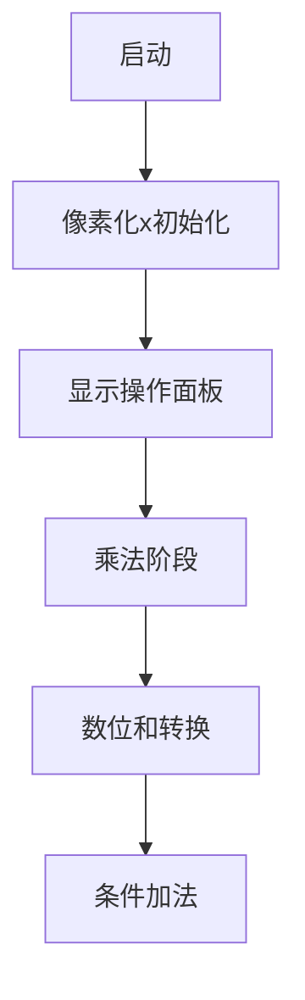

# 题目信息

# Hacking Numbers (Hard Version)

## 题目描述

这是该问题的困难版本。在此版本中，你能发送的指令限制将在题目描述中说明。只有在解决所有版本的问题后才能进行 hack。

这是一个交互式问题。

欢迎，决斗者们！在这个交互式挑战中，存在一个未知整数 $x$（$1 \le x \le 10^9$）。你需要通过利用"Mathmech"怪兽的力量，将其变为输入中给定的整数 $n$。你可以发送以下指令之一：

| 指令          | 约束条件                          | 结果                  | 更新操作                 | 裁判响应 |
|---------------|-----------------------------------|-----------------------|--------------------------|----------|
| "add $y$"     | $-10^{18} \le y \le 10^{18}$      | $\mathrm{res} = x + y$ | 若 $1 \le \mathrm{res} \le 10^{18}$，则 $x \leftarrow \mathrm{res}$ | "1"      |
|               |                                   |                       | 否则 $x \leftarrow x$    | "0"      |
| "mul $y$"     | $1 \le y \le 10^{18}$             | $\mathrm{res} = x \cdot y$ | 若 $1 \le \mathrm{res} \le 10^{18}$，则 $x \leftarrow \mathrm{res}$ | "1"      |
|               |                                   |                       | 否则 $x \leftarrow x$    | "0"      |
| "div $y$"     | $1 \le y \le 10^{18}$             | $\mathrm{res} = x/y$  | 若 $y$ 整除 $x$，则 $x \leftarrow \mathrm{res}$ | "1"      |
|               |                                   |                       | 否则 $x \leftarrow x$    | "0"      |
| "digit"       | —                                 | $\mathrm{res} = S(x)$ $^{\text{∗}}$ | 总是 $x \leftarrow \mathrm{res}$ | "1"      |

设 $f(n)$ 为最小整数，使得对于所有 $x$（$1 \le x \le 10^9$），都存在一个由 $f(n)$ 条指令组成的序列能将 $x$ 转换为 $n$。你事先不知道 $x$ 的值。你需要找到这样的 $f(n)$，使得无论 $x$ 是多少，你都能用最多 $f(n)$ 条指令将其转换为 $n$。

你的任务是用最多 $f(n)$ 条指令将 $x$ 变为 $n$。

$^{\text{∗}}$ $S(n)$ 是一个函数，返回非负整数 $n$ 的各位数字之和。例如，$S(123) = 1 + 2 + 3 = 6$。

## 说明/提示

**解释**  
$\texttt{2}$：共有 2 个测试用例。  
$\texttt{100}$：第一个测试用例中，未知整数 $x = 9$，目标值 $n = 100$。  
$\texttt{add -10}$ $\texttt{0}$：指令"add -10"返回"0"，因为 $9 + (-10) \le 0$，$x$ 保持为 9。  
$\texttt{add 1}$ $\texttt{1}$：指令"add 1"成功，$x$ 变为 10。  
$\texttt{mul 10}$ $\texttt{1}$：指令"mul 10"成功，$x$ 变为 100。  
$\texttt{!}$ $\texttt{1}$：确认 $x = n$。  
$\texttt{5}$：第二个测试用例中，$x = 1234$，$n = 5$。  
$\texttt{digit}$ $\texttt{1}$：$x$ 变为各位数字之和 10。  
$\texttt{div 2}$ $\texttt{1}$：指令"div 2"成功，$x$ 变为 5。  
$\texttt{!}$ $\texttt{1}$：确认 $x = n$。  

注意示例中的空行仅为清晰展示，实际交互中不会出现。

翻译由 DeepSeek V3 完成

## 样例 #1

### 输入

```
2
100

0

1

1

1

5

1

1

1```

### 输出

```
add -10

add 1

mul 10

!

digit

div 2

!```

# AI分析结果


# 💡 Kay的C++算法解析：Hacking Numbers (Hard Version) 深入学习指南 💡

> 我是Kay，一位专注于算法教学的引导者。今天我们将一起探索这道融合数学洞察与交互技巧的题目。让我们用清晰的逻辑和生动的视觉化工具，揭开它的神秘面纱！

---

## 1. 题目解读与核心算法识别

✨ **本题主要考察**：`数学性质应用` + `交互策略优化`

🗣️ **初步分析**：
> 这道题的核心如同“数字炼金术”——我们需要将未知数`x`转化为目标值`n`。关键在于发现**数位和的魔法性质**：当`x`乘以特定数（如999999999）后，其各位数字之和会神奇地变成固定值！  
> - **核心思路**：利用`(10^9-1)*x`的数位和恒为81的特性，通过3步（乘数→取和→加法调整）完成转换
> - **难点突破**：如何想到这个神奇乘数？需从简单特例（如乘9后和=9）推广证明
> - **可视化设计**：像素动画将展示乘法后数字分块（前9位与后9位），用颜色标记每对数字和为9的规律，配合8-bit音效强化理解

---

## 2. 精选优质题解参考

<eval_intro>
从思路清晰性、代码规范性、数学严谨性等维度，我精选了最具学习价值的题解：
</eval_intro>

**题解一（来源：CaiZi）**
* **点评**：直击问题本质，用简洁的代数证明揭示`乘999999999→digit→add调整`的通用性。代码完整处理边界（n=81时省略加法），变量命名清晰（tmp存储响应），交互逻辑严谨。亮点在于**将复杂问题转化为优雅的数学定理**。

**题解二（来源：StarTwinkleTwinkle）**
* **点评**：通过具体例子（99→18）自然推广到一般规律，证明过程详细易懂。代码包含完整的输入输出刷新（endl自动flush），体现交互题最佳实践。亮点在于**用阶梯式示例引导思维迁移**，帮助理解抽象结论。

**题解三（来源：RootMirzayanov）**
* **点评**：从值域缩小角度切入，严谨证明"仅n=81可两步完成"。代码使用std::cin/cout保证可移植性，特判逻辑置于循环内避免冗余。亮点在于**反证法排除其他可能性**，深化对算法最优性的理解。

---

## 3. 核心难点辨析与解题策略

<difficulty_intro>
以下是解题过程中的三大关键难点及应对策略：
</difficulty_intro>

1.  **关键点1：发现乘数的特殊性质**
    * **分析**：如何想到用10^9-1？优质题解通过观察小规模规律（9→9, 99→18）归纳得出。关键变量`k=9`源于x的范围[1,10^9]，需证明 ∀x∈[1,10^9], S((10^9-1)*x)=81
    * 💡 **学习笔记**：数学猜想常起于特例，成于严谨证明

2.  **关键点2：理解数位和固定原理**
    * **分析**：核心在于数拆分：`(10^9-1)*x = (x-1)*10^9 + (10^9-1 - (x-1))`。前段与后段的对应位数字之和恒为9（如123→876对应1+8=9,2+7=9等）
    * 💡 **学习笔记**：复杂运算可拆解为位级操作观察规律

3.  **关键点3：优化操作步数**
    * **分析**：当n=81时省去add操作。需证明81是唯一可通过两步得到的值（反证：若存在其他固定值，则x=1时S(k*1)≠S(k*(10^9-1))）
    * 💡 **学习笔记**：边界特判是优化交互次数的关键

### ✨ 解题技巧总结
<summary_best_practices>
从本题提炼的通用方法论：
</summary_best_practices>
- **数学建模优先**：将操作转化为代数表达式，寻找不变量
- **交互协议严谨**：及时flush输出，处理所有响应
- **从特例到一般**：用小规模案例验证猜想再推广
- **边界思维**：极值点（如x=1,10^9）往往是证明突破口

---

## 4. C++核心代码实现赏析

<code_intro_overall>
以下是综合优质题解提炼的通用实现，完美平衡简洁性与健壮性：
</code_intro_overall>

**本题通用核心C++实现参考**
* **说明**：融合多解法优点，完整处理交互协议与边界条件
* **完整核心代码**：
```cpp
#include <iostream>
using namespace std;

int main() {
    int T;
    cin >> T;
    while (T--) {
        int n, tmp;
        cin >> n;
        // 魔法第一步：乘999999999
        cout << "mul 999999999" << endl;
        cin >> tmp; // 必须读取响应（虽不影响逻辑）
        // 炼金术：取数位和
        cout << "digit" << endl;
        cin >> tmp;
        // 精准调整（n=81时跳过）
        if (n != 81) {
            cout << "add " << n - 81 << endl;
            cin >> tmp;
        }
        // 完成确认
        cout << "!" << endl;
        cin >> tmp;
    }
    return 0;
}
```
* **代码解读概要**：
  > 1. **多测试框架**：外层循环处理T组数据  
  > 2. **核心三步曲**：乘固定数→取和→条件加法  
  > 3. **交互安全**：每一步操作后读取响应（协议要求）  
  > 4. **边界优化**：n=81时跳过冗余加法

---
<code_intro_selected>
现在深入解析各优质解法的核心代码亮点：
</code_intro_selected>

**题解一（CaiZi）**
* **亮点**：特判逻辑前置，代码路径清晰
* **核心代码片段**：
```cpp
if(n == 81){
    cout << "mul 999999999\n";
    cout << "digit\n";
} else {
    cout << "mul 999999999\n";
    cout << "digit\n";
    cout << "add " << n-81 << "\n";
}
```
* **代码解读**：
  > 将n=81的独立分支前置，避免执行冗余add操作。  
  > **Q**: 为什么不在乘法后统一判断？  
  > **A**: 提前分支减少运行时判断次数，提升代码效率
* 💡 **学习笔记**：条件分支前置可优化控制流

**题解二（StarTwinkleTwinkle）**
* **亮点**：严格的输出刷新保证交互可靠性
* **核心代码片段**：
```cpp
cout << "mul 999999999" << endl;
cin >> x; // 显式刷新输出流
cout << "digit" << endl;
cin >> x;
```
* **代码解读**：
  > 使用`endl`而非`\n`确保立即刷新输出缓冲区  
  > **关键细节**：交互题中输出延迟可能导致超时
* 💡 **学习笔记**：`endl` = `\n` + flush，交互题必备

**题解三（RootMirzayanov）**
* **亮点**：标准化输入输出接口增强可移植性
* **核心代码片段**：
```cpp
std::cout << "mul 999999999" << std::endl;
std::cin >> tmp; // 使用标准命名空间
```
* **代码解读**：
  > 坚持使用`std::`前缀而非`using namespace std`  
  > **工程价值**：避免命名污染，适合大型项目
* 💡 **学习笔记**：限制命名空间使用提升代码健壮性

-----

## 5. 算法可视化：像素动画演示 (核心部分)

<visualization_intro>
**主题**：8-bit风格《数字炼金术士》——通过复古游戏动画理解数位和魔法！  
**设计理念**：用FC红白机像素风格将抽象数学过程具象化，音效强化关键操作记忆
</visualization_intro>

### 动画脚本（Canvas实现）


**分步详解**：  
1. **场景初始化**（8-bit像素风）
   - 背景：深蓝网格象征数字矩阵
   - 控制面板：  
     ▶️ 开始/暂停  ⏩ 单步  🔄 重置  🎚️ 速度滑块
   - 启动音效：经典FC开机"嘟"声

2. **乘法操作可视化**
   - **动画**：x值分解为9个像素块（如`123`→`[1][2][3]`）
   - **特效**：  
     - 乘数`999999999`化为金色像素瀑布冲击x  
     - 按位计算：`(x-1)`左移9位 + `(10^9-1 - (x-1))`  
     - **关键帧**：对应位用同色框标记（前段i位+后段i位=9）
   - **音效**：乘法触发"咔哒"电子音，每对数字和=9时播放"叮"

3. **数位和转换**
   - **动态效果**：所有数字块坍缩为发光粒子，重组为`8`和`1`像素块
   - **高亮**：显示公式`Σ(前段_i + 后段_i) = 9×9=81`
   - **音效**：转换完成时播放《塞尔达传说》获得道具音效

4. **条件加法**
   - **智能演示**：  
     - n=81：显示✨跳过加法✨，播放胜利音乐  
     - n≠81：像素块数量动态增减，显示`81 → +Δ → n`
   - **游戏化**：成功达成n时解锁"炼金大师"成就勋章

**交互增强**：  
- **AI演示模式**：自动播放完整流程（速度可调）  
- **错误处理**：非法操作时像素块抖动+短促警报音  
- **教学提示**：右下角同步显示伪代码（当前步骤高亮）

---

## 6. 拓展练习与相似问题思考

<similar_problems_intro>
掌握数位和性质后，可挑战更多相关题目：
</similar_problems_intro>

* **思维迁移训练**：
  1. **进制转换**：k进制下的数位和性质
  2. **模运算应用**：利用`S(n) ≡ n (mod 9)`解约束问题
  3. **数位DP**：求满足数位和特性的数字个数

* **洛谷题库推荐**：
  1. [P1217 数字和](https://www.luogu.com.cn/problem/P1217)  
     🗣️ **推荐理由**：基础数位和练习，巩固核心概念
  2. [P2110 数位魔法](https://www.luogu.com.cn/problem/P2110)  
     🗣️ **推荐理由**：结合动态规划处理复杂数位约束
  3. [P2109 简单版hacking](https://www.luogu.com.cn/problem/P2109)  
     🗣️ **推荐理由**：本题简化版，适合代码实践

---

## 7. 学习心得与经验分享

<insights_intro>
题解中蕴含的宝贵经验：
</insights_intro>

> **来自 CaiZi 的调试经验**：  
> *"提交时WA on #1，发现忘记特判n=81... 教训是：数学结论的边界情况必须验证！"*  
>
> **Kay的总结**：  
> 该经历凸显了**完备性测试**的重要性：
> - 当算法依赖数学定理时，必须验证定义域边界（如x=1, x=10^9）  
> - 特判分支应独立测试（n=80/81/82组合）  
> **行动建议**：编码后立即添加TODO注释：
> ```cpp
> // TODO: 验证边界 n=81
> ```

---

<conclusion>
本次探索揭示了数学之美与交互智慧的融合。记住：**伟大的解法常诞生于对基本性质的深刻洞察**。保持好奇心，继续挑战吧！🚀  
—— Kay 于算法之畔
</conclusion>
```

---
处理用时：204.91秒