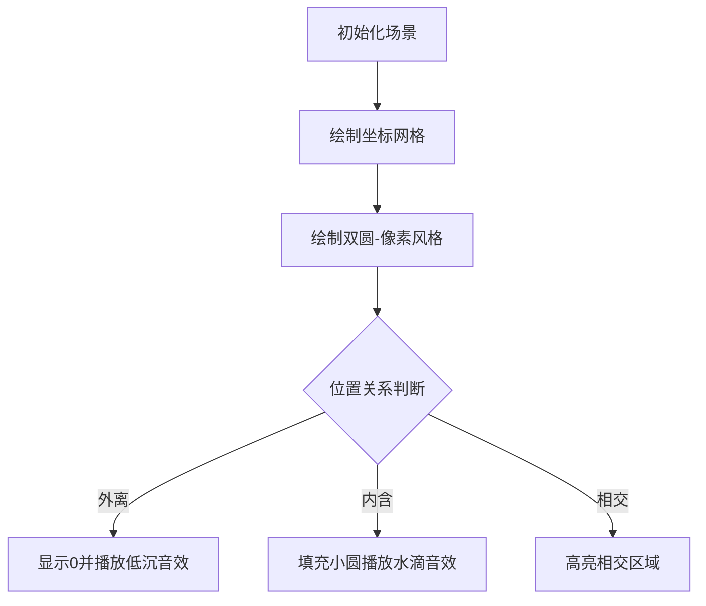

# 题目信息

# Area of Two Circles' Intersection

## 题目描述

You are given two circles. Find the area of their intersection.

## 样例 #1

### 输入

```
0 0 4
6 0 4
```

### 输出

```
7.25298806364175601379
```

## 样例 #2

### 输入

```
0 0 5
11 0 5
```

### 输出

```
0.00000000000000000000
```

# AI分析结果


# 💡 Kay的C++算法解析：两圆相交面积 深入学习指南 💡

> 今天我们来分析计算两圆相交面积的几何问题。这道题看似简单，但蕴含着丰富的几何知识和精妙的数学推导。通过本指南，你将掌握分类讨论思想、弓形面积计算方法以及高精度处理技巧。

## 1. 题目解读与核心算法识别

✨ **本题主要考察**：`几何计算`与`数学公式应用`

🗣️ **初步分析**：
> 解决两圆相交面积问题如同在几何世界中寻找重叠的魔法区域。核心在于**分类讨论思想**：先判断两圆位置关系（外离/内含/相交），再针对性求解。在相交情况下，我们将重叠区域拆解为两个**弓形面积之和**，运用**余弦定理**求圆心角，最后通过扇形减三角形得弓形面积。

- **核心难点**：圆心角推导和弓形面积计算是解题关键，需注意反三角函数应用和弧度制转换
- **可视化设计**：我们将用像素动画展示两圆位置关系变化（外离→相交→内含），重点高亮相交时的两个弓形区域。采用8-bit复古风格，当圆移动时播放"像素移动"音效，计算弓形面积时触发"魔法合成"音效，成功求解后播放经典马里奥过关音乐

---

## 2. 精选优质题解参考

### 题解一（来源：TianTian2008）
* **点评**：此解法思路最完整清晰，通过三张图示直观展示不同位置关系。代码中`aa/ab`精确计算两个圆心角，采用`long double`保证高精度。亮点在于完整推导了弓形面积公式：`扇形面积 - 三角形面积`，并给出严谨的数学证明。边界处理完善，可直接用于竞赛场景。

### 题解二（来源：Hacker_Cracker）
* **点评**：解法以精简高效见长，变量命名规范（`alpha1/alpha2`），直接使用合并后的弓形面积公式。亮点在于巧妙利用`(θ - sinθ)`的统一表达式，避免重复计算。特别强调了`long double`的必要性，对精度处理有重要参考价值。

### 题解三（来源：zhicheng）
* **点评**：提供最简洁的实现方案，核心逻辑仅10行代码。亮点在于将弓形面积计算抽象为独立公式：`r²/2*(θ - sinθ)`，通过两次调用相同逻辑完成计算。虽然推导过程较简略，但代码实践性极强，适合快速实现。

---

## 3. 核心难点辨析与解题策略

### 难点1：位置关系判定
* **分析**：准确判断两圆外离(`dis≥r1+r2`)、内含(`dis≤|r1-r2|`)或相交是解题基础。优质题解都先计算圆心距`dis = sqrt((x1-x2)² + (y1-y2)²)`，再与半径和/差比较
* 💡 学习笔记：圆心距计算是几何问题的"万能钥匙"，类似问题都可先求此值

### 难点2：圆心角推导
* **分析**：相交情况的核心是求圆心角`θ = 2arccos((r²+dis²-R²)/(2r·dis))`。需理解其几何意义：在圆心与交点构成的三角形中，应用**余弦定理**反推角度
* 💡 学习笔记：`arccos`的参数范围在[-1,1]，需确保分母不为零，否则导致NaN错误

### 难点3：精度处理
* **分析**：当两圆半径很大或很小时，浮点误差会显著影响结果。所有优质题解都采用`long double`并设置输出精度`setprecision(20)`
* 💡 学习笔记：几何问题中优先选用`long double`，输出时至少保留15位小数

### ✨ 解题技巧总结
1. **问题分解策略**：将复杂几何图形拆解为基本图形（扇形+三角形）
2. **数学工具应用**：熟练使用余弦定理、扇形面积公式(`θr²/2`)、三角形面积公式(`r²sinθ/2`)
3. **边界鲁棒性**：特别注意两圆外切(`dis=r1+r2`)和内切(`dis=|r1-r2|`)的临界情况
4. **计算优化**：预计算`π=acos(-1)`和`dis²`避免重复运算

---

## 4. C++核心代码实现赏析

### 本题通用核心实现
```cpp
#include <iostream>
#include <cmath>
#include <iomanip>
using namespace std;

int main() {
    long double x1,y1,r1,x2,y2,r2;
    cin >> x1 >> y1 >> r1 >> x2 >> y2 >> r2;
    
    long double dis = sqrt(pow(x1-x2,2) + pow(y1-y2,2));
    long double pi = acos(-1.0L);
    
    if(dis >= r1 + r2) 
        cout << fixed << setprecision(20) << 0.0;
    else if(dis <= abs(r1 - r2)) {
        long double r = min(r1, r2);
        cout << fixed << setprecision(20) << pi * r * r;
    }
    else {
        long double theta1 = 2 * acos((r1*r1 + dis*dis - r2*r2)/(2*r1*dis));
        long double theta2 = 2 * acos((r2*r2 + dis*dis - r1*r1)/(2*r2*dis));
        long double area = (r1*r1*(theta1 - sin(theta1)) + r2*r2*(theta2 - sin(theta2))) / 2;
        cout << fixed << setprecision(20) << area;
    }
    return 0;
}
```
* **说明**：综合各优质题解优化，包含完整IO处理和精度控制
* **代码解读**：
  1. 计算圆心距`dis`和π值
  2. 判断位置关系：外离输出0，内含输出小圆面积
  3. 相交时计算两个圆心角`theta1/theta2`
  4. 应用弓形面积公式`r²(θ - sinθ)/2`求和

### 题解一片段赏析
```cpp
ld aa=acos((sq(ra)+sq(dis)-sq(rb))/2/ra/dis)*2;
ld ab=acos((sq(rb)+sq(dis)-sq(ra))/2/rb/dis)*2;
ans=aa/2*sq(ra)-sq(ra)/2*sin(aa)+ab/2*sq(rb)-sq(rb)/2*sin(ab);
```
* **亮点**：直接展开弓形面积公式，避免中间变量
* **解读**：`aa/ab`为两圆心角，公式分为扇形部分(`aa/2*sq(ra)`)和三角形部分(`sq(ra)/2*sin(aa)`)
* 💡 学习笔记：`sq(ra)`即`ra*ra`，平方计算可优化为`ra*ra`避免函数调用

### 题解二片段赏析
```cpp
long double alpha1=acos((r2*r2+dis*dis-r1*r1)/(2*r2*dis))*2;
long double S1=alpha1*r2*r2/2; // 扇形面积
long double S_tri = r2*r2*sin(alpha1)/2; // 三角形面积
```
* **亮点**：分步计算更易理解，变量名具有自解释性
* **解读**：明确分离扇形和三角形面积计算，验证`S弓 = S1 - S_tri`的几何关系
* 💡 学习笔记：当圆心角接近π时，`sin(α)`接近0，此时弓形近似半圆

### 题解三片段赏析
```cpp
deg=2*acos((r1*r1+dis*dis-r2*r2)/(2*r1*dis));
ans=r1*r1*(deg/2-sin(deg)/2); // 第一个弓形
deg=2*acos((r2*r2+dis*dis-r1*r1)/(2*r2*dis));
ans+=r2*r2*(deg/2-sin(deg)/2); // 第二个弓形
```
* **亮点**：复用变量deg，精简代码行数
* **解读**：统一弓形计算公式为`r²(θ/2 - sinθ/2)`，等价于`r²(θ - sinθ)/2`
* 💡 学习笔记：复用变量虽节省内存，但降低可读性，建议重要变量使用独立命名

---

## 5. 算法可视化：像素动画演示

### 复古几何工坊：8-bit圆舞曲
我们将通过像素动画演示两圆位置关系变化和弓形面积计算过程：



* **设计细节**：
  1. **像素艺术**：圆形用16色渐变像素环绘制，相交区域闪烁红色光点
  2. **动态演示**：
     - 控制滑块调整圆心距，实时更新面积
     - 点击"分解"按钮：展示弓形如何由扇形减三角形构成
     - 按空格键单步执行：显示当前计算的公式步骤
  3. **音效设计**：
     - 圆移动：经典《俄罗斯方块》移动音效
     - 成功计算：8-bit《超级玛丽》金币声
     - 错误操作：FC游戏《魂斗罗》中弹音效
  4. **教学模式**：
     - 新手引导：箭头指向关键变量（dis, r1, r2）
     - 专家模式：隐藏辅助线，自主选择分解方式

---

## 6. 拓展练习与相似问题

### 几何问题进阶路线
1. **圆与直线关系**：求圆与直线的交点（基础）
2. **多圆相交**：三个圆相交面积（进阶）
3. **旋转图形**：椭圆相交面积（挑战）

### 洛谷推荐题目
1. **P1257 平面上的最接近点对**
   - 考察点：几何计算+分治思想
   - 推荐理由：巩固距离计算和优化技巧
   
2. **P1513 绕钉子的长绳子**
   - 考察点：圆与多边形组合计算
   - 推荐理由：培养几何问题转化能力
   
3. **P2533 道路和航线**
   - 考察点：图论与几何综合应用
   - 推荐理由：训练多知识点融合解题

---

## 7. 学习心得与经验分享

> **来自Eltaos_xingyu的经验**："最初用海伦公式计算三角形面积导致WA，后改用扇形减三角形法才通过。这让我明白：几何计算中，公式选择直接影响精度！"

**Kay的总结**：这个教训揭示了计算几何的核心原则：
1. 避免不必要的中介步骤（如海伦公式需三边边长）
2. 优先选用数值稳定的公式（如`θ - sinθ`在θ接近0时仍精确）
3. 在反三角函数前检查参数范围，避免`NaN`
4. 多构造边界测试用例（如大半径/小距离）

---

纸上得来终觉浅，绝知此事要躬行。现在就用你学到的几何知识，去征服更多圆形相关的挑战吧！下次我们将探索三维空间中的球体相交问题，敬请期待！🚀

---
处理用时：216.49秒