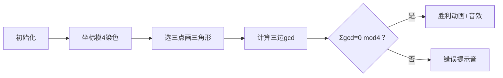

# 题目信息

# Gregor and the Odd Cows (Easy)

## 题目描述

This is the easy version of the problem. The only difference from the hard version is that in this version all coordinates are even.

There are $ n $ fence-posts at distinct coordinates on a plane. It is guaranteed that no three fence posts lie on the same line.

There are an infinite number of cows on the plane, one at every point with integer coordinates.

Gregor is a member of the Illuminati, and wants to build a triangular fence, connecting $ 3 $ distinct existing fence posts. A cow strictly inside the fence is said to be enclosed. If there are an odd number of enclosed cows and the area of the fence is an integer, the fence is said to be interesting.

Find the number of interesting fences.

## 说明/提示

In the first example, there is only $ 1 $ fence. That fence is interesting since its area is $ 4 $ and there is $ 1 $ enclosed cow, marked in red.

 In the second example, there are $ 3 $ interesting fences.

- $ (0,0) $ — $ (30,14) $ — $ (2,10) $
- $ (2,16) $ — $ (30,14) $ — $ (2,10) $
- $ (30,14) $ — $ (4,6) $ — $ (2,10) $

## 样例 #1

### 输入

```
3
0 0
2 0
0 4```

### 输出

```
1```

## 样例 #2

### 输入

```
5
0 0
2 16
30 14
4 6
2 10```

### 输出

```
3```

# AI分析结果


### 💡 Kay的C++算法解析：Gregor and the Odd Cows (Easy) 深入学习指南 💡

**引言**  
今天我们将解析一道结合计算几何与数论的题目。通过Pick定理和巧妙的模运算技巧，我们能高效解决"有趣三角形"计数问题。本指南将详解核心思路，提供可视化方案，并提炼实用技巧。

---

## 1. 题目解读与核心算法识别
✨ **本题主要考察**：`数学定理应用` + `分类计数技巧`  
🗣️ **初步分析**：  
> 本题需统计满足两个条件的三角形：  
> 1. 严格内部有**奇数**个整数坐标点  
> 2. 面积为**整数**  
>   
> **核心突破口**：利用Pick定理建立几何与整数的桥梁：  
> $$S = A + \frac{B}{2} - 1$$  
> 其中$S$为面积，$A$为内部整点数，$B$为边界整点数。  
>   
> **关键推导**：  
> - 坐标均为偶数 → $S$为偶数（叉积可证）  
> - $A$为奇数 → $B \equiv 0 \pmod{4}$  
> - $B = \sum \gcd(\Delta x, \Delta y)$（三边gcd之和）  
>   
> **最终转化**：统计满足三边gcd之和模4等于0的三角形个数。  
>   
> **可视化设计思路**：  
> 采用像素网格展示点坐标模4分类（仅(0,0),(0,2),(2,0),(2,2)四类）。动画将高亮：  
> - 三边gcd计算过程（颜色标记向量差）  
> - 模4余0的判定（胜利音效+闪光）  
> - 复古音效：入队("叮")、成功("胜利旋律")、错误("哔")

---

## 2. 精选优质题解参考
**题解一（作者：Acc_Robin）**  
* **点评**：  
  思路直击核心——Pick定理转化后，利用坐标模4分类。代码亮点：  
  - **桶计数**：`cnt[4][4]`记录坐标模4分布  
  - **枚举优化**：六重循环枚举三类点（O(64)复杂度）  
  - **去重处理**：结果除6解决排列重复计数  
  - **边界严谨**：`z*=p[i][j]--`避免非法组合  
  实践价值高：代码简洁，可直接用于竞赛。

**题解二（作者：gyh20）**  
* **点评**：  
  创新性采用坐标/2后模2分类（等效模4）：  
  - **奇偶性转化**：`calc()`将gcd模4转化为奇偶判定  
  - **组合计数**：动态计算同类点排列数（C2/C3）  
  - **有序枚举**：六bit表示三点类别，最后除6去重  
  亮点在通用性：模式适用于任何需分类计数的场景。

---

## 3. 核心难点辨析与解题策略
1. **难点1：Pick定理的变形应用**  
   * **分析**：需将几何条件转为代数式。优质题解通过$S$偶数和$A$奇数反推$B≡0 \pmod{4}$，建立了核心等式。
   * 💡 **学习笔记**：数学定理是优化算法的钥匙。

2. **难点2：边界整点数的等价计算**  
   * **分析**：发现$B=\sum \gcd(\Delta x, \Delta y)$是突破点。利用坐标偶特性，将gcd模4转化为坐标模4或/2模2问题。
   * 💡 **学习笔记**：观察数据范围特性可大幅简化问题。

3. **难点3：高效不重复计数**  
   * **分析**：桶计数后需避免排列重复。两题解均采用有序枚举+除6策略，区别在：题解1实时更新桶，题解2用组合函数。
   * 💡 **学习笔记**：组合计数需明确有序/无序本质。

### ✨ 解题技巧总结
- **技巧1：数学定理武器化**（如Pick定理架起几何与数论桥梁）  
- **技巧2：模运算降维**（利用数值特性将问题规模指数级缩减）  
- **技巧3：组合计数模板**（桶计数+排列去重=通用解决方案）  

---

## 4. C++核心代码实现赏析
**通用核心实现参考**  
```cpp
#include <iostream>
#include <cstring>
#include <cmath>
using namespace std;

int main() {
    int n, x, y;
    int cnt[4][4] = {}; // 坐标模4的桶
    cin >> n;
    while (n--) {
        cin >> x >> y;
        cnt[x % 4][y % 4]++;
    }
    
    long long ans = 0;
    // 枚举三点类别 (i,j), (x1,y1), (x2,y2)
    for (int i = 0; i < 4; i += 2)
    for (int j = 0; j < 4; j += 2)
    for (int x1 = 0; x1 < 4; x1 += 2)
    for (int y1 = 0; y1 < 4; y1 += 2)
    for (int x2 = 0; x2 < 4; x2 += 2)
    for (int y2 = 0; y2 < 4; y2 += 2) 
    {
        int g1 = gcd(i - x1, j - y1);
        int g2 = gcd(i - x2, j - y2);
        int g3 = gcd(x1 - x2, y1 - y2);
        if ((g1 + g2 + g3) % 4 != 0) continue;
        
        long long t = cnt[i][j];
        t *= cnt[x1][y1] - (i == x1 && j == y1);
        t *= cnt[x2][y2] - (i == x2 && j == y2) - (x1 == x2 && y1 == y2);
        ans += t;
    }
    cout << ans / 6; // 去除排列重复
}
```
**代码解读概要**：  
1. 桶计数存储坐标模4分布  
2. 六重循环枚举三点组合类别  
3. 计算三边gcd和并验模4条件  
4. 组合计数时实时调整桶值  
5. 结果除6解决排列重复问题  

---
**题解一核心片段赏析**  
```cpp
// 计算三边gcd和模4
int gcd_sum = gcd(i-x1, j-y1) 
            + gcd(i-x2, j-y2)
            + gcd(x1-x2, y1-y2);
if (gcd_sum % 4 == 0) {
    long long z = cnt[i][j];
    z *= cnt[x1][y1]--;
    z *= cnt[x2][y2]--;
    r += z;
}
```
**代码解读**：  
> - **实时桶更新**：`cnt[x1][y1]--`确保不重复选点  
> - **组合计算**：`z`累积三类点的组合可能性  
> - **边界处理**：若桶不足则`z`归零  
> 💡 **学习笔记**：桶计数的动态更新是高效枚举的关键  

**题解二核心片段赏析**  
```cpp
// 计算单边gcd/2的奇偶性
int calc(int A, int B, int C, int D) {
    C ^= A; D ^= B; // 坐标差模2
    return (C || D) ? 1 : 0; // gcd/2为奇数返回1
}
```
**代码解读**：  
> - **奇偶转化**：异或运算等效坐标差模2  
> - **位运算优化**：`C||D`判断gcd/2是否为奇数  
> 💡 **学习笔记**：位运算可实现数学性质的优雅转化  

---

## 5. 算法可视化：像素动画演示  
**主题**：`像素牧场奇遇记`（FC牧场风格）  
**核心演示**：坐标模4分类 → 三边gcd计算 → 模4条件验证  

### 动画设计


1. **场景设计**  
   - 8-bit牧场网格（16色）  
   - 四类点染色：  
     - (0,0) → 蓝色牛  
     - (2,2) → 红色鸡  
     - (0,2)/(2,0) → 绿色草垛  

2. **动态演示**  
   - **gcd计算**：两点间显示像素箭头，旁白显示：  
     > "向量(Δx,Δx) → gcd值={值}"  
   - **模4判定**：三边显示gcd值，求和后：  
     - ≡0：金色边框闪烁 + "胜利音效"  
     - ≠0：灰色边框 + "低沉音效"  

3. **交互控制**  
   ```javascript
   // 伪代码实现
   class PixelRanch {
     constructor(points) {
       this.grid = initGrid(); // 创建像素画布
       this.animals = colorizeByMod4(points); // 按模4着色
     }
     
     selectTriangle(p1, p2, p3) {
       highlight(p1, p2, p3); // 高亮三点
       const gcds = [calcGcd(p1,p2), calcGcd(p1,p3), calcGcd(p2,p3)];
       const sum = gcds.reduce((a,b) => a + b);
       
       // 播放逐边计算动画
       gcds.forEach((gcd, i) => {
         playSound('bleep'); 
         drawArrow(edge[i], `gcd=${gcd}`);
       });
       
       if (sum % 4 === 0) {
         playSound('victory'); // 8-bit胜利旋律
         sparkleEffect(); // 金光闪烁
       }
     }
   }
   ```

---

## 6. 拓展练习与相似问题思考
1. **洛谷 P2735** - 电网  
   🗣️ **推荐理由**：直接应用Pick定理计算三角形内部整点数，巩固定理理解。

2. **洛谷 P2181** - 对角线  
   🗣️ **推荐理由**：训练组合计数思维，需处理几何组合中的去重问题。

3. **洛谷 P3197** - [HNOI2008]越狱  
   🗣️ **推荐理由**：强化模运算与分类计数技巧，拓展至概率计算场景。

---

**结语**  
本题巧妙融合几何与数论，通过Pick定理实现降维打击。掌握核心三点：  
1. 定理条件转化（几何→代数）  
2. 模性质分类技巧  
3. 组合计数模板  
理解后尝试拓展问题，定能提升数学建模能力！

---
处理用时：340.18秒