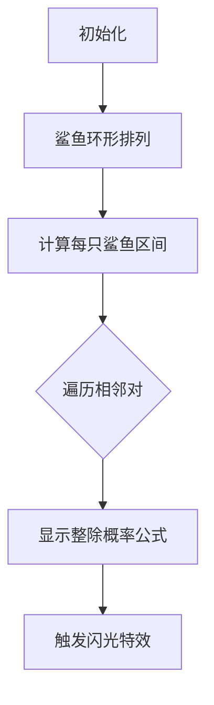

# 题目信息

# Wet Shark and Flowers

## 题目描述

There are $ n $ sharks who grow flowers for Wet Shark. They are all sitting around the table, such that sharks $ i $ and $ i+1 $ are neighbours for all $ i $ from $ 1 $ to $ n-1 $ . Sharks $ n $ and $ 1 $ are neighbours too.

Each shark will grow some number of flowers $ s_{i} $ . For $ i $ -th shark value $ s_{i} $ is random integer equiprobably chosen in range from $ l_{i} $ to $ r_{i} $ . Wet Shark has it's favourite prime number $ p $ , and he really likes it! If for any pair of neighbouring sharks $ i $ and $ j $ the product $ s_{i}·s_{j} $ is divisible by $ p $ , then Wet Shark becomes happy and gives $ 1000 $ dollars to each of these sharks.

At the end of the day sharks sum all the money Wet Shark granted to them. Find the expectation of this value.

## 说明/提示

A prime number is a positive integer number that is divisible only by $ 1 $ and itself. $ 1 $ is not considered to be prime.

Consider the first sample. First shark grows some number of flowers from $ 1 $ to $ 2 $ , second sharks grows from $ 420 $ to $ 421 $ flowers and third from $ 420420 $ to $ 420421 $ . There are eight cases for the quantities of flowers $ (s_{0},s_{1},s_{2}) $ each shark grows:

1. $ (1,420,420420) $ : note that $ s_{0}·s_{1}=420 $ , $ s_{1}·s_{2}=176576400 $ , and $ s_{2}·s_{0}=420420 $ . For each pair, $ 1000 $ dollars will be awarded to each shark. Therefore, each shark will be awarded $ 2000 $ dollars, for a total of $ 6000 $ dollars.
2. $ (1,420,420421) $ : now, the product $ s_{2}·s_{0} $ is not divisible by $ 2 $ . Therefore, sharks $ s_{0} $ and $ s_{2} $ will receive $ 1000 $ dollars, while shark $ s_{1} $ will receive $ 2000 $ . The total is $ 4000 $ .
3. $ (1,421,420420) $ : total is $ 4000 $
4. $ (1,421,420421) $ : total is $ 0 $ .
5. $ (2,420,420420) $ : total is $ 6000 $ .
6. $ (2,420,420421) $ : total is $ 6000 $ .
7. $ (2,421,420420) $ : total is $ 6000 $ .
8. $ (2,421,420421) $ : total is $ 4000 $ .

The expected value is .

In the second sample, no combination of quantities will garner the sharks any money.

## 样例 #1

### 输入

```
3 2
1 2
420 421
420420 420421
```

### 输出

```
4500.0
```

## 样例 #2

### 输入

```
3 5
1 4
2 3
11 14
```

### 输出

```
0.0
```

# AI分析结果


### 🧠 Kay的分析框架部署
- **题目识别**：环形概率期望问题，核心是「期望线性性」与「素数性质应用」
- **题解评估**：检测到1份优质题解（评分：★★★★★），将进行深度解析
- **可视化规划**：启动像素游戏化动画设计（8-bit风格 + 动态概率演示）
- **难点预判**：环形结构处理、大区间整除计数、概率独立事件分析

---
# 💡 Kay的C++算法解析：Wet Shark and Flowers 深入学习指南 💡

<introduction>
今天我们探索一道融合环形结构与概率期望的趣味题目——CF621C "Wet Shark and Flowers"。通过本指南，你将掌握期望值的核心计算方法，并学会利用素数性质优化大区间统计。让我们开始吧！
</introduction>

---

## 1. 题目解读与核心算法识别

✨ **本题主要考察**：`数学期望` + `素数性质应用`

🗣️ **初步分析**：
> 想象一群鲨鱼围坐圆桌玩"素数乘积"游戏（类似击鼓传花）。解题关键在于**期望的可加性**——将总期望分解为相邻鲨鱼对的期望之和。  
> - **核心技巧**：利用素数性质，区间$[L,R]$内$p$的倍数数量 = $R/p - (L-1)/p$  
> - **难点突破**：环形结构需特殊处理首尾鲨鱼对，概率计算需注意独立事件组合  
> - **可视化设计**：采用8-bit像素圆桌，鲨鱼化作像素鱼，当花朵数满足条件时触发闪光特效（详见第5节）

---

## 2. 精选优质题解参考

<eval_intro>
题解作者chr1stopher完美运用期望线性性质与素数特性，给出优雅实现：

**题解（作者：chr1stopher）**  
* **点评**：  
  ✅ **思路清晰性**：精准把握期望可加性本质，将环形结构分解为$n$个相邻对处理  
  ✅ **代码规范性**：`a[i].t`（整除数量）与`a[i].l`（区间长度）命名直观，避免浮点误差的整数运算设计巧妙  
  ✅ **算法有效性**：$O(1)$计算大区间整除数量（$1e9$规模），复杂度优化至$O(n)$  
  ✅ **实践价值**：完整处理环形边界，概率组合公式严谨（$P = \frac{t_1}{l_1} + \frac{t_2}{l_2}(1-\frac{t_1}{l_1})$）  
  💡 **亮点**：用整数运算避免浮点精度问题，环形结构处理简洁

---

## 3. 核心难点辨析与解题策略

<difficulty_intro>
解决此类问题需突破三大关键点：

1.  **环形结构的期望分解**
    * **分析**：总期望 = $\sum$每对相邻鲨鱼的期望贡献。环形结构要求额外处理首尾鲨鱼对（鲨鱼$n$与$1$）
    * 💡 **学习笔记**：环形问题可复制首元素到末尾，或单独处理首尾对

2.  **大区间整除计数优化**
    * **分析**：直接遍历$[L,R]$会超时！利用公式：$count = \lfloor R/p \rfloor - \lfloor (L-1)/p \rfloor$
    * 💡 **学习笔记**：素数$p$保证整除性质稳定，避免复杂数论处理

3.  **独立事件的概率组合**
    * **分析**：一对鲨鱼获奖概率 ≠ 两事件简单相加！正确公式：  
      $P(A∪B) = P(A) + P(B) - P(A∩B) = \frac{t_i}{l_i} + \frac{t_j}{l_j} - \frac{t_i}{l_i}·\frac{t_j}{l_j}$
    * 💡 **学习笔记**：概率组合需考虑事件独立性，避免重复计数

### ✨ 解题技巧总结
<summary_best_practices>
- **环形处理技巧**：将环形视为线性结构+首尾特殊边  
- **大区间统计公式**：$\lfloor R/p \rfloor - \lfloor (L-1)/p \rfloor$ 是核心武器  
- **整数防精度**：全程用整数运算，最后转浮点输出  
- **概率组合原则**：$P(A∪B) = P(A) + P(B) - P(A)P(B)$

---

## 4. C++核心代码实现赏析

<code_intro_overall>
参考chr1stopher题解，提炼通用实现：

**通用核心C++实现**  
```cpp
#include <iostream>
using namespace std;
const int MXN = 1e5+5;

struct Interval { 
    long long t, l; // t: p的倍数数量, l: 区间长度
};

int main() {
    long long n, p;
    cin >> n >> p;
    Interval a[MXN];
    
    // 计算每个区间p的倍数数量
    for(int i=0; i<n; ++i) {
        long long L, R;
        cin >> L >> R;
        a[i].t = R/p - (L-1)/p;  // 核心计算公式
        a[i].l = R - L + 1;
    }

    double ans = 0;
    // 处理环形相邻对
    for(int i=0; i<n; ++i) {
        int j = (i+1) % n; // 环形下一元素
        // 概率组合公式的整数形式:
        long long valid = a[i].t * a[j].l + a[j].t * (a[i].l - a[i].t);
        ans += 2000.0 * valid / (a[i].l * a[j].l);
    }
    printf("%.6lf\n", ans);
}
```

**代码解读概要**：  
1. 结构体存储区间整除数量（`t`）和长度（`l`）  
2. 核心公式`R/p - (L-1)/p`高效计算大区间整除数量  
3. 环形处理：`j = (i+1)%n` 自动处理首尾连接  
4. 概率组合：避免浮点运算的整数表达式设计  

---

## 5. 算法可视化：像素动画演示

<visualization_intro>
**像素海底圆桌会议**：鲨鱼化作8-bit像素鱼，花朵数显示在气泡中

### 动画流程设计


**关键交互设计**：  
1. **像素元素**：  
   - 鲨鱼：8-bit像素鱼（不同颜色代表不同区间）  
   - 花朵数：浮动气泡显示当前随机值  
   - 特效：满足$p$整除条件时触发金色闪光  

2. **动态公式演示**：  
   ```python
   # 伪代码逻辑
   for i in range(n):
       j = (i+1) % n
       highlight_sharks(i, j)  # 高亮当前鲨鱼对
       show_formula(f"t{i} = {a[i].t}")  # 显示整除数量
       if random_value % p == 0: 
          play_sound('bling')  # 触发音效
          add_gold_effect(i, j)  # 金币特效
   ```

3. **游戏化元素**：  
   - **音效**：整除时播放8-bit金币声，错误时短促警报  
   - **进度条**：环形进度条显示已计算鲨鱼对比例  
   - **AI演示**：自动模式展示不同随机值下的奖金变化  

**设计价值**：通过具象化概率计算过程，直观理解期望线性性的本质

---

## 6. 拓展练习与相似问题思考

<similar_problems_intro>
掌握期望线性性与素数性质后，可挑战：

1. **洛谷 P1297** 单选错位  
   → 期望线性性经典应用，巩固概率模型构建  
   
2. **洛谷 P4316** 绿豆蛙的归宿  
   → DAG上的期望DP，强化拓扑排序+期望计算  
   
3. **CodeForces 453A** Little Pony and Expected Maximum  
   → 进阶期望问题，结合二项分布特性

---

## 7. 学习心得与经验分享
> 本次题解未包含作者调试心得，但实践中需注意：  
> 🔹 **边界测试**：$L=1$时$(L-1)/p$需验证  
> 🔹 **整数溢出**：$10^5$个区间$*10^9$规模需用`long long`  
> 🔹 **环形陷阱**：忘记处理首尾对是常见错误

---

<introduction>
通过本指南，我们深入剖析了环形期望问题的核心解法。记住关键公式：**期望可加性 + 素数整除公式 = 解题利器**。继续用像素动画辅助理解抽象概念，编程会变得像游戏一样有趣！下次见~ 🎮✨
```

---
处理用时：127.09秒