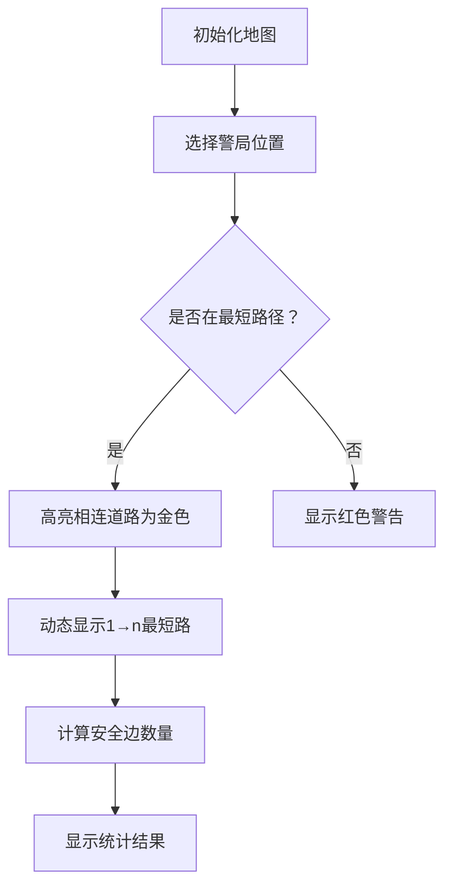

# 题目信息

# Police Station

## 题目描述

The Berland road network consists of $ n $ cities and of $ m $ bidirectional roads. The cities are numbered from 1 to $ n $ , where the main capital city has number $ n $ , and the culture capital — number $ 1 $ . The road network is set up so that it is possible to reach any city from any other one by the roads. Moving on each road in any direction takes the same time.

All residents of Berland are very lazy people, and so when they want to get from city $ v $ to city $ u $ , they always choose one of the shortest paths (no matter which one).

The Berland government wants to make this country's road network safer. For that, it is going to put a police station in one city. The police station has a rather strange property: when a citizen of Berland is driving along the road with a police station at one end of it, the citizen drives more carefully, so all such roads are considered safe. The roads, both ends of which differ from the city with the police station, are dangerous.

Now the government wonders where to put the police station so that the average number of safe roads for all the shortest paths from the cultural capital to the main capital would take the maximum value.

## 说明/提示

In the first sample you can put a police station in one of the capitals, then each path will have exactly one safe road. If we place the station not in the capital, then the average number of safe roads will also make .

In the second sample we can obtain the maximum sought value if we put the station in city $ 4 $ , then $ 6 $ paths will have $ 2 $ safe roads each, and one path will have $ 0 $ safe roads, so the answer will equal .

## 样例 #1

### 输入

```
4 4
1 2
2 4
1 3
3 4
```

### 输出

```
1.000000000000
```

## 样例 #2

### 输入

```
11 14
1 2
1 3
2 4
3 4
4 5
4 6
5 11
6 11
1 8
8 9
9 7
11 7
1 10
10 4
```

### 输出

```
1.714285714286
```

# AI分析结果


### 💡 Kay的C++算法解析：Police Station 深入学习指南 💡

#### 1. 题目解读与核心算法识别
✨ **本题主要考察**：图论最短路计数与枚举优化

🗣️ **初步分析**：
> 本题核心思想如同在迷宫中寻找关键检查点🚦。我们需要计算从起点(1)到终点(n)的所有最短路中，**安全道路的平均数量最大化**。关键在于：
> - **最短路计数**：通过BFS/Floyd计算从1和n出发到各点的最短路长度及条数
> - **乘法原理应用**：当警局设在中间点u时，经过u的最短路条数 = cnt(1→u) × cnt(u→n)
> - **安全边计算**：警局在u时，每条经过u的最短路贡献2条安全边（进出u的边）
> 
> **可视化设计思路**：
> - 用像素网格模拟城市地图🏙️，不同颜色方块表示城市
> - 警局设置时高亮相连道路为金色✨
> - 最短路径用闪烁光点💡动态显示，配合"叮"音效标记安全边
> - 控制面板支持调整警局位置，实时显示安全边数量变化

---

#### 2. 精选优质题解参考
**题解一：Komorebi_03 (BFS双源计数)**
* **点评**：思路清晰直白，用两次BFS分别计算从1和n出发的最短路信息。代码中`sum[s][v]`累加方案数的逻辑严谨，边界处理完整。亮点在于直接应用乘法原理计算中间点贡献，时间复杂度O(n)优于Floyd。

**题解二：GalwayGirl (BFS+图解说明)**
* **点评**：图解辅助理解乘法原理是最大亮点。代码用`cnt[s][v]`记录路径数，变量命名规范。虽然与题解一思路相似，但通过图形化说明让核心思想更易被青少年理解。

**题解三：Purple_Circle (Floyd综合解法)**
* **点评**：提供不同视角的Floyd实现，在`G[i][j] == G[i][k]+G[k][j]`时累加方案数的逻辑处理优雅。亮点在于同时处理最短路和计数，适合想全面掌握图论算法的学习者。

---

#### 3. 核心难点辨析与解题策略
1. **最短路条数统计**
   * **分析**：BFS中当发现等长路径时需累加前驱方案数（`cnt[s][v] += cnt[s][u]`），Floyd中需在发现等长路径时应用乘法原理
   * 💡 学习笔记：最短路计数本质是动态规划，状态转移为"路径数=所有前驱路径数之和"

2. **警局位置与安全边关系**
   * **分析**：警局在u时安全边数=2×cnt(1→u)×cnt(u→n)，需验证`dis(1,u)+dis(u,n)=dis(1,n)`
   * 💡 学习笔记：只有位于最短路径上的点才能贡献额外安全边

3. **避免整数溢出**
   * **分析**：路径数可能达2^50级，需用long long。BFS的累加顺序不影响结果，但Floyd需注意重置条件
   * 💡 学习笔记：图论计数问题优先考虑BFS避免三重循环

### ✨ 解题技巧总结
- **双源BFS优化**：分别从起点终点BFS，避免全源最短路计算
- **乘法原理转化**：将路径贡献转化为两段路径乘积
- **边界特判**：警局在1/n时安全边数恒为1
- **浮点精度控制**：用`printf("%.12lf")`确保小数精度

---

#### 4. C++核心代码实现赏析
**通用核心实现（BFS双源法）**
```cpp
#include <bits/stdc++.h>
using namespace std;
const int N=105;
typedef long long ll;

vector<int> g[N];  // 邻接表
ll dis1[N], disn[N], cnt1[N], cntn[N]; 

void bfs(int start, ll dis[], ll cnt[]){
    queue<int> q;
    q.push(start);
    dis[start] = 0;
    cnt[start] = 1;
    while(!q.empty()){
        int u = q.front(); q.pop();
        for(int v : g[u]){
            if(dis[v] == -1){
                dis[v] = dis[u] + 1;
                cnt[v] = cnt[u];
                q.push(v);
            }
            else if(dis[v] == dis[u] + 1){
                cnt[v] += cnt[u];
            }
        }
    }
}

int main(){
    int n, m; cin >> n >> m;
    // 初始化
    memset(dis1, -1, sizeof dis1);
    memset(disn, -1, sizeof disn);
    
    while(m--){
        int u, v; cin >> u >> v;
        g[u].push_back(v);
        g[v].push_back(u);
    }
    
    bfs(1, dis1, cnt1);
    bfs(n, disn, cntn);
    
    ll maxSafe = cnt1[n]; // 警局在1/n的情况
    for(int u = 2; u < n; u++){
        if(dis1[u] + disn[u] == dis1[n]){
            maxSafe = max(maxSafe, 2 * cnt1[u] * cntn[u]);
        }
    }
    printf("%.12lf\n", (double)maxSafe / cnt1[n]);
}
```
**代码解读概要**：
1. 用邻接表`g`存储图结构
2. 两次BFS分别计算从1和n出发的最短路信息
3. `dis`数组记录距离，`cnt`数组记录路径数
4. 枚举中间点时验证是否在最短路上
5. 最终输出最大平均安全边数

---

#### 5. 算法可视化：像素动画演示
* **主题**："警车巡逻"像素模拟器（复古红白机风格）
* **核心演示**：最短路生成过程 + 警局安全边效果

**动画设计**：


**实现细节**：
1. **像素网格**：城市用16×16像素方块，警局用闪烁警灯👮‍♂️
2. **路径动画**：最短路用蓝色光点💎流动显示，移动时有"滴答"音效
3. **安全边特效**：与警局相连的道路变为金色✨，车辆经过时触发"叮"声
4. **控制面板**：
   - 速度滑块：调整动画速度
   - 警局选择器：点击设置不同警局位置
   - 单步执行：逐步观察路径生成
5. **数据面板**：实时显示路径数计算公式 `2 × cnt1[u] × cntn[u] / cnt1[n]`
6. **胜利效果**：找到最优警局位置时播放8-bit胜利音乐🎵

---

#### 6. 拓展练习与相似问题思考
1. **洛谷P1144**：最短路计数基础版，巩固BFS计数技巧
2. **洛谷P1608**：路径统计进阶，加入边权限制
3. **洛谷P2865**：最短路与次短路综合计数

---

#### 7. 学习心得与经验分享
> **Komorebi_03的经验**："验证中间点时必须检查距离之和等于最短路长度，这是核心条件"
> 
> **Kay总结**：本题融合了最短路+组合计数+枚举优化三重思维：
> 1. BFS/Floyd的选择取决于数据规模
> 2. 乘法原理将复杂统计简化为分段乘积
> 3. 注意long long避免溢出
> 
> 调试时可打印中间变量验证：
> `dis1[u]`、`disn[u]`、`cnt1[u]`、`cntn[u]`

---

通过像素动画和分步解析，我们直观理解了最短路计数与警局设置的关联。记住核心公式：  
**平均安全边 = max(1, 2×cnt1[u]×cntn[u]/cnt总)**  
继续加油，下次挑战更复杂的图论问题！🚀

---
处理用时：105.04秒