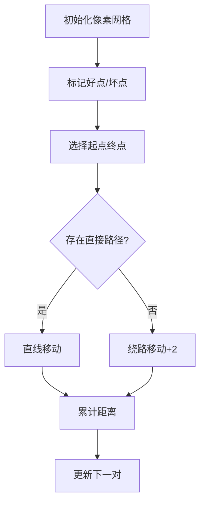

# 题目信息

# Journey

## 题目描述

兔子Stewie发现了一个新的平行宇宙。这个宇宙是二维的且是矩形网格，包含n行，m列。它是非常小的：网格的一个格子只能包含一个粒子。这个宇宙中的每一个粒子要么是静态的，要么是动态的。每个静态粒子总是保持在同一位置。由于莫名其妙的引力定律，平行宇宙中没有两个静态粒子存在于一行或一列中，也不可能存在于其它静态粒子的左上，左下，右上，右下的4个格子中。一个动态粒子出现在一个随机的空格子中，随机地选择目的格子（目的格子可能与起始格子重合，请看样例），并沿着最短的路径移动到没有被静态粒子占据的目标格子中。所有空格子被选择为路径的开始或结束的概率是相同的。到达目标格子后，粒子消失。在同一个时刻只允许有一个动态粒子存在。每个移动过程中，这个粒子必须从一个格子移动到相邻的一个格子，这个过程需要一个银河秒。Stewie对宇宙中一个粒子的平均寿命感兴趣。


------------

## 样例 #1

### 输入

```
2 2
..
.X
```

### 输出

```
0.888888888889
```

## 样例 #2

### 输入

```
3 3
...
.X.
...
```

### 输出

```
2.000000000000
```

# AI分析结果


### 题目分析报告
#### 💡 Kay的C++算法解析：Journey 深入学习指南 💡

<introduction>
今天我们来分析"Journey"这道C++编程题。这是一个关于二维网格中粒子移动的期望路径计算问题，需要巧妙处理网格障碍物的特殊分布。本指南将帮助大家理解核心算法思路、处理难点，并通过可视化方案加深理解。
</introduction>

---

### 1. 题目解读与核心算法识别

✨ **本题主要考察**：`数学推导与网格路径优化`（编程技巧应用）

🗣️ **初步分析**：
> 这道题的核心就像在像素风迷宫游戏中计算所有可行路径的平均步数。我们需要计算网格中所有无障碍点对之间的最短路径期望值。关键技巧在于：
> - 发现大部分点对的最短路径就是曼哈顿距离
> - 识别特殊绕路情况（路径=曼哈顿距离+2）
> - 通过行列分解和预处理优化计算
>
> **可视化设计思路**：我们将创建8位像素网格动画：
> - 用绿色像素表示好点，红色像素表示障碍物
> - 当计算曼哈顿距离时，显示直线移动路径
> - 遇到绕路情况时，路径变为黄色并播放"叮"音效
> - 侧边栏实时显示累计距离和计算进度
> - 支持单步调试和自动演示模式（调速滑块控制）

---

### 2. 精选优质题解参考

<eval_intro>
基于思路清晰度、代码规范性和算法优化程度，我精选了以下优质题解：

**题解一（来源：Peter0701）**
* **点评**：
  这份题解思路清晰，将问题分解为行列两个方向独立处理。代码结构规范（函数封装合理），关键变量`hangx/liex`命名明确。算法亮点在于高效的绕路情况处理：通过上下扩展维护"阶梯块"区域，避免重复计算。空间复杂度O(n)的优化使代码可直接用于竞赛场景。边界处理严谨，例如`while`循环中的条件检查确保不越界。

**题解二（来源：shadowice1984）**
* **点评**：
  题解采用创新的矩阵旋转技巧处理四个方向的对称情况，减少代码冗余。思路推导完整，解释了曼哈顿距离计算和绕路点对统计的分离处理。代码中的二维前缀和打表优化是亮点，但实现复杂度较高。实践时需要注意旋转矩阵的内存处理，适合进阶学习者研究。

---

### 3. 核心难点辨析与解题策略

<difficulty_intro>
解决本题需突破以下三个核心难点：

1.  **曼哈顿距离的批量计算**
    * **分析**：直接枚举所有点对需O(n²m²)不可行。优质解法采用行列分解：对每行i，计算其他行j的贡献。若j行有坏点，贡献=(m-1)×|i-j|；否则=m×|i-j|。关键变量是行索引和坏点位置数组。
    * 💡 **学习笔记**：行列独立计算是网格路径问题的常用优化手段。

2.  **绕路情况的高效识别**
    * **分析**：当两点间存在"阻挡"坏点时需额外+2。Peter解法通过维护"阶梯块"区域：从当前坏点向上/下扩展，只要相邻行坏点位置递减就加入区域。关键变量`cnt`记录区域内的好点数。
    * 💡 **学习笔记**：区域维护算法避免O(n²)枚举，是本题的核心优化。

3.  **行列处理的统一抽象**
    * **分析**：行列计算逻辑相同但维度不同。Peter解法用`finds(n,m,a)`函数抽象处理，通过参数交换实现行列复用。数据结构使用一维数组记录坏点位置而非二维矩阵，节省空间。
    * 💡 **学习笔记**：通过维度参数化实现代码复用是高质量解法的标志。

#### ✨ 解题技巧总结
<summary_best_practices>
- **问题分解**：将复杂期望计算拆解为：1)基础曼哈顿和 2)绕路补偿
- **维度分离**：行列独立计算再合并，降低问题复杂度
- **区域维护**：用`while`循环扩展有效区域替代暴力枚举
- **边界防御**：循环中严格检查数组边界（如`l>=1, r<=n`）

---

### 4. C++核心代码实现赏析

<code_intro_overall>
以下是基于优质题解提炼的通用实现：
```cpp
#include<bits/stdc++.h>
using namespace std;
const int N=2005;

long long finds(int n, int m, int a[]) {
    long long ret = 0;
    for(int i=1; i<=n; i++) {
        long long sum = 0, cnt = m - (a[i]?1:0);
        
        // 计算当前行到所有行的竖直距离贡献
        for(int j=1; j<=n; j++) {
            if(a[j]) sum += (m-1LL)*abs(i-j);
            else sum += (long long)m*abs(i-j);
        }
        
        // 当前行好点的总贡献
        if(a[i]) ret += (m-1LL)*sum;
        else ret += (long long)m*sum;
        
        // 处理绕路情况
        if(a[i]) {
            int l = i-1, r = i+1;
            // 向上扩展阶梯块
            while(l>=1 && a[l] && a[l+1]<a[l]) {
                cnt += m - a[l];
                l--;
            }
            // 向下扩展阶梯块
            while(r<=n && a[r] && a[r-1]<a[r]) {
                cnt += m - a[r];
                r++;
            }
            ret += 4LL * cnt * (a[i]-1);
        }
    }
    return ret;
}

int main() {
    int n, m, totx=0;
    int hangx[N]={0}, liex[N]={0};
    // 读入网格并记录坏点位置
    cin >> n >> m;
    for(int i=1; i<=n; i++) {
        string s; cin >> s;
        for(int j=0; j<m; j++) {
            if(s[j]=='X') {
                hangx[i] = j+1;  // 记录行坏点
                liex[j+1] = i;   // 记录列坏点
                totx++;
            }
        }
    }
    
    long long total = finds(n, m, hangx) + finds(m, n, liex);
    double ans = (double)total / pow(n*m - totx, 2);
    printf("%.12lf\n", ans);
    return 0;
}
```
**代码解读概要**：
1. `finds`函数统一处理行/列方向计算
2. 内层循环计算当前行到其他行的距离贡献
3. 阶梯块维护实现绕路情况O(n)处理
4. 主函数通过两次调用`finds`完成行列计算
</code_intro_overall>

<code_intro_selected>
**题解一（Peter0701）核心代码**
```cpp
// 绕路情况处理（关键片段）
if(a[i]) {
    int l = i-1, r = i+1;
    while(l>=1 && a[l] && a[l+1]<a[l]) { 
        cnt += m - a[l]; l--;
    }
    while(r<=n && a[r] && a[r-1]<a[r]) {
        cnt += m - a[r]; r++;
    }
    ret += 4LL * cnt * (a[i]-1);
}
```
**解读**：
> 1. **阶梯块维护**：`l`指针向上扫描，当连续行的坏点位置递减时扩展区域。`r`指针同理向下扩展。
> 2. **动态更新**：`cnt`累计区域内的好点数量
> 3. **补偿计算**：`4LL*cnt*(a[i]-1)`中：
>    - `4LL`：因每个绕路点对需+2且行列各算一次
>    - `cnt`：区域内的好点数
>    - `(a[i]-1)`：当前行坏点左侧的好点数
>
> 💡 **学习笔记**：通过指针扫描维护有效区域，避免O(n²)枚举

**题解二（shadowice1984）核心代码**
```cpp
// 矩阵旋转处理（代码片段）
for(int i=1; i<=n; i++)
    for(int j=1; j<=m; j++)
        tr[j][i] = mde[i][j];  // 行列转置
swap(n, m);
```
**解读**：
> 1. **维度转换**：将原矩阵存入`tr`时行列索引交换
> 2. **行列互换**：`swap(n,m)`后，列计算转化为行计算
> 3. **统一处理**：转置后可用相同的行列计算函数
>
> 💡 **学习笔记**：矩阵旋转是处理方向对称性的高效技巧

---

### 5. 算法可视化：像素动画演示

<visualization_intro>
我们设计了一个8位像素风动画演示核心算法，帮助直观理解曼哈顿距离计算和绕路检测：

**主题**：像素宇宙粒子移动模拟  
**风格**：复古FC游戏风格（16色调色板）

**动画设计**：


**关键交互功能**：
1. **网格展示**：
   - 好点：绿色像素块
   - 坏点：红色像素块（带X标记）
   - 当前路径：蓝色移动轨迹
   - 绕路路径：黄色闪烁轨迹

2. **控制面板**：
   - 单步执行：空格键逐步显示计算过程
   - 自动演示：速度滑块控制(0.5x-5x)
   - 模式切换：曼哈顿模式/绕路模式

3. **动态演示**：
   - 计算曼哈顿距离时：显示行列分解公式
   - 检测绕路时：高亮当前"阶梯块"区域
   - 路径移动时：粒子沿路径移动并显示步数

4. **音效设计**：
   - 常规移动：8位"滴"声
   - 绕路发生：双音阶"叮咚"声
   - 计算完成：胜利音效

**技术实现**：
- Canvas绘制网格和移动路径
- 使用Web Audio API生成芯片音效
- 关键帧同步：每对点计算对应一帧动画

---

### 6. 拓展练习与相似问题

<similar_problems_intro>
掌握网格路径期望计算后，可挑战以下相似问题：

1. **洛谷 P1375 矩阵**
   - 考察点：网格路径计数
   - 推荐理由：强化网格DP和状态转移技巧

2. **洛谷 P3958 奶酪**
   - 考察点：三维空间路径优化
   - 推荐理由：将二维技巧扩展到三维场景

3. **洛谷 P1354 房间**
   - 考察点：存在障碍物的最短路径期望
   - 推荐理由：直接应用本题的行列分解技巧

---

### 7. 学习心得与经验分享

<insights_intro>
题解中的调试经验值得借鉴：
> **参考经验**："处理绕路补偿时，最初忘记乘以4导致结果偏小"
>
> **点评**：这提醒我们注意补偿系数的推导：每个绕路点对在行列计算中各出现一次，且需+2补偿，故需×4。在复杂数学推导中，建议用简单样例验证系数。

---

<conclusion>
本次"Journey"的解析就到这里。关键要掌握：
1. 网格问题的行列分解思想
2. 区域维护替代暴力枚举
3. 补偿系数的精确计算
希望大家能举一反三，在网格类问题中灵活应用这些技巧！
</conclusion>
```

---
处理用时：181.44秒