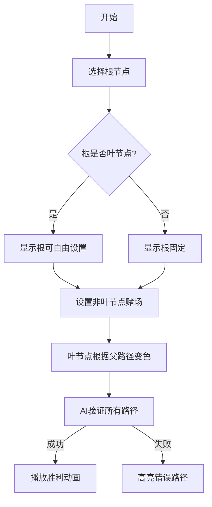

# 题目信息

# Casinos and travel

## 题目描述

John has just bought a new car and is planning a journey around the country. Country has $ N $ cities, some of which are connected by bidirectional roads. There are $ N-1 $ roads and every city is reachable from any other city. Cities are labeled from $ 1 $ to $ N $ .

John first has to select from which city he will start his journey. After that, he spends one day in a city and then travels to a randomly choosen city which is directly connected to his current one and which he has not yet visited. He does this until he can't continue obeying these rules.

To select the starting city, he calls his friend Jack for advice. Jack is also starting a big casino business and wants to open casinos in some of the cities (max $ 1 $ per city, maybe nowhere). Jack knows John well and he knows that if he visits a city with a casino, he will gamble exactly once before continuing his journey.

He also knows that if John enters a casino in a good mood, he will leave it in a bad mood and vice versa. Since he is John's friend, he wants him to be in a good mood at the moment when he finishes his journey. John is in a good mood before starting the journey.

In how many ways can Jack select a starting city for John and cities where he will build casinos such that no matter how John travels, he will be in a good mood at the end? Print answer modulo $ 10^{9}+7 $ .

## 说明/提示

Example 1: If Jack selects city 1 as John's starting city, he can either build 0 casinos, so John will be happy all the time, or build a casino in both cities, so John would visit a casino in city 1, become unhappy, then go to city 2, visit a casino there and become happy and his journey ends there because he can't go back to city 1. If Jack selects city 2 for start, everything is symmetrical, so the answer is 4.

Example 2: If Jack tells John to start from city 1, he can either build casinos in 0 or 2 cities (total 4 possibilities). If he tells him to start from city 2, then John's journey will either contain cities 2 and 1 or 2 and 3. Therefore, Jack will either have to build no casinos, or build them in all three cities. With other options, he risks John ending his journey unhappy. Starting from 3 is symmetric to starting from 1, so in total we have $ 4+2+4=10 $ options.

## 样例 #1

### 输入

```
2
1 2
```

### 输出

```
4
```

## 样例 #2

### 输入

```
3
1 2
2 3
```

### 输出

```
10
```

# AI分析结果


# 💡 Kay的C++算法解析：Casinos and travel 深入学习指南 💡

> 今天我们来分析"Casinos and travel"这道树形结构计数问题。这道题巧妙结合了树的性质和异或运算，需要深入理解路径约束与自由度的关系。通过本指南，你将掌握如何将复杂条件转化为简洁数学模型，并学会分类计数技巧。

## 1. 题目解读与核心算法识别

✨ **本题主要考察**：`树形结构计数` + `异或性质应用`

🗣️ **初步分析**：
> 想象你在玩一个像素风探险游戏：地图是树形结构（城市是节点，道路是边）。作为游戏设计师（Jack），你需要：
> 1. 选择起点（John的出发点）
> 2. 决定哪些城市设置赌场（像素地图上的特殊建筑）
> 3. 确保无论玩家走哪条路径，到达终点时心情值必须为"好"（用异或运算模拟心情翻转）

**核心技巧**：
- **异或映射**：将赌场视为"心情翻转器"，路径上赌场数量奇偶性 ≡ 路径异或和（偶数次翻转=0，奇数次=1）
- **叶节点约束**：当根固定时，非叶节点可自由设置赌场，而叶节点赌场由父节点路径异或和唯一确定
- **分类计数**：根据根节点是否为叶节点（度=1的节点）分别计算方案数，最终合并为简洁公式：(n+tot)×2ⁿ⁻ᵗᵒᵗ

**可视化设计**：
> 采用复古RPG地图风格，树结构显示为像素节点（非叶节点=可自由设置的彩色方块，叶节点=自动变色的受约束方块）。动画演示：
> 1. 高亮当前选择的根节点（皇冠图标）
> 2. 自由设置非叶节点赌场时播放"建造音效"
> 3. 叶节点根据父节点路径异或值自动变色（逻辑门动画）
> 4. 点击"AI验证"自动遍历所有路径，成功时播放胜利音效

---

## 2. 精选优质题解参考

**题解：kevin2006 (赞数3)**
* **点评**：该题解直击问题本质——将心情约束转化为路径异或和为0的条件，通过树的结构特性（叶节点约束）和分类讨论，推导出优雅的计数公式：(n+tot)×2ⁿ⁻ᵗᵒᵗ。代码实现简洁高效：
  - **思路清晰**：用"每个节点0/1权值"抽象赌场设置，叶节点路径异或和=0的设定精准匹配题意
  - **代码规范**：度数统计逻辑严谨（`in[]`数组计数），变量名`tot`明确表示叶节点数
  - **算法优化**：快速幂(`quick_mod`)处理指数运算，复杂度O(log(n-tot))
  - **实践价值**：完整可编译代码，边界处理周全（模运算防溢出）

---

## 3. 核心难点辨析与解题策略

1.  **难点：抽象心情约束为数学模型**
    * **分析**：需理解"路径赌场数奇偶性决定最终心情"可转化为异或运算。关键突破：发现异或为0 ⇔ 偶数个赌场 ⇔ 结束心情好
    * 💡 **学习笔记**：复杂行为约束常可转化为数学性质（如奇偶性/异或）

2.  **难点：处理树结构的自由度与约束**
    * **分析**：固定根后，非叶节点有赋值自由，但叶节点受父节点路径异或值约束。核心变量：叶节点数`tot`决定自由变量规模
    * 💡 **学习笔记**：树形问题中，叶节点常是约束的传递终点

3.  **难点：根节点位置分类讨论**
    * **分析**：根是否叶节点影响计数：
      - 根非叶 → 自由变量：n-tot个 → 方案数：(n-tot)×2ⁿ⁻ᵗᵒᵗ
      - 根是叶 → 自由变量：n-tot+1个（含根自身）→ 方案数：tot×2ⁿ⁻ᵗᵒᵗ⁺¹
    * 💡 **学习笔记**：分类讨论需抓住本质差异点（此处是根的类型）

### ✨ 解题技巧总结
- **模型转化**：将行为约束（心情变化）映射到数学运算（异或）
- **自由度分析**：识别树中可自由赋值的节点（非叶节点）
- **分类完备性**：覆盖根节点的所有可能类型（叶/非叶）
- **公式化简**：合并分类结果得统一表达式（(n+tot)×2ⁿ⁻ᵗᵒᵗ）

---

## 4. C++核心代码实现赏析

**本题通用核心C++实现参考**
```cpp
#include <iostream>
#include <vector>
using namespace std;
const int mod = 1e9+7;

long long quick_mod(long long b, int p) {
    long long s = 1;
    for (; p; p >>= 1, b = b*b%mod)
        if (p&1) s = s*b%mod;
    return s;
}

int main() {
    int n; cin >> n;
    vector<int> deg(n+1, 0);
    for (int i=1; i<n; ++i) {
        int u, v; cin >> u >> v;
        deg[u]++; deg[v]++;
    }
    
    int tot = 0;
    for (int i=1; i<=n; ++i)
        if (deg[i] == 1) tot++;
    
    long long ans = (n + tot) * quick_mod(2, n-tot) % mod;
    cout << ans;
    return 0;
}
```

**代码解读概要**：
> 1. **度数统计**：`deg`数组记录每个节点度数（连接边数）
> 2. **叶节点计数**：度数=1的节点为叶节点 → 累计到`tot`
> 3. **快速幂计算**：`quick_mod`高效计算2ⁿ⁻ᵗᵒᵗ
> 4. **公式应用**：合并方案数`(n+tot)*pow(2,n-tot) mod 1e9+7`

---

**题解：kevin2006**
* **亮点**：度数统计与快速幂的精炼实现
* **核心代码片段**：
```cpp
for(int i=1; i<n; i++)
    in[read()]++, in[read()]++;  // 统计度数

for(int i=1; i<=n; i++)
    if (in[i]==1) tot++;        // 计数叶节点

printf("%d\n",(n+tot)*quick_mod(2,n-tot)%mod); // 应用公式
```
* **代码解读**：
  > - **度数统计**：无向图每条边使两个端点度数+1
  > - **叶节点识别**：树中度为1的节点即叶节点（根节点特殊处理已纳入公式）
  > - **公式实现**：直接套用推导结果，快速幂优化指数计算
* 💡 **学习笔记**：树问题中度数是分析节点性质的关键指标

---

## 5. 算法可视化：像素动画演示

**主题**：像素RPG - 树形赌场布局模拟器  
**核心演示**：自由设置非叶节点赌场 → 叶节点自动变色 → 验证所有路径心情终点  



**动画步骤**：
1. **像素场景**：8-bit风格树状图（节点=16x16像素块）
   - 非叶节点：蓝色（可点击切换赌场/无赌场）
   - 叶节点：黄色（自动变色）
   - 根节点：金色边框+皇冠图标
2. **交互控制面板**：
   - 速度滑块：调节AI验证速度
   - 单步/自动模式：逐步观察或自动演示
   - 重置：随机生成新树结构
3. **动态过程**：
   - 点击非叶节点：切换状态（赌场→红色X，无赌场→绿色√），伴随"放置音效"
   - 叶节点实时变色：根据父节点路径异或值（0=绿色，1=红色）
   - AI验证：像素小人沿各路径移动，终点显示心情图标（笑脸/哭脸）
4. **游戏化元素**：
   - 成功音效：所有路径终点笑脸时播放8-bit胜利音乐
   - 积分系统：每完成一次有效布局得★，连续成功触发连击特效
   - 错误提示：失败路径闪烁红光+短促警示音

---

## 6. 拓展练习与相似问题思考

**技巧迁移场景**：
1. 路径约束问题：树中多条路径的公共约束条件分析
2. 奇偶性计数：用异或简化奇偶校验问题
3. 自由度计算：组合问题中确定自由变量规模

**洛谷推荐**：
1. **P1352 没有上司的舞会**  
   → 同类技巧：树形DP自由度分析，状态转移包含约束
2. **P5658 括号树**  
   → 同类技巧：路径积累值计算（异或衍生）
3. **P2607 骑士**  
   → 同类技巧：基环树上的路径约束与自由度计算

---

## 7. 学习心得与经验分享

> 本题解中未包含作者个人调试心得，但Kay建议：  
> **调试技巧**：当遇到树形计数问题时，可尝试：
> 1. 小规模手工验证（n=2,3时画图计算）
> 2. 输出中间变量（如各节点度数、叶节点标识）
> 3. 对比公式推导与暴力枚举结果（小数据）

---

> 本次解析完毕！通过将赌场布局转化为像素游戏中的自由方块与约束方块，我们直观理解了树形计数的核心思想。记住：识别自由度是优化组合计数的关键。下次冒险再见！🚀

---
处理用时：282.38秒