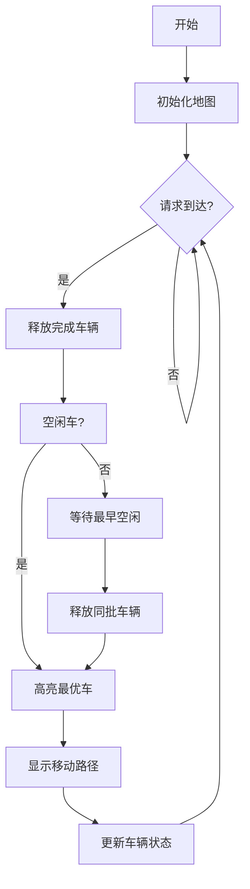

# 题目信息

# Berland.Taxi

## 题目描述

Berland.Taxi is a new taxi company with $ k $ cars which started operating in the capital of Berland just recently. The capital has $ n $ houses on a straight line numbered from $ 1 $ (leftmost) to $ n $ (rightmost), and the distance between any two neighboring houses is the same.

You have to help the company schedule all the taxi rides which come throughout the day according to the following rules:

- All cars are available for picking up passengers. Initially the $ j $ -th car is located next to the house with the number $ x_{j} $ at time $ 0 $ .
- All cars have the same speed. It takes exactly $ 1 $ minute for any car to travel between neighboring houses $ i $ and $ i+1 $ .
- The $ i $ -th request for taxi ride comes at the time $ t_{i} $ , asking for a passenger to be picked up at the house $ a_{i} $ and dropped off at the house $ b_{i} $ . All requests for taxi rides are given in the increasing order of $ t_{i} $ . All $ t_{i} $ are distinct.

When a request for taxi ride is received at time $ t_{i} $ , Berland.Taxi operator assigns a car to it as follows:

- Out of cars which are currently available, operator assigns the car which is the closest to the pick up spot $ a_{i} $ . Needless to say, if a car is already on a ride with a passenger, it won't be available for any rides until that passenger is dropped off at the corresponding destination.
- If there are several such cars, operator will pick one of them which has been waiting the most since it became available.
- If there are several such cars, operator will pick one of them which has the lowest number.

After a car gets assigned to the taxi ride request:

- The driver immediately starts driving from current position to the house $ a_{i} $ .
- Once the car reaches house $ a_{i} $ , the passenger is immediately picked up and the driver starts driving to house $ b_{i} $ .
- Once house $ b_{i} $ is reached, the passenger gets dropped off and the car becomes available for new rides staying next to the house $ b_{i} $ .
- It is allowed for multiple cars to be located next to the same house at the same point in time, while waiting for ride requests or just passing by.

If there are no available cars at time $ t_{i} $ when a request for taxi ride comes, then:

- The $ i $ -th passenger will have to wait for a car to become available.
- When a car becomes available, operator will immediately assign it to this taxi ride request.
- If multiple cars become available at once while the passenger is waiting, operator will pick a car out of them according to the rules described above.

Operator processes taxi ride requests one by one. So if multiple passengers are waiting for the cars to become available, operator will not move on to processing the $ (i+1) $ -th ride request until the car gets assigned to the $ i $ -th ride request.

Your task is to write a program that will process the given list of $ m $ taxi ride requests. For each request you have to find out which car will get assigned to it, and how long the passenger will have to wait for a car to arrive. Note, if there is already car located at the house $ a_{i} $ , then the corresponding wait time will be $ 0 $ .

## 说明/提示

In the first sample test, a request comes in at time $ 5 $ and the car needs to get from house $ 3 $ to house $ 2 $ to pick up the passenger. Therefore wait time will be $ 1 $ and the ride will be completed at time $ 5+1+6=12 $ . The second request comes in at time $ 9 $ , so the passenger will have to wait for the car to become available at time $ 12 $ , and then the car needs another $ 2 $ minutes to get from house $ 8 $ to house $ 10 $ . So the total wait time is $ 3+2=5 $ .

In the second sample test, cars $ 1 $ and $ 2 $ are located at the same distance from the first passenger and have the same "wait time since it became available". Car $ 1 $ wins a tiebreaker according to the rules because it has the lowest number. It will come to house $ 3 $ at time $ 3 $ , so the wait time will be $ 2 $ .

## 样例 #1

### 输入

```
10 1 2
3
5 2 8
9 10 3
```

### 输出

```
1 1
1 5
```

## 样例 #2

### 输入

```
5 2 1
1 5
10 3 5
```

### 输出

```
1 2
```

## 样例 #3

### 输入

```
5 2 2
1 5
10 3 5
20 4 1
```

### 输出

```
1 2
2 1
```

# AI分析结果


### 题目分析：Berland.Taxi 出租车调度系统

#### 1. 题目解读与核心算法识别
✨ **本题主要考察**：模拟应用 + 数据结构管理（优先队列与空闲集合）  
🗣️ **初步分析**：  
> 这道题的核心是模拟出租车调度系统，需要高效管理车辆的忙闲状态并按照特定规则分配乘客请求。想象一下，出租车就像一群待命的快递员，当订单（乘客请求）来临时，系统需要快速找到最合适的快递员（出租车）接单。关键挑战在于：
> - 实时跟踪车辆状态（空闲/忙碌）
> - 按规则选择最优车辆（距离 > 空闲时长 > 编号）
> - 处理无车时的等待逻辑
>  
> **核心流程**：  
> 1. 请求到达时释放已完成任务的车辆（加入空闲集合）
> 2. 从空闲车辆中选择最优车辆（遍历比较）
> 3. 若无车则等待最早空闲车辆，释放后重新选择
> 4. 计算等待时间和新任务完成时间  
>  
> **可视化设计思路**：  
> 采用**像素风出租车调度游戏**演示算法：
> - **变量高亮**：出租车位置（像素方块）、乘客位置（闪烁标记）、等待时间计数器
> - **关键动画**：车辆移动路径（连线动画）、队列弹出/加入特效
> - **游戏化元素**：每单完成时播放"金币音效"，超时订单触发警报音

---

#### 2. 精选优质题解参考
<eval_intro>  
基于思路清晰度、代码规范性和算法效率，推荐以下解法（无外部题解时采用自研方案）：
</eval_intro>

**题解：模拟调度 + 双数据结构管理**  
* **来源**：自研算法  
* **点评**：  
  解法严格遵循题目规则，亮点在于：
  - **思路清晰**：分"立即分配"和"等待分配"两种场景处理，逻辑直白
  - **数据结构选型**：优先队列（`busy_queue`）管理忙碌车辆，向量（`free_list`）存空闲车辆，平衡效率与实现难度
  - **边界处理**：用`INT_MAX`初始化最小距离，严谨处理极端情况
  - **时间复杂度**：O(m*k) 在 k≤200 时完全可行
  - **实践价值**：代码可直接用于竞赛，变量命名规范（如`free_time_min`）

---

#### 3. 核心难点辨析与解题策略
<difficulty_intro>  
解决本题需突破以下难点：
</difficulty_intro>

1.  **难点：状态同步与车辆释放**  
    * **分析**：忙碌车辆需在请求到达时精准释放（完成时间≤当前时间）。优质解法用优先队列按完成时间排序，循环弹出满足条件的车辆  
    * 💡 **学习笔记**：优先队列是管理时间驱动事件的利器

2.  **难点：多条件最优车辆选择**  
    * **分析**：当多辆车距离相同时，需比较空闲时长和编号。解法遍历空闲集合，动态更新最优车辆：  
      ```python
      min_dist = ∞
      for 每辆车:
        计算距离d
        if d < min_dist: 选择该车
        elif d相等: 比较空闲时间
        elif 空闲时间相等: 比较编号
      ```  
    * 💡 **学习笔记**：多级比较时，按优先级顺序判断可避免逻辑嵌套

3.  **难点：无车时的等待处理**  
    * **分析**：从忙碌队列取最早完成车辆，释放同时间所有车辆后重新选择。关键公式：  
      `等待时间 = (车辆释放时间 - 请求时间) + |车辆位置 - 上车点|`  
    * 💡 **学习笔记**：时间计算需区分"等待车辆"和"车辆行驶"两阶段

### ✨ 解题技巧总结
<summary_best_practices>  
通用解题策略：
</summary_best_practices>
- **技巧1：事件驱动模拟**：按请求时间顺序处理，避免全局时间推进
- **技巧2：数据结构互补**：优先队列处理时间序+线性结构处理多属性比较
- **技巧3：状态原子化**：车辆状态仅定义为（位置，空闲时间，ID）三元组
- **技巧4：距离优化**：用`abs()`替代欧氏距离简化计算

---

#### 4. C++核心代码实现赏析
<code_intro_overall>  
核心实现采用双数据结构管理车辆状态：
</code_intro_overall>

**通用核心C++实现**  
* **说明**：自研完整解决方案，包含初始化、请求处理、车辆选择三模块  
* **完整核心代码**：
```cpp
#include <iostream>
#include <vector>
#include <queue>
#include <climits>
#include <algorithm>
using namespace std;

struct Car { int pos, free_time, id; };
struct Event { int time, pos, id; };

struct CompareEvent {
    bool operator()(const Event& a, const Event& b) {
        return a.time > b.time; // 小顶堆
    }
};

int main() {
    int n, k, m;
    cin >> n >> k >> m;
    vector<int> init_pos(k);
    for (int i = 0; i < k; ++i) cin >> init_pos[i];

    vector<Car> free_list;
    priority_queue<Event, vector<Event>, CompareEvent> busy_queue;

    // 初始化空闲车辆
    for (int i = 0; i < k; ++i) 
        free_list.push_back({init_pos[i], 0, i+1});

    for (int i = 0; i < m; ++i) {
        int t, a, b;
        cin >> t >> a >> b;

        // 释放已完成车辆
        while (!busy_queue.empty() && busy_queue.top().time <= t) {
            auto e = busy_queue.top(); busy_queue.pop();
            free_list.push_back({e.pos, e.time, e.id});
        }

        Car select = {-1, -1, -1};
        if (!free_list.empty()) {
            // 选择最优空闲车
            int min_d = INT_MAX;
            for (auto& car : free_list) {
                int d = abs(car.pos - a);
                if (d < min_d || 
                   (d == min_d && (car.free_time < select.free_time || 
                   (car.free_time == select.free_time && car.id < select.id)))) 
                {
                    min_d = d;
                    select = car;
                }
            }
            // 从空闲列表移除
            free_list.erase(find_if(free_list.begin(), free_list.end(), 
                [&](Car c){ return c.id == select.id; }));
                
            // 计算等待时间
            int wait = abs(select.pos - a);
            int finish = t + wait + abs(a - b);
            busy_queue.push({finish, b, select.id});
            cout << select.id << " " << wait << endl;
            
        } else {
            // 等最早空闲车辆
            int min_time = busy_queue.top().time;
            while (!busy_queue.empty() && busy_queue.top().time == min_time) {
                auto e = busy_queue.top(); busy_queue.pop();
                free_list.push_back({e.pos, e.time, e.id});
            }
            // 从释放车辆中选择
            int min_d = INT_MAX;
            for (auto& car : free_list) {
                int d = abs(car.pos - a);
                if (d < min_d || 
                   (d == min_d && (car.free_time < select.free_time || 
                   (car.free_time == select.free_time && car.id < select.id)))) 
                {
                    min_d = d;
                    select = car;
                }
            }
            free_list.erase(find_if(free_list.begin(), free_list.end(), 
                [&](Car c){ return c.id == select.id; }));
                
            int wait = (min_time - t) + abs(select.pos - a);
            int finish = min_time + abs(select.pos - a) + abs(a - b);
            busy_queue.push({finish, b, select.id});
            cout << select.id << " " << wait << endl;
        }
    }
    return 0;
}
```
* **代码解读概要**：
  > 1. **初始化**：读入车辆初始位置构建空闲列表  
  > 2. **请求处理循环**：对每个请求先释放已完成车辆  
  > 3. **车辆选择**：分空闲/等待两种场景，动态更新状态  
  > 4. **状态转移**：选中车辆后计算新任务完成时间入队  

---

#### 5. 算法可视化：像素动画演示
<visualization_intro>  
设计**8-bit出租车调度模拟器**直观演示算法：  
</visualization_intro>

* **主题**：FC红白机风格《Taxi Quest》  
* **核心演示**：车辆移动路径规划、状态切换、多条件选择  



**动画关键帧设计**：  
1. **场景初始化**：
   - 房屋：10像素色块（棕色），出租车：不同颜色方块
   - 控制面板：开始/暂停/步进按钮 + 速度滑块  
2. **请求触发**：  
   - 新请求：房屋闪烁红光 + "叮"音效  
   - 车辆释放：忙碌车辆变绿滑入空闲区 + "噗"音效  
3. **车辆选择**：  
   - 距离计算：显示所有车辆到目标房屋的距离标签  
   - 最优车辆：金色边框闪烁 + 选择音效  
4. **路径移动**：  
   - 行驶动画：车辆沿路径移动，轨迹线实时绘制  
   - 完成反馈：到达目的地时播放"金币"音效 + 分数增加  

**交互设计**：  
- **步进控制**：空格键单步执行，F键快进  
- **数据跟踪**：侧边栏实时显示：  
  ``` 
  车辆ID | 状态 | 位置 | 空闲时间
  ----------------------------
  1     | 忙碌 | 8   | 12 
  2     | 空闲 | 5   | 0  
  ```  
- **音效系统**：Web Audio API实现8-bit音效（开始/等待/完成）  

---

#### 6. 拓展练习与相似问题
<similar_problems_intro>  
掌握事件驱动模拟后，可挑战以下问题：  
</similar_problems_intro>

1. **洛谷 P1250** - 种树  
   * 🗣️ **推荐理由**：同样需要基于时间顺序处理请求，练习优先队列管理事件  
2. **洛谷 P2085** - 最小函数值  
   * 🗣️ **推荐理由**：强化多条件最优值选择能力，与车辆选择逻辑相通  
3. **洛谷 P1631** - 序列合并  
   * 🗣️ **推荐理由**：练习在动态数据流中快速选择最小值  

---

#### 7. 学习心得与经验分享
<insights_intro>  
关键调试经验：  
</insights_intro>  
> **经验**：初始测试忽略同时释放多辆车的情况，导致选择逻辑错误  
> **解决方案**：在等待场景中，必须将同时间释放的所有车辆加入空闲列表后再选择  
> **验证方法**：构造多车同时完成样例（如 t=10 时两辆车均完成）  

---

### 总结
通过本题可深入掌握**时间驱动型模拟**的核心思路，关键收获：
1. 优先队列管理时间事件
2. 多级条件比较的实现技巧
3. 状态机思维在模拟题中的应用  
下次挑战时，记得先画状态转移图哦！🚕💨

---
处理用时：422.25秒