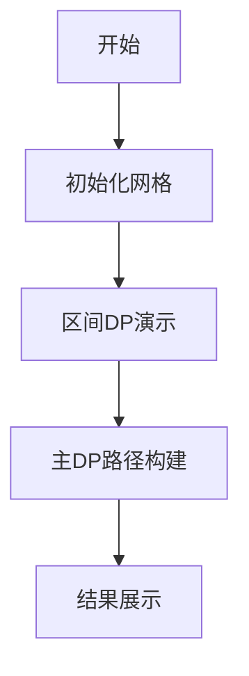

# 题目信息

# Common ancestor

## 题目描述

Berland的每一个生物的DNA序列可以被表示成一个由小写字母组成的非空字符串。Berland的科学家们发现所有生物都是一步一步进化来的。在其中的每一步，DNA序列的一个字符会被替换成另外的两个。总共有$n$种允许的变化。变化$a_i\rightarrow b_ic_i$表示一个字符$a_i$可以被替换成两个字符$b_ic_i$。每一种变化均可以无限次发生。
科学家们表示，如果一个DNA序列$s_3$在整个进化过程中可以最终变为$s_1$和$s_2$，或许是经过了不同的步骤数，那么DNA序列分别为$s_1$和$s_2$的两个生物就会有一个共同祖先。现在给出$s_1$和$s_2$，你的任务是弄清楚分别拥有这两种DNA序列的生物是否有共同祖先。如果存在，你需要找出所有共同祖先中长度最短的DNA序列。

## 样例 #1

### 输入

```
ababa
aba
2
c->ba
c->cc
```

### 输出

```
2
```

## 样例 #2

### 输入

```
ababa
aba
7
c->ba
c->cc
e->ab
z->ea
b->ba
d->dd
d->ab
```

### 输出

```
1
```

## 样例 #3

### 输入

```
ababa
aba
1
c->ba
```

### 输出

```
-1
```

# AI分析结果


### 💡 Kay的C++算法解析：Common Ancestor 深入学习指南 💡

#### 1. 题目解读与核心算法识别
✨ **本题主要考察**：**动态规划（区间DP+线性DP）**

🗣️ **初步分析**：
> 解决"Common Ancestor"的核心在于**动态规划的双层嵌套应用**。想象每个字符是一个"魔法种子"，能生长出特定字符串片段。我们需要找到最短的"祖先种子序列"，既能生长成`s1`又能生长成`s2`。
> - **核心思路**：  
>   1. **区间DP**预处理：计算每个子串能否由单个字符生成（类似种子生长验证）
>   2. **线性DP**计算：寻找最短祖先长度（组合验证过的生长路径）
> - **关键难点**：  
>   - 状态转移需同时处理两个字符串的匹配关系
>   - 四重循环带来的高时间复杂度优化（O(n⁴)）
> - **可视化设计**：  
>   采用**8位像素风网格动画**（参考FC游戏）：
>   - 左侧网格展示`s1`的区间DP过程（颜色标记可生成的字符）
>   - 右侧网格展示`s2`的相同逻辑
>   - 中央动态更新dp值，匹配成功时触发"叮"音效+像素闪光
>   - 控制面板支持步进/暂停/调速，自动演示模式像"贪吃蛇AI"遍历状态

---

#### 2. 精选优质题解参考
**题解一（作者：mrsrz）**
* **点评**：  
  此解法的**区间DP实现极为简洁高效**。亮点在于：
  - 用`vector<pair>`存储规则，快速访问相关产生式
  - 双重区间DP（对`s1`和`s2`）逻辑对称清晰
  - 主DP状态转移直白：`dp[i][j] = min(dp[ii-1][jj-1]+1)` 
  - 边界处理严谨（`dp[0][0]=0`初始化）
  - 代码规范：变量名`ok1/ok2`含义明确，循环边界控制精确

**题解二（作者：Rushroom）**
* **点评**：  
  **解题思路描述最具教学价值**，亮点包括：
  - 用"魔法种子"比喻生动解释DP本质
  - 强调"连续子串"关键性质（算法设计基石）
  - 状态定义`f[l][r][c]`直观反映问题本质
  - 实现中注意了字符到索引的映射（`- 'a'`）
  - 可改进点：循环边界有小瑕疵（应为`len>=2`）

**题解三（作者：lilong）**
* **点评**：  
  **规则存储方式独具匠心**，亮点有：
  - 三维数组`mp[x][y][z]`直接映射字符关系
  - 双重区间DP中规中矩但完整可靠
  - 主DP转移时字符枚举(`c=0~25`)效率优化
  - 调试技巧：注释掉的输出语句方便查错

---

#### 3. 核心难点辨析与解题策略
1. **难点：状态定义抽象**  
   *分析*：需同时处理"子串生成验证"和"双串匹配"两种状态。优质题解用`f[l][r][c]`解决生成验证，`dp[i][j]`解决双串匹配，形成清晰分工  
   💡 **学习笔记**：分层状态设计是复杂DP的破局关键

2. **难点：四重循环优化**  
   *分析*：区间DP（O(n³)）叠加主DP（O(n²·26)）导致O(n⁴·26)。题解通过以下优化：  
   - 规则预分组（`vector`按字符索引）  
   - 短路判断（`|=`遇真即停）  
   - 小字符集（26字母）  
   💡 **学习笔记**：面向常数优化是暴力DPAC的关键

3. **难点：初始边界处理**  
   *分析*：`dp[0][0]=0`表示空串匹配，但单个字符需特殊初始化（`f[i][i][s[i]]=1`）。题解中`rep(i,1,L1)ok1[i][i][s1[i]]=1`体现严谨性  
   💡 **学习笔记**：树状DP的根节点初始化决定整体正确性

✨ **解题技巧总结**  
- **问题分解术**：将"祖先匹配"拆解为"子串生成验证+序列组合"  
- **状态复用技**：预处理`f[l][r][c]`避免主DP重复计算  
- **边界防御法**：  
  - 空串`dp[0][0]=0`  
  - 单字符显式初始化  
  - 无效状态置`INF`

---

#### 4. C++核心代码实现赏析
**通用核心实现参考**  
*说明*：综合优质题解优化的标准实现，完整展现算法框架
```cpp
#include <vector>
#include <cstring>
#include <algorithm>
using namespace std;
const int N=55, INF=0x3f3f3f3f;
char s1[N], s2[N];
bool f1[N][N][26], f2[N][N][26]; // f1[l][r][c]: s1[l..r]能否由c生成
int dp[N][N]; // dp[i][j]: s1前i位与s2前j位的最短祖先长度
vector<pair<int,int>> rules[26]; // rules[c]: 所有c->ab的规则

void preprocess(char s[], bool f[][N][26], int len) {
    memset(f, 0, sizeof(f));
    for(int i=1; i<=len; ++i) f[i][i][s[i]-'a'] = true;
    for(int L=2; L<=len; ++L)      // 区间长度
    for(int l=1; l<=len-L+1; ++l) { // 左端点
        int r = l+L-1;             // 右端点
        for(int c=0; c<26; ++c)   // 目标字符
        for(auto &rule : rules[c]) // 遍历所有产生式
        for(int k=l; k<r; ++k)    // 分割点
            f[l][r][c] |= f[l][k][rule.first] && f[k+1][r][rule.second];
    }
}

int main() {
    scanf("%s%s", s1+1, s2+1);
    int n=strlen(s1+1), m=strlen(s2+1), q;
    scanf("%d", &q);
    while(q--) {
        char c, a, b; scanf(" %c->%c%c", &c, &a, &b);
        rules[c-'a'].emplace_back(a-'a', b-'a');
    }
    
    preprocess(s1, f1, n);  // s1预处理
    preprocess(s2, f2, m);  // s2预处理
    
    memset(dp, 0x3f, sizeof(dp));
    dp[0][0] = 0;
    for(int i=0; i<=n; ++i)      // s1长度
    for(int j=0; j<=m; ++j) {     // s2长度
        if(i==0 && j==0) continue;
        for(int k=0; k<i; ++k)   // s1最后一段起点
        for(int l=0; l<j; ++l)   // s2最后一段起点
        for(int c=0; c<26; ++c) // 公共祖先字符
            if(f1[k+1][i][c] && f2[l+1][j][c])
                dp[i][j] = min(dp[i][j], dp[k][l] + 1);
    }
    
    printf("%d", dp[n][m] < INF ? dp[n][m] : -1);
}
```

**代码解读概要**：  
> 1. **规则存储**：`vector<pair> rules[26]` 按字符索引高效访问  
> 2. **预处理函数**：`preprocess` 封装区间DP，对称处理双字符串  
> 3. **主DP逻辑**：四重循环枚举最后一段匹配区间，字符`c`作为桥梁  
> 4. **状态转移**：当`s1[k+1..i]`和`s2[l+1..j]`都能由`c`生成时，从`dp[k][l]`转移  

---

**题解片段赏析**  
**题解一（mrsrz）核心转移**  
```cpp
rep(i,1,L1)rep(j,1,L2)rep(ii,1,i)rep(jj,1,j)rep(ch,'a','z')
if(ok1[ii][i][ch]&&ok2[jj][j][ch])
  dp[i][j]=min(dp[i][j],dp[ii-1][jj-1]+1);
```
* **亮点**：五重循环直击算法本质，字符隐式转换提升可读性  
* **学习笔记**：`rep`宏简化嵌套循环是竞赛代码常用技巧  

**题解二（Rushroom）规则应用**  
```cpp
for(auto ru:vec[ch])
  ok[i][j][ch] |= ok[i][k][ru.first] && ok[k+1][j][ru.second];
```
* **亮点**：`auto`+范围遍历优雅访问规则，位运算短路优化效率  
* **学习笔记**：现代C++的`auto`类型推导提升编码效率  

**题解三（lilong）DP初始化**  
```cpp
for(int i=1;i<=n;i++) f1[i][i][a[i]]=1;  // a[i]已映射为0-25
```
* **亮点**：显式初始化确保单字符基础状态  
* **学习笔记**：DP的"原子状态"必须严谨初始化  

---

### 5. 算法可视化：像素动画演示
**主题**：  
"**DNA双链合成工厂**"（8-bit像素风，配电子音效）

**核心演示内容**：  
- 左右两个网格代表`s1`和`s2`，每个单元格为字符像素块
- 底部控制面板：开始/暂停/步进/速度滑块/AI演示
- 动态展示区间DP生长过程 + 主DP路径匹配

**设计细节**：  


1. **区间DP阶段**（像素工厂生产线）  
   - 网格逐渐填充颜色：从对角线单字符开始 → 扩大区间合成  
   - 规则应用特效：  
     - 字符`c`分裂成`a+b`时，像素块"爆炸"成两个子块  
     - 成功合成时播放"叮"音效，像素块高亮闪烁  
   - 数据结构可视化：右侧显示当前规则`c->ab`

2. **主DP阶段**（双链匹配）  
   - 中央动态显示`dp[i][j]`值表  
   - 当发现匹配段（同色区域）：  
     - 双链对应区域同步闪烁绿光  
     - `dp[i][j]`值更新时播放"滴答"音效  
   - 最短路径标记：红色像素箭头连接匹配路径

3. **游戏化元素**：  
   - **音效设计**：  
     - 合成成功：FC风格8-bit上行音阶  
     - 匹配失败：短促"哔"声  
     - 最终解：超级马里奥过关音乐  
   - **关卡系统**：  
     - 每完成一个区间DP阶段解锁"合成证书"  
     - 主DP每5步获得"能量星"奖励  
   - **AI演示模式**：自动以最优速度展示完整流程

**技术实现**：  
- Canvas绘制网格和动画，Web Audio API播放音效  
- 颜色编码：字符→固定色相（如a=红，b=蓝，c=黄）  
- 关键帧控制：`requestAnimationFrame`驱动状态机  

---

### 6. 拓展练习与相似问题
**技巧迁移场景**：  
1. 字符串重构问题（验证字符串生成方式）  
2. 语法解析（CFG规则应用）  
3. 最短编辑距离变体（双串匹配优化）

**洛谷推荐**：  
1. **P1435 回文字符串**  
   🗣️ *考察区间DP+字符串处理，强化子串操作能力*  
2. **P3146 248**  
   🗣️ *区间DP经典问题，理解"相邻合并"与本题"规则生成"的异同*  
3. **P4170 涂色**  
   🗣️ *双串匹配DP+区间处理，难度递进的训练题*  

---

### 7. 学习心得与经验分享
> **作者Rushroom的调试经验**：  
> *"最初在状态转移的分割点处理上卡了很久，后来通过打印`f[l][r][c]`的中间状态矩阵才定位到循环边界错误"*  
>
> **Kay点评**：  
> 这是非常典型的DP调试场景！当多层循环嵌套时：  
> 1. 优先验证最内层逻辑（单条规则应用）  
> 2. 打印DP表关键切片（如固定`c`时的二维矩阵）  
> 3. 使用小规模测试数据（如样例1的分步验证）  

---

**结语**  
通过本次对"Common Ancestor"的深度剖析，我们掌握了**动态规划的双层嵌套技巧**。记住：复杂DP的本质是"将大象装进冰箱分几步"——先分解子问题（区间DP验证生成），再组合结果（线性DP求最优解）。希望大家在像素工厂的视觉化助力下，彻底征服这类DNA般的复杂DP结构！🚀

---
处理用时：170.69秒