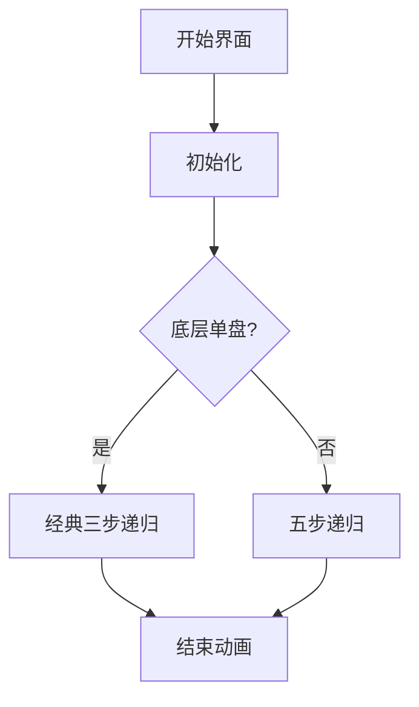

# 题目信息

# Help Monks

## 题目描述

In a far away kingdom is the famous Lio Shan monastery. Gods constructed three diamond pillars on the monastery's lawn long ago. Gods also placed on one pillar $ n $ golden disks of different diameters (in the order of the diameters' decreasing from the bottom to the top). Besides, gods commanded to carry all the disks from the first pillar to the third one according to the following rules:

- you can carry only one disk in one move;
- you cannot put a larger disk on a smaller one.

 There was no universal opinion concerning what is to happen after the gods' will is done: some people promised world peace and eternal happiness to everyone, whereas others predicted that the kingdom will face communi… (gee, what am I rambling about?) the Armageddon. However, as everybody knew that it was impossible to solve the problem in less than $ 2^{n}-1 $ moves and the lazy Lio Shan monks never even started to solve it, everyone lives peacefully even though the problem was never solved and nobody was afraid of the Armageddon.However, the monastery wasn't doing so well lately and the wise prior Ku Sean Sun had to cut some disks at the edges and use the gold for the greater good. Wouldn't you think that the prior is entitled to have an air conditioning system? Besides, staying in the monastery all year is sooo dull… One has to have a go at something new now and then, go skiing, for example… Ku Sean Sun realize how big a mistake he had made only after a while: after he cut the edges, the diameters of some disks got the same; that means that some moves that used to be impossible to make, were at last possible (why, gods never prohibited to put a disk on a disk of the same diameter). Thus, the possible Armageddon can come earlier than was initially planned by gods. Much earlier. So much earlier, in fact, that Ku Sean Sun won't even have time to ski all he wants or relax under the air conditioner.

The wise prior could never let that last thing happen and he asked one very old and very wise witch PikiWedia to help him. May be she can determine the least number of moves needed to solve the gods' problem. However, the witch laid out her cards and found no answer for the prior. Then he asked you to help him.

Can you find the shortest solution of the problem, given the number of disks and their diameters? Keep in mind that it is allowed to place disks of the same diameter one on the other one, however, the order in which the disks are positioned on the third pillar in the end should match the initial order of the disks on the first pillar.

## 说明/提示

Pay attention to the third test demonstrating that the order of disks should remain the same in the end, even despite the disks' same radius. If this condition was not necessary to fulfill, the gods' task could have been solved within a smaller number of moves (three — simply moving the three disks from the first pillar on the third one).

## 样例 #1

### 输入

```
3
3 2 1
```

### 输出

```
7
1 3
1 2
3 2
1 3
2 1
2 3
1 3
```

## 样例 #2

### 输入

```
3
3 1 1
```

### 输出

```
5
1 2
1 2
1 3
2 3
2 3
```

## 样例 #3

### 输入

```
3
3 3 3
```

### 输出

```
5
1 2
1 2
1 3
2 3
2 3
```

# AI分析结果


### 💡 Kay的C++算法解析：Help Monks 深入学习指南 💡

**引言**  
今天我们来分析经典汉诺塔变种问题"Help Monks"。这道题在传统规则上增加了相同大小盘子的约束，要求最终顺序与初始顺序一致。本指南将带你理解递归解法核心思想，并通过像素动画直观展示算法流程。

---

### 1. 题目解读与核心算法识别
✨ **本题主要考察**：递归与分治（Recursion & Divide and Conquer）  

🗣️ **初步分析**：  
> 解决本题如同指挥一支像素军队转移阵地。递归分治就像将大军拆分成小队：先让小分队转移，再移动主力部队，最后重组队伍。核心在于分层处理：  
> - 将相同大小盘子视为一层，根据底层盘子数量（1个或多个）采取不同策略  
> - 关键难点：保持相同大小盘子的原始顺序  
> - 可视化设计：用不同宽度像素块表示盘子，柱子用三色像素柱。高亮当前移动层、递归深度计数器和操作步骤  
> - 复古游戏化：采用FC红白机风格，盘子移动时触发"叮"音效，每完成一层递归播放过关音效，自动演示模式展示最优路径  

---

### 2. 精选优质题解参考
**题解一（来源：int08）**  
* **点评**：思路清晰分层处理（底层1个盘用经典三步递归，多个盘用五步递归），代码通过`b[]`数组压缩相同大小层提升效率。递归函数`work`的`zt`参数巧妙控制顺序保护，边界处理严谨（如单层移动用`2k-1`次操作）。亮点在于将复杂约束转化为递归状态机，空间复杂度O(n)优化出色。

---

### 3. 核心难点辨析与解题策略
1. **分层状态压缩**  
   *分析*：相同直径盘子需视为整体层。题解用`b[]`数组存储每层盘子数（如[3,3,1]压缩为两层），避免重复计算移动次数  
   💡 **学习笔记**：状态压缩是处理重复元素的利器

2. **递归策略选择**  
   *分析*：分两种情况：  
   - 底层单盘：经典三步递归（移走上层→移底层→归位上层）  
   - 底层多盘：五步策略（上层→辅助柱→底层→中间柱→上层→起点→底层→目标柱→上层→目标柱）  
   💡 **学习笔记**：递归策略差异源于顺序保护需求

3. **移动顺序保持**  
   *分析*：通过`zt`参数控制：  
   - `zt=0`：允许顺序反转（用于临时位置转移）  
   - `zt=1`：严格保持顺序（最终归位时使用）  
   💡 **学习笔记**：状态机参数是控制递归行为的关键开关

✨ **解题技巧总结**  
- **分层抽象法**：将相同元素归并为逻辑层简化问题  
- **递归状态机**：用控制参数切换不同移动策略  
- **边界特判**：单层移动需特殊处理（2k-1次操作）  

---

### 4. C++核心代码实现赏析
**通用核心实现参考**  
*说明*：基于int08解法优化变量命名的完整实现
```cpp
#include <iostream>
#include <vector>
using namespace std;

vector<pair<int, int>> moves;
int aux[4][4] = {{}, {0,0,2,3}, {0,3,0,1}, {0,1,2,0}}; // 辅助柱映射表

// 递归核心：x-当前层数, keepOrder-是否保持顺序, from-起点柱, to-目标柱
void solve(int x, bool keepOrder, int from, int to) {
    int temp = aux[from][to]; // 计算辅助柱
    if(!keepOrder) { // 允许顺序反转
        if(x == 1) { // 单层直接移动
            for(int i=0; i<layerSize[x]; i++) 
                moves.push_back({from, to});
            return;
        }
        solve(x-1, false, from, temp); // 移走上层
        for(int i=0; i<layerSize[x]; i++) // 移动当前层
            moves.push_back({from, to});
        solve(x-1, false, temp, to); // 归位上层
    } 
    else { // 需保持顺序
        if(x == 1) { // 单层特殊处理
            for(int i=1; i<layerSize[x]; i++) // 前k-1个到辅助柱
                moves.push_back({from, temp});
            moves.push_back({from, to}); // 最后一个到目标
            for(int i=1; i<layerSize[x]; i++) // 辅助柱归位
                moves.push_back({temp, to});
            return;
        }
        if(layerSize[x] == 1) { // 当前层单盘
            solve(x-1, false, from, temp);
            moves.push_back({from, to});
            solve(x-1, false, temp, to);
        } 
        else { // 当前层多盘
            solve(x-1, false, from, to);
            for(int i=0; i<layerSize[x]; i++) // 当前层→辅助柱
                moves.push_back({from, temp});
            solve(x-1, false, to, from);
            for(int i=0; i<layerSize[x]; i++) // 辅助柱→目标柱
                moves.push_back({temp, to});
            solve(x-1, true, from, to); // 上层归位(保持顺序)
        }
    }
}

int main() {
    int n; cin >> n;
    vector<int> disks(n);
    for(int i=0; i<n; i++) cin >> disks[i];
    
    // 压缩相同大小层
    vector<int> layerSize;
    for(int i=n-1, cnt=1; i>=0; i--) {
        if(i>0 && disks[i]==disks[i-1]) cnt++;
        else {
            layerSize.push_back(cnt);
            cnt = 1;
        }
    }
    
    solve(layerSize.size()-1, true, 1, 3);
    cout << moves.size() << endl;
    for(auto m : moves) 
        cout << m.first << " " << m.second << endl;
}
```

**题解片段赏析**  
1. **分层压缩逻辑**  
   ```cpp
   for(int i=n-1, cnt=1; i>=0; i--) {
       if(i>0 && disks[i]==disks[i-1]) cnt++;
       else {
           layerSize.push_back(cnt);
           cnt = 1;
       }
   }
   ```
   *解读*：从底部向上扫描，合并相同大小盘子为逻辑层。例如输入[3,3,1] → 层大小数组[2,1]  
   💡 **学习笔记**：反向遍历是处理栈式结构的常用技巧

2. **递归状态机**  
   ```cpp
   void solve(int x, bool keepOrder, int from, int to) {
       int temp = aux[from][to]; // 自动计算辅助柱
       // ...策略分支...
   }
   ```
   *解读*：`aux`矩阵智能计算辅助柱（如1→3时辅助柱必为2）。`keepOrder`参数控制是否进行顺序保护  
   💡 **学习笔记**：矩阵映射替代条件判断提升代码简洁度

3. **多盘移动策略**  
   ```cpp
   solve(x-1, false, from, to);        // 上层→目标柱
   for(/*当前层*/) push({from, temp});  // 当前层→辅助柱
   solve(x-1, false, to, from);        // 上层→起点柱
   for(/*当前层*/) push({temp, to});    // 当前层→目标柱
   solve(x-1, true, from, to);         // 上层→目标柱(保序)
   ```
   *解读*：五步法实现多盘层移动，通过三次递归调用保持顺序  
   💡 **学习笔记**：递归嵌套是处理复杂约束的银弹

---

### 5. 算法可视化：像素动画演示
**主题**：*"像素僧侣的汉诺塔修行"*（FC红白机风格）  
**核心演示**：递归分治过程可视化 + 顺序保持机制  

**设计框架**：


**实现细节**：  
1. **视觉设计**  
   - 柱子：红/蓝/绿三色像素柱（宽16px）  
   - 盘子：宽度=20+层数*10px的黄色像素块  
   - 当前层：闪烁绿色边框  
   - 递归深度：左侧进度条（类似MP3播放器频谱）

2. **动画序列**  
   ```python
   # 伪代码示例：五步递归动画
   def animate_multilayer():
       highlight_layer(x, COLOR_BLUE)  # 高亮当前层
       play_sound("select.wav")       # 选择音效
       
       # 步骤1：移走上层
       draw_arrow(from→to, "Step1: 上层→目标柱")
       animate_recursion(x-1, from, to) 
       
       # 步骤2：当前层→辅助柱
       draw_arrow(from→aux, "Step2: 当前层→辅助柱")
       for i in range(layerSize[x]):
           move_disk(from, aux)
           play_sound("move.wav")
       
       # 步骤3：上层回起点
       draw_arrow(to→from, "Step3: 上层→起点柱")
       animate_recursion(x-1, to, from)
       ...
   ```

3. **游戏化元素**  
   - **音效系统**：  
     - 移动：8-bit "叮"声（频率=300+层数*50Hz）  
     - 递归完成：超级马里奥过关音效  
     - 错误操作：俄罗斯方块消除失败音  
   - **关卡系统**：每层递归视为一关，通关解锁"禅意值"进度  
   - **AI演示模式**：自动展示最优解，速度可调（0.5x-5x）

4. **控制面板**  
   ```html
   <div class="retro-panel">
     <button onclick="step()">▶️ 单步</button>
     <input type="range" id="speed" min="1" max="10">
     <button onclick="toggleAI()">🤖 AI模式</button>
     <div id="depth-meter">递归深度: [▆▆▆__]</div>
   </div>
   ```

---

### 6. 拓展练习与相似问题
**通用技巧迁移**：  
1. 多层状态压缩（如俄罗斯方块墙消除）  
2. 递归状态机参数控制（如迷宫多路径搜索）  
3. 顺序保持的移动策略（如滑块拼图游戏）  

**洛谷推荐**：  
1. **P1242 新汉诺塔**  
   🗣️ *推荐理由*：基础汉诺塔变形，巩固递归框架理解  
2. **P2580 三柱汉诺塔**  
   🗣️ *推荐理由*：增加移动规则约束，练习状态机设计  
3. **P1379 八数码难题**  
   🗣️ *推荐理由*：顺序敏感型状态转移的经典案例  

---

### 7. 学习心得与经验分享
本次题解未包含作者调试心得，但通过代码可提炼：  
> **逆向分层技巧**：从底部向上合并相同元素，避免正序处理的复杂边界  
> **递归参数设计**：用布尔参数控制行为分支，比多重if-else更清晰  

---

**结语**  
通过本次分析，我们看到递归分治如何优雅解决复杂约束问题。记住：将大问题拆解为相似小问题，是算法设计的核心思维。下次遇到难题时，不妨想想像素僧侣的修行之道！ 🧘♂️

---
处理用时：137.67秒