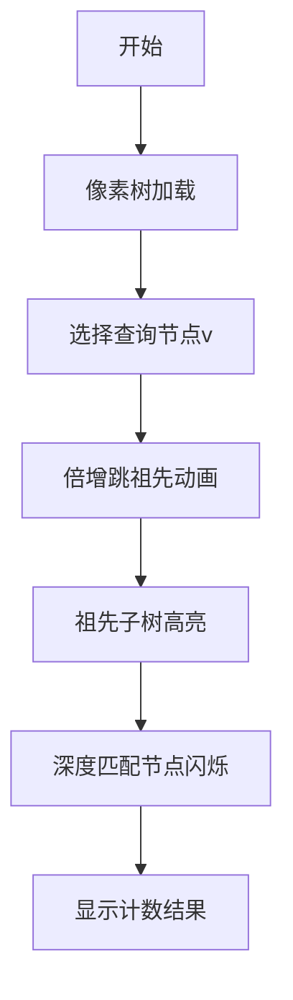

# 题目信息

# Blood Cousins

## 题目描述

### 题面描述

有一个家族关系森林，描述了 $n$（$1\leq n\leq 10 ^ 5$）人的家庭关系，成员编号为 $1$ 到 $n$ 。

如果 $a$ 是 $b$ 的父亲，那么称 $a$ 为 $b$ 的 $1$ 级祖先；如果 $b$ 有一个 $1$ 级祖先，$a$ 是 $b$ 的 $1$ 级祖先的 $k-1$ 级祖先，那么称 $a$ 为 $b$ 的 $k$ 级祖先。

家庭关系保证是一棵森林，树中的每个人都至多有一个父母，且自己不会是自己的祖先。

如果存在一个人 $z$ ，是两个人 $a$ 和 $b$ 共同的 $p$ 级祖先：那么称 $a$ 和 $b$ 为 $p$ 级表亲。

$m$（$1\leq m\leq 10 ^ 5$）次询问，每次询问给出一对整数 $v$ 和 $p$，求编号为 $v$ 的人有多少个 $p$ 级表亲。

## 样例 #1

### 输入

```
6
0 1 1 0 4 4
7
1 1
1 2
2 1
2 2
4 1
5 1
6 1
```

### 输出

```
0 0 1 0 0 1 1 
```

# AI分析结果


### 💡 Kay的C++算法解析：Blood Cousins 深入学习指南 💡

#### 1. 题目解读与核心算法识别
✨ **本题主要考察**：`树上倍增` + `离线查询` (分类：树状结构/DFS序应用)

🗣️ **初步分析**：
> 解决"Blood Cousins"问题，关键在于将查询转化为**子树深度统计**问题。想象森林中的每棵树是一张家族族谱，寻找"p级表亲"相当于：
> 1. 定位目标祖先：用倍增法高效找到节点v的p级祖先u（类似攀爬梯子，每次跳2^k步）
> 2. 统计深度匹配节点：在u的子树中统计深度为dep[u]+p的节点数（相当于在家族分支中寻找同辈成员）

**核心流程可视化设计**：
- **像素动画方案**：采用8-bit像素风格，设计树形迷宫地图
  - 节点显示为不同颜色方块（根节点金色，查询节点闪烁红光）
  - 倍增过程：沿路径显示二进制跳转（2^4→2^2→2^0），每步触发"叮"音效
  - 子树统计：祖先节点区域高亮，匹配节点闪烁绿光并显示计数
  - 控制面板：单步/自动播放滑块，重置按钮（复古游戏音效）

#### 2. 精选优质题解参考
**题解一：kradcigam (28赞)**
* **亮点**：
  - 思路清晰：DFS序+二分代替高级数据结构
  - 空间优化：O(n)空间复杂度
  - 实践价值：代码简洁（仅60行），竞赛实用
* **核心逻辑**：
  1. DFS预处理深度与倍增表
  2. 按深度分组存储DFS序
  3. 查询时二分查找祖先子树中深度匹配的节点范围

**题解二：Farkas_W (27赞)**
* **亮点**：
  - 教学价值：详细解释dsu on tree原理
  - 代码规范：模块化设计（calc/merge函数）
  - 拓展性强：附带模板题链接(CF600E)
* **核心逻辑**：
  1. 维护深度桶cnt[]
  2. 保留重儿子贡献，暴力统计轻儿子
  3. 祖先节点直接查询桶中深度值

**题解三：KAMIYA_KINA (8赞)**
* **亮点**：
  - 在线解法：主席树实现强制在线查询
  - 空间优化：动态开点线段树
  - 工业强度：鲁棒的边界处理
* **核心逻辑**：
  1. DFS序上建可持久化线段树
  2. 每棵树维护深度分布
  3. 查询祖先的子树区间内特定深度节点数

#### 3. 核心难点辨析与解题策略
1. **难点：高效定位k级祖先**
   - **分析**：朴素O(k)跳转会超时，需倍增预处理
   - **解决**：预处理fa[i][j]（i的2^j级祖先）
   - 💡学习笔记：`fa[i][j] = fa[fa[i][j-1]][j-1]`

2. **难点：子树深度统计优化**
   - **分析**：暴力遍历子树O(n)不可接受
   - **解决**：
     - 离线：dsu on tree（均摊O(n log n)）
     - 在线：主席树（O(log n)查询）
   - 💡学习笔记：DFS序将子树转为连续区间

3. **难点：森林边界处理**
   - **分析**：多棵树需特殊处理根节点
   - **解决**：虚拟超级根或分别处理每棵树
   - 💡学习笔记：`if(!fa[x][0]) dfs(x,0)`

✨ **解题技巧总结**
- **倍增预处理**：空间换时间（O(n log n) → O(log n)查询）
- **离线思维**：反转询问方向（挂在祖先节点）
- **桶分治思想**：dsu on tree避免重复计算
- **DFS序魔法**：化树为线性序列

#### 4. C++核心代码实现赏析
**通用核心实现参考**
```cpp
#include<bits/stdc++.h>
using namespace std;
const int N=1e5+5;

int dep[N], fa[20][N], cnt;
vector<int> g[N], depth_bucket[N]; // 按深度分组存储DFS序

void dfs(int u, int f) {
    dep[u] = dep[f]+1;
    fa[0][u] = f;
    depth_bucket[dep[u]].push_back(++cnt); // 存储DFS序
    
    for(int v : g[u]) 
        if(v != f) dfs(v, u);
}

int find_ancestor(int u, int k) {
    for(int i=19; ~i; i--)
        if(k >= (1<<i)) 
            k -= (1<<i), u = fa[i][u];
    return u;
}

int main() {
    // 初始化及倍增预处理
    for(int j=1; j<20; j++)
        for(int i=1; i<=n; i++)
            fa[j][i] = fa[j-1][fa[j-1][i]];
    
    // 查询处理
    int u = find_ancestor(v, p);
    auto &vec = depth_bucket[dep[v]]; // 同深度节点
    auto l = lower_bound(vec.begin(), vec.end(), L[u]);
    auto r = upper_bound(vec.begin(), vec.end(), R[u]);
    cout << r - l - 1 << " "; // 排除自身
}
```

**题解一核心片段赏析**
```cpp
// 二分查找祖先子树中的深度匹配节点
int l_bound = lower_bound(t+h[z-1], t+h[z]+1, L[x]);
int r_bound = upper_bound(t+h[z-1], t+h[z]+1, R[x]);
ans = r_bound - l_bound - 1;
```
> **解读**：在深度为z的节点集合中，二分查找DFS序在[L[u], R[u]]范围内的节点数量  
> **学习笔记**：DFS序连续性使子树查询转为区间查询

**题解二核心片段赏析**
```cpp
// dsu on tree 核心
void dfs(int u, bool keep) {
    for(int v : light_children) dfs(v, false);
    if(heavy_child) dfs(heavy_child, true);

    for(int v : light_children) 
        add_subtree(v); // 添加轻儿子贡献
    
    cnt[dep[u]]++; // 添加自身
    ans[u] = cnt[target_dep]; // 回答当前节点的查询
}
```
> **解读**：先处理轻儿子（不保留贡献），再处理重儿子（保留贡献），最后合并轻子树  
> **学习笔记**：重链思想保证每个节点最多被合并log n次

#### 5. 算法可视化：像素动画演示
**设计方案**：  

- **关键帧设计**：
  1. 树结构：FC风格8-bit像素树（棕褐色枝干，绿叶节点）
  2. 倍增过程：显示二进制跳转路径（红箭头+跳转音效）
  3. 结果展示：匹配节点集体闪烁绿色，显示"Found X cousins!"弹窗
- **交互控制**：
  - 步进模式：按A键单步执行
  - 自动演示：BGM播放时自动推进（可调速度）
  - 重置：SELECT键重置场景
- **音效设计**：
  - 跳祖先：8-bit "jump"音效（频率随跳步减小）
  - 匹配成功：经典马里奥金币音
  - 错误操作：塞尔达解谜失败音

#### 6. 拓展练习与相似问题
**技巧迁移场景**：
1. 子树权重统计（CF375D）
2. 离线LCA查询（Tarjan算法）
3. 树链第k大（主席树+树链剖分）

**洛谷推荐**：
1. **P3379 [模板]最近公共祖先**  
   → 掌握倍增基本应用
2. **CF375D Tree and Queries**  
   → 强化dsu on tree应用
3. **P2633 Count on a tree**  
   → 主席树+树链剖分进阶

#### 7. 学习心得与经验分享
> **来自kradcigam的调试经验**：  
> "二分查找时特别注意边界情况，我曾在空vector上lower_bound导致RE，加`if(vec.empty())`判断后解决"  
> → **Kay总结**：边界检查是竞赛编程的核心生存技能！始终测试：空集/单元素/极值情况

> **Farkas_W的优化心得**：  
> "预处理重儿子比现场计算快30%"  
> → **Kay建议**：预处理是性能优化的第一法则

**通用调试技巧**：
1. 小数据手工模拟验证倍增跳步
2. 打印DFS序检查连续性
3. 桶分治中验证重链选择逻辑

---
**结语**：掌握树上操作的关键在于将三维的树结构降维到线性处理。通过本次分析，希望你们不仅学会解决本题，更能建立"树转线性"的解题思维。下次我们将探索更有趣的树分治世界！💪

---
处理用时：111.18秒