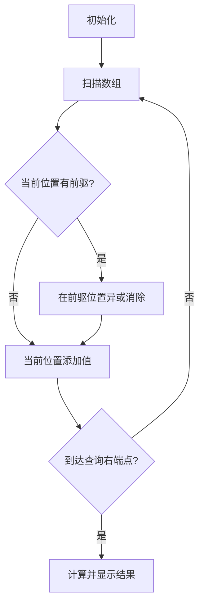

# 题目信息

# Mishka and Interesting sum

## 题目描述

Little Mishka enjoys programming. Since her birthday has just passed, her friends decided to present her with array of non-negative integers $ a_{1},a_{2},...,a_{n} $ of $ n $ elements!

Mishka loved the array and she instantly decided to determine its beauty value, but she is too little and can't process large arrays. Right because of that she invited you to visit her and asked you to process $ m $ queries.

Each query is processed in the following way:

1. Two integers $ l $ and $ r $ ( $ 1<=l<=r<=n $ ) are specified — bounds of query segment.
2. Integers, presented in array segment $ [l,r] $ (in sequence of integers $ a_{l},a_{l+1},...,a_{r} $ ) even number of times, are written down.
3. XOR-sum of written down integers is calculated, and this value is the answer for a query. Formally, if integers written down in point 2 are $ x_{1},x_{2},...,x_{k} $ , then Mishka wants to know the value , where  — operator of exclusive bitwise OR.

Since only the little bears know the definition of array beauty, all you are to do is to answer each of queries presented.

## 说明/提示

In the second sample:

There is no integers in the segment of the first query, presented even number of times in the segment — the answer is $ 0 $ .

In the second query there is only integer $ 3 $ is presented even number of times — the answer is $ 3 $ .

In the third query only integer $ 1 $ is written down — the answer is $ 1 $ .

In the fourth query all array elements are considered. Only $ 1 $ and $ 2 $ are presented there even number of times. The answer is .

In the fifth query $ 1 $ and $ 3 $ are written down. The answer is .

## 样例 #1

### 输入

```
3
3 7 8
1
1 3
```

### 输出

```
0
```

## 样例 #2

### 输入

```
7
1 2 1 3 3 2 3
5
4 7
4 5
1 3
1 7
1 5
```

### 输出

```
0
3
1
3
2
```

# AI分析结果


# 💡 Kay的C++算法解析：Mishka and Interesting sum 深入学习指南 💡

> "编程就像解谜，关键在于找到隐藏的规律。今天我们将一起探索异或的魔法世界！"

## 1. 题目解读与核心算法识别

✨ **本题主要考察**：`离线处理与树状数组应用` (树状数组/线段树/莫队)

🗣️ **初步分析**：
> 解决"Mishka and Interesting sum"这道题，关键在于巧妙运用**异或性质**与**离线处理技巧**。想象你在整理一盒彩色积木，每次查询要求计算特定区间内出现**偶数次**的积木颜色编码的"混合色值"（异或和）。  

> 异或操作（XOR）有个神奇特性：`x XOR x = 0`。这意味着：  
> - **出现奇数次的数**在异或和中会保留  
> - **出现偶数次的数**会相互抵消  
> 
> 通过数学推导可得关键公式：  
> **偶数次异或和 = 区间所有数异或和 XOR 区间不同数异或和**  
> 
> 解题思路分三步：  
> 1. 用前缀和计算区间异或和（简单）  
> 2. 用树状数组/线段树维护"不同数的异或和"（核心难点）  
> 3. 离线处理查询（按右端点排序）  
> 
> **可视化设计思路**：  
> 我们将设计一个8位像素风格的动画：  
> - 数组元素显示为彩色像素方块（FC游戏风格）  
> - 树状数组更新时，当前方块闪烁黄光，前一个相同值方块变灰  
> - 执行查询时，区间边框发光，结果显示在顶部LED屏  
> - 关键操作配"叮"音效，完成时播放胜利旋律

---

## 2. 精选优质题解参考

**题解一（顾z）**  
* **点评**：此解法采用树状数组离线处理，思路清晰严谨。亮点在于：  
  - 完整推导了核心公式 `ans = (区间异或和) XOR (不同数异或和)`  
  - 使用`pre[]`数组记录上次出现位置，确保每个数只贡献一次  
  - 代码规范：变量名`pre[i]`、`head[a[i]]`含义明确，边界处理完善  
  - 离散化实现简洁高效，时间复杂度稳定在$O((n+m)log n)$  

**题解二（RuntimeErr）**  
* **点评**：莫队算法实现，适合理解暴力优化的学习者。亮点：  
  - 利用`if(++cnt[x]>1) XORsum^=x`巧妙维护偶数次异或  
  - 采用奇偶排序优化缓存命中率，块长取$n/\sqrt{m}$提升效率  
  - 离散化处理节省空间，代码结构紧凑  
  - 注意：$10^6$数据需卡常，实践中可能被卡时限  

**题解三（灰鹤在此）**  
* **点评**：线段树实现，与树状数组异曲同工。亮点：  
  - 通过`last[]`数组实现"出现多次时只保留最后位置"  
  - 更新操作同时清除前驱值，保证不同数异或正确性  
  - 代码模块化清晰，`update()`和`query()`函数封装完整  

---

## 3. 核心难点辨析与解题策略

### 难点1：理解偶数次异或和的转换
**分析**：  
- 直接统计偶数次出现数困难（需计数）  
- 利用异或性质转换：  
  `偶数次异或和 = (所有数异或和) XOR (不同数异或和)`  
- **原理**：所有数异或和包含奇数次数的数，再异或一次不同数（相当于所有数各加一次）使奇数次变偶数次，偶数次变奇数次  

💡 **学习笔记**：异或的"自反性"是解题钥匙  

### 难点2：维护区间不同数异或和
**分析**：  
- 离线处理：将查询按右端点排序，保证处理顺序  
- 树状数组更新：  
  ```markdown
  for i in [1, r]:
      if pre[i]存在: 
          在pre[i]位置异或a[i]  // 清除前值
      在i位置异或a[i]           // 添加新值
  ```
- 每个数只在最后出现位置保留，避免重复计算  

💡 **学习笔记**："离线下扫"是处理无修改区间查询的利器  

### 难点3：大数据范围处理（离散化）
**分析**：  
- $a_i ≤ 10^9$ 无法直接建数组  
- 离散化三步：  
  1. 排序`sort(b, b+n)`  
  2. 去重`unique(b, b+n)-b`  
  3. 二分映射`lower_bound()`  
- 注意：异或时需用原值，离散化仅用于索引  

💡 **学习笔记**：离散化将"大海"变为"泳池"，问题规模瞬间缩小  

### ✨ 解题技巧总结
- **性质转化**：将复杂条件转化为已知操作（如异或性质）  
- **离线扫描**：对无修改查询，按右端点排序简化处理  
- **空间压缩**：离散化处理大值域，树状数组替代线段树节省空间  
- **边界艺术**：前缀和数组使用`sum[l-1]`避免边界错误  

---

## 4. C++核心代码实现赏析

**本题通用核心实现**（综合树状数组+离线处理）：
```cpp
#include <cstdio>
#include <algorithm>
using namespace std;
const int N = 1e6 + 10;

int n, m, a[N], b[N], pre[N], head[N], sum[N], ans[N], tr[N];

struct Query { int l, r, id; } q[N];
bool cmp(Query a, Query b) { return a.r < b.r; }

void update(int x, int v) {
    for (; x <= n; x += x & -x) tr[x] ^= v;
}

int query(int x) {
    int res = 0;
    for (; x; x -= x & -x) res ^= tr[x];
    return res;
}

int main() {
    scanf("%d", &n);
    for (int i = 1; i <= n; i++) {
        scanf("%d", &a[i]);
        b[i] = a[i];
        sum[i] = sum[i - 1] ^ a[i]; // 前缀异或和
    }
    
    // 离散化
    sort(b + 1, b + n + 1);
    int cnt = unique(b + 1, b + n + 1) - b - 1;
    for (int i = 1; i <= n; i++) {
        int t = lower_bound(b + 1, b + cnt + 1, a[i]) - b;
        pre[i] = head[t];    // 记录前一个相同值位置
        head[t] = i;         // 更新最后出现位置
    }

    scanf("%d", &m);
    for (int i = 1; i <= m; i++) {
        scanf("%d%d", &q[i].l, &q[i].r);
        q[i].id = i;
    }
    sort(q + 1, q + m + 1, cmp); // 按右端点排序

    for (int i = 1, j = 1; i <= m; i++) {
        while (j <= q[i].r) {
            if (pre[j]) update(pre[j], a[j]); // 清除前值
            update(j, a[j]);                  // 添加新值
            j++;
        }
        int allXOR = sum[q[i].r] ^ sum[q[i].l - 1]; // 区间所有数异或和
        int uniqueXOR = query(q[i].r) ^ query(q[i].l - 1); // 不同数异或和
        ans[q[i].id] = allXOR ^ uniqueXOR;
    }

    for (int i = 1; i <= m; i++) printf("%d\n", ans[i]);
    return 0;
}
```

**代码解读概要**：
> 1. **离散化处理**：将大范围数值映射到小范围索引（L24-32）  
> 2. **树状数组维护**：`update()`和`query()`实现高效单点修改、区间查询（L13-20）  
> 3. **离线查询**：按右端点排序后顺序处理（L37）  
> 4. **双指针更新**：`j`指针扫描数组，动态维护树状数组（L39-43）  
> 5. **结果计算**：巧妙应用转换公式（L45-47）  

---

## 5. 算法可视化：像素动画演示

**主题**：8位像素风格的"异或冒险"  
**核心演示**：树状数组维护不同数异或和的过程  



**动画设计细节**：  
1. **场景设计**：  
   - 数组显示为16x16像素网格，每个格子显示数字和颜色编码  
   - 树状数组显示为底部状态栏，二进制位用LED灯表示  

2. **操作动画**：  
   - **步骤1**：新元素出现→格子闪烁绿光，播放"出现"音效  
   - **步骤2**：若存在前驱→前驱位置闪烁红光并消失，播放"消除"音效  
   - **步骤3**：树状数组更新→对应位LED灯翻转，伴随"滴答"声  

3. **查询演示**：  
   - 选定区间边框变金，显示`区间异或和 = X`  
   - 树状数组区域高亮，显示`不同数异或和 = Y`  
   - 结果计算：`X XOR Y = Z` 以像素烟花形式展示  

4. **交互控制**：  
   - 步进按钮：单步执行算法  
   - 速度滑块：调整动画速度（0.5x~5x）  
   - 模式切换：树状数组/线段树/莫队可视化  

> "通过像素动画，抽象算法变为可触摸的游戏过程！"

---

## 6. 拓展练习与相似问题

**通用技巧迁移**：  
1. 区间统计类问题（出现次数、不同元素）  
2. 离线处理技巧应用  
3. 异或性质的巧妙利用  

**推荐练习**：  
1. **洛谷P1972**（HH的项链）  
   → 考察区间不同数个数，同款离线+树状数组解法  
2. **洛谷P3901**（数列找不同）  
   → 判断区间是否存在重复数，莫队入门好题  
3. **洛谷P2709**（小B的询问）  
   → 区间出现次数平方和，莫队算法经典应用  

---

## 7. 学习心得与经验分享

> **顾z的调试经验**：  
> "最初以为答案是0（全是偶数次），没注意题目要求的是偶数次数的异或和而非是否存在。通过小样例`[1,2,1,3]`手动模拟才发现理解错误"  

> **Kay的总结**：  
> 1. **手动模拟**是理解算法的关键，特别是位运算题目  
> 2. 注意区分："偶数次的数" vs "出现偶数次"的数的异或和  
> 3. 离散化时务必用原值计算异或，映射仅用于索引  

--- 

> "编程如探险，算法是藏宝图。掌握异或的魔法，你就能打开数据结构的大门！" 🚀

---
处理用时：150.84秒