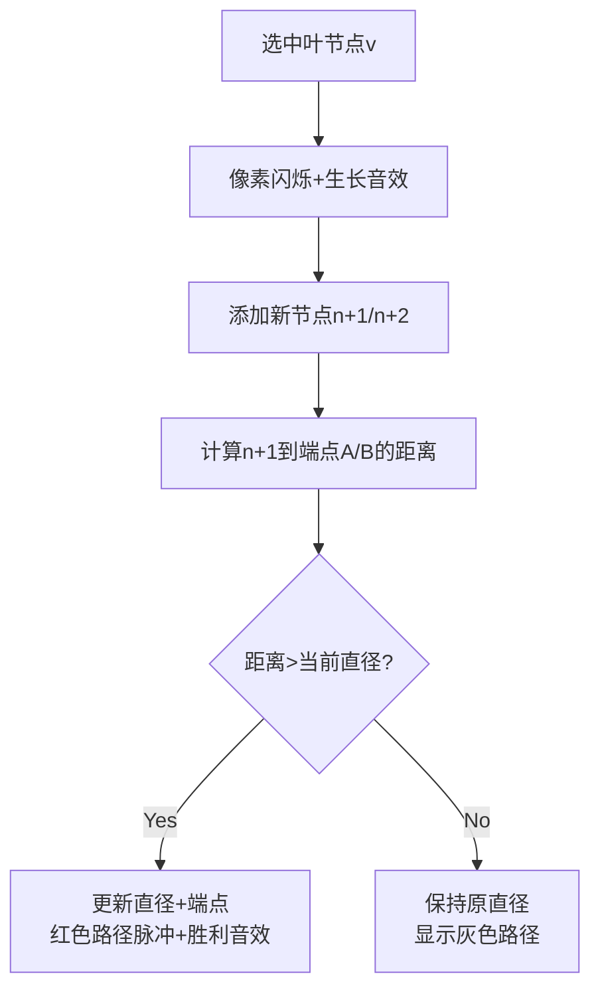

# 题目信息

# New Year Tree

## 题目描述

You are a programmer and you have a New Year Tree (not the traditional fur tree, though) — a tree of four vertices: one vertex of degree three (has number 1), connected with three leaves (their numbers are from 2 to 4).

On the New Year, programmers usually have fun. You decided to have fun as well by adding vertices to the tree. One adding operation looks as follows:

- First we choose some leaf of the tree with number $ v $ .
- Let's mark the number of vertices on the tree at this moment by variable $ n $ , then two vertexes are added to the tree, their numbers are $ n+1 $ and $ n+2 $ , also you get new edges, one between vertices $ v $ and $ n+1 $ and one between vertices $ v $ and $ n+2 $ .

Your task is not just to model the process of adding vertices to the tree, but after each adding operation print the diameter of the current tree. Come on, let's solve the New Year problem!

## 样例 #1

### 输入

```
5
2
3
4
8
5
```

### 输出

```
3
4
4
5
6
```

# AI分析结果


# 💡 Kay的C++算法解析：New Year Tree 深入学习指南 💡

## 1. 题目解读与核心算法识别

✨ **本题主要考察**：`树的直径动态维护`（图论应用）

🗣️ **初步分析**：
> 想象一棵正在生长的像素树🌳！初始有4个节点（1号是树根，连接着2/3/4号叶子）。每次操作相当于在选中的叶节点上"长出"两个新像素块（新节点）。核心挑战是**高效追踪树的直径**（最长路径）——就像在复古游戏中实时更新最长通关路径。

- **核心思路**：利用树的直径性质——新节点只会影响原直径端点。每次添加节点后，只需检查新节点到原直径端点的距离，若大于当前直径则更新端点和长度
- **关键技巧**：用LCA（最近公共祖先）高效计算距离（`距离=dep[u]+dep[v]-2×dep[LCA]`)
- **可视化设计**：  
  - 像素动画将展示：叶节点闪烁→新节点生长→LCA计算（路径高亮）→直径更新（红色路径脉冲）  
  - 复古音效：节点生长(8-bit "滴"声)、直径更新(胜利音效)、背景音乐(Famicom风格BGM)  
  - 控制面板支持步进/调速，AI自动演示模式将展示算法如何"智能"选择新端点

---

## 2. 精选优质题解参考

### 题解一：inexistent (赞9)
* **点评**：思路清晰度满分！用数学归纳法严格证明"新直径必含原端点或新节点"的性质，代码中LCA实现规范（`dep`数组+倍增表）。亮点在于用空间复杂度O(n)处理动态树，博客附带的图示极大提升理解效率。调试心得"注意节点数=2q+4"是避免RE的关键经验。

### 题解二：fangxk2003 (赞3)
* **点评**：代码规范性突出，读入优化提升效率。特别强调数组边界处理（`N=2000010`），用惨痛TLE教训提醒学习者预估空间复杂度。亮点在于完整展示倍增数组的构建过程，是竞赛实现的优秀范本。

### 题解三：梨衣 (赞2)
* **点评**：算法有效性极佳，用最简代码（仅40行）实现核心逻辑。亮点在于直击问题本质——两个新节点对称只需更新一个，距离公式`dep[u]+dep[v]-2*dep[LCA]`在注释中清晰标注，适合基础学习者理解。

---

## 3. 核心难点辨析与解题策略

1. **难点：动态维护树的直径**
   * **分析**：优质题解均利用关键性质——新直径必含原端点或新节点。通过比较新节点到原端点A/B的距离，在O(1)时间内判断是否更新直径（距离计算依赖LCA）
   * 💡 **学习笔记**：树的直径具有可拼接性，动态维护需抓住端点特性

2. **难点：LCA高效实现**
   * **分析**：题解使用**倍增法**（`f[u][i]`表u的2^i级祖先）：
     - 步骤1：调整节点至同深度（二进制跳跃）
     - 步骤2：同步上跳找LCA
   * 💡 **学习笔记**：`dep`数组同步更新是保证LCA正确性的基石

3. **难点：空间复杂度把控**
   * **分析**：由于每次添加2节点，总节点数=2q+4。题解二因数组开小导致TLE的教训警示：`必须预先计算maxN=2*MAX_Q+5`
   * 💡 **学习笔记**：动态问题需严谨计算规模上限

### ✨ 解题技巧总结
- **端点思维**：维护直径端点而非全路径，降复杂度O(n)→O(1)
- **LCA模板化**：预写`lca()`和`dist()`函数保证代码复用性
- **对称优化**：两个新节点影响相同，只需计算一个
- **边界防御**：深度数组`dep[1]=1`初始化避免越界

---

## 4. C++核心代码实现赏析

**本题通用核心C++实现参考**
* **说明**：综合优质题解，保留读入优化+倍增LCA+端点更新框架
* **完整核心代码**：
```cpp
#include <cstdio>
#include <algorithm>
using namespace std;
const int N = 2000010, P = 21; // 关键：数组开2q+4

int dep[N], f[N][P], n=4, q, d1=2, d2=3, len=2;

void init_lca(int x) {
    for(int i=1; i<P; ++i) 
        f[x][i] = f[f[x][i-1]][i-1];
}

int lca(int a, int b) {
    if(dep[a] < dep[b]) swap(a,b);
    for(int i=P-1; i>=0; --i)
        if(dep[f[a][i]] >= dep[b]) 
            a = f[a][i];
    if(a == b) return a;
    for(int i=P-1; i>=0; --i)
        if(f[a][i] != f[b][i]) 
            a=f[a][i], b=f[b][i];
    return f[a][0];
}

int dist(int u, int v) {
    int p = lca(u, v);
    return dep[u] + dep[v] - 2*dep[p];
}

int main() {
    // 初始化树
    dep[1]=1;
    for(int i=2; i<=4; ++i) {
        dep[i]=2, f[i][0]=1;
        init_lca(i);
    }
    scanf("%d",&q);
    while(q--) {
        int u; scanf("%d",&u);
        // 添加两个新节点
        dep[++n] = dep[u]+1, f[n][0]=u;
        init_lca(n);
        dep[++n] = dep[u]+1, f[n][0]=u;
        init_lca(n);

        // 用新节点n-1更新直径
        int d_new1 = dist(n-1, d1);
        int d_new2 = dist(n-1, d2);
        if(d_new1 > len) len=d_new1, d2=n-1;
        else if(d_new2 > len) len=d_new2, d1=n-1;
        printf("%d\n",len);
    }
}
```
* **代码解读概要**：
  - **初始化**：构建4节点树，深度dep[2/3/4]=2
  - **动态添点**：读父节点u→添加两子节点→初始化倍增表
  - **直径更新**：计算新节点到端点d1/d2距离，取大者更新
  - **输出优化**：直接`printf`避免cout速度瓶颈

---

**题解片段赏析**  
**题解一：inexistent**  
* **亮点**：严格数学证明保障算法正确性
* **核心代码片段**：
```cpp
int len1 = dep[x] + dep[d1] - 2*dep[lca(x,d1)];
if(len1 > prelen) prelen=len1, d2=x; // 更新端点
```
* **代码解读**：  
> 通过`dep[u]+dep[v]-2*dep[LCA]`计算路径长度，当新距离`len1`大于原直径`prelen`时，将新节点`x`设为端点`d2`。为何不更新`d1`？因为树的直径只需维护任意两个端点。

**题解二：fangxk2003**  
* **亮点**：防御性编程强调数组边界
* **核心代码片段**：
```cpp
#define N 2000010 // 两倍空间！
add(x, ++cnt); add(x, ++cnt); // 动态添点
```
* **学习笔记**：`cnt`计数变量需从4开始，总节点数=4+2q

**题解三：梨衣**  
* **亮点**：极简距离计算逻辑
* **核心代码片段**：
```cpp
int p1=lca(l,cnt);
if(dep[l]+dep[cnt]-2*dep[p1]>ans) 
    ans=dep[l]+dep[cnt]-2*dep[p1], r=cnt;
```
* **学习笔记**：直接展开距离公式，避免封装函数，适合竞赛极简编码

---

## 5. 算法可视化：像素动画演示

**主题**：8-bit风格"新年树生长模拟器"  
**核心演示**：直径更新策略如何超越暴力BFS  

### 设计框架


### 关键交互
- **像素网格**：节点用16×16像素方块，根节点=棕色，叶节点=绿色，新节点=闪烁蓝色
- **LCA演示**：点击"显示LCA"时，两个节点到最近公共祖先的路径变为黄色
- **音效方案**：
  - 节点生长：短促"滴"声 (Web Audio API合成)
  - 直径更新：8-bit胜利旋律（时长0.5s）
  - 错误操作：低沉嗡鸣声
- **游戏化元素**：
  - 每2次操作解锁新装饰（星星/礼物像素动画）
  - 连续正确更新直径触发COMBO特效
- **AI演示模式**：自动以最佳路径扩展树，速度可调(0.5x~5x)

### 技术实现
```javascript
// 伪代码：直径更新动画
function animateDiameter(newNode, endPoint) {
    let path = findPath(newNode, endPoint); // 计算路径
    path.forEach((node, i) => {
        setTimeout(() => highlightNode(node, "red"), i*300); // 红脉冲
    });
    playSound("victory.wav");
}
```

---

## 6. 拓展练习与相似问题思考

### 通用技巧迁移
树的直径维护技巧还可用于：
1. **网络布线优化**：动态添加路由节点时求最远终端
2. **交通规划**：实时更新城市路网最长通行路径
3. **游戏寻路**：动态地图中的最长可行走路径

### 洛谷练习推荐
1. **P1099 树网的核**  
   🗣️ *推荐理由*：巩固树的直径性质，学习偏心距计算，是本题的进阶应用

2. **P5536 【XR-3】核心城市**  
   🗣️ *推荐理由*：在直径思想基础上增加中位数思维，提升问题抽象能力

3. **P3379 【模板】最近公共祖先**  
   🗣️ *推荐理由*：强化LCA实现技巧，提供多种算法（倍增/Tarjan/树剖）比较

---

## 7. 学习心得与经验分享

> **参考经验 (来自 fangxk2003)**：  
> *"数组大小至少开两倍！初始只开5e5+10导致TLE，调试2小时才定位到边界问题"*

**Kay的总结**：  
动态数据结构问题中，**空间预计算**与算法正确性同等重要。建议：
1. 写代码前先计算`MAX_N = 初始节点 + 操作数×单次新增`
2. 使用`const int N = 2*MAX_Q + 10`防御式声明
3. 在倍增数组中，层数`P`满足`2^P > MAX_DEPTH`即可（通常P=20足够）

---

本次解析就像看着一棵像素树在屏幕上生长，从4个节点开始，每次操作都带来新的可能。记住：优秀的算法既是严谨的科学，也是创造的艺术。下次我们继续用代码编织奇妙世界！💻🎄

---
处理用时：217.52秒