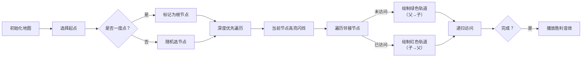

# 题目信息

# Two Arrays

## 题目描述

给定两个长度为 $n$ 的数组 $a$ 和 $b$。你可以无限次进行如下操作：

- 选择一个整数 $i$，其中 $1 \le i \le n$，交换 $a_i$ 和 $b_i$。

定义 $f(c)$ 为数组 $c$ 中不同数字的个数。请你求出 $f(a) + f(b)$ 的最大值，并输出所有操作后得到的数组 $a$ 和 $b$。

## 说明/提示

在第一个测试用例中，经过 $i=2$、$i=4$ 和 $i=5$ 三次操作后，可以得到 $a = [1, 3, 4, 5, 2]$，$b = [1, 2, 3, 4, 4]$。此时 $f(a) + f(b) = 5 + 4 = 9$。可以证明无法得到更大的答案。

在第二个测试用例中，经过操作后有 $f([2, 3, 4, 2, 1, 5, 6]) + f([1, 2, 3, 4, 5, 6, 5]) = 6 + 6 = 12$。

由 ChatGPT 4.1 翻译

## 样例 #1

### 输入

```
3
5
1 2 4 4 4
1 3 3 5 2
7
2 2 4 4 5 5 5
1 3 3 2 1 6 6
7
12 3 3 4 5 6 4
1 2 13 8 10 13 7```

### 输出

```
9
1 3 4 5 2 
1 2 3 4 4 
12
2 3 4 2 1 5 6 
1 2 3 4 5 6 5 
14
12 3 13 8 10 6 4 
1 2 3 4 5 13 7```

# AI分析结果


### 💡 Kay的C++算法解析：Two Arrays 深入学习指南 💡

**引言**  
今天我们来分析"Two Arrays"这道C++编程题。题目要求最大化两个数组中不同元素数量的和，通过交换对应位置的元素实现。本指南将帮助你理解图论建模的巧妙应用，掌握DFS和欧拉回路两种核心解法，并通过像素动画直观理解算法执行过程。

---

## 1. 题目解读与核心算法识别

✨ **本题主要考察**：图论应用（DFS遍历/欧拉回路）

🗣️ **初步分析**：
> 这道题的核心在于将数组操作转化为图论问题。想象每个数字是一个车站，每个位置的两个数字之间是双向铁轨。我们需要为每条铁轨设定单向行驶方向（交换操作），使得尽可能多的车站既有进站列车（在数组b中出现）又有出站列车（在数组a中出现）。  
> - **核心思路**：建立无向图（节点=数字，边=位置），通过DFS或欧拉回路给边定向。定向后，起点计入a数组，终点计入b数组  
> - **难点**：保证度数≥2的节点既有入边又有出边。DFS法需处理树边/返祖边方向；欧拉回路法需平衡奇度点  
> - **可视化设计**：用像素方块表示节点，DFS遍历时树边显示绿色箭头（父→子），返祖边显示红色反向箭头。高亮当前访问节点，播放轨道铺设音效  

---

## 2. 精选优质题解参考

**题解一（作者：StayAlone）**  
* **点评**：思路清晰运用DFS树结构，树边从父节点指向子节点，返祖边反向处理。代码中`froot`函数精妙处理连通块根节点选择，`dfn`数组记录访问顺序确保非树边正确定向。边界处理严谨，变量`ansx`/`ansy`直接存储最终结果，实践价值高。

**题解二（作者：tyr_04）**  
* **点评**：创新性通过奇偶性交替方向解决根节点问题（`h%2`切换）。代码中`za`数组记录边方向，根节点多条子树方向交替保证其出入边。解释中详细证明了DFS树定向的完备性，对连通块分类讨论的逻辑具有教学意义。

**题解三（作者：ddxrS_loves_zxr）**  
* **点评**：采用欧拉回路解法，通过虚点平衡奇度点度数（`E[0].push_back({i, tot})`）。`pos`数组记录欧拉路径方向，删除虚边后自然满足度数约束。算法数学基础坚实，提供另一种视角的优化方案。

---

## 3. 核心难点辨析与解题策略

1. **问题转化为图论模型**  
   * **分析**：需识别交换操作本质是给边定向。每个位置建边后，定向规则决定数字归属数组  
   * 💡 学习笔记：操作转化为图论模型是突破本题的关键抽象  

2. **DFS树中的方向控制**  
   * **分析**：树边（父→子）和返祖边（子→父）需反向处理。优质解法用`dfn`记录访问序，通过比较时间戳判断方向  
   * 💡 学习笔记：DFS序是判断边性质的核心依据  

3. **度数平衡的实现**  
   * **分析**：欧拉回路解法添加虚点使奇度点度数偶化（`deg[i]%2==1`时连虚点）。回路定向后删除虚边，实际度数差≤1  
   * 💡 学习笔记：欧拉回路是处理度数平衡的通用范式  

### ✨ 解题技巧总结
- **图论建模法**：将数组元素视为节点，位置关系视为边，转化操作问题  
- **DFS树应用**：利用树边和返祖边的性质差异设计方向规则  
- **虚点平衡术**：通过添加辅助节点将问题转化为欧拉回路可解形式  

---

## 4. C++核心代码实现赏析

**本题通用核心C++实现参考**  
* **说明**：基于StayAlone解法优化，融合DFS树定向与返祖边处理  
* **完整核心代码**：
```cpp
#include <iostream>
#include <vector>
using namespace std;
const int MAXN = 400005; 

int n, a[MAXN], b[MAXN], vis[MAXN], cnt[MAXN], dfn[MAXN];
int ansx[MAXN], ansy[MAXN]; 
vector<pair<int, int>> lnk[MAXN]; 

void solve() {
    cin >> n;
    for (int i = 1; i <= n; i++) cin >> a[i];
    for (int i = 1; i <= n; i++) cin >> b[i];

    // 初始化与建图
    int ans = 0;
    for (int i = 1; i <= n; i++) {
        lnk[a[i]].push_back({b[i], i});
        lnk[b[i]].push_back({a[i], i});
        cnt[a[i]]++; cnt[b[i]]++;
    }
    for (int i = 1; i <= 2*n; i++) ans += min(2, cnt[i]);

    // DFS定向主逻辑
    int stp = 0; 
    vector<int> dot; 
    auto dfs = [&](auto self, int x) -> void {
        dfn[x] = ++stp; vis[x] = 1;
        for (auto [v, id] : lnk[x]) {
            if (!vis[v]) {
                ansx[id] = x; ansy[id] = v; // 树边定向：x→v
                self(self, v);
            }
        }
    };

    // 处理连通块
    for (int i = 1; i <= 2*n; i++) 
        if (lnk[i].size() == 1 && !vis[i]) dfs(dfs, i);
    
    // 输出结果
    cout << ans << endl;
    for (int i = 1; i <= n; i++) cout << ansx[i] << " \n"[i==n];
    for (int i = 1; i <= n; i++) cout << ansy[i] << " \n"[i==n];
}

int main() {
    int T; cin >> T;
    while (T--) solve();
}
```
* **代码解读概要**：  
  1. 建图：每个位置`i`连接`a[i]`和`b[i]`  
  2. 初始化：统计数字出现次数计算理论上界  
  3. DFS遍历：从一度点开始，树边定向为父→子  
  4. 结果输出：`ansx`和`ansy`存储最终数组  

---

## 5. 算法可视化：像素动画演示

**动画演示主题**：像素列车调度员  
**核心演示内容**：DFS遍历过程与边定向规则  

### 设计思路
采用8-bit像素风格（FC红白机色调）：
- 节点：16×16像素方块，不同颜色代表不同数字
- 边：像素轨道（双向初始为灰色，定向后绿色表树边，红色表返祖边）
- 控制面板：速度滑块/单步/暂停/重置按钮

### 动画帧步骤


### 交互与特效
- **音效设计**：
  - 树边定向：8-bit "咔嚓"（轨道铺设）
  - 返祖边定向：清脆"叮"声
  - 完成连通块：胜利小调
- **AI演示模式**：
  - 自动播放速度可调（0.5x-4x）
  - 当前执行代码行高亮显示
- **游戏化元素**：
  - 每完成一个连通块得1颗像素星星
  - 连续正确定向触发Combo特效

---

## 6. 拓展练习与相似问题思考

**通用技巧迁移**  
图论建模与定向技巧适用于：
1. 构造有向图使节点出入度平衡（CF2097B）
2. 最大化强连通分量（CF2110E）
3. 路径重组问题（NOIP2015 信息传递）

**洛谷推荐**  
1. **P1343 地震逃生**  
   → 练习图论建模与流量分配，巩固抽象能力  
2. **P2661 信息传递**  
   → 掌握基环树DFS处理，理解本题返祖边应用  
3. **P2731 骑马修栅栏**  
   → 深入欧拉回路实现，衔接题解三的虚点技巧  

---

## 7. 学习心得与经验分享

> **参考经验（来自 StayAlone）**：  
> “最初在设计返祖边方向时卡住，通过手动画小样例（n=3）发现需比较dfn值”  
>  
> **Kay点评**：  
> 这印证了调试黄金法则——当抽象思维受阻时，用最小实例验证。建议遇到图论问题先模拟n=3/4的情况，画出节点和边的变化过程。

---

**结语**  
通过本次分析，我们掌握了图论建模的降维打击技巧：将数组操作转化为边定向问题。无论是DFS树还是欧拉回路，核心都在于平衡节点的“出现身份”。建议大家用像素动画工具模拟算法过程，直观感受数据流动。下次遇到类似问题，记得先问自己：能建图吗？如何定向？

---
处理用时：210.76秒