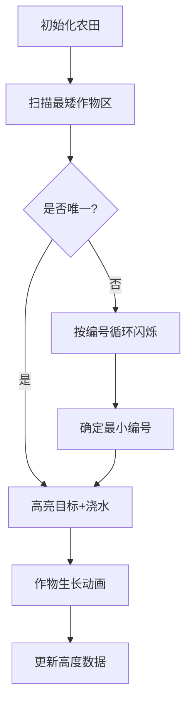

# 题目信息

# Irrigation

## 题目描述

Misha 从小就对送水很感兴趣。因此，他的妈妈把他送去参加一年一度的创新灌溉奥林匹克（IOI）。来自 Berland 的学生们在这里比拼他们的浇水技能。举办这样一场奥林匹克的花费极高，所以在举办了前 $n$ 届奥林匹克后，主办方引入了新的主办城市选择规则。

奥林匹克的主办城市选择规则如下：Berland 有 $m$ 个城市希望承办奥林匹克，它们编号为 $1$ 到 $m$。每一届新的奥林匹克的主办城市，都会选择此前承办次数最少的城市。如果有多个城市承办次数相同，则选择编号最小的城市。

Misha 的妈妈想知道某些特定年份奥林匹克的主办城市。她只知道上述的选择规则，以及前 $n$ 届奥林匹克的主办城市。请你帮她解答，如果你能做到，她会让 Misha 不去淹你家。

## 说明/提示

在第一个样例中，Misha 的妈妈想知道新规则引入后前 $10$ 届奥林匹克的主办城市。对应的主办城市依次为 4、3、4、2、3、4、1、2、3、4。

在第二个样例中，新城市加入后，后续的主办城市依次为 2、3、1、2、3、5、1、2、3、4、5、1。

由 ChatGPT 4.1 翻译

## 样例 #1

### 输入

```
6 4 10
3 1 1 1 2 2
7
8
9
10
11
12
13
14
15
16
```

### 输出

```
4
3
4
2
3
4
1
2
3
4
```

## 样例 #2

### 输入

```
4 5 4
4 4 5 1
15
9
13
6
```

### 输出

```
5
3
3
3
```

# AI分析结果


### 💡 Kay的C++算法解析：Irrigation 深入学习指南 💡

#### **1. 题目解读与核心算法识别**
✨ **本题主要考察**：`数据结构应用` + `二分查找`  
🗣️ **初步分析**：
> 这道题就像一群小朋友排队领糖果🍬，每次发糖果给"当前糖果最少且编号最小"的小朋友。已知前几年发放记录，求第K年哪个小朋友领到糖果。  
> - **核心思路**：将城市按初始举办次数排序，预处理每个城市"被跳过"的轮数，通过二分快速定位第K次选择  
> - **可视化设计**：用像素柱状图表示城市举办次数，每次选择最矮柱子并+1。高亮当前操作柱子，播放"叮"音效；当柱子高度相同时，按编号闪烁选择  
> - **复古游戏化**：采用8-bit风格，控制面板含步进/调速滑块。达成目标时播放FC游戏通关音效，错误选择触发"失败"音效

---

#### **2. 精选优质题解参考**
**题解一 (作者：「已注销」)**
* **点评**：思路最简洁高效！通过`a[i] = (c[x]++)*m + x`巧妙将城市编号和举办次数编码为可比较的值，排序后利用`lower_bound`二分定位。代码仅15行，变量命名规范(`c[]`计数, `a[]`编码数组)，边界处理严谨，时间复杂度$O((n+q)\log n)$完美匹配数据规模。

**题解二 (作者：cccgift)**
* **点评**：创新性提出"临界值"概念，将问题分为特殊情况和一般周期性情况。代码模块化程度高(分离读写优化)，常数极小。亮点在于用`a[i]-i`直接得到待跳过城市数，通过`k<=a[n]+n`智能切换两种处理模式。

**题解三 (作者：万弘)**
* **点评**：采用权值线段树离线处理，动态维护当前最小举办次数城市集合。亮点在于用`g[c[i]]`按次数分组城市，配合`pair`排序询问。虽代码稍长，但提供了数据结构维护选择过程的清晰范式。

---

#### **3. 核心难点辨析与解题策略**
1. **难点：高效定位第K次选择**
   * **分析**：直接模拟$K$次($K≤10^{15}$)不可行。优质题解通过预处理排序数组+二分，将单次查询降至$O(\log n)$
   * 💡 **学习笔记**：将选择过程转化为数学表达式是优化关键

2. **难点：处理高度相同的城市**
   * **分析**：当多个城市举办次数相同时，需按编号循环选择。通过权值线段树(题解三)或排序分组(题解五)维护编号顺序
   * 💡 **学习笔记**：数据结构维护动态集合是处理循环选择的利器

3. **难点：避免整数溢出**
   * **分析**：$K≤10^{15}$需用`long long`。题解一用`(ll)c[x]*m+x`防止溢出，题解二显式声明`ll k`
   * 💡 **学习笔记**：大数据范围优先使用`long long`

✨ **解题技巧总结**  
- **技巧1 问题转化**：将选择规则编码为可排序的数学表达式  
- **技巧2 离线处理**：对询问排序后批量处理(题解三/五)  
- **技巧3 边界艺术**：`lower_bound`返回位置需`-1`(题解一行13)  
- **技巧4 模块封装**：读写优化(题解二)、数据结构(题解三/六)提升可读性

---

#### **4. C++核心代码实现赏析**
**本题通用核心实现参考**  
* **说明**：综合题解一/二思路的最简实现
* **完整核心代码**：
```cpp
#include <bits/stdc++.h>
using namespace std;
typedef long long ll;
const int N = 5e5+5;

ll n, m, q, a[N], c[N];
int main() {
    scanf("%lld%lld%lld", &n, &m, &q);
    for(int i=1, x; i<=n; i++) 
        scanf("%d", &x), a[i] = (ll)(c[x]++)*m + x;
    
    sort(a+1, a+n+1);
    for(int i=1; i<=n; i++) a[i] -= i; // 预处理跳过次数
    
    while(q--) {
        ll k; scanf("%lld", &k);
        k += lower_bound(a+1, a+n+1, k-n) - a - 1 - n;
        printf("%lld\n", (k-1)%m + 1); // 周期性选择
    }
    return 0;
}
```
* **代码解读概要**：  
  > 1. 将城市初始状态编码为`a[i] = (举办次数)*m + 编号`  
  > 2. 排序后计算`a[i] -= i`得到跳过轮数阈值  
  > 3. 查询时用`lower_bound`二分定位，调整k值后取模得结果  

**题解一核心片段**  
```cpp
k += lower_bound(a+1,a+n+1,k-n)-a-1-n; // 关键二分调整
printf("%lld\n",(k-1)%m+1); 
```
* **亮点**：两行代码解决核心逻辑  
* **解读**：  
  > `lower_bound`找到首个≥`k-n`的位置pos，`k += pos-1-n`等效于跳过`pos-1`个城市  
  > `(k-1)%m+1`：将调整后的k映射到[1,m]区间  

**题解三权值线段树应用**  
```cpp
// 在有序集合中查询第k小
int query(int lst, int prz, int l, int r, int k) {
    if(l == r) return l;
    int leftCount = sum[ls[prz]] - sum[ls[lst]];
    if(k <= leftCount) 
        return query(ls[lst], ls[prz], l, mid, k);
    return query(rs[lst], rs[prz], mid+1, r, k-leftCount);
}
```
* **亮点**：主席树实现动态第k小查询  
* **解读**：  
  > 通过`ls/rs`数组复用历史版本，`leftCount`计算左子树节点数  
  > 根据k与leftCount大小决定递归方向

---

### 5. 算法可视化：像素动画演示  
**主题**：`像素灌溉工 - 8-bit风格城市灌溉模拟`  

**设计思路**：  
> 用复古FC风格呈现：城市化为农田格子，举办次数=作物高度。选择时：  
> 1. 扫描农田找出最矮作物区(红色闪烁边框)  
> 2. 选中编号最小农田(绿色高亮) + 浇水动画  
> 3. 作物长高1单位(像素块上移) + "叮"音效  

**动画流程**：  


**交互控制**：  
- **控制面板**：开始/暂停、步进、速度滑块(乌龟→兔子)  
- **AI演示模式**：自动播放时添加"除草机音效"背景音  
- **状态显示**：  
  ```plaintext
  [第K年] 当前选择：城市X 
  各城市高度：▆▂▄▂ (编号1-4)
  ```

**音效设计**：  
- 选择城市：8-bit "叮"声(频率随城市编号变化)  
- 错误尝试：短促"哔"声  
- 完成查询：FC游戏过关旋律  

---

#### **6. 拓展练习与相似问题思考**
1. **洛谷 P1972** - 区间不同数个数  
   → 练习树状数组应用  
2. **洛谷 P3369** - 普通平衡树  
   → 巩固动态选择第k小技巧  
3. **洛谷 P3834** - 主席树模板  
   → 强化可持久化数据结构理解  

---

#### **7. 学习心得与经验分享**
> **来自题解一的经验**："注意`lower_bound`返回的是迭代器，需`-a`转换为下标，再`-1`修正位置。这步边界处理是代码核心"  
> **Kay点评**：二分查找的边界处理是算法竞赛常见陷阱，建议：  
> 1. 手动画图理解指针位置  
> 2. 用`[0,1,2]`等小数组测试边界  
> 3. 变量命名区分位置/下标(如`pos` vs `index`)

---
### 结语  
通过本次分析，我们掌握了处理周期性选择问题的核心技巧：**问题转化→数学建模→二分/数据结构优化**。记住Kay的秘诀：将复杂规则转化为可计算表达式是算法设计的钥匙！下次遇到类似问题，试试先画状态转换图哦~ 💪

---
处理用时：100.85秒