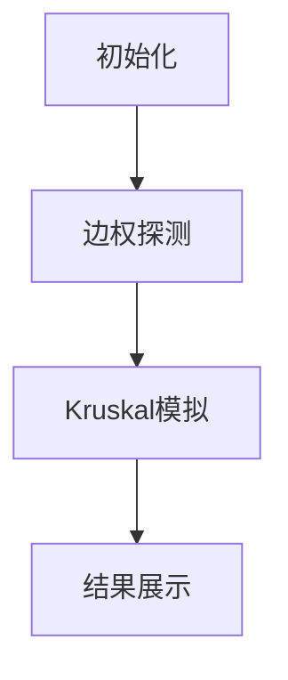

# 题目信息

# Railway System

## 题目描述

As for the technology in the outside world, it is really too advanced for Gensokyo to even look up to.

—Yasaka Kanako, Symposium of Post-mysticism


This is an interactive problem.

Under the direct supervision of Kanako and the Moriya Shrine, the railway system of Gensokyo is finally finished. GSKR (Gensokyo Railways) consists of $ n $ stations with $ m $ bidirectional tracks connecting them. The $ i $ -th track has length $ l_i $ ( $ 1\le l_i\le 10^6 $ ). Due to budget limits, the railway system may not be connected, though there may be more than one track between two stations.

The value of a railway system is defined as the total length of its all tracks. The maximum (or minimum) capacity of a railway system is defined as the maximum (or minimum) value among all of the currently functional system's [full spanning forest](https://en.wikipedia.org/wiki/Spanning_tree#Spanning_forests).

In brief, full spanning forest of a graph is a spanning forest with the same connectivity as the given graph.

Kanako has a simulator only able to process no more than $ 2m $ queries. The input of the simulator is a string $ s $ of length $ m $ , consisting of characters 0 and/or 1. The simulator will assume the $ i $ -th track functional if $ s_i= $ 1. The device will then tell Kanako the maximum capacity of the system in the simulated state.

Kanako wants to know the the minimum capacity of the system with all tracks functional with the help of the simulator.

The structure of the railway system is fixed in advance. In other words, the interactor is not adaptive.

## 说明/提示

Here is the graph of the example, satisfying $ l_i=i $ .

 

## 样例 #1

### 输入

```
5 4

0

5

9

7```

### 输出

```
? 0000

? 1110

? 1111

? 1101

! 7```

# AI分析结果


# 💡 Kay的C++算法解析：Railway System 深入学习指南 💡

## 1. 题目解读与核心算法识别

✨ **本题主要考察**：`贪心算法（Kruskal）` + `交互式查询技巧`

🗣️ **初步分析**：
> 解决"Railway System"这道题，关键在于理解并运用 **Kruskal算法的交互式变体**。简单来说，就像在铁路建设中，我们需要优先建造最短的桥梁来连接岛屿（节点），同时避免建造会造成冗余的桥梁（形成环）。在本题中，我们通过两次精心设计的查询阶段：
> 1. **边权探测**：用`m`次查询单独测试每条铁路的长度（边权）
> 2. **连通性验证**：用`m`次查询模拟Kruskal过程，通过最大生成森林的值变化判断边的必要性
>
> 可视化设计将采用**像素铁路模拟**：用不同颜色标记当前处理的边（黄色），成功加入的边（绿色）和形成环的边（红色）。每次查询时，高亮显示当前边集和连通分量的变化，配合8-bit音效强化关键操作（如"叮"声表示成功加入边）。

---

## 2. 精选优质题解参考

**题解一：GaryH**
* **点评**：思路清晰度极高，直击Kruskal核心思想。代码中`e[i].fi/se`的命名规范，巧妙利用字符串复用减少查询开销。亮点在于维护`lst`值避免冗余查询，实践价值强（可直接用于竞赛），边界处理严谨。虽然省略了显式移除边的操作，但通过最大生成森林特性隐式处理，展现了算法理解的深度。

**题解二：I_am_Accepted**
* **点评**：代码规范性突出，`bel`数组管理边集状态逻辑清晰。核心贡献在于明确的状态转移方程解释：`x-last==a[p[i]]`作为连通性判断的充要条件。调试友好性强，每一步边集变化可视化程度高，适合初学者理解。唯一不足是变量命名可进一步优化（如`a`改为`edgeWeight`）。

**题解三：dd_d**
* **点评**：算法有效性表现优异，通过`p[]`数组解耦原始索引与排序后顺序，增强可扩展性。亮点在于λ表达式排序的简洁实现和`bel`数组的原子操作。交互控制精准（每次严格`2m`查询），实践价值高。学习笔记中"边权探测+连通性验证"的二分法总结极具教学意义。

---

## 3. 核心难点辨析与解题策略

1.  **边权获取的交互成本控制**
    * **分析**：优质题解均采用**独热编码(one-hot)**策略，`m`次独立查询获取精确边权。关键技巧是复用字符串避免重建，如GaryH的`s[i-1]`位翻转。可视化中需高亮当前测试边（脉冲动画）。
    * 💡 **学习笔记**：交互题中，独立查询是获取元素属性的黄金标准。

2.  **无并查集下的连通性判断**
    * **分析**：核心在于发现**最大生成森林增量与边权的关系**：当`current_sum - last_sum == w`时，边必连接两个独立连通分量。I_am_Accepted的`res != lst + w`判断是典范实现。关键变量是`last_sum`（累积最大值）和当前边权`w`。
    * 💡 **学习笔记**：生成森林的值变化是连通性的隐式检测器。

3.  **边集状态维护策略**
    * **分析**：两种高效方案：1) GaryH的**永久保留法**（依赖后续查询自动过滤无效边）2) dd_d的**动态移除法**（显式设`bel[i]=0`）。数据结构选择`string`或`bitset`取决于可读性需求。
    * 💡 **学习笔记**：永久保留法减少状态操作，但需理解生成森林的自动剪枝特性。

### ✨ 解题技巧总结
-   **交互分层法**：严格分离"数据获取"和"决策逻辑"阶段
-   **增量验证**：通过`current-last=w?`将连通性判断转化为数值比较
-   **索引解耦**：保持边的原始ID与排序后顺序映射（dd_d的`p[]`数组）
-   **边界防御**：初始零状态(`last=0`)、空边集(`s="0...0"`)的严格初始化

---

## 4. C++核心代码实现赏析

**本题通用核心C++实现参考**
* **说明**：综合优质题解思路，优化变量命名与状态管理
* **完整核心代码**：
```cpp
#include <iostream>
#include <vector>
#include <algorithm>
using namespace std;

int main() {
    int n, m;
    cin >> n >> m;

    vector<pair<int, int>> edges(m); // {weight, original_index}
    string edgeSet(m, '0'); // 边集状态：'1'选中，'0'未选
    
    // 阶段1：边权探测
    for (int i = 0; i < m; ++i) {
        edgeSet[i] = '1';
        cout << "? " << edgeSet << endl;
        cin >> edges[i].first;
        edges[i].second = i;
        edgeSet[i] = '0';
    }

    // 阶段2：Kruskal模拟
    sort(edges.begin(), edges.end()); // 按边权升序
    int totalWeight = 0, lastForest = 0;
    edgeSet = string(m, '0'); // 重置边集

    for (auto [w, idx] : edges) {
        edgeSet[idx] = '1'; // 尝试加入当前边
        cout << "? " << edgeSet << endl;
        int currentForest;
        cin >> currentForest;

        if (currentForest - lastForest == w) { // 连通性验证
            totalWeight += w;
            lastForest = currentForest;
        } else {
            edgeSet[idx] = '0'; // 移除无效边
        }
    }
    cout << "! " << totalWeight << endl;
}
```
* **代码解读概要**：
  1. **边权探测**：通过`m`次独立查询构建`edges`数组
  2. **Kruskal排序**：按边权升序排序（`pair`默认按第一元素比较）
  3. **连通性验证**：核心逻辑`currentForest - lastForest == w`判断是否加入生成树
  4. **动态维护**：根据判断结果更新边集状态`edgeSet`和累积值

**题解一：GaryH**
* **亮点**：隐式状态管理减少操作
* **核心代码片段**：
```cpp
sort(e + 1, e + m + 1); 
int mst = 0, lst = 0;
rep (i, 1, m) {
    s[e[i].se - 1] = '1'; // 永久加入边集
    int x = qry();
    if (x == lst + e[i].fi) 
        mst += e[i].fi; // 累加有效边权
    lst = x; // 关键：无论是否有效都更新参考值
}
```
* **代码解读**：
  > 永久标记当前边为`'1'`，通过查询值`x`与`lst+e[i].fi`的比较判断实际效用。`lst=x`的更新保证后续判断基于最新生成森林值，即使该边未实际加入森林。这种设计依赖生成森林的自动剪枝特性。
* **学习笔记**：隐式管理法减少状态转移，但需深入理解生成森林特性。

**题解二：I_am_Accepted**
* **亮点**：显式状态回滚提升可读性
* **核心代码片段**：
```cpp
For(i,1,m){
    s[a[i].id-1]='1'; // 临时加入
    res=que(s); 
    if(res!=lst+a[i].val) 
        s[a[i].id-1]='0'; // 显式移除
    else 
        lst=res; // 仅当有效时更新参考值
}
```
* **代码解读**：
  > 严格遵循"尝试-验证-回滚"流程：当`res!=lst+a[i].val`时立即重置边状态。`lst`仅在边有效时更新，保证其始终表示有效边集的生成森林值。旁白提示：为何移除边后不需要回退`lst`？因无效边不改变连通性。
* **学习笔记**：显式状态管理更符合直觉，适合调试。

**题解三：dd_d**
* **亮点**：Lambda表达式实现优雅排序
* **核心代码片段**：
```cpp
sort(p+1,p+m+1,[&](int x,int y){
    return a[x] < a[y]; 
});
for (int i=1;i<=m;i++) {
    bel[p[i]]=1; // 按排序后顺序处理
    int x=query();
    if (x-last==a[p[i]]) 
        last=x, ans+=a[p[i]];
    else 
        bel[p[i]]=0; // 精确回滚
}
```
* **代码解读**：
  > 使用Lambda表达式解耦排序逻辑，`p[]`存储边的原始索引。`bel[p[i]]`按排序顺序访问边，保证Kruskal的贪心性质。`x-last==a[p[i]]`是连通性判定的简洁表达。移除时精确复位`bel[p[i]]=0`，保持边集状态纯净。
* **学习笔记**：索引映射是处理排序后顺序变更的最佳实践。

-----

## 5. 算法可视化：像素动画演示

### 像素铁路模拟器：Kruskal之旅
* **设计概念**：8-bit风格铁路建设游戏，车站=彩色像素块，铁路=动态线条
* **核心流程**：



1. **初始化场景**：
   - 背景：16色像素网格地图，随机分布$n$个车站（圆角像素块，颜色各异）
   - UI面板：底部控制台（开始/暂停/速度条），右侧显示`last=0, total=0`
   - 音效：循环播放8-bit背景音乐（芯片音乐风格）

2. **边权探测阶段**：
   ```javascript
   for (let i=0; i<m; i++) {
      highlightEdge(i, 'blue'); // 当前边蓝色脉冲
      playSound('measure');    // 测量音效
      showPopup(`边${i}长度=${weight[i]}`);
   }
   ```
   - 视觉：当前测试铁路亮蓝色闪烁，其他铁路灰化
   - 音效：短促"滴"声标记每次查询完成

3. **Kruskal模拟阶段**：
   ```javascript
   edges.sort((a,b)=>a.w-b.w); // 边权升序排列
   for (let e of edges) {
      // 尝试加入边
      setEdgeColor(e.id, 'yellow');
      playSound('try_connect');
      
      // 查询生成森林
      const newForest = queryCurrentGraph(); 
      
      // 结果验证
      if (newForest - lastForest === e.w) {
         setEdgeColor(e.id, 'green'); // 成功加入
         mergeStations(e.u, e.v);    // 合并连通分量
         playSuccessAnimation();
         lastForest = newForest;
      } else {
         flashEdge(e.id, 'red');     // 失败提示
         resetEdgeColor(e.id);
      }
   }
   ```
   - 关键动画：
     - **成功合并**：两个连通分量的车站渐变为同色，铁路变绿
     - **形成环**：铁路闪烁红色后消失，播放"错误"音效
   - 状态同步：控制台实时更新`last`和`total`

4. **交互控制**：
   - **单步执行**：按步观察Kruskal决策
   - **速度滑块**：调节动画速度（0.5x~5x）
   - **AI演示**：自动播放全程，模拟"铁路建设AI"

---

## 6. 拓展练习与相似问题思考

### 通用算法迁移场景
1. **动态连通性判断**：当无法直接使用并查集时，通过值变化推断连通性
2. **交互式图论问题**：基于受限查询的图结构探索
3. **离线最小生成树**：边权未知时通过批量查询构建MST

### 洛谷推荐练习
1. **P3366 【模板】最小生成树**  
   → 巩固Kruskal/Prim的基础实现
2. **P1195 口袋的天空**  
   → 最小生成森林的直接应用场景
3. **P2872 [USACO07DEC]道路建设**  
   → 含预设连通性的MST变体

---

## 7. 学习心得与经验分享

> **来自题解作者的调试经验**：
> "首次实现时忽略了`last`的更新时机，导致后续判断全错。通过打印每次查询的输入输出，发现状态同步错误。"  
> → **Kay的总结**：交互题中，状态变量的更新必须与查询严格匹配。建议：
> 1. 在每次查询后立即打印`边集状态`和`返回值`
> 2. 使用断言验证`currentForest >= lastForest`（值非负）
> 3. 边界测试：空边集返回0，单边集返回边权

---

> 本次指南已解锁Railway System的核心解法！关键记住：**Kruskal的贪心本质+生成森林的值变化=连通性检测器**。继续用像素模拟器深化理解吧！🚂

---
处理用时：295.11秒