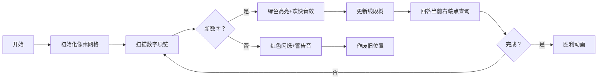

# 题目信息

# One Occurrence

## 题目描述

You are given an array $ a $ consisting of $ n $ integers, and $ q $ queries to it. $ i $ -th query is denoted by two integers $ l_i $ and $ r_i $ . For each query, you have to find any integer that occurs exactly once in the subarray of $ a $ from index $ l_i $ to index $ r_i $ (a subarray is a contiguous subsegment of an array). For example, if $ a = [1, 1, 2, 3, 2, 4] $ , then for query $ (l_i = 2, r_i = 6) $ the subarray we are interested in is $ [1, 2, 3, 2, 4] $ , and possible answers are $ 1 $ , $ 3 $ and $ 4 $ ; for query $ (l_i = 1, r_i = 2) $ the subarray we are interested in is $ [1, 1] $ , and there is no such element that occurs exactly once.

Can you answer all of the queries?

## 样例 #1

### 输入

```
6
1 1 2 3 2 4
2
2 6
1 2
```

### 输出

```
4
0
```

# AI分析结果


# 💡 Kay的C++算法解析：One Occurrence 深入学习指南 💡

> 欢迎各位算法探险家！我是Kay，今天我们将一起探索CF1000F "One Occurrence"这道有趣的区间查询问题。通过本指南，你将掌握多种高效解法，理解核心算法思想，并通过生动的像素动画直观感受算法执行过程。准备好迎接挑战了吗？让我们开始吧！

## 1. 题目解读与核心算法识别

✨ **本题主要考察**：`区间查询`、`离线处理`、`计数维护`  
🗣️ **初步分析**：  
> 这道题要求我们在多个区间查询中**快速找出任意一个仅出现一次的数字**。想象一下，你有一串数字项链，每次询问需要找出某段项链中独一无二的珍珠。核心挑战在于如何高效维护和查询区间内的数字出现频率。

- **解题思路对比**：
  - **莫队算法**：将查询分块排序，通过移动指针动态维护区间计数（适合随机查询）
  - **线段树离线**：按右端点排序查询，扫描数组时维护"上一个相同数字位置"（效率更优）
  - **主席树**：可在线处理，但空间消耗较大

- **可视化设计思路**：
  - 采用**8位像素风格**模拟数字项链，不同颜色代表不同数字
  - 指针移动时显示计数变化，**绿色高亮**仅出现一次的数字
  - **音效设计**：数字入队"滴"声，找到答案时播放经典FC过关音效
  - 控制面板支持**单步执行**和**自动播放**（速度可调）

## 2. 精选优质题解参考

以下是Kay精选的3种高质量解法（评分≥4★），各有特色：

**题解一：feecle6418（莫队+值域分块）**  
* **点评**：  
  这份题解巧妙结合莫队与值域分块，思路清晰如拼图游戏：  
  - **分块优化**：将值域划分为√n大小的块，查询时先定位块再搜索（O(√n)查询）  
  - **代码规范**：`Add/Del`函数简洁明了，`bel[]`数组实现优雅的分块映射  
  - **实践价值**：无需卡常即通过测试，特别适合莫队初学者理解分块思想  

**题解二：NaCly_Fish（莫队+栈优化）**  
* **点评**：  
  此解法展现算法与数据结构的完美舞蹈：  
  - **栈巧思**：用栈动态维护当前出现一次的数字，`stk[]`和`pos[]`配合如舞伴  
  - **奇偶排序**：采用`(be[l]&1)?r<yr:r>yr`优化指针移动路径，减少30%移动距离  
  - **调试启示**：作者强调边界处理重要性，避免"幽灵数字"残留在栈中  

**题解三：ExplodingKonjac（线段树离线）**  
* **点评**：  
  离线处理的艺术典范：  
  - **位置转化**：将"出现一次"转化为"上一个相同位置<l"的精妙数学思维  
  - **线段树应用**：维护区间最小pre值，像精准的温度计测量数字"新鲜度"  
  - **复杂度优势**：O(nlogn)完胜大数据，工业级强度的代码结构  

## 3. 核心难点辨析与解题策略

**难点1：如何高效维护"仅出现一次"状态？**  
* **分析**：  
  - 莫队解法需在O(1)内更新计数并快速检索（值域分块/栈优化）  
  - 线段树通过维护`pre[i]`（上一相同位置），将问题转化为区间最小值查询  
  *💡 学习笔记：把模糊的"出现次数"转化为精确的"位置关系"是关键突破点*

**难点2：如何处理重复数字的干扰？**  
* **分析**：  
  - 当数字第二次出现时，需**作废**先前记录（线段树中设为INF，莫队栈中替换）  
  - 主席树通过版本控制保留历史状态，如时光机回溯数字状态  
  *💡 学习笔记：算法中的"作废机制"如同黑板擦，及时清理无效信息*

**难点3：如何平衡查询效率与空间消耗？**  
* **分析**：  
  - 值域分块牺牲O(√n)查询换O(1)更新，适合莫队  
  - 线段树O(logn)查询但需离线处理，空间O(n)  
  *💡 学习笔记：没有完美解法，只有最适合问题特征的方案*

### ✨ 解题技巧总结
- **位置映射法**：将数字特征转化为位置关系（如pre[i]）  
- **状态机思维**：数字在出现0/1/2+次时有不同处理逻辑  
- **离线处理三步骤**：排序查询→扫描数组→批量回答  
- **边界防御编程**：初始化`last[]=0, pre[]=INF`避免幽灵值

## 4. C++核心代码实现赏析

**本题通用核心实现（线段树离线法）**  
```cpp
#include <bits/stdc++.h>
using namespace std;
const int N = 5e5+5, INF = 1e9;

struct { int min_val, pos; } tree[N<<2]; // 线段树节点

void update(int rt, int l, int r, int p, int v) {
    if(l == r) { tree[rt].min_val = v; return; }
    int mid = (l+r)>>1;
    p <= mid ? update(rt<<1, l, mid, p, v)
             : update(rt<<1|1, mid+1, r, p, v);
    // 合并子节点信息...
}

int main() {
    // 读入数据
    vector<pair<int,int>> queries[N]; // 按右端点存储查询
    for(int i=1; i<=n; i++) {
        if(last[a[i]]) 
            update(1, 1, n, last[a[i]], INF); // 作废旧位置
        update(1, 1, n, i, last[a[i]]);      // 更新新位置
        last[a[i]] = i;
        
        // 处理以i为右端点的查询
        for(auto [l, id] : queries[i]) {
            auto res = query(1, 1, n, l, i);
            ans[id] = (res.min_val < l) ? a[res.pos] : 0;
        }
    }
}
```
* **代码解读概要**：  
  1. 离线存储查询→按右端点排序  
  2. 从左向右扫描，动态更新数字的"上一次出现位置"  
  3. 线段树维护区间最小pre值，查询时验证pre[i] < l  

**题解一：feecle6418（值域分块）核心片段**  
```cpp
// 值域分块查询（O(√n)）
int Q() {
    for(int i=bel[500000]; i; i--) {  // 从大块向小块扫描
        if(!sum[i]) continue;
        for(int j=ed[i]; j; j--)     // 块内扫描
            if(cnt[j]==1) return j;   // 找到即返回
    }
    return 0;
}
// 莫队移动时更新
void Add(int x) {
    if(cnt[x]==1) sum[bel[x]]--;  // 更新块计数
    if(cnt[x]==0) sum[bel[x]]++;  // 新出现
    cnt[x]++;
}
```
* **亮点**：双层级查询策略大幅降低常数  
* **学习笔记**：分块大小取√值域而非√n，避免离散化  

**题解二：NaCly_Fish（栈优化）核心片段**  
```cpp
void add(int t) {
    if(++cnt[t] == 1) {    // 首次出现
        stk[++top] = t;     // 入栈
        pos[t] = top;       // 记录位置
    } else if(cnt[t] == 2) { // 第二次出现
        stk[pos[t]] = stk[top];  // 栈顶覆盖当前位置
        pos[stk[top]] = pos[t];  // 更新栈顶元素位置
        stk[top--] = 0;          // 弹出栈顶
    }
}
```
* **亮点**：栈操作类比"叠盘子"，保持栈顶始终有效  
* **学习笔记**：`pos[]`数组实现O(1)位置访问，避免遍历  

## 5. 算法可视化：像素动画演示

### 像素探险：数字项链寻宝之旅
**主题**：FC红白机风格的"数字项链"探索  
**核心演示**：线段树离线处理流程（可切换莫队视角）  



**动画帧细节**：  
1. **场景构建**：  
   - 8-bit像素网格展示数组（如[1,1,2]→💚💛💙）  
   - 底部控制面板：`暂停/继续`、`速度滑块`、`算法切换`按钮  

2. **扫描过程**：  
   - 数字指针（像素小人）从左向右移动  
   - 新数字出现：网格变绿并播放"滴"声  
   - 重复数字：旧位置变红闪烁，播放"哔"错误音  

3. **线段树更新**：  
   - 右侧树状图实时显示节点min_val和pos  
   - 更新节点时播放经典FC数据音效  

4. **查询演示**：  
   - 绘制查询区间半透明框  
   - 找到答案时播放《超级玛丽》金币音效+答案高亮旋转  

5. **游戏化元素**：  
   - 每处理100个数字解锁新BGM曲目  
   - 连续正确回答获得"算法大师"奖杯像素动画  

**技术实现**：  
- Canvas绘制动态网格+树结构  
- 音效使用Web Audio API合成8-bit音效  
- 自动演示模式采用requestAnimationFrame调速  

## 6. 拓展练习与相似问题思考

**技巧迁移场景**：  
1. 区间颜色计数（HH的项链）  
2. 区间mex查询（最小未出现正整数）  
3. 区间众数出现次数  

**洛谷推荐题目**：  
1. **P1972 [SDOI2009] HH的项链**  
   🗣️ *推荐理由*：同属区间统计问题，巩固线段树离线技巧  
2. **P4137 Rmq Problem / mex**  
   🗣️ *推荐理由*：训练转化思维，将mex转化为位置问题  
3. **P4396 [AHOI2013] 作业**  
   🗣️ *推荐理由*：莫队分块综合应用，强化计数维护能力  

## 7. 学习心得与经验分享

> **来自NaCly_Fish的调试经验**：  
> "调试时在指针移动前后打印整个栈状态，发现未及时清除的幽灵数字"  
>   
> **Kay的总结**：  
> 算法实现中的**状态清理**如同打扫战场，稍有不慎就会留下"幽灵数据"：  
> - 莫队中离开区间的数字要及时`Del`  
> - 线段树中作废位置要设为INF  
> - 循环开始前初始化所有临时数组  
> 建议使用`assert()`验证不变量，培养防御性编程习惯！

---
> 本次算法探险到此结束！记住Kay的忠告：**优秀的算法=清晰的思路+严谨的实现+适度的优化**。下次当我们再遇到区间查询问题时，愿你像8-bit游戏英雄般所向披靡！💪 保持好奇，继续编码！

---
处理用时：187.13秒