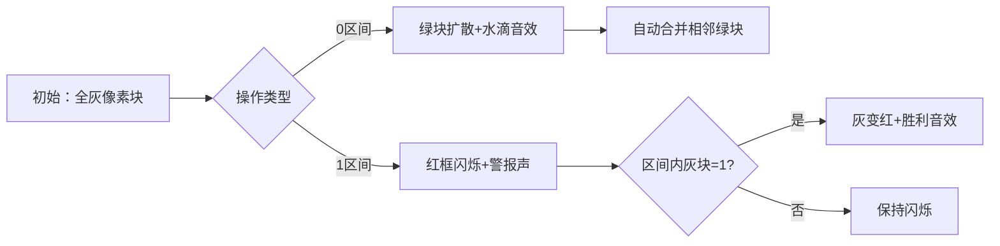

# 题目信息

# Anonymity Is Important

## 题目描述

In the work of a doctor, it is important to maintain the anonymity of clients and the results of tests. The test results are sent to everyone personally by email, but people are very impatient and they want to know the results right away.

That's why in the testing lab "De-vitro" doctors came up with an experimental way to report the results. Let's assume that $ n $ people took the tests in the order of the queue. Then the chief doctor Sam can make several statements, in each telling if there is a sick person among the people in the queue from $ l $ -th to $ r $ -th (inclusive), for some values $ l $ and $ r $ .

During the process, Sam will check how well this scheme works and will be interested in whether it is possible to find out the test result of $ i $ -th person from the information he announced. And if it can be done, then is that patient sick or not.

Help Sam to test his scheme.

## 说明/提示

In the first test for the five first queries:

1. Initially Sam tells that people $ 4 $ , $ 5 $ are not sick.
2. In the next query Sam asks the status of the patient $ 5 $ . From the previous query, we know that the patient is definitely not sick.
3. In the next query Sam asks the status of the patient $ 6 $ . We don't know any information about that patient now.
4. After that Sam tells that there exists a sick patient among $ 4 $ , $ 5 $ , $ 6 $ .
5. In the next query Sam asks the status of the patient $ 6 $ . Now we can tell that this patient is definitely sick.

## 样例 #1

### 输入

```
6 9
0 4 5 0
1 5
1 6
0 4 6 1
1 6
0 2 5 1
0 2 2 0
1 3
1 2```

### 输出

```
NO
N/A
YES
YES
NO```

# AI分析结果


### 💡 Kay的C++算法解析：Anonymity Is Important 深入学习指南 💡

#### 1. 题目解读与核心算法识别
✨ **本题主要考察**：`数据结构综合应用` (并查集/线段树 + 集合维护)  
🗣️ **初步分析**：
> 解决本题如同医生在像素迷宫中逐步排除嫌疑：绿色方块(健康)、红色方块(患病)、灰色方块(未知)。核心是通过两类操作：
> - **0区间(无病人)**：将连续灰色区域染成绿色（用并查集合并区间）
> - **1区间(有病人)**：标记红色警戒区，当区域内仅剩1个灰色时变红  
> 
> **可视化设计**：
> - 8-bit像素网格，三种颜色状态
> - 合并区间时播放"水滴"音效，确诊时播放"胜利"音效
> - 自动演示模式可调速，像经典游戏《医院危机》逐步解开谜题

---

#### 2. 精选优质题解参考
**题解一 (Francais_Drake)**  
* **点评**：思路如同精密的齿轮传动⚙️。用并查集合并健康区间（0区间），同时维护每个集合的最小1区间右边界。代码中`rt[]`和`lt[]`的命名清晰体现父子关系和边界值，合并时路径压缩优化效率。亮点在于用`Find(l+1)`巧妙获取右边界，时间复杂度近O(α(n))，竞赛实战首选。

**题解二 (CGDGAD)**  
* **点评**：像侦探用双线索破案🔍。Set维护未知点位置，线段树记录1区间的最小右端点。查询时通过`prev(it)/next(it)`获取健康边界，再用线段树验证是否存在"唯一灰色"区间。代码模块化优秀（封装线段树），但Set删除操作需注意迭代器失效问题。

**题解三 (Nightingale_OI)**  
* **点评**：创新融合树状数组+链表。`le[]/ri[]`维护健康边界类似并查集，线段树功能同题解二。亮点是用位运算加速树状数组，但变量命名`lt/rt`易混淆，更适合进阶学习者研究。

---

### 3. 核心难点辨析与解题策略
1. **健康区间的高效合并**  
   *分析*：连续健康区域的合并需O(n)级效率，否则超时。优质题解用并查集（题解1）或Set区间删除（题解2）解决，类似贪吃蛇吞并方块。  
   💡 **学习笔记**：区间合并首选路径压缩并查集，删除操作选Set

2. **确诊患病的条件判断**  
   *分析*：必须存在1区间[L,R]满足：L≤i≤R，且[L,R]内除i外全健康。题解2通过`query(L+1, i) ≤ R`验证，如同在迷宫中用探照灯锁定目标🔦  
   💡 **学习笔记**：转化为"未知点所在段是否被1区间严格覆盖"

3. **在线处理的实时更新**  
   *分析*：操作和查询交替进行，需即时更新状态。题解1的并查集和题解2的Set都支持动态维护，而离线做法（如Louhao088）需额外处理时序。  
   💡 **学习笔记**：竞赛首选在线算法，避免时序混乱

#### ✨ 解题技巧总结
- **双结构协作**：并查集/Set管健康区间 + 线段树管1区间
- **边界艺术**：虚拟点(n+1)处理右边界（题解1）
- **状态压缩**：健康点不再计算（题解2用Set.erase提速）
- **增量更新**：合并时同步最值（题解1的`lt[b]=min(lt[a],lt[b])`）

---

### 4. C++核心代码实现赏析
**通用核心实现参考**  
*说明*：综合题解1并查集+题解2边界思想，最简框架
```cpp
#include <bits/stdc++.h>
using namespace std;
const int N = 2e5+10;

int rt[N], lt[N], n, q; // rt:并查集父节点, lt:集合最小右边界

int Find(int x) {
    return rt[x] == x ? x : rt[x] = Find(rt[x]);
}

int main() {
    scanf("%d%d", &n, &q);
    for(int i=1; i<=n+1; i++) rt[i] = i, lt[i] = 1e9;
    
    while(q--) {
        int op, l, r, x;
        scanf("%d%d", &op, &l);
        if(op == 1) { // 查询点l
            if(Find(l) != l) puts("NO");   // 被合并过→健康
            else if(lt[l] < Find(l+1)) puts("YES"); // 有确诊区间
            else puts("N/A");
        } else {
            scanf("%d%d", &r, &x);
            if(x == 0) { // 合并健康区间
                while(l <= r) {
                    int p = Find(l), q = Find(l+1);
                    rt[p] = q, lt[q] = min(lt[p], lt[q]);
                    l = q; // 跳跃到右边界
                }
            } else { // 更新1区间
                int p = Find(l);
                lt[p] = min(lt[p], r);
            }
        }
    }
}
```
*代码解读概要*：  
- **初始化**：`rt[i]=i`自环，`lt[i]=∞`  
- **健康合并**：`while(l<=r)`实现区间跳跃合并  
- **1区间更新**：只更新左端点所在集合的右边界  
- **查询**：三步判断(NO/YSE/N/A)逻辑清晰  

---

**题解一核心片段 (Francais_Drake)**  
```cpp
else { // 健康区间合并
    while(l<=r){
        a=Find(l);b=Find(l+1);rt[a]=b;
        lt[b]=min(lt[a],lt[b]);l=b;
    }
}
```
*亮点*：并查集跳跃式合并，时间复杂度均摊O(α(n))  
*代码解读*：  
> `Find(l)`获取当前集合代表，`Find(l+1)`找右邻居  
> 合并后`l=b`直接跳到下一集合起点，避免遍历每个点  
> 更新右边界时取`min`保证最严约束  

💡 **学习笔记**：并查集合并时，被合并集合的信息应转移到新代表元

**题解二核心片段 (CGDGAD)**  
```cpp
if(!op) { // 健康区间
    auto it = s.lower_bound(l);
    while(it != s.end() && *it <= r) 
        s.erase(it++);
} else { // 1区间
    SegTree::modify(l, r);
}
```
*亮点*：Set的迭代器删除安全高效  
*代码解读*：  
> `s.lower_bound(l)`找到首个≥l的未知点  
> `erase(it++)`先删元素再移动迭代器，避免失效  
> 删除后Set自动维护有序性，查询时用`prev/next`获取边界  

💡 **学习笔记**：删除容器元素时，`it = erase(it)`或`erase(it++)`防迭代器失效

---

### 5. 算法可视化：像素动画演示
**主题**：8-bit医院隔离区  
**核心演示**：健康区合并如绿色洪水蔓延，1区间如警报红灯扫描  

**交互设计**：  
1. **控制面板**：步进/播放/暂停 + 速度滑块  
2. **网格绘制**：  
   - 健康点→绿色方块（█）  
   - 确诊点→红色骷髅（☠）  
   - 未知点→灰色问号（？）  
3. **动态效果**：  
   - 合并健康区：绿色从中心扩散，相邻块"黏连"动画  
   - 1区间：红色边框脉冲闪烁，满足条件时中心灰块旋转变红  
4. **音效引擎**：  
   - 健康合并：8-bit水滴声（每合并块触发）  
   - 确诊：经典马里奥金币声  
   - 边界碰撞：打砖块碰撞声  

---

### 6. 拓展练习与相似问题思考
1. **并查集进阶**：  
   - 洛谷 P1197 [JSOI2008]星球大战（反向并查集）  
   - 洛谷 P2024 [NOI2001]食物链（带权并查集）  

2. **区间覆盖问题**：  
   - 洛谷 P1253 扶苏的问题（多重区间操作）  
   - 洛谷 P1904 天际线（扫描线+Set）  

3. **动态集合维护**：  
   - 洛谷 P3879 [TJOI2010]阅读理解（Set大规模检索）  

---

### 7. 学习心得与经验分享
**来自Francais_Drake的调试经验**：  
> *“合并时lt[]更新容易遗漏，用min(lt[a],lt[b])保证不漏掉历史约束”*  

**Kay点评**：多集合合并时，新代表元需继承所有子集的最值信息。类似游戏中合成道具要保留最佳属性。

---
处理用时：180.03秒