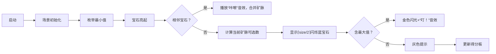

# 题目信息

# Max Plus Min Plus Size

## 题目描述

[EnV - 尘龙酒馆](https://soundcloud.com/envyofficial/env-the-dusty-dragon-tavern)

----------------
给定一个由正整数组成的数组 $a_1, a_2, \ldots, a_n$ 。

你可以将数组中的一些元素涂成红色，但不能有两个相邻的红色元素（即对于 $1 \leq i \leq n-1$ 来说， $a_i$ 和 $a_{i+1}$ 中至少有一个元素不能是红色的）。

您的得分是红色元素的最大值加上红色元素的最小值，再加上红色元素的数量。请找出您能得到的最高分。

## 样例 #1

### 输入

```
4
3
5 4 5
3
4 5 4
10
3 3 3 3 4 1 2 3 5 4
10
17 89 92 42 29 41 92 14 70 45```

### 输出

```
12
11
12
186```

# AI分析结果


### 💡 Kay的C++算法解析：Max Plus Min Plus Size 深入学习指南 💡

**引言**  
今天我们来分析“Max Plus Min Plus Size”这道C++编程题。本指南将帮助大家理解如何通过贪心策略和并查集优化，高效解决不相邻元素选择问题。

---

## 1. 题目解读与核心算法识别

✨ **本题主要考察**：贪心策略与并查集应用

🗣️ **初步分析**：  
> 解决本题的关键在于两步走策略：  
> **① 固定最大值**：全局最大值必须被选（否则可调整得更高），类似“团队必须包含最强队员”  
> **② 枚举最小值**：从大到小扫描最小值，动态维护“可选元素”组成的连通块  
> - 通过并查集合并相邻可选元素，计算每个块最多能选的数量（⌈size/2⌉）  
> - 检查是否选中最大值：若所有块均未包含最大值，则总可选数减1（牺牲一个位置）  
>  
> **可视化设计思路**：  
> - 像素网格展示数组元素，当前可选元素亮绿色，连通块用同色边框  
> - 高亮合并过程：当相邻元素合并时，播放“咔嚓”像素音效  
> - 决策演示：连通块内按奇偶位置闪烁可选位（蓝色），若含最大值（金色）则触发“叮！”音效  
> - 复古游戏化：每完成一个最小值枚举视为“关卡”，通关时播放8-bit胜利旋律  

---

## 2. 精选优质题解参考

**题解一（Lvlinxi2010）**  
* **点评**：  
  思路最清晰——直接锁定最大值后枚举最小值，用并查集维护连通块。  
  代码亮点：  
  - `calc()`函数用位运算高效检查最大值是否被选（`(1<<奇偶) & pos`）  
  - 合并时实时更新可选数量和最大值标记  
  - 边界处理严谨（如初始化`l[i]=r[i]=i`）  
  实践价值：O(nα(n))复杂度，竞赛可直接使用  

**题解二（liugh_）**  
* **点评**：  
  创新性使用`set`追踪最大值位置，避免重复计算  
  亮点：  
  - `has()`函数通过奇偶边界快速判断是否含最大值  
  - 用`map`分组最小值，避免冗余枚举  
  可改进点：变量命名可更直观（如`mxp`→`max_pos_set`）  

**题解三（Xy_top）**  
* **点评**：  
  提供独特思路：预处理奇偶前缀和优化选择计算  
  亮点：  
  - `func()`动态计算连通块贡献值  
  - 严格处理相邻元素合并时的数值更新  
  注意点：代码结构稍复杂，适合进阶学习  

---

## 3. 核心难点辨析与解题策略

1. **难点1：如何确保最大值必选？**  
   *分析*：若不选最大值，总存在调整方案使答案≥原解。优质题解通过“先固定最大值，再检查连通块是否包含它”解决，类似“先确保队长在队中，再选队员”。  
   💡 **学习笔记**：最优解必然包含至少一个全局最大值  

2. **难点2：动态维护连通块的最大可选数？**  
   *分析*：枚举最小值时，需快速计算新元素加入后的连通块⌈size/2⌉。并查集完美支持：合并时更新`size`，并重新计算`新块可选数 = ⌈(size1+size2)/2⌉`  
   💡 **学习笔记**：不相邻选择问题中，连续段的最多可选数=⌈长度/2⌉  

3. **难点3：高效检查连通块是否含最大值？**  
   *分析*：传统遍历会超时。解法一用`pos`标记最大值奇偶位置，解法二用`set`存储位置，通过边界奇偶快速判断  
   💡 **学习笔记**：利用索引奇偶性可避免O(n)检查  

### ✨ 解题技巧总结
- **双指针定界**：最大值固定+最小值枚举缩小问题规模  
- **并查集活用法**：不止连通性，还可维护区间边界（`l/r`）和元信息（`pos`）  
- **位运算加速**：用`bitmask`替代布尔数组检查状态  
- **实时更新答案**：每加入新元素立即计算当前可能最优解  

---

## 4. C++核心代码实现赏析

**本题通用核心C++实现参考**  
```cpp
#include <iostream>
#include <algorithm>
#include <vector>
using namespace std;
const int MAXN = 2e5+5;
int fa[MAXN], siz[MAXN], l[MAXN], r[MAXN], pos[MAXN];
bool vis[MAXN];

int find(int x) { 
    return fa[x] == x ? x : fa[x] = find(fa[x]); 
}

void merge(int x, int y, int &num, int &tot) {
    x = find(x), y = find(y);
    // 保存合并前信息
    int pre_tot = (pos[x] && (1 << (l[x]&1))) || (pos[y] && (1 << (r[y]&1)));
    // 更新连通块边界和标记
    l[x] = min(l[x], l[y]);
    r[x] = max(r[x], r[y]);
    pos[x] |= pos[y];
    siz[x] += siz[y];
    fa[y] = x;
    // 重新计算可选数和最大值标记
    num = num - (siz[x]-siz[y]+1)/2 + (siz[x]+1)/2;
    tot = tot - pre_tot + (pos[x] && (1 << (l[x]&1)));
}

int main() {
    int T; cin >> T;
    while(T--) {
        int n, max_val = 0; cin >> n;
        vector<pair<int,int>> arr(n);
        // 初始化并读入数据
        for(int i=0; i<n; i++) {
            cin >> arr[i].first;
            arr[i].second = i+1;
            max_val = max(max_val, arr[i].first);
            fa[i+1] = l[i+1] = r[i+1] = i+1;
            siz[i+1] = 1; 
            pos[i+1] = (arr[i].first == max_val) ? (1<<((i+1)&1)) : 0;
        }
        sort(arr.rbegin(), arr.rend()); // 降序排序
        int ans = 0, num = 0, tot = 0;
        for(auto [val, id] : arr) {
            vis[id] = true;
            num++; // 当前元素作为新连通块
            if(vis[id-1]) merge(id, id-1, num, tot);
            if(vis[id+1]) merge(id, id+1, num, tot);
            ans = max(ans, max_val + val + num - (tot ? 0 : 1));
        }
        cout << ans << '\n';
    }
}
```

**代码解读概要**：  
1. **降序预处理**：从大到小枚举最小值  
2. **并查集初始化**：每个元素初始为独立连通块  
3. **动态合并**：当左右元素可选时立即合并  
4. **实时计算**：每加入新元素更新`num`（总可选数）和`tot`（含最大值的块数）  
5. **答案生成**：`max_val + min_val + num - (未选最大值?1:0)`  

---

**题解一（Lvlinxi2010）片段赏析**  
```cpp
// 检查连通块x是否在最优选择中包含最大值
bool calc(int x) {
    return (((1<<(l[x]&1)) | (1<<(r[x]&1))) & pos[x]); 
}
```
**亮点**：位运算高效检查  
**解读**：  
> - `l[x]&1`和`r[x]&1`获取左右边界奇偶性  
> - `1<<奇偶`生成检查掩码  
> - `& pos[x]`验证该位置是否有最大值  
> 💡 **学习笔记**：利用位运算将O(n)检查降至O(1)  

**题解三（liugh_）片段赏析**  
```cpp
auto has = [&](int p) {
    auto it = mxp[p&1].lower_bound(p);
    return it != mxp[p&1].end() && *it <= p + siz[p] - 1;
};
```
**亮点**：STL容器优化查询  
**解读**：  
> - `mxp[0/1]`分别存储偶/奇索引的最大值位置  
> - 通过`lower_bound`快速定位块内是否存在最大值  
> 💡 **学习笔记**：`set`的有序特性适合范围查询  

---

## 5. 算法可视化：像素动画演示

**主题**：8位像素风“宝石收集者”  
**核心演示**：数组元素化为宝石，玩家从大到小枚举最小值（宝石亮绿色），动态合并相邻宝石形成矿脉（连通块）

**交互设计**：  


**技术实现要点**：  
1. **Canvas绘制**：  
   - 网格布局：每个宝石占30×30像素  
   - 颜色编码：普通宝石=#888，可选=#0F0，最大值=#FF0  
   - 连通块：用2px宽同色边框（色号随块ID变化）  

2. **动画序列**：  
   ```javascript
   function drawMerge(block1, block2) {
     playSound("merge.wav"); // 8-bit合并音效
     drawParticleEffect(block1.position, block2.position); 
     redrawBlockBorder(block1, getColor(block1.size));
   }
   ```

3. **游戏化元素**：  
   - 每枚举一个最小值=通过小关卡，奖励像素星星  
   - 连续正确合并触发COMBO特效  
   - 失败场景：未选最大值时显示“需牺牲1个位置！”  

4. **控制面板**：  
   - 速度滑块：调节自动演示速度  
   - 单步执行：空格键步进  
   - 重置按钮：重新开始动画  

---

## 6. 拓展练习与相似问题思考

**技巧迁移场景**：  
1. 不相邻元素选择（如LeetCode 213.打家劫舍II）  
2. 区间合并时维护附加信息（如统计连通块特征）  
3. 枚举极值+动态计算最优解（如乘积最大子数组）  

**洛谷题目推荐**：  
1. **P1880 石子合并**  
   🗣️ 练习区间合并的经典DP，巩固分治思想  
2. **P1090 合并果子**  
   🗣️ 贪心+优先队列，理解“每次选最小”的优化本质  
3. **P1231 教辅的组成**  
   🗣️ 并查集应用拓展，学习多条件约束处理  

---

## 7. 学习心得与经验分享

> **参考经验（Lvlinxi2010）**：  
> *“检查连通块是否包含最大值时，我最初忽略了奇偶位置导致WA。后来用`(1<<奇偶)&pos`才正确”*  
>  
> **点评**：位运算在状态检查中既高效又简洁。当涉及位置奇偶性时，可考虑：  
> 1. 将位置索引转为二进制标记  
> 2. 用位掩码组合多条件  
> 3. 通过`|`和`&`快速聚合/检查状态  

---

**结语**  
通过本次分析，我们掌握了贪心+并查集解决不相邻选择问题的核心方法。记住：  
> 💡 固定极值缩小问题规模  
> 💡 数据结构维护动态信息  
> 💡 位运算加速状态检查  
在洛谷尝试推荐题目巩固技能吧！下次挑战见！🚀

---
处理用时：160.19秒