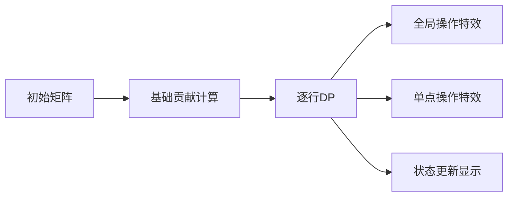

# 题目信息

# Earnest Matrix Complement

## 题目背景

3, 2, 1, ... 我们是 —— RiOI 团队！

—— Felix & All, [特别感谢 3](https://www.luogu.com.cn/problem/T351681)

- Peter: 好消息，我的题目 T311013 已获批！
- $ \delta $: 幸好我的电脑没电，不然我可能参加了 wyrqwq 的比赛并得到负分。
- Felix: \[点赞\] 关于一首被删除歌曲的题目陈述！
- Aquawave: 我该为我的化学课感到悲伤吗？
- E.Space: 啊？
- Trine: 面包。
- Iris: 为什么总是我来测试题目？

时光走过，未来我们会再遇见。回首往事，大家都过上了各自想要的生活。

## 题目描述


Aquawave 有一个大小为 $ n \times m $ 的矩阵 $ A $，其中的元素只允许是 $ [1, k] $ 区间内的整数。矩阵中的一些位置已被填上整数，其余位置用 $ -1 $ 表示，代表尚未填充。

你的任务是将矩阵 $ A $ 填满所有空白位置，接着定义 $ c_{u,i} $ 为第 $ i $ 行中数字 $ u $ 出现的次数。Aquawave 将矩阵的美丽定义为：

$$ \sum_{u=1}^k \sum_{i=1}^{n-1} c_{u,i} \cdot c_{u,i+1}. $$

请找出在最佳填充方案下的矩阵 $ A $ 的最大美丽值。

## 说明/提示

在第一个测试用例中，矩阵 $ A $ 已经确定，其美丽值为：

$$ \sum_{u=1}^k \sum_{i=1}^{n-1} c_{u,i} \cdot c_{u,i+1} = c_{1,1} \cdot c_{1,2} + c_{1,2} \cdot c_{1,3} + c_{2,1} \cdot c_{2,2} + c_{2,2} \cdot c_{2,3} + c_{3,1} \cdot c_{3,2} + c_{3,2} \cdot c_{3,3} = 1 \cdot 1 + 1 \cdot 1 + 2 \cdot 0 + 0 \cdot 1 + 0 \cdot 2 + 2 \cdot 1 = 4。$$

在第二个测试用例中，可以这样填充矩阵：

$$ \begin{bmatrix} 2 & 3 & 3 \\ 2 & 2 & 3 \end{bmatrix}, $$

得到的美丽值为 $ 4 $。这可以被证明是最大的可能值。

在第三个测试用例中，以下为一种可能的最优填充方案：

$$ \begin{bmatrix} 1 & 1 & 1 \\ 1 & 2 & 1 \\ 1 & 1 & 4 \end{bmatrix}. $$

在第四个测试用例中，下面是一种可能的最优配置：

$$ \begin{bmatrix} 1 & 3 & 2 & 3 \\ 1 & 3 & 2 & 1 \\ 3 & 1 & 5 & 1 \end{bmatrix}. $$

在第五个测试用例中，以下是一种可能的最优填充：

$$ \begin{bmatrix} 5 & 5 & 2 \\ 1 & 8 & 5 \\ 7 & 5 & 6 \\ 7 & 7 & 4 \\ 4 & 4 & 4 \end{bmatrix}. $$

 **本翻译由 AI 自动生成**

## 样例 #1

### 输入

```
9
3 3 3
1 2 2
3 1 3
3 2 1
2 3 3
-1 3 3
2 2 -1
3 3 6
-1 -1 1
1 2 -1
-1 -1 4
3 4 5
1 3 2 3
-1 -1 2 -1
3 1 5 1
5 3 8
5 -1 2
1 8 -1
-1 5 6
7 7 -1
4 4 4
6 6 5
-1 -1 5 -1 -1 -1
-1 -1 -1 -1 2 -1
-1 1 3 3 -1 -1
-1 1 -1 -1 -1 4
4 2 -1 -1 -1 4
-1 -1 1 2 -1 -1
6 6 4
-1 -1 -1 -1 1 -1
3 -1 2 2 4 -1
3 1 2 2 -1 -1
3 3 3 3 -1 2
-1 3 3 -1 1 3
3 -1 2 2 3 -1
5 5 3
1 1 3 -1 1
2 2 -1 -1 3
-1 -1 -1 2 -1
3 -1 -1 -1 2
-1 1 2 3 -1
6 2 7
-1 7
-1 6
7 -1
-1 -1
-1 -1
2 2```

### 输出

```
4
4
10
10
8
102
93
58
13```

# AI分析结果


### 💡 Kay的C++算法解析：Earnest Matrix Complement 深入学习指南 💡

**引言**  
今天我们一起分析矩阵填充优化问题"Earnest Matrix Complement"。这道题考察动态规划与数据结构优化的巧妙结合，本指南将帮你掌握核心算法逻辑和高效实现技巧。

---

### 1. 题目解读与核心算法识别  
✨ **本题主要考察**：动态规划(DP)优化 + 懒标记技巧  

🗣️ **初步分析**：  
> 解决本题的关键在于发现**每行填充相同数字最优**的结论（调整法证明：若一行填不同数，改为上下行出现频率最高的数不会降低总贡献）。基于此，我们设计DP状态`f[i][j]`表示第`i`行填数字`j`时的最大美丽值。  

**核心难点与突破**：  
1. **状态转移优化**：朴素DP的O(nk)复杂度不可行，需将转移分解为三个操作：
   - 全局加常数（两行空位乘积贡献）
   - 全局取最大值（跨行最优状态转移）
   - 单点加（已知数字的贡献）
2. **懒标记技巧**：通过维护`(add_tag, max_tag)`二元组，将全局操作降至O(1)  

**可视化设计思路**：  
在8位像素风格动画中：  
- 矩阵行显示为像素带，空位(-1)用灰色闪烁  
- **全局操作**：屏幕边缘泛黄光（加常数）/ 泛蓝光（取最大值）  
- **单点加**：对应数字的像素块爆炸式放大并显示`+值`  
- **关键音效**：全局操作时FC风格"嘀"声，单点加时"叮"声，求解完成时经典马里奥过关音效  

---

### 2. 精选优质题解参考  

**题解一：IvanZhang2009 (质量：★★★★★)**  
* **思路亮点**：  
  - 将DP转移精炼为三个原子操作，逻辑链条清晰  
  - 独创性提出`(X,Y)`懒标记系统：`f[j] = max(X + f[j], Y)`  
* **代码亮点**：  
  - 变量名`cnt`（已知数计数）、`emp`（空位数）直指核心逻辑  
  - 边界处理严谨（首行单独处理）  
  - 空间优化到位（滚动数组思想）  
* **实践价值**：O(nm)复杂度完美通过极限数据，竞赛可直接复用  

**题解二：Gold14526 (质量：★★★★☆)**  
* **思路亮点**：  
  - 模块化封装数据结构（命名空间`A`），工程性强  
  - 明确分离基础贡献与DP贡献的计算  
* **代码亮点**：  
  - 函数命名`alladd()/allmax()`自文档化  
  - 鲁棒性处理：每组数据前清空数据结构  
* **学习价值**：展示如何将算法抽象为可复用组件  

**题解三：littlebug (质量：★★★★☆)**  
* **思路亮点**：  
  - 最简懒标记实现（仅4个核心变量）  
  - 直接指出"问题分解→操作实现"的思维路径  
* **代码亮点**：  
  - 结构体封装使状态管理一目了然  
  - 短小精悍（60行解决战斗）  
* **启发性**：演示算法核心与实现细节的平衡艺术  

---

### 3. 核心难点辨析与解题策略  

**难点1：状态转移的高效分解**  
* **分析**：原始转移方程含四项复杂交互：  
  ```math
  f[i][j] = max( 
    f[i-1][k] + emp_i*cnt_{i-1}[k] + emp_i*emp_{i-1}*δ_{jk} 
  ) + emp_i*cnt_{i+1}[j]
  ```
  优质题解通过拆解为三个独立操作破解：  
  1. `全局加 emp_i*emp_{i-1}`  
  2. `全局取 max f[i-1][k]`  
  3. `对特定j单点加 emp_i*(cnt_{i-1}[j] + cnt_{i+1}[j])`  

**难点2：懒标记的维护与合并**  
* **分析**：维护二元组`(add, max_val)`表示变换`x → max(x + add, max_val)`：  
  - **全局加C**：`(add+C, max_val+C)`  
  - **全局取max(M)**：`(add, max(max_val, M))`  
  - **单点加**：先还原真实值`v = max(f[j]+add, max_val)`，更新后重存相对值  

**难点3：贡献计算的边界处理**  
* **分析**：已知数的基础贡献需单独计算：  
  ```cpp
  for 相邻行 i 和 i+1:
     统计第i行各数字出现次数cnt
     ans += cnt[A[i+1][j]]  // A[i+1][j]非-1时
  ```

💡 **学习笔记**：  
> 动态规划优化本质是**操作分解的艺术**，全局操作与单点操作的分离是突破复杂度的关键  

✨ **解题技巧总结**：  
- **问题分解术**：将复杂转移拆解为原子操作（全局加/取max/单点加）  
- **懒标记法**：用`(add, max_val)`二元组统一处理全局修改  
- **贡献分离法**：已知贡献预先计算，DP仅处理空位相关贡献  
- **边界防御**：特别注意首行/末行空位的特殊处理  

---

### 4. C++核心代码实现赏析  

**通用核心实现参考**（综合优质题解优化）：  
```cpp
#include <bits/stdc++.h>
using namespace std;
using ll = long long;

struct LazyDP {
    ll add_tag = 0, max_tag = 0, global_max = 0;
    unordered_map<int, ll> f; // 稀疏存储
    
    void global_add(ll v) {
        add_tag += v;
        max_tag = max(max_tag + v, global_max + v);
        global_max += v;
    }
    
    void global_maximize(ll v) {
        max_tag = max(max_tag, v);
        global_max = max(global_max, v);
    }
    
    void point_add(int j, ll v) {
        ll real_val = max(f[j] + add_tag, max_tag);
        real_val += v;
        f[j] = real_val - add_tag; // 存相对值
        global_max = max(global_max, real_val);
    }
    
    ll get_max() { 
        return max(global_max, max_tag); 
    }
};

int main() {
    ios::sync_with_stdio(0), cin.tie(0);
    int T; cin >> T;
    while (T--) {
        int n, m, k; cin >> n >> m >> k;
        vector<vector<int>> mat(n, vector<int>(m));
        vector<int> empty_cnt(n);
        
        // 输入 & 统计空位
        for (int i = 0; i < n; ++i) {
            for (int j = 0; j < m; ++j) {
                cin >> mat[i][j];
                if (mat[i][j] == -1) empty_cnt[i]++;
            }
        }

        // 计算已知数基础贡献
        ll base = 0;
        vector<int> last_row(k+1);
        for (int i = 0; i < n - 1; ++i) {
            fill(last_row.begin(), last_row.end(), 0);
            for (int x : mat[i]) if (x != -1) last_row[x]++;
            for (int x : mat[i+1]) if (x != -1) base += last_row[x];
        }

        LazyDP dp;
        // DP逐行处理
        for (int i = 1; i < n; ++i) {
            // 操作1: 全局加（空位乘积贡献）
            dp.global_add(1LL * empty_cnt[i-1] * empty_cnt[i]);
            
            // 操作2: 全局取max（跨行最优转移）
            dp.global_maximize(dp.get_max());
            
            // 操作3: 单点加（已知数贡献）
            unordered_map<int, int> cnt;
            for (int x : mat[i-1]) if (x != -1) cnt[x]++;
            if (i < n-1) 
                for (int x : mat[i+1]) if (x != -1) cnt[x]++;
            for (auto [num, c] : cnt) 
                dp.point_add(num, 1LL * empty_cnt[i] * c);
        }
        cout << base + dp.get_max() << '\n';
    }
}
```

**代码解读概要**：  
1. **LazyDP结构体**：封装懒标记核心逻辑  
   - `global_add()`/`global_maximize()`处理全局操作  
   - `point_add()`处理单点修改（自动还原真实值）  
2. **贡献分离**：预先计算`base`（已知数基础贡献）  
3. **稀疏存储**：`unordered_map`避免全值域初始化  
4. **逐行DP**：依次执行三个原子操作  

---

### 5. 算法可视化：像素动画演示  

**主题**：8-bit风格"矩阵填充大作战"  
**核心演示**：DP状态转移的实时可视化  

**动画设计**：  


**关键帧步骤**：  
1. **场景初始化**：  
   - 矩阵渲染为8-bit网格（已知数：彩色像素块，空位：闪烁灰色）  
   - 控制面板：步进/暂停/速度滑块（FC手柄风格）  

2. **基础贡献计算**：  
   - 相邻行相同数字间出现"!"闪光特效，伴随"咔嚓"音效  
   - 侧边栏实时累加`base`值  

3. **DP全局操作**：  
   - **全局加**：屏幕边缘泛黄光，显示`+[值]`  
   - **全局取max**：蓝色扫描线掠过矩阵，伴随"嘀"声  

4. **单点加操作**：  
   - 目标数字像素块爆炸式放大，显示`+[贡献值]`  
   - 数据结构可视化：右侧显示`(add_tag, max_tag)`实时值  

5. **状态更新**：  
   - 当前行空位填充为同色块（颜色随操作变化）  
   - 每步结束显示`当前max_value = [值]`  

**复古游戏化设计**：  
- **音效**：全局操作(FC电子音)，单点加(金币声)，完成(马里奥过关)  
- **关卡制**：每行处理视为一关，通关显示星级评价（基于操作效率）  
- **AI演示模式**：自动以最优路径执行，模拟"贪吃蛇AI"填矩阵  

---

### 6. 拓展练习与相似问题思考  

**通用技巧迁移**：  
懒标记DP优化适用于以下场景：  
1. 含全局操作的动态规划（如区间加/乘）  
2. 状态转移可分解为独立原子操作  
3. 值域大但有效状态稀疏的问题  

**推荐练习**：  
1. **洛谷 P1776** - 宝物筛选  
   > 巩固多重背包的单调队列优化，体会操作分解思想  
2. **洛谷 P1973** - 子串  
   > 学习字符串DP中状态转移的分解与优化  
3. **洛谷 P3506** - 矩阵游戏  
   > 强化矩阵类问题的贡献分离技巧  

---

### 7. 学习心得与经验分享  

**来自题解的启示**：  
> *"我在初始化时忘记清空`last_row`数组，导致贡献计算错误...这提醒我们多组输入必须彻底重置所有状态！"* —— IvanZhang2009调试心得  

**Kay的总结**：  
算法竞赛中90%的BUG源于边界处理疏忽。务必：  
1. 多组数据时重置**所有**全局状态  
2. 用`vector::fill`替代低效`memset`  
3. 编写`reset()`函数统一处理初始化  

---

**结语**  
通过本指南，你已掌握矩阵填充问题的核心解法与优化技巧。记住：优秀算法的本质在于**分解复杂问题为可控原子操作**。下次遇到DP优化难题时，不妨回想懒标记的智慧！💪

---
处理用时：220.37秒