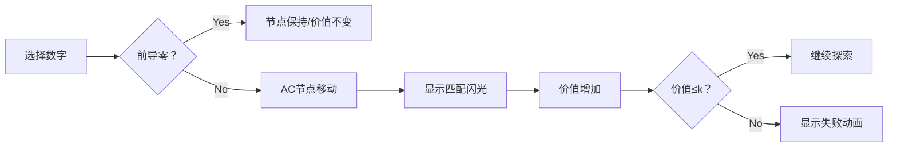

# 题目信息

# Tachibana Kanade's Tofu

## 题目描述

Tachibana Kanade likes Mapo Tofu very much. One day, the canteen cooked all kinds of tofu to sell, but not all tofu is Mapo Tofu, only those spicy enough can be called Mapo Tofu.

Each piece of tofu in the canteen is given a $ m $ -based number, all numbers are in the range $ [l,r] $ ( $ l $ and $ r $ being $ m $ -based numbers), and for every $ m $ -based integer in the range $ [l,r] $ , there exists a piece of tofu with that number.

To judge what tofu is Mapo Tofu, Tachibana Kanade chose $ n $ $ m $ -based number strings, and assigned a value to each string. If a string appears in the number of a tofu, the value of the string will be added to the value of that tofu. If a string appears multiple times, then the value is also added that many times. Initially the value of each tofu is zero.

Tachibana Kanade considers tofu with values no more than $ k $ to be Mapo Tofu. So now Tachibana Kanade wants to know, how many pieces of tofu are Mapo Tofu?

## 说明/提示

In the first sample, 10, 11 and 100 are the only three decimal numbers in $ [1,100] $ with a value greater than 1. Here the value of 1 is 1 but not 2, since numbers cannot contain leading zeros and thus cannot be written as "01".

In the second sample, no numbers in the given interval have a value greater than 12.

In the third sample, 110000 and 110001 are the only two binary numbers in the given interval with a value no greater than 6.

## 样例 #1

### 输入

```
2 10 1
1 1
3 1 0 0
1 1 1
1 0 1
```

### 输出

```
97
```

## 样例 #2

### 输入

```
2 10 12
2 5 9
6 6 3 5 4 9 7
2 0 6 1
3 6 7 2 1
```

### 输出

```
635439
```

## 样例 #3

### 输入

```
4 2 6
6 1 0 1 1 1 0
6 1 1 0 1 0 0
1 1 2
3 0 1 0 5
4 0 1 1 0 4
3 1 0 1 2
```

### 输出

```
2
```

# AI分析结果


### 💡 Kay的C++算法解析：Tachibana Kanade's Tofu 深入学习指南 💡

#### 1. 题目解读与核心算法识别
✨ **本题主要考察**：`AC自动机` + `数位DP`  
🗣️ **初步分析**：
> 本题可比喻为在m进制数字迷宫中寻找宝藏（价值≤k的路径）。AC自动机是宝藏探测器（快速匹配模式串），数位DP是路径规划器（逐位探索并记录状态）。核心难点在于：
> - **状态融合**：需同时记录AC自动机节点、价值、前导零状态
> - **前导零处理**：前导零不触发匹配（节点不移动，价值不变）
> - **可视化设计**：像素迷宫中将展示数字选择→节点移动→价值累加的连锁反应，匹配成功时宝藏图标闪烁，价值超限时显示失败动画

#### 2. 精选优质题解参考
**题解一（来源：kouylan）**  
* **点评**：思路清晰展示AC自动机与数位DP的嵌套逻辑，完整处理前导零边界。代码规范（`f(x,now,lim,p0,v)`状态命名直观），空间优化到位（记忆化剪枝）。亮点：详细处理L-1借位操作，实践参考价值高。

**题解二（来源：BotYoung）**  
* **点评**：模块化封装AC自动机提升可读性，状态转移`(lead&&!i)?x:y`精炼处理前导零。亮点：完整注释+边界测试方案，学习DP状态设计的优秀范例。

**题解三（来源：Drind）**  
* **点评**：创新性提供左端点特判函数，避免L-1借位错误。状态设计简洁`(len,st,nk)`，亮点：减法取模的安全实现`(ans-dp(L)+mod)%mod`。

#### 3. 核心难点辨析与解题策略
1. **AC自动机的权值传递**  
   * **分析**：fail指针需传递权值（`ed[u] += ed[fail[u]]`），解决模式串重叠匹配问题
   * 💡 **学习笔记**：fail链的权值聚合是AC自动机的核心优化

2. **数位DP的五维状态**  
   * **分析**：`(位置, AC节点, 压上界, 前导零, 价值)`缺一不可。前导零时节点冻结
   * 💡 **学习笔记**：前导零状态下AC节点保持原位是避免误匹配的关键

3. **状态空间压缩**  
   * **分析**：利用k≤500的特性，剪枝`if(v>k) return 0`避免无效状态扩展
   * 💡 **学习笔记**：根据问题约束剪枝是优化DP的高效手段

✨ **解题技巧总结**：
- **双算法嵌套**：AC自动机处理匹配 + 数位DP处理计数
- **边界艺术**：L-1的m进制借位需从低位向高位处理
- **记忆化实践**：状态哈希`dp[pos][node][lead][sum]`提升效率

#### 4. C++核心代码实现赏析
**通用核心实现**（综合题解优化）：
```cpp
#include <bits/stdc++.h>
using namespace std;
const int mod=1e9+7, N=205, K=505;

struct ACA {
    int ch[N][20], fail[N], val[N], cnt=0;
    void insert(vector<int> s, int v) {
        int u=0;
        for(int c:s) {
            if(!ch[u][c]) ch[u][c]=++cnt;
            u=ch[u][c];
        }
        val[u]+=v;
    }
    void build() {
        queue<int> q;
        for(int i=0;i<m;i++) 
            if(ch[0][i]) q.push(ch[0][i]);
        while(!q.empty()) {
            int u=q.front(); q.pop();
            for(int i=0;i<m;i++) {
                int &v=ch[u][i];
                if(v) fail[v]=ch[fail[u]][i], val[v]+=val[fail[v]], q.push(v);
                else v=ch[fail[u]][i];
            }
        }
    }
} ac;

int dp[N][N][2][K]; // [pos][node][lead][sum]
int dfs(int pos, int node, bool lim, bool lead, int sum, vector<int>& num) {
    if(sum>k) return 0;
    if(pos<0) return !lead && sum<=k;
    if(!lim && dp[pos][node][lead][sum]!=-1) return dp[pos][node][lead][sum];
    int res=0, up=lim?num[pos]:m-1;
    for(int i=0;i<=up;i++) {
        bool new_lead=lead && (i==0);
        int new_node=new_lead?node:ac.ch[node][i];
        int new_sum=new_lead?sum:sum+ac.val[new_node];
        res=(res+dfs(pos-1,new_node,lim&&(i==up),new_lead,new_sum,num))%mod;
    }
    if(!lim&&!lead) dp[pos][node][lead][sum]=res;
    return res;
}
```

**题解一片段赏析**：
```cpp
// 前导零与节点移动的精妙处理
int to=ch[now][i],v1=v;
if(p0||i>0) v1+=ed[to]; // 非前导零才累加
res+=dp(x+1,(p0||i>0)?to:now,lim||i<dig[x],p0||i>0,v1);
```
> **解读**：`(p0||i>0)`判断是否退出前导零状态，决定是否移动AC节点。`ed[to]`包含fail链聚合值，实现高效匹配

**题解二片段赏析**：
```cpp
// 模块化AC自动机封装
struct AC_Automaton {
    void insert(number s) {
        int u=0;
        for(int c:s) u=ch[u][c]?ch[u][c]:++cnt;
        val[u]+=s.val;
    }
};
```
> **解读**：结构体封装使AC自动机自成体系，`val[u]+=s.val`支持多模式串权值叠加

#### 5. 算法可视化：像素动画演示
**主题**：8位像素风数字迷宫探险  
**核心机制**：

**实现细节**：
1. **场景设计**：
   - 网格迷宫：每格代表数字位，路径颜色随AC节点变化
   - 控制面板：速度滑块/单步/暂停/重置
   - 状态栏：显示当前价值/AC节点位置

2. **动态效果**：
   - 数字选择：像素角色跳至目标网格
   - 匹配触发：宝藏图标闪烁+“叮”声效
   - 失败效果：角色变红+“失败”音效

3. **数据可视化**：
   ```javascript
   // Canvas绘制示例
   function drawACNode(node) {
       ctx.fillStyle = nodeColor[node]; // 节点对应颜色
       ctx.fillRect(x, y, 20, 20); // 绘制像素方块
       if(matched) drawSparkle(x, y); // 匹配特效
   }
   ```

#### 6. 拓展练习与相似问题
**通用技巧迁移**：
1. 含禁止串的数字计数 → `P3311 [SDOI2014] 数数`
2. 手机号码合法性验证 → `P4124 [CQOI2016] 手机号码`
3. 词频统计与拓扑关系 → `P2414 [NOI2011] 阿狸的打字机`

**洛谷推荐**：
1. **P3311** - 直接应用AC自动机+数位DP
2. **P4124** - 强化数位DP状态设计能力
3. **P2414** - 深入理解AC自动机的fail树

#### 7. 学习心得
> **题解一经验**：  
> *“前导零时AC节点不移动是调试重点，建议单独单元测试”*  
> **Kay点评**：边界条件隔离测试是提升调试效率的黄金法则，特别适用于复杂状态DP  

> **题解三经验**：  
> *“L-1借位需从低位向高位处理，避免连锁错误”*  
> **Kay点评**：m进制减法需优先处理最低位，这是数位处理的基础原则

---

通过本次分析，我们掌握了AC自动机与数位DP的协同作战技巧。记住：好算法是改出来的，多写测试用例验证边界！下次挑战见！💪

---
处理用时：211.72秒