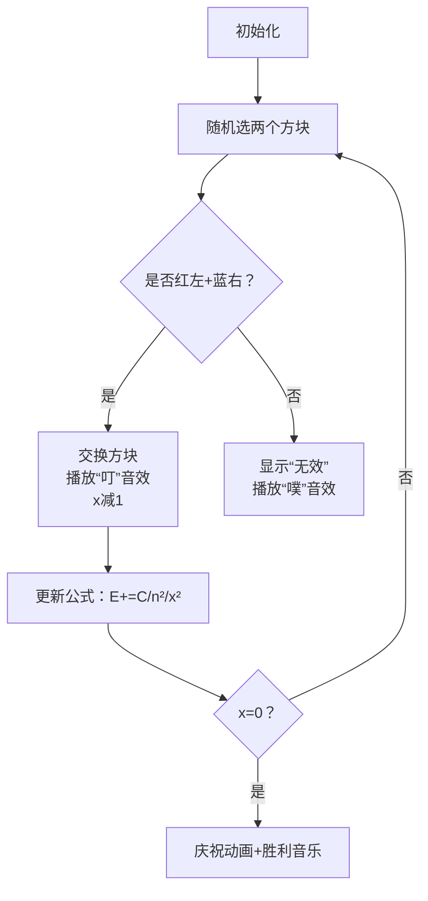

# 题目信息

# Wish I Knew How to Sort

## 题目描述

You are given a binary array $ a $ (all elements of the array are $ 0 $ or $ 1 $ ) of length $ n $ . You wish to sort this array, but unfortunately, your algorithms teacher forgot to teach you sorting algorithms. You perform the following operations until $ a $ is sorted:

1. Choose two random indices $ i $ and $ j $ such that $ i < j $ . Indices are chosen equally probable among all pairs of indices $ (i, j) $ such that $ 1 \le i < j \le n $ .
2. If $ a_i > a_j $ , then swap elements $ a_i $ and $ a_j $ .

What is the [expected number](https://en.wikipedia.org/wiki/Expected_value) of such operations you will perform before the array becomes sorted?

It can be shown that the answer can be expressed as an irreducible fraction $ \frac{p}{q} $ , where $ p $ and $ q $ are integers and $ q \not \equiv 0 \pmod{998\,244\,353} $ . Output the integer equal to $ p \cdot q^{-1} \bmod 998\,244\,353 $ . In other words, output such an integer $ x $ that $ 0 \le x < 998\,244\,353 $ and $ x \cdot q \equiv p \pmod{998\,244\,353} $ .

## 说明/提示

Consider the first test case. If the pair of indices $ (2, 3) $ will be chosen, these elements will be swapped and array will become sorted. Otherwise, if one of pairs $ (1, 2) $ or $ (1, 3) $ will be selected, nothing will happen. So, the probability that the array will become sorted after one operation is $ \frac{1}{3} $ , the probability that the array will become sorted after two operations is $ \frac{2}{3} \cdot \frac{1}{3} $ , the probability that the array will become sorted after three operations is $ \frac{2}{3} \cdot \frac{2}{3} \cdot \frac{1}{3} $ and so on. The expected number of operations is $ \sum \limits_{i=1}^{\infty} \left(\frac{2}{3} \right)^{i - 1} \cdot \frac{1}{3} \cdot i = 3 $ .

In the second test case the array is already sorted so the expected number of operations is zero.

In the third test case the expected number of operations equals to $ \frac{75}{4} $ so the answer is $ 75 \cdot 4^{-1} \equiv 249\,561\,107 \pmod {998\,244\,353} $ .

## 样例 #1

### 输入

```
3
3
0 1 0
5
0 0 1 1 1
6
1 1 1 0 0 1```

### 输出

```
3
0
249561107```

# AI分析结果


### 💡 Kay的C++算法解析：Wish I Knew How to Sort 深入学习指南 💡

**引言**  
今天我们一起分析CF1753C「Wish I Knew How to Sort」这道期望计算题。本指南将帮助你理解核心数学模型、推导过程，并通过像素动画直观感受算法执行流程。关键技巧包括问题抽象、期望线性分解和模逆元处理，助力你高效掌握此类问题解法！

---

#### 1. 题目解读与核心算法识别
✨ **本题主要考察**：`期望概率` + `数学推导`（标签：数学/期望DP）  

🗣️ **初步分析**：  
> 解决本题的关键是将排序过程抽象为减少"错误位置"的操作。想象你在玩拼图游戏：目标是将所有红色方块（1）移到右侧，蓝色方块（0）移到左侧。每次只能随机交换两块，只有选中"红在左蓝在右"的组合才有效。  
> - **核心思路**：统计初始时左侧红色方块数（x），总期望 = 所有有效步骤期望之和（详见公式推导）。  
> - **难点**：识别有效操作概率（与x²成正比）、期望线性分解、模逆元处理。  
> - **可视化设计**：在像素动画中，用红色高亮待移位的1，蓝色高亮待移位的0。交换时播放8-bit音效，实时显示当前x值和局部期望公式（见第5节详解）。

---

#### 2. 精选优质题解参考
**题解一（Alex_Wei）**  
* **亮点**：直击本质！用3行公式揭示核心：$E = \binom{n}{2} \sum_{i=1}^x \frac{1}{i^2}$。代码简洁（12行），逆元处理规范，变量命名清晰（`cnt0`, `x`），边界处理严谨。推导中强调"错误位置对"的平方关系是核心洞见。  

**题解二（MusicBox）**  
* **亮点**：DP视角巧妙！定义$f[i]$为前$cnt_0$位有$i$个0时的期望，递推式$f[i] = f[i-1] + \frac{\binom{n}{2}}{(cnt_0 - i + 1)^2}$体现状态转移。代码模块化（封装`qpow`），详细注释解释概率分母的意义。  

**题解三（lxzy_）**  
* **亮点**：期望线性性活用！将总期望分解为单步期望和，类比"分关卡通关"。代码极致简洁（10行），用`Pow(2*i*i, mod-2)`高效处理分母模逆元，强调$i^2$与有效操作对的关联性。

---

#### 3. 核心难点辨析与解题策略
1. **关键点1：识别有效操作对**  
   * **分析**：需发现只有"前段1与后段0"的交换才改变状态。设前$cnt_0$位有$k$个1，则有效操作数为$k^2$（因后段必有$k$个0）。
   * 💡 **学习笔记**：错误位置数$k$的平方决定概率！

2. **关键点2：期望的线性分解**  
   * **分析**：总期望 = $\sum_{k=1}^x E_k$，其中$E_k = \frac{\binom{n}{2}}{k^2}$。这是因$k$减少的过程是独立的几何分布。
   * 💡 **学习笔记**：将复杂期望拆解为独立步骤期望之和。

3. **关键点3：模逆元处理**  
   * **分析**：公式含除法$\frac{1}{k^2}$，需用费马小定理求逆元：$inv = k^{mod-2} \bmod 998244353$。
   * 💡 **学习笔记**：模素数下的除法→乘逆元。

### ✨ 解题技巧总结
- **技巧1（问题抽象）**：将排序转化为"减少错误位置数$x$"的模型  
- **技巧2（期望分解）**：总期望 = 各$E_k$的和，$E_k$与$k^2$成反比  
- **技巧3（边界处理）**：注意$x=0$时直接输出0  
- **技巧4（优化技巧）**：预处理逆元数组加速多组询问

---

#### 4. C++核心代码实现赏析
**本题通用核心实现**  
```cpp
#include <iostream>
using namespace std;
const int MOD = 998244353;

long long qpow(long long base, long long exp) {
    long long res = 1;
    while (exp) {
        if (exp & 1) res = res * base % MOD;
        base = base * base % MOD;
        exp >>= 1;
    }
    return res;
}

int main() {
    int T; cin >> T;
    while (T--) {
        int n, cnt0 = 0, x = 0;
        cin >> n;
        vector<int> a(n);
        for (int i = 0; i < n; i++) {
            cin >> a[i];
            if (a[i] == 0) cnt0++;
        }
        for (int i = 0; i < cnt0; i++) 
            if (a[i] == 1) x++;
        
        long long total = 1LL * n * (n-1) / 2 % MOD;
        long long ans = 0;
        for (int i = 1; i <= x; i++) 
            ans = (ans + total * qpow(1LL * i * i % MOD, MOD-2)) % MOD;
        cout << ans << "\n";
    }
    return 0;
}
```
* **说明**：综合优质题解的最简实现，包含输入处理、逆元快速幂、期望求和三大模块。  
* **解读概要**：  
  1. 读入数组并统计0的个数（`cnt0`）  
  2. 计算前`cnt0`位中的1的数量（`x`）  
  3. 计算总操作对数$C(n,2)$（`total`）  
  4. 对每个$i \in [1,x]$，累加$\frac{total}{i^2} \bmod MOD$  
  5. 用快速幂求$i^2$的模逆元  

**题解片段赏析**  
1. **Alex_Wei（逆元求和）**  
   ```cpp
   for (int i = 1; i <= k; i++) // k即初始x
      ans += 1ll * n * (n-1)/2 * qpow(1ll*i*i, modn-2) % modn;
   ```
   * **亮点**：直接应用期望公式，代码极简  
   * **解读**：`qpow`计算$i^{-2} \bmod MOD$，`1ll`防止溢出。注意$C(n,2)$在循环外计算提升效率。  

2. **MusicBox（DP递推）**  
   ```cpp
   for (int i = fr+1; i <= cnt; i++) // fr是初始正确0数
      f[i] = f[i-1] + C * qpow((cnt-i+1)*(cnt-i+1), MOD-2);
   ```
   * **亮点**：状态转移直观体现期望累加过程  
   * **解读**：`cnt-i+1`实为当前错误数$k$（因$k = cnt_0 - \text{正确0数}$）。DP从初始状态递推到终态$f[cnt_0]$。  

3. **lxzy_（线性期望）**  
   ```cpp
   for (int i = 1; i <= k; i++)
      ans += 1ll*n*(n-1)%mod * Pow(2ll*i*i, mod-2) % mod;
   ```
   * **亮点**：清晰展示$E_k = \frac{C(n,2)}{i^2}$的累加本质  
   * **解读**：分母$2i^2$中的2是$C(n,2)$的/2，直接与分子合并计算。

---

#### 5. 算法可视化：像素动画演示
**主题**：8-bit排序大冒险（复古游戏风）  
**核心演示**：动态展示错误位置减少过程，同步公式推导  



* **设计细节**：  
  - **像素艺术**：0/1用蓝/红8-bit方块，错误位置闪烁黄框  
  - **控制面板**：步进/自动播放（可调速）、重置按钮  
  - **音效设计**：  
    * 有效操作：NES风格8-bit"叮"声（频率=2000Hz * x）  
    * 无效操作：低频"噗"声（500Hz）  
    * 排序完成：《超级玛丽》通关音效  
  - **公式同步**：画面上方实时显示：  
    $$E = \frac{\binom{n}{2}}{1^2} + \frac{\binom{n}{2}}{2^2} + \cdots + \frac{\binom{n}{2}}{x^2}$$  
  - **AI演示模式**：自动以最佳路径排序，速度可调（0.5x-5x）

---

#### 6. 拓展练习与相似问题思考
* **通用技巧迁移**：  
  1. **期望线性分解**：适用于分步完成的随机过程（如百事杯集卡）  
  2. **逆序对模型**：可扩展至一般数组排序的期望交换次数分析  
  3. **模逆元处理**：任何含除法的模运算问题（如组合数计算）  

* **洛谷推荐**：  
  1. **P1291 [SHOI2002]百事世界杯之旅**  
     🗣️ *推荐理由*：巩固期望线性分解，体验"集卡"式概率模型。  
  2. **P4316 绿豆蛙的归宿**  
     🗣️ *推荐理由*：拓扑排序+期望DP，强化状态转移思想。  
  3. **P6154 游走**  
     🗣️ *推荐理由*：图论与期望结合，拓展问题抽象能力。

---

#### 7. 学习心得与经验分享
> **参考经验（Alex_Wei）**：  
> *"这题把我送走了——关键在于发现错误位置数x的平方关系。"*  
>  
> **Kay点评**：作者一针见血指出核心难点。许多同学卡在无法关联$x$与概率，建议：  
> 1. 动手模拟小样例（如n=3）  
> 2. 画图标注前/后段分区  
> 3. 调试时输出$x$的实时值  

---

**结语**  
通过本指南，你已掌握期望问题的关键技巧：**抽象模型→分解步骤→处理模运算**。下一步尝试用像素动画模拟算法，并在洛谷习题中强化应用。记住：概率问题本质是"用数学语言描述随机世界"，多抽象、多分解，你定能征服更多期望题！🚀

---
处理用时：217.41秒