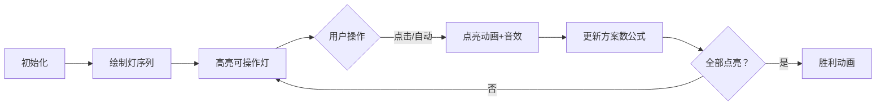

# 题目信息

# Shaass and Lights

## 题目描述

There are $ n $ lights aligned in a row. These lights are numbered $ 1 $ to $ n $ from left to right. Initially some of the lights are switched on. Shaass wants to switch all the lights on. At each step he can switch a light on (this light should be switched off at that moment) if there's at least one adjacent light which is already switched on.

He knows the initial state of lights and he's wondering how many different ways there exist to switch all the lights on. Please find the required number of ways modulo $ 1000000007 (10^{9}+7) $ .

## 样例 #1

### 输入

```
3 1
1
```

### 输出

```
1
```

## 样例 #2

### 输入

```
4 2
1 4
```

### 输出

```
2
```

## 样例 #3

### 输入

```
11 2
4 8
```

### 输出

```
6720
```

# AI分析结果


### 题目解读与核心算法识别
✨ **本题主要考察**：组合数学（计数问题）

🗣️ **初步分析**：
> 解决 "Shaass and Lights" 的关键在于运用组合数学技巧。想象一排灯被初始点亮的灯分割成多个独立区间，如同被点亮灯塔分隔的黑暗隧道。每个区间内的点亮操作有特定规则：
> - **中间区间**（两侧有亮灯）：每次可从左/右端点选择点亮，方案数为 $2^{len-1}$（$len$ 为区间长度）
> - **边界区间**（单侧有亮灯）：只能从亮灯侧单向点亮，方案数为 $1$
> 
> 总方案数 = $\frac{(n-m)!}{\prod (len_i!)}$（多重集排列） × $\prod_{中间区间} 2^{len_j-1}$（区间独立方案）
> 
> **可视化设计**：采用8位像素风格，灯用黄/灰方块表示。动画高亮当前可操作灯（绿框），点灯时播放"叮"声并显示方案数计算公式。控制面板支持单步/自动模式（调速滑块），结束播放胜利音效。

---

### 精选优质题解参考
**题解一（RedreamMer）**  
* **点评**：思路清晰拆解区间，推导出组合数核心公式。代码规范（预处理阶乘/逆元），巧妙处理边界（$len=0$ 跳过）。复杂度 $O(n \log n)$，竞赛实用性强。亮点：完整状态转移推导和边界处理。

**题解二（StillEmpty）**  
* **点评**：创新性将操作序列抽象为多重集排列，公式推导直观。预处理阶乘逆元优化计算（$O(1)$ 组合数），变量命名明确（`frat`/`pow2`）。实践价值高，尤其适合数学基础扎实的学习者。

**题解三（RockyYue）**  
* **点评**：三类区间分类讨论简洁（中间/左端/右端），递推法预处理组合数表降低常数。代码结构工整（模块化初始化），但需注意右端区间处理（原文未显式处理，需补充 $res \times C[k][n-a_m]$）。

---

### 核心难点辨析与解题策略
1. **区间划分与点亮规则**  
   * **分析**：初始亮灯将序列分割为独立区间，中间区间（两侧亮灯）有双向选择，边界区间（单侧亮灯）仅单向点亮。优质题解通过排序后计算 $a_i-a_{i-1}-1$ 确定区间长度。
   * 💡 **学习笔记**：准确识别区间类型是方案数计算的基础。

2. **多重集排列与组合优化**  
   * **分析**：总操作序列需合并各区间操作，使用 $\frac{(n-m)!}{\prod len_i!}$ 计算多重集排列。组合数优化通过预处理阶乘逆元实现（费马小定理求逆元）。
   * 💡 **学习笔记**：阶乘逆元预处理可 $O(1)$ 计算组合数，大幅提升效率。

3. **幂次因子与边界处理**  
   * **分析**：中间区间引入 $2^{len-1}$ 因子（端点选择自由），边界区间因子为 $1$。需特判 $len=0$（相邻亮灯无操作）避免无效计算。
   * 💡 **学习笔记**：边界条件直接影响结果正确性，必须严谨验证。

### ✨ 解题技巧总结
- **区间分解法**：将复杂序列拆解为独立子区间，降低问题维度
- **组合数学优化**：预处理阶乘/逆元加速组合数计算，空间换时间
- **边界鲁棒性**：使用 $len>0$ 检查过滤无效区间，避免乘1副作用

---

### C++核心代码实现赏析
**本题通用核心实现**  
```cpp
#include <bits/stdc++.h>
#define ll long long
using namespace std;
const ll MOD = 1e9+7, MAXN = 1005;

ll fac[MAXN], inv[MAXN], pow2[MAXN];

ll qpow(ll base, ll exp) { // 快速幂
    ll res = 1;
    while (exp) {
        if (exp & 1) res = res * base % MOD;
        base = base * base % MOD;
        exp >>= 1;
    }
    return res;
}

void init() { // 预处理阶乘/逆元/幂次
    fac[0] = pow2[0] = 1;
    for (int i = 1; i < MAXN; i++) {
        fac[i] = fac[i-1] * i % MOD;
        pow2[i] = pow2[i-1] * 2 % MOD;
    }
    inv[MAXN-1] = qpow(fac[MAXN-1], MOD-2);
    for (int i = MAXN-2; i >= 0; i--) 
        inv[i] = inv[i+1] * (i+1) % MOD;
}

int main() {
    init();
    int n, m; 
    vector<int> lit;
    cin >> n >> m;
    for (int i = 0; i < m; i++) {
        int x; cin >> x; 
        lit.push_back(x);
    }
    sort(lit.begin(), lit.end());
    
    ll ans = fac[n - m]; // 总操作序列排列 (n-m)!
    int total_len = n - m;

    // 左端区间（灯1左侧）
    if (lit[0] > 1) {
        int len = lit[0] - 1;
        ans = ans * inv[len] % MOD; // 除以len!
    }

    // 中间区间（灯i与灯i-1之间）
    for (int i = 1; i < m; i++) {
        int len = lit[i] - lit[i-1] - 1;
        if (len <= 0) continue;
        ans = ans * inv[len] % MOD; // 除以len!
        ans = ans * pow2[len - 1] % MOD; // 乘以2^{len-1}
    }

    // 右端区间（末灯右侧）
    if (lit.back() < n) {
        int len = n - lit.back();
        ans = ans * inv[len] % MOD; // 除以len!
    }
    cout << ans;
}
```
**代码解读概要**：  
1. 预处理优化：阶乘/逆元/幂次数组预计算  
2. 主逻辑：排序后分三类区间处理  
3. 左/右端区间：仅需多重集排列因子 ($\div len!$)  
4. 中间区间：额外增加 $2^{len-1}$ 选择因子  

---

### 算法可视化：像素动画演示
**主题**：  
`像素灯阵：组合点亮大冒险`（复古8-bit风格）

**核心设计**：  


**关键实现**：  
1. **视觉元素**  
   - 灯：16×16像素方块（灰：未点亮，黄：已点亮，绿框：可操作）  
   - 控制面板：复古红白机按钮（开始/暂停/单步/重置）  
   - 实时公式：$\frac{(n-m)!}{\prod len_i!} \times \prod 2^{len_j-1}$ 随操作动态更新  

2. **动画流程**  
   - **步骤1**：绘制初始灯阵（黄灯定位分割线）  
   - **步骤2**：边界区间单向点亮（箭头动画+单调音效）  
   - **步骤3**：中间区间双向选择（左/右箭头闪烁，选择后播放不同音效）  
   - **步骤4**：每区间完成时显示 $\checkmark$ 并更新分母 $len_i!$  

3. **游戏化增强**  
   - 每区间作为独立关卡，完成解锁下一区  
   - 自动模式：AI模拟"贪吃蛇"式点亮路径（速度可调）  
   - 音效体系：  
     - 点亮："叮"（400Hz方波）  
     - 错误："嘟"（100ms短促音）  
     - 胜利：《超级玛丽》过关旋律  

---

### 拓展练习与相似问题
1. **技巧迁移场景**：  
   - 多重集排列：带限制条件的操作序列计数（P3197 越狱）  
   - 区间划分：带权值的最小区间划分（P1880 石子合并）  
   - 组合优化：高精度组合数取模（P3807 卢卡斯定理）  

2. **洛谷推荐**：  
   - **P3197** [HNOI2008]越狱  
     > 推荐理由：巩固组合计数技巧，理解乘法原理与容斥的转换  
   - **P1066** 2^k进制数  
     > 推荐理由：强化组合数学思维，处理高精度与边界条件  
   - **P1494** 小Z的袜子  
     > 推荐理由：莫队算法中组合数应用，迁移区间划分思想  

---

### 学习心得与经验分享
> **经验摘录（RedreamMer）**：  
> "特别注意相邻亮灯间 $len=0$ 的情况，避免无效计算污染结果。通过打印 $len$ 值验证边界是有效的调试手段。"  
>   
> **Kay点评**：  
> 调试时验证边界值（如 $len\leq0$）能避免90%的计数错误。建议学习者在类似问题中：  
> 1. 先写伪代码明确数学公式  
> 2. 用小样例（如 n=3,m=1）人脑模拟  
> 3. 添加 `cout<<len<<endl;` 跟踪边界值  

---

> 本次分析结束，请继续挑战更多组合数学问题！🚀  
> 记住：优雅的代码 = 严谨的数学 + 细致的边界处理 ——Kay

---
处理用时：310.53秒