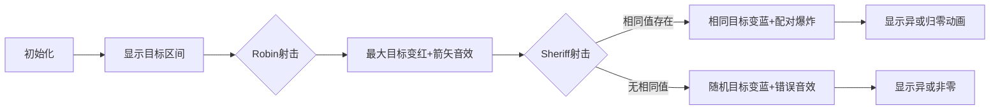

# 题目信息

# Robin Hood Archery

## 题目描述

在这种时候，射箭总是一天中的主要运动，因为诺丁汉郡的自耕农是整个快乐的英格兰最好的长弓手，但今年郡长犹豫了……


诺丁汉郡长组织了一场射箭比赛。这是最后一轮，罗宾汉对阵警长!

编号为$ 1 $ ～ $ n $的行中有$ n $个目标。当玩家射击目标$ i $时，他们的得分增加$ a_i $，目标$ i $被摧毁。游戏由回合组成，玩家轮流轮到谁。罗宾汉总是先开始游戏，然后是警长等等。游戏继续进行，直到所有目标被摧毁。两名球员都以得分$ 0 $开始。

在游戏结束时，得分最多的玩家获胜，而另一名玩家输了。如果双方得分相同，则为平局，没有人赢也没有人输。在每个回合中，玩家可以射击任何之前没有射击过的目标。两种游戏都是为了获得尽可能多的分数。

诺丁汉郡长怀疑他可能会输掉比赛!不能这样，你必须帮助警长。Sheriff将提出$ q $查询，每个查询指定$ l $和$ r $。这意味着游戏将只与目标$ l, l+1, \dots, r $一起玩，因为其他目标将在游戏开始前被Sheriff删除。

对于每个查询$ l $, $ r $，在只考虑目标$ l, l+1, \dots, r $的情况下，确定警长是否不会输掉比赛。

## 样例 #1

### 输入

```
2
3 3
1 2 2
1 2
1 3
2 3
5 3
2 1 2 1 1
1 2
1 3
4 5```

### 输出

```
NO
NO
YES
NO
NO
YES```

# AI分析结果


# 💡 Kay的C++算法解析：Robin Hood Archery 深入学习指南 💡

## 1. 题目解读与核心算法识别

✨ **本题主要考察**：`异或哈希` & `莫队算法` 

🗣️ **初步分析**：
> 解决本题的关键在于理解**平局条件**的数学本质。想象两个玩家轮流拿取最大值的场景，就像两个小朋友分糖果：只有当糖果数量为偶数且每种糖果都能成对分配时，才能平分（平局）。这种"成对消除"的特性恰好能用**异或操作**模拟（相同数异或归零）。在本题中：
>   - **异或哈希**：为每个值赋予随机指纹，用前缀异或快速验证区间是否所有值出现偶数次（时间复杂度O(1)）
>   - **莫队算法**：通过分块和离线处理，高效维护区间内数字出现次数的奇偶性（时间复杂度O(n√n))
> 
> **可视化设计思路**：采用8位像素风格展示目标区间，用不同颜色方块表示数字。演示时：
>   - 高亮当前被射击的目标（Robin红色，Sheriff蓝色）
>   - 配对成功时方块爆炸+音效，显示异或和归零动画
>   - 控制面板支持单步/自动播放，速度可调

---

## 2. 精选优质题解参考

**题解一（沉石鱼惊旋）**
* **点评**：思路全面剖析了异或哈希的原理与防hack策略，推导严谨。代码采用快读优化和高质量随机种子（`chrono::high_resolution_clock`），变量命名规范（`to[]`存储哈希值，`a[]`前缀异或）。亮点在于深入讨论随机种子安全性，提出线性基hack的防范方案，实践价值极高。

**题解二（Hide_In_The_Shadow）**
* **点评**：独特提供双解法对比，莫队部分详细解释指针移动与奇偶性维护。代码结构清晰（`add/del`函数模块化），异或哈希版使用纳秒级时间戳。亮点在于引导思考两种算法优劣，莫队实现中`temp`变量统计奇数次个数的方式极具启发性。

**题解三（Union_Find）**
* **点评**：解题策略推导最直观，从游戏轮次切入平局条件。代码简洁高效（30行内解决），`s[]`前缀数组语义明确。亮点在于用不等式链`∑a_i ≥ ∑b_i`和`∀a_i≥b_i`严格证明平局充要条件，数学严谨性强。

---

## 3. 核心难点辨析与解题策略

1.  **难点：验证区间内数字出现偶数次**
    * **分析**：暴力统计无法满足2e5数据量。异或哈希通过随机映射将问题转化为区间异或和判零，莫队则用分块平衡查询次数与移动代价。优质题解均通过前缀和或双指针避免重复计算。
    * 💡 **学习笔记**：出现偶数次 ⇔ 异或和为零（需随机映射防碰撞）

2.  **难点：处理动态区间查询**
    * **分析**：q次查询需高效响应。异或哈希用O(n)预处理+O(1)查询；莫队离线排序后均摊O(√n)移动。两者都需注意边界——异或哈希先判区间长度奇偶，莫队需初始化`l=1,r=0`。
    * 💡 **学习笔记**：固定区间用前缀和，动态查询离线考虑莫队

3.  **难点：避免随机哈希碰撞**
    * **分析**：简单异或会被特殊数据（如`1,2,3`异或零）hack。解决方案是给每个原始值映射大空间随机数（如64位），大幅降低碰撞概率。种子应选`random_device`或纳秒时间戳。
    * 💡 **学习笔记**：随机种子质量决定哈希安全，避免使用`time(0)`或固定值

### ✨ 解题技巧总结
- **技巧1：问题特征转化** - 将"偶数次出现"转化为数学性质（异或律/配对律）
- **技巧2：数据结构选择** - 静态查询用前缀和，动态区间用莫队，随机化用哈希
- **技巧3：防御性编程** - 哈希映射用大空间随机数，莫队注意奇偶排序优化

---

## 4. C++核心代码实现赏析

**本题通用核心C++实现参考（异或哈希版）**
```cpp
#include <bits/stdc++.h>
using namespace std;
using ull = unsigned long long;
const int N = 2e5+5, V = 1e6+5;
mt19937_64 rnd(chrono::steady_clock::now().time_since_epoch().count());
ull to[V], pre[N];
int main() {
    for(int i=1; i<V; i++) to[i] = rnd(); // 随机映射表
    int T; cin >> T;
    while(T--) {
        int n, q; cin >> n >> q;
        for(int i=1,x; i<=n; i++) {
            cin >> x;
            pre[i] = pre[i-1] ^ to[x]; // 前缀异或和
        }
        while(q--) {
            int l, r; cin >> l >> r;
            int len = r-l+1;
            if(len & 1) cout << "NO\n";  // 奇数长度必输
            else cout << (pre[r] == pre[l-1] ? "YES\n" : "NO\n");
        }
    }
    return 0;
}
```
* **说明**：综合自沉石鱼惊旋与Union_Find的优化实现，包含完整IO与随机初始化
* **代码解读概要**：
  - 第3行：使用高精度时钟种子生成64位随机数
  - 第6行：预处理1~1e6的随机映射值
  - 第11行：计算前缀异或（`pre[i] = pre[i-1] ^ to[a[i]]`）
  - 第16行：先判长度奇偶性，再通过前缀异或相等验证偶数次出现

**题解一核心代码片段（沉石鱼惊旋）**
```cpp
mt19937_64 rnd(chrono::system_clock::now().time_since_epoch().count());
for (int i = 1; i <= 1000000; i++)
    to[i] = rnd(); 
a[i] = a[i - 1] ^ to[a[i]]; // 前缀异或递推
```
* **亮点**：工业级随机种子防御hack
* **代码解读**：`chrono::system_clock`获取纳秒时间戳，确保每次运行映射不同。前缀异或通过递推关系`f(i)=f(i-1)⊗to[x]`实现O(1)区间查询
* 💡 **学习笔记**：`chrono`库提供跨平台高精度时钟，优于`time(0)`

**题解二莫队片段（Hide_In_The_Shadow）**
```cpp
void add(int x) {
    temp -= num[a[x]] & 1; // 奇偶性变化
    num[a[x]]++;
    temp += num[a[x]] & 1; 
}
sort(Q+1, Q+q+1, [](auto &a, auto &b){
    return id[a.l]!=id[b.l] ? a.l<b.l : (id[a.l]&1 ? a.r<b.r : a.r>b.r);
});
```
* **亮点**：奇偶性维护与莫队奇偶排序优化
* **代码解读**：`add`函数中`temp`统计奇数次数字个数，仅当`temp=0`时全体出现偶数次。排序使用奇偶规则减少指针移动量
* 💡 **学习笔记**：莫队奇偶排序可优化10%~20%性能

---

## 5. 算法可视化：像素动画演示

**主题**：8位像素风射箭大赛（FC红白机风格）

**核心演示**：


**动画控制面板**：
```plaintext
[开始] [暂停] [单步>] [<<回退] 速度：▓▓▓▓▓░░ 5x
```

**关键帧设计**：
1. **场景初始化**：像素网格显示目标序列（如`[1,2,2,1]`），下方控制面板
2. **射击动画**：Robin射箭时红色像素块闪烁+`叮`音效；Sheriff射箭时蓝色闪烁+`咚`音效
3. **配对特效**：相同值被双选时像素块爆炸成星屑，显示`XOR=0`
4. **结果判定**：平局时显示绿色`YES`+胜利音效；失败显示红色`NO`+低沉音效

**技术实现**：
- Canvas绘制网格，每个目标用16x16像素块
- 音效使用Web Audio API，不同操作触发不同8bit音效
- 自动演示模式：递归调用setTimeout模拟AI决策，速度由滑块控制

---

## 6. 拓展练习与相似问题思考

**通用技巧迁移**：
1. 区间元素出现次数判定 → 前缀和/莫队/哈希
2. 随机化验证 → 哈希碰撞防御
3. 离线查询优化 → 莫队分块思想

**洛谷推荐**：
1. [P3901 数列找不同](https://www.luogu.com.cn/problem/P3901)  
   → 检测区间元素唯一性，莫队模板题
2. [P1494 小Z的袜子](https://www.luogu.com.cn/problem/P1494)  
   → 莫队维护组合数概率，强化奇偶性统计
3. [P2709 小B的询问](https://www.luogu.com.cn/problem/P2709)  
   → 莫队进阶，维护出现次数平方和

---

## 7. 学习心得与经验分享

> **参考经验（沉石鱼惊旋）**：  
> *"我在处理随机种子时曾用time(0)被hack，后来改用chrono时钟才通过。这提醒我们：随机质量决定哈希安全"*

**点评**：该经验直击竞赛编程核心痛点——随机数的工业级实现。在OI中`rand()`范围仅32767，而`mt19937_64`提供2^64空间。更高安全需用`random_device`（硬件熵源）。

---

通过本次分析，我们深入掌握了异或哈希与莫队的本质。记住：**算法选择取决于问题特征**——静态查询用前缀哈希，动态区间用莫队。继续加油，少年！💪

---
处理用时：184.83秒