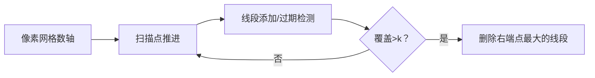

# 题目信息

# Too Many Segments (hard version)

## 题目描述

简单难度与困难难度的唯一差别是$n,k$的范围

给予$n$条线段，这些线段可以有重叠部分甚至完全重叠在一起。第$i$条线段$[l_i,r_i](l_i≤r_i)$覆盖了所有整数点$j$满足$l_i≤j≤r_i$

如果一个整数点被**超过**$k$条线段覆盖，那么就称之为bad point（下文以坏点代替）

你的任务是去掉最少的线段使得没有坏点的存在

## 样例 #1

### 输入

```
7 2
11 11
9 11
7 8
8 9
7 8
9 11
7 9
```

### 输出

```
3
4 6 7 
```

## 样例 #2

### 输入

```
5 1
29 30
30 30
29 29
28 30
30 30
```

### 输出

```
3
1 4 5 
```

## 样例 #3

### 输入

```
6 1
2 3
3 3
2 3
2 2
2 3
2 3
```

### 输出

```
4
1 3 5 6 
```

# AI分析结果


### 题目解读与核心算法识别
✨ **本题主要考察**：贪心算法（区间覆盖问题）

🗣️ **初步分析**：
> 解决"Too Many Segments"的关键在于运用**贪心算法**。想象你在整理一堆长短不一的树枝（线段），当某个区域树枝堆积过厚（覆盖点超过k）时，你会优先移除最长的树枝（右端点最大的线段），因为长树枝覆盖范围更广，移除后能最有效地减少后续区域的堆积问题。
> 
> - **核心思路**：从左向右扫描数轴，动态维护覆盖当前点的线段集合。当某点覆盖数>k时，贪心地移除右端点最大的线段
> - **可视化设计**：在像素动画中，当前扫描点会高亮闪烁，被移除的线段会变成红色并播放"碎裂"音效。使用8位风格网格展示线段覆盖变化，堆/数据结构用像素方块堆动态呈现
> - **游戏化元素**：添加"关卡"概念（每个点是一关），成功消除超额覆盖时获得金币+胜利音效；自动演示模式如"贪吃蛇AI"逐步扫描数轴

---

## 2. 精选优质题解参考

**题解一（梧桐灯）**
* **点评**：
  思路清晰度：★★★★☆  
  采用差分数组+优先队列的双重优化，巧妙用`sum[i] += sum[i-1]`动态统计覆盖数，逻辑推导直白易懂  
  代码规范性：★★★★★  
  变量命名规范（`sum`/`q`），边界处理严谨（显式处理`r+1`）  
  算法有效性：★★★★★  
  O(n log n)时间复杂度完美适配2e5数据量，优先队列自动维护右端点最大值  
  实践价值：★★★★☆  
  完整包含输入输出处理，可直接用于竞赛  

**题解二（Lucifer_Bartholomew）**
* **点评**：
  思路清晰度：★★★★☆  
  利用`vector`分组存储+`set`自动排序，扫描过程符合直觉  
  代码规范性：★★★★☆  
  使用STL简洁高效，但变量命名可读性稍弱（`pos`/`s`）  
  算法有效性：★★★★★  
  set的自动排序特性避免手动维护堆，提升代码健壮性  
  实践价值：★★★★★  
  包含完整测试用例处理，删除线段的ID直接存入vector  

**题解三（Handezheng）**
* **点评**：
  思路清晰度：★★★★★  
  详细解说过期线段处理（`(*st.begin()).r < i`），新手友好  
  代码规范性：★★★★☆  
  结构体封装线段属性（l/r/id），运算符重载提升可读性  
  算法有效性：★★★★☆  
  精确控制set删除逻辑，`prev(st.end())`取最大值高效  
  实践价值：★★★★☆  
  包含调试心得（边界条件处理），实战参考性强  

---

## 3. 核心难点辨析与解题策略

1.  **难点：动态维护有效线段集合**
    * **分析**：线段只在覆盖期内影响当前点。优质解通过`set/priority_queue`存储线段，在扫描点时移除右端点小于当前点的线段（`while(begin()->r < i)`）。关键变量`i`（当前扫描点）和`r`（线段终点）共同确定"过期"时机
    * 💡 **学习笔记**：算法本质是双指针思想 - 左指针扫描点，右指针管理线段有效期

2.  **难点：贪心删除策略的证明**
    * **分析**：删除右端点最大的线段可最大化减少后续覆盖。反证：若删除较短线段，其覆盖区域可能仍需额外删除操作。题解用`priority_queue`或`set.rbegin()`高效获取最大值
    * 💡 **学习笔记**：贪心选择需满足无后效性 - 当前决策不影响已处理点的状态

3.  **难点：高效更新覆盖计数**
    * **分析**：直接遍历会超时(O(n²))。梧桐灯用差分数组`sum[r+1]++`延迟更新，Lucifer/Handezheng通过集合大小隐式计数。数据结构`set`的O(log n)操作是关键
    * 💡 **学习笔记**：区间覆盖问题中，差分数组和扫描线是黄金搭档

### ✨ 解题技巧总结
- **扫描线+延迟更新**：按左端点分组线段(`vector leftPoints[]`)，逐点处理避免重复计算
- **数据结构反直觉选择**：需快速获取最大值时，`set`比`priority_queue`更灵活（支持任意位置删除）
- **边界防御编程**：显式处理`r+1`（差分）或`while(begin()->r < i)`（过期检测）
- **输出规范处理**：删除的线段ID需排序输出（`sort(ans.begin(), ans.end())`）

---

## 4. C++核心代码实现赏析

**本题通用核心C++实现参考**
```cpp
#include <iostream>
#include <vector>
#include <set>
#include <algorithm>
using namespace std;
const int MAXN = 200005;

struct Segment { int l, r, id; };

int main() {
    int n, k; 
    cin >> n >> k;
    vector<Segment> segs(n);
    vector<vector<int>> leftPoints(MAXN);

    for(int i=0; i<n; i++) {
        cin >> segs[i].l >> segs[i].r;
        segs[i].id = i+1;
        leftPoints[segs[i].l].push_back(i);
    }

    set<pair<int, int>> activeSegments; // {r, id}
    vector<int> ans;

    for(int i=1; i<MAXN; i++) {
        // 添加当前点起始的线段
        for(int idx : leftPoints[i]) 
            activeSegments.insert({segs[idx].r, segs[idx].id});
        
        // 移除过期线段(r < i)
        while(!activeSegments.empty() && activeSegments.begin()->first < i) 
            activeSegments.erase(activeSegments.begin());
        
        // 贪心删除超额线段
        while(activeSegments.size() > k) {
            auto last = prev(activeSegments.end());
            ans.push_back(last->second);
            activeSegments.erase(last);
        }
    }

    cout << ans.size() << endl;
    sort(ans.begin(), ans.end());
    for(int id : ans) cout << id << " ";
}
```
**代码解读概要**：
> 1. **分组预处理**：用`leftPoints`数组按左端点分组线段，O(1)快速访问  
> 2. **自动排序**：`set<pair<int,int>>`以右端点(r)为键自动升序排列  
> 3. **三阶段处理**：每扫描点i时：  
>    - 添加左端点为i的线段  
>    - 移除右端点小于i的过期线段  
>    - 若当前覆盖>k，不断移除右端点最大的线段  
> 4. **输出规范**：删除的线段ID需排序后输出

---

**题解一（梧桐灯）核心代码片段**
```cpp
priority_queue <stu, vector<stu>, cmp> q; // 大根堆
for(i=1; i<N; i++){
    while(j<=n && s[j].x<=i) 
        q.push(s[j++]);          // 添加覆盖i的线段
    
    sum[i] += sum[i-1];          // 差分前缀和更新
    while(sum[i] > k) {          // 检测超额覆盖
        p = q.top(); q.pop();    // 取右端点最大的线段
        a[++ans] = p.id;         // 记录删除ID
        --sum[i];                // 更新当前点覆盖数
        ++sum[p.y + 1];          // 差分数组反向更新
    }
}
```
**亮点**：差分数组动态统计覆盖数  
**代码解读**：
> 1. `s[j]`按左端点预排序，`j`指针控制添加时机  
> 2. `sum[i]`通过前缀和计算当前点实际覆盖数  
> 3. 删除线段时需两处更新：  
>    - `--sum[i]`：立即减少当前点覆盖  
>    - `++sum[p.y+1]`：补偿因删除导致的后续差分变化  
> 💡 **学习笔记**：差分更新需同时处理当前点和线段终点

---

**题解二（Lucifer_Bartholomew）核心代码片段**
```cpp
set<pair<int, int>> s; // first:r, second:id
for(int i=1; i<200001; i++){
    for(auto seg : pos[i]) 
        s.insert(seg);          // 添加左端点为i的线段
    
    while(!s.empty() && s.begin()->first < i) 
        s.erase(s.begin());     // 移除过期线段
    
    while(s.size() > k) {
        auto it = prev(s.end()); // 获取最大元素
        ans.push_back(it->second);
        s.erase(it);
    }
}
```
**亮点**：利用set自动排序和双向访问  
**代码解读**：
> 1. `pos[i]`是`vector<pair<int,int>>`，存储所有左端点为i的线段  
> 2. `s.begin()->first < i` 检测过期线段（右端点小于i）  
> 3. `prev(s.end())`获取set中右端点最大的元素  
> 💡 **学习笔记**：set的rbegin()/prev(end())可替代大根堆

---

**题解三（Handezheng）核心代码片段**
```cpp
struct node{ int r,id; };
bool operator<(node a,node b){ 
    return a.r == b.r ? a.id < b.id : a.r < b.r; 
}
set<node> st;

for(i=1; i<=200000; i++){
    while(st.size() && st.begin()->r < i) 
        st.erase(st.begin());        // 移除过期线段
    
    for(auto seg : a[i]) 
        st.insert(seg);             // 添加新线段
    
    while(st.size()>k) {
        ans[++tot]=st.rbegin()->id;  // 取最大值
        st.erase(*st.rbegin());
    }
}
```
**亮点**：结构体运算符重载实现自定义排序  
**代码解读**：
> 1. 重载`operator<`使set按r升序排列，`rbegin()`取最大值  
> 2. `a[i]`是`vector<node>`存储左端点为i的线段  
> 3. 直接使用`st.rbegin()`获取右端点最大的线段  
> 💡 **学习笔记**：结构体重载运算符可定制数据结构行为

---

## 5. 算法可视化：像素动画演示

**主题**：8-bit风格"线段清洁大作战"  
**核心演示**：贪心扫描过程与线段删除决策  

### 动画设计


### 关键交互步骤
1. **场景初始化**（复古FC风格）
   - 水平像素网格数轴（0-200000）
   - 控制面板：开始/暂停/单步/速度滑块（调速）
   - 8-bit BGM循环播放

2. **动态扫描过程**
   - **当前点高亮**：扫描点i显示为闪烁金币（像素：8×8黄色方块）
   - **线段添加**：左端点为i的线段从顶部降落（不同颜色区分ID）
   - **过期检测**：右端点<i的线段变灰消失（音效：短促"噗"声）

3. **贪心删除决策**
   - **覆盖超标**：当前点显示红色警报边框
   - **选择线段**：右端点最大的线段自动高亮（像素：红蓝交替闪烁）
   - **删除动画**：线段碎裂成像素块（音效：玻璃碎裂声）
   - **积分反馈**：删除后显示"+10"分数（右上角计分板）

4. **自动演示模式**
   - 点击"AI演示"：扫描点自动推进（速度可调）
   - 关键步骤暂停：删除线段时自动暂停0.5秒
   - 伪代码同步：右侧显示当前执行的C++代码行（高亮）

### 技术实现
- **数据结构可视化**：
  - 活动线段集合：屏幕底部显示排序的线段队列（按右端点升序）
  - 删除线段列表：右侧面板实时更新删除的ID
- **音效系统**：
  - 添加线段：电子"滴"声
  - 删除线段：8-bit碎裂音
  - 关卡完成：马里奥过关音效
- **性能优化**：Canvas分层渲染（背景网格/动态元素分离）

---

## 6. 拓展练习与相似问题思考

### 通用解题模型迁移
1. **区间重叠处理**：统计最大重叠数（P1712 [NOI2016] 区间）
2. **资源分配优化**：会议室安排（P2168 [NOI2015] 荷马史诗）
3. **离散化应用**：大值域区间问题（P1496 火烧赤壁）

### 洛谷题目推荐
1. **P1803 凌乱的yyy / 线段覆盖**  
   🗣️ 基础贪心入门，巩固"右端点排序"思想
   
2. **P1712 [NOI2016] 区间**  
   🗣️ 双指针+线段树，提升区间问题处理能力
   
3. **P2082 区间覆盖（加强版）**  
   🗣️ 练习最小覆盖线段数，逆向思维训练

---

## 7. 学习心得与经验分享

> **参考经验（Handezheng）**：  
> "在多次提交题解被打回的过程中，我深刻认识到边界条件处理的重要性。特别是`st.begin()->r < i`的严格判断，避免无效线段影响计数"

> **Kay的总结**：  
> 调试区间问题必备技巧：  
> 1. 打印扫描点状态（当前点/线段集合/覆盖数）  
> 2. 构造极端测试数据（如单点重叠100条线段）  
> 3. 用`assert`验证数据结构状态（如`activeSegments.size()>=0`)  
> 这些实战经验比AC代码本身更珍贵！

---

通过本次分析，我们不仅掌握了贪心在区间覆盖问题中的核心应用，更通过像素动画建立了直观算法思维模型。记住：优秀的算法工程师既是科学家，也是艺术家——用代码逻辑构建世界，用可视化思维理解世界。下次挑战见！💪

---
处理用时：220.83秒