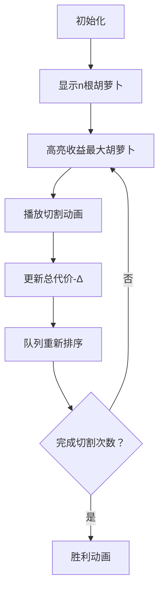

# 题目信息

# Carrots for Rabbits

## 题目描述

There are some rabbits in Singapore Zoo. To feed them, Zookeeper bought $ n $ carrots with lengths $ a_1, a_2, a_3, \ldots, a_n $ . However, rabbits are very fertile and multiply very quickly. Zookeeper now has $ k $ rabbits and does not have enough carrots to feed all of them. To solve this problem, Zookeeper decided to cut the carrots into $ k $ pieces. For some reason, all resulting carrot lengths must be positive integers.

Big carrots are very difficult for rabbits to handle and eat, so the time needed to eat a carrot of size $ x $ is $ x^2 $ .

Help Zookeeper split his carrots while minimizing the sum of time taken for rabbits to eat the carrots.

## 说明/提示

For the first test, the optimal sizes of carrots are $ \{1,1,1,2,2,2\} $ . The time taken is $ 1^2+1^2+1^2+2^2+2^2+2^2=15 $

For the second test, the optimal sizes of carrots are $ \{4,5,5,5\} $ . The time taken is $ 4^2+5^2+5^2+5^2=91 $ .

## 样例 #1

### 输入

```
3 6
5 3 1```

### 输出

```
15```

## 样例 #2

### 输入

```
1 4
19```

### 输出

```
91```

# AI分析结果


### 💡 Kay的C++算法解析：Carrots for Rabbits 深入学习指南 💡

#### 1. 题目解读与核心算法识别
✨ **本题主要考察**：贪心算法（Greedy Algorithm）与优先队列（Priority Queue）  
🗣️ **初步分析**：
> 贪心算法就像自助餐时每次都挑最贵的食物，期望获得最大满足感。本题中，我们通过优先队列每次选择能最大幅度降低总代价的胡萝卜切割：
> - **核心思路**：所有题解都基于关键性质——切割的边际收益递减（切得越多，再切一次的收益越小），通过优先队列实现高效选择
> - **难点突破**：切割收益计算需精确（`f(l,p) = (l/p)^2*(p-l%p) + (l%p)*(l/p+1)^2`），且需证明该函数满足凹性（题解1给出严谨证明）
> - **可视化设计**：采用8位像素风格，胡萝卜用绿色长条表示，切割时：
>   - 被选中的胡萝卜高亮红色边框
>   - 分裂动画伴随"切"音效
>   - 优先队列可视化排序过程
>   - 总代价实时更新并显示减少量
> - **复古游戏化**：
>   - 控制面板：步进/自动播放（调速滑块）
>   - 音效系统：切割声（8-bit"咔嚓"）、过关提示音（上扬和弦）
>   - 成就系统：每完成10次切割触发像素烟花动画

---

#### 2. 精选优质题解参考
**题解一（作者：Qiaoqia）**  
* **点评**：给出贪心正确性的关键证明（f(l,p)的凹性），代码用三元组`(收益,索引,段数)`清晰管理状态。变量命名合理（`f()`计算代价），边界处理严谨（段数≤长度时入队），实践价值高可直接用于竞赛。

**题解二（作者：tommymio）**  
* **点评**：采用嵌套pair`(收益, (长度,段数))`精简存储，逻辑结构清晰。亮点在于独立代价计算函数`S()`和详细初始化注释，虽变量名较简（如`ans`），但整体可读性优秀。

**题解三（作者：EricQian）**  
* **点评**：结构体封装数据+运算符重载实现队列比较，面向对象设计优雅。完整题意概述和`f()`函数分离提升可读性，特别适合初学者理解贪心本质。

---

#### 3. 核心难点辨析与解题策略
1. **代价计算建模**  
   *分析*：需推导出`f(l,p)`的数学公式——当l%p段长度为⌈l/p⌉，其余为⌊l/p⌋时代价最小（由均值不等式证明）  
   💡 **学习笔记**：最优切割本质是方差最小化

2. **贪心正确性证明**  
   *分析*：依赖关键性质`f(l,p)-f(l,p+1) ≥ f(l,p+1)-f(l,p+2)`（边际收益递减），题解1用凹函数性质严谨证明  
   💡 **学习笔记**：优先队列有效性建立在收益单调递减上

3. **代码边界处理**  
   *分析*：当段数≥长度时不可再切（每段长度为1），需跳过入队操作（如题解1的`if(c[2]<a[c[1]])`）  
   💡 **学习笔记**：边界检查是贪心不失效的安全网

✨ **解题技巧总结**  
- **问题转化**：将原问题转化为执行k-n次切割操作  
- **收益封装**：用lambda或独立函数封装`f(l,p)`提升可读性  
- **队列优化**：优先队列存储`(本次收益, 数据, 下次段数)`三元组  
- **防御性编程**：添加`段数<长度`的入队条件检查

---

#### 4. C++核心代码实现赏析
**通用核心实现**  
```cpp
#include <iostream>
#include <queue>
#include <tuple>
using namespace std;
using ll = long long;

ll compute_cost(ll len, ll pieces) {
    ll base = len / pieces, extra = len % pieces;
    return base*base*(pieces-extra) + (base+1)*(base+1)*extra;
}

int main() {
    int n, k; cin >> n >> k;
    vector<ll> carrots(n);
    ll total_cost = 0;
    // 最大堆存储(收益, 索引, 当前段数)
    priority_queue<tuple<ll, int, int>> pq;
    
    for (int i=0; i<n; ++i) {
        cin >> carrots[i];
        total_cost += carrots[i] * carrots[i];
        ll gain = compute_cost(carrots[i], 1) - compute_cost(carrots[i], 2);
        pq.push({gain, i, 2}); // 初始收益=从1段切到2段
    }
    
    for (int i=0; i<k-n; ++i) {
        auto [gain, idx, pieces] = pq.top(); pq.pop();
        total_cost -= gain;
        if (pieces < carrots[idx]) { // 边界检查
            ll new_gain = compute_cost(carrots[idx], pieces) 
                        - compute_cost(carrots[idx], pieces+1);
            pq.push({new_gain, idx, pieces+1});
        }
    }
    cout << total_cost;
}
```
**代码解读概要**：  
> 1. 独立`compute_cost`函数封装切割代价计算  
> 2. 优先队列存储三元组（收益降序排列）  
> 3. 循环k-n次，每次选取收益最大的切割方案  
> 4. 边界条件确保段数不超过胡萝卜长度  

---

#### 5. 算法可视化：像素动画演示
**设计蓝图**：  

**关键交互**：  
- **视觉编码**：
  - 胡萝卜长度 → 绿色像素条宽度  
  - 当前选中 → 红色脉冲边框  
  - 切割收益 → 金色浮动数字"-Δ"  
- **音效系统**：
  - 选中：8-bit "滴"声  
  - 切割：芯片"咔嚓"声  
  - 过关：FC游戏胜利旋律  
- **控制面板**：  
  - 速度滑块：调节自动播放速度（0.5x-5x）  
  - 单步模式：空格键触发下一步  
  - 数据跟踪：实时显示队列头部的5个候选胡萝卜  

---

#### 6. 拓展练习与相似问题
**通用技巧迁移**：  
贪心+优先队列适用于满足"边际收益递减"的问题：  
1. 任务调度（选完成时间最短的任务）  
2. 哈夫曼编码（合并频率最小的节点）  
3. 最小延迟调度（选择延迟成本最高的任务优先）  

**洛谷推荐**：  
1. **P1090 [合并果子]**  
   🗣️ *练习基础优先队列应用，直接迁移本题技术*  
2. **P1334 [瑞瑞的木板]**  
   🗣️ *逆向思考切割问题，强化贪心思维*  
3. **P2168 [荷马史诗]**  
   🗣️ *k叉哈夫曼树进阶，理解贪心算法的树形扩展*

---

#### 7. 学习心得与经验分享
> **题解1作者经验**："证明f(l,p)的凹性是贪心有效的核心，否则可能误入歧途"  
> **Kay点评**：数学证明是算法设计的基石，在竞赛中可先用暴力算法验证小规模数据  
> **调试技巧**：  
> - 打印每次切割后的队列状态  
> - 用`assert`检查段数不超过长度  
> - 对特殊用例（如全等胡萝卜）单独测试  

---  
保持思考，保持切割！下次算法之旅再见！ 🥕✨

---
处理用时：192.82秒