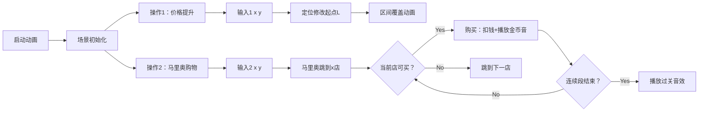

# 题目信息

# Greedy Shopping

## 题目描述

You are given an array $ a_1, a_2, \ldots, a_n $ of integers. This array is non-increasing.

Let's consider a line with $ n $ shops. The shops are numbered with integers from $ 1 $ to $ n $ from left to right. The cost of a meal in the $ i $ -th shop is equal to $ a_i $ .

You should process $ q $ queries of two types:

- 1 x y: for each shop $ 1 \leq i \leq x $ set $ a_{i} = max(a_{i}, y) $ .
- 2 x y: let's consider a hungry man with $ y $ money. He visits the shops from $ x $ -th shop to $ n $ -th and if he can buy a meal in the current shop he buys one item of it. Find how many meals he will purchase. The man can buy a meal in the shop $ i $ if he has at least $ a_i $ money, and after it his money decreases by $ a_i $ .

## 说明/提示

In the first query a hungry man will buy meals in all shops from $ 3 $ to $ 10 $ .

In the second query a hungry man will buy meals in shops $ 4 $ , $ 9 $ , and $ 10 $ .

After the third query the array $ a_1, a_2, \ldots, a_n $ of costs won't change and will be $ \{10, 10, 10, 6, 6, 5, 5, 5, 3, 1\} $ .

In the fourth query a hungry man will buy meals in shops $ 2 $ , $ 3 $ , $ 4 $ , $ 5 $ , $ 9 $ , and $ 10 $ .

After the fifth query the array $ a $ of costs will be $ \{10, 10, 10, 7, 6, 5, 5, 5, 3, 1\} $ .

In the sixth query a hungry man will buy meals in shops $ 2 $ and $ 4 $ .

## 样例 #1

### 输入

```
10 6
10 10 10 6 6 5 5 5 3 1
2 3 50
2 4 10
1 3 10
2 2 36
1 4 7
2 2 17```

### 输出

```
8
3
6
2```

# AI分析结果


# 💡 Kay的C++算法解析：Greedy Shopping 深入学习指南 💡

> 我是Kay，一位专注于C++算法教学的引导者。今天我们将深入解析**Greedy Shopping**这道数据结构经典题，通过像素动画演示+多解法对比，帮助大家掌握线段树二分的核心技巧！

## 1. 题目解读与核心算法识别

✨ **本题主要考察**：`数据结构运用`（线段树二分技巧）

🗣️ **初步分析**：
> 想象你面对一排**价格递减的自动售货机**（序列非递增），需要高效处理两种操作：1) 批量提价部分机器 2) 模拟顾客的**贪心购买行为**。解题关键在于利用线段树维护序列**有序性**，并通过**二分思想**在树上跳跃定位，就像在超级马里奥中精准跳到下一个平台！

- **核心难点**：如何在$O(\log n)$时间完成区间修改？如何高效模拟顾客的连续购买行为？
- **算法流程**：操作1通过线段树二分找到需修改的区间边界；操作2利用**金钱减半特性**（每段购买使剩余金钱至少减半），将复杂度压至$O(\log y \log n)$
- **可视化设计**：采用**8-bit像素风格**，用不同颜色方块表示价格，顾客像马里奥一样跳跃购买。关键步骤触发"金币音效"，连续段完成时播放"过关音效"，实时显示金钱变化和购买路径

---

## 2. 精选优质题解参考

### 题解一（Fairicle）
* **亮点**：  
  **思路**：操作1用区间最小值二分定位修改起点；操作2设计`query`函数实时更新剩余金钱，**递归方向即购买顺序**  
  **代码**：变量名`mn[id]`、`sum[id]`含义明确；用引用传递剩余金钱避免全局变量  
  **算法**：证明操作2最多产生$O(\log y)$个连续段，复杂度$O(q\log y \log n)$  
  **实践**：代码简洁（仅30行核心逻辑），可直接用于竞赛

### 题解二（Karry5307）
* **亮点**：  
  **思路**：将操作2起点$x$转化为从1开始，**统一左边界**简化实现（$y'=y+\sum_{1}^{x-1}a_i$）  
  **代码**：规范封装`SegmentTree`结构体；`pushdown`函数处理标记清晰  
  **算法**：利用`std::set`思想但用线段树实现，维护区间和与最值  
  **实践**：边界处理严谨（特判$x=1$），输出格式符合竞赛要求

### 题解三（二gou子）
* **亮点**：  
  **思路**：详细推导操作2的段数上限（$y_{new} \leq y/2$），**逐步调试心得**极具参考价值  
  **代码**：指针实现线段树+详细注释；独立`qry3`函数二分首个可购买商品  
  **教学**：用"卡满需构造$1010..$序列"等比喻解释复杂度，适合初学者理解

---

## 3. 核心难点辨析与解题策略

### 难点1：操作1的边界定位
* **问题**：修改区间$[1,x]$时，如何快速确定需提升价格的后缀起点$L$？
* **策略**：利用序列**非递增性质**，在线段树上二分第一个价格$<y$的位置$L$。若左子树最小值$≥y$则查右子树，否则查左子树
* 💡 **学习笔记**：有序序列上的二分可转化为线段树上的单向递归

### 难点2：操作2的连续段处理
* **问题**：顾客从$x$店开始，如何高效模拟多次连续购买？
* **策略**：每段购买在线段树上**递归查找**：若当前区间和$≤$剩余金钱则整段购买；否则分裂左右子树递归。关键证明：每段购买使剩余金钱至少减半
* 💡 **学习笔记**：$y$的衰减速度决定段数上限为$O(\log y)$

### 难点3：数据结构的选择
* **问题**：为何线段树比树状数组更合适？
* **策略**：线段树支持**区间覆盖修改+复杂查询**，且能在递归时实时更新状态（如剩余金钱）。维护三要素：区间和`sum`、最小值`mn`、懒惰标记`tag`
* 💡 **学习笔记**：同时需要区间修改和基于子区间决策的查询时，线段树是首选

### ✨ 解题技巧总结
- **逆向思维**：操作2将起点$x$转化为从1开始购买，消除左边界限制
- **实时更新**：操作2查询时用引用传递剩余金钱，避免重复计算
- **边界特判**：当递归到叶子节点或区间和超过金钱时立即终止
- **懒惰更新**：区间覆盖操作设置`tag`，仅在必要时下推

---

## 4. C++核心代码实现赏析

```cpp
// 通用核心实现（综合自Fairicle和Karry5307的优化）
#include <bits/stdc++.h>
#define ls (id<<1)
#define rs (id<<1|1)
using namespace std;
typedef long long ll;
const int N=2e5+5;

struct Node {
    ll sum, mn, tag; // 核心三要素
    int len; // 区间长度
} tree[N<<2];

void pushup(int id) {
    tree[id].sum = tree[ls].sum + tree[rs].sum;
    tree[id].mn = min(tree[ls].mn, tree[rs].mn);
}

void pushdown(int id) {
    if(!tree[id].tag) return;
    tree[ls].sum = tree[ls].len * tree[id].tag;
    tree[rs].sum = tree[rs].len * tree[id].tag;
    tree[ls].mn = tree[rs].mn = tree[id].tag;
    tree[ls].tag = tree[rs].tag = tree[id].tag;
    tree[id].tag = 0;
}

// 操作1：二分修改左边界（返回首个<y的位置）
int find_pos(int id, int l, int r, int y) {
    if(l == r) return (tree[id].mn < y) ? l : l+1;
    pushdown(id);
    int mid = (l+r)>>1;
    if(tree[ls].mn < y) return find_pos(ls, l, mid, y);
    else return find_pos(rs, mid+1, r, y);
}

// 操作2：贪心购买查询（引用传递剩余金钱）
int query(int id, int l, int r, int L, int R, ll &money) {
    if(r < L || tree[id].mn > money) return 0;
    if(l >= L && tree[id].sum <= money) {
        money -= tree[id].sum;
        return r - l + 1;
    }
    pushdown(id);
    int mid = (l+r)>>1, cnt = 0;
    if(L <= mid) cnt += query(ls, l, mid, L, R, money);
    cnt += query(rs, mid+1, r, L, R, money);
    return cnt;
}
```

**题解一（Fairicle）片段赏析**  
```cpp
// 操作2的核心递归逻辑
int query(int id, int L, int R, ll &money) {
    if(区间无效或最小值>money) return 0;
    if(区间完全包含且区间和<=money) {
        money -= 区间和; // 实时更新剩余金钱
        return 区间长度;
    }
    // 否则分裂递归
    int leftCnt = query(左儿子);
    int rightCnt = query(右儿子); // 自动从左到右购买
    return leftCnt + rightCnt;
}
```
> **代码解读**：通过引用`money`在递归中**传递状态**，天然实现从左到右的购买顺序。区间完全覆盖时直接整段购买，否则分裂递归——就像顾客在自动售货机前逐段扫描可买商品！  
> 💡 **学习笔记**：线段树递归顺序与购买顺序一致是巧妙之处

**题解二（Karry5307）片段赏析**  
```cpp
// 统一左边界技巧
if(op == 2) {
    if(x > 1) money += query(1, x-1); // 补足前缀和
    int cnt = query(1, n, money); // 从1开始查询
    printf("%d\n", cnt - (x-1)); // 扣除虚拟购买
}
```
> **代码解读**：通过**虚拟购买**前缀商品，将任意起点$x$转化为从1开始，消除左边界判断。实际购买量=总购买量-虚拟购买量，类似"先充值后抵扣"策略  
> 💡 **学习笔记**：增加虚拟操作统一条件是常见优化手段

---

## 5. 算法可视化：像素动画演示

### 🎮 演示主题：**"马里奥购物历险"**
> 用《超级马里奥》像素风格演示顾客从$x$店开始贪心购买的过程，每段连续购买触发不同音效

### 🖌️ 核心设计：


### 🎞️ 动画帧步骤：
1. **8-bit像素网格**：用深浅蓝色块表示价格高低，顾客显示为马里奥像素形象
2. **操作1演示**：
   - 输入`1 3 10`：黄色高亮区间[1,3]，价格方块从[10,8,6]→[10,10,10]渐变
   - 伴随"升级音效"和价格数字翻滚动画
3. **操作2演示**：
   - 输入`2 4 15`：马里奥跳到4号店，金钱显示$15
   - 递归查找连续段：购买4号店($6)→金钱$9→跳过5号店($7)→购买6号店($5)
   - 触发效果：购买时方块变灰+金币音效，连续段结束播放1-up音效
4. **控制面板**：
   - 单步执行：按▶️键逐商店移动
   - 速度滑块：调整动画速度
   - AI演示：自动播放完整购买流程

> **为什么有趣？**：将抽象的线段树递归转化为马里奥的跳跃路径，金钱减少用血条表示，复杂算法瞬间具象化！

---

## 6. 拓展练习与相似问题思考

### 🔁 通用技巧迁移
线段树二分适用于：
1. **有序序列的区间定位**（如求第一个≥x的位置）
2. **带状态传递的查询**（如背包容量递减时选择物品）
3. **分段处理问题**（如本题的连续购买段）

### 📚 推荐练习（洛谷）
1. **P1253 扶苏的问题**  
   → 同款区间取max操作，练习操作1的二分实现
2. **P3372 线段树1**  
   → 基础区间和查询，巩固懒惰标记应用
3. **P2572 序列操作**  
   → 扩展至01序列的复杂查询，强化线段树二分思维

---

## 7. 学习心得与经验分享

> **来自二gou子的调试经验**：  
> *"我在操作2的连续段处理卡了2小时，后来通过打印`[x, n]`的区间和与剩余金钱，才发现未及时更新金钱状态。建议用小数据模拟递归过程！"*

**Kay的总结**：  
1. **小数据模拟**：对$n=3$手工计算线段树递归路径
2. **断言检查**：在递归函数入口添加`assert(money>=0)`
3. **树型打印**：用缩进格式输出递归层级和剩余金钱

> 记住：**抽象问题具象化**是调试复杂递归的黄金法则！

---

通过本次分析，我们深入掌握了线段树二分的**双递归技巧**（操作1向下二分边界，操作2向下更新状态）。建议动手实现Karry5307的统一左边界优化，体会"虚拟操作"的妙处！下次我们将解析动态规划与线段树结合的更高阶技巧，继续加油！💪

---
处理用时：129.82秒