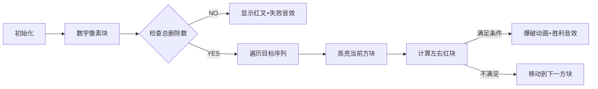

# 题目信息

# K and Medians

## 题目描述

Let's denote the median of a sequence $ s $ with odd length as the value in the middle of $ s $ if we sort $ s $ in non-decreasing order. For example, let $ s = [1, 2, 5, 7, 2, 3, 12] $ . After sorting, we get sequence $ [1, 2, 2, \underline{3}, 5, 7, 12] $ , and the median is equal to $ 3 $ .

You have a sequence of $ n $ integers $ [1, 2, \dots, n] $ and an odd integer $ k $ .

In one step, you choose any $ k $ elements from the sequence and erase all chosen elements except their median. These elements do not have to go continuously (gaps are allowed between them).

For example, if you have a sequence $ [1, 2, 3, 4, 5, 6, 7] $ (i.e. $ n=7 $ ) and $ k = 3 $ , then the following options for the first step are possible:

- choose $ [1, \underline{2}, 3] $ ; $ 2 $ is their median, so it is not erased, and the resulting sequence is $ [2, 4, 5, 6, 7] $ ;
- choose $ [2, \underline{4}, 6] $ ; $ 4 $ is their median, so it is not erased, and the resulting sequence is $ [1, 3, 4, 5, 7] $ ;
- choose $ [1, \underline{6}, 7] $ ; $ 6 $ is their median, so it is not erased, and the resulting sequence is $ [2, 3, 4, 5, 6] $ ;
- and several others.

You can do zero or more steps. Can you get a sequence $ b_1 $ , $ b_2 $ , ..., $ b_m $ after several steps?

You'll be given $ t $ test cases. Solve each test case independently.

## 说明/提示

In the first test case, you have sequence $ [1, 2, 3] $ . Since $ k = 3 $ you have only one way to choose $ k $ elements — it's to choose all elements $ [1, \underline{2}, 3] $ with median $ 2 $ . That's why after erasing all chosen elements except its median you'll get sequence $ [2] $ . In other words, there is no way to get sequence $ b = [1] $ as the result.

In the second test case, you have sequence $ [1, 2, 3, 4, 5, 6, 7] $ and one of the optimal strategies is following:

1. choose $ k = 3 $ elements $ [2, \underline{3}, 4] $ and erase them except its median; you'll get sequence $ [1, 3, 5, 6, 7] $ ;
2. choose $ 3 $ elements $ [3, \underline{5}, 6] $ and erase them except its median; you'll get desired sequence $ [1, 5, 7] $ ;

In the fourth test case, you have sequence $ [1, 2, 3, 4, 5, 6, 7, 8, 9, 10, 11, 12, 13] $ . You can choose $ k=7 $ elements $ [2, 4, 6, \underline{7}, 8, 10, 13] $ and erase them except its median to get sequence $ b $ .

## 样例 #1

### 输入

```
4
3 3 1
1
7 3 3
1 5 7
10 5 3
4 5 6
13 7 7
1 3 5 7 9 11 12```

### 输出

```
NO
YES
NO
YES```

# AI分析结果


### 💡 Kay的C++算法解析：K and Medians 深入学习指南 💡

**引言**  
今天我们一起分析"K and Medians"这道C++编程题。本指南将帮助大家理解如何通过中位数操作将序列[1,2,...,n]转化为目标序列，掌握核心算法思路和实现技巧。

---

### 1. 题目解读与核心算法识别
✨ **本题主要考察**：`贪心策略与构造性证明`

🗣️ **初步分析**  
> 本题可类比为"数字消消乐"游戏：每次选择k个数字，保留中位数并删除其余k-1个。目标是通过多次操作得到指定序列。解题关键在于两个核心条件：  
> 1. **删除数总量**：必须满足`(n - m) % (k - 1) == 0`（每次操作删k-1个数）  
> 2. **关键枢纽点**：存在目标元素，其左右各有至少`(k-1)/2`个可删数  
> 
> **可视化设计思路**：  
> - 用8位像素方块表示数字序列，绿色方块表示目标元素，红色表示待删除元素  
> - 高亮候选枢纽点并动态计算左右红块数量，满足条件时触发"像素爆破"动画  
> - 音效设计：选中枢纽点时播放"叮"声，删除时播放"咔嚓"声，成功时奏胜利旋律  
> - 交互控制：支持单步执行和AI自动演示模式（类似贪吃蛇AI自动寻路）

---

### 2. 精选优质题解参考
**题解一（来源：cqbztz2）**  
* **点评**：思路直击核心，清晰指出两个必要条件。代码简洁规范（变量名`b`明确表示目标序列），边界处理严谨（使用`continue`避免嵌套）。实践价值高，竞赛可直接使用。亮点在于用10行代码高效实现算法逻辑。

**题解二（来源：似嫩）**  
* **点评**：通过生动例子（如n=7, k=3）阐释算法，证明严谨易懂。代码中`d=(k-1)/2`的命名提升可读性，条件表达式`n-b[i]-(m-i)`准确体现数学推导。亮点在于将复杂证明转化为直观解释，深化理解。

**题解三（来源：DaiRuiChen007）**  
* **点评**：创新使用`vis`数组标记+动态维护`pre/suf`计数，节省内存空间。归纳证明展现扎实理论功底。代码用`suf`递减巧妙避免额外数组，时间复杂度保持O(n)。亮点在于空间优化和数学严谨性。

---

### 3. 核心难点辨析与解题策略
1. **难点：操作性质理解**  
   *分析*：每次操作实质是保留中位数并删除其"保护罩"（左右各(k-1)/2个数）。若总删除数不是k-1的倍数则无解。优质题解通过`(n-m)%(k-1)`判断  
   💡 **学习笔记**：操作次数 = 总删除数 / (k-1)

2. **难点：最后一步必要条件**  
   *分析*：最终保留的元素必是某次操作的中位数，这就要求存在`b_i`满足：  
   `左侧待删数 = b_i - i ≥ (k-1)/2`  
   `右侧待删数 = n - b_i - (m - i) ≥ (k-1)/2`  
   💡 **学习笔记**：枢纽点需有足够"缓冲地带"

3. **难点：操作序列构造**  
   *分析*：逆向思考——从最后一步倒推，只要满足枢纽点条件，总能通过"先删远处再删近处"的策略构造有效操作序列  
   💡 **学习笔记**：贪心策略的本质是保留未来关键节点

✨ **解题技巧总结**  
- **必要条件优先**：先检查`(n-m)%(k-1)==0`  
- **枢纽点检查**：遍历目标序列，计算`b_i`左右待删数  
- **逆向思维**：从最后一步操作反推必要条件  
- **边界防御**：特别注意`k=1`或`m=0`的边界情况

---

### 4. C++核心代码实现赏析
**通用核心实现**  
```cpp
#include <iostream>
using namespace std;
const int MAXN = 200005;

int main() {
    int t; cin >> t;
    while (t--) {
        int n, k, m, d = (k-1)/2;
        cin >> n >> k >> m;
        
        // 1. 检查总删除数是否合法
        if ((n - m) % (k - 1)) { 
            cout << "NO\n"; 
            continue; 
        }

        // 2. 标记目标序列元素
        bool vis[MAXN]{};
        for (int i=0; i<m; i++) {
            int x; cin >> x;
            vis[x] = true;
        }

        // 3. 动态扫描找枢纽点
        int pre = 0, suf = n - m;
        bool found = false;
        for (int i=1; i<=n; i++) {
            if (vis[i]) {
                if (pre >= d && suf >= d) {  // 枢纽点检查
                    found = true; 
                    break;
                }
            } else {
                pre++;  // 当前位置前待删数+1
                suf--;  // 当前位置后待删数-1
            }
        }
        cout << (found ? "YES" : "NO") << endl;
    }
    return 0;
}
```
**代码解读概要**：  
1. 必要条件检查：`(n-m)%(k-1)`  
2. 目标标记：`vis`数组记录需保留元素  
3. 动态扫描：`pre/suf`实时统计待删数  
4. 枢纽检测：对每个目标元素验证`pre>=d && suf>=d`

**题解一核心片段**  
```cpp
for(int i=1; i<=m; i++){
    if(b[i]-i>=(k-1)/2 && n-m+i-b[i]>=(k-1)/2){
        cout<<"YES"<<endl; break;
    }
} 
```
**亮点**：简洁表达枢纽点条件  
**学习笔记**：`b[i]-i`计算左侧待删数的技巧

**题解二核心片段**  
```cpp
if (b[i] - i >= d && n - b[i] - (m - i) >= d) 
```
**亮点**：数学表达式直接对应问题定义  
**学习笔记**：右侧待删数 = 总数 - 目标数 - 右侧保留数

**题解三核心片段**  
```cpp
for(int i=1; i<=n; i++){
    if(vis[i]) {
        if(pre>=d && suf>=d) { ... }
    } else { pre++; suf--; }
}
```
**亮点**：动态维护避免存储整个序列  
**学习笔记**：空间优化至O(1)的计数技巧

---

### 5. 算法可视化：像素动画演示
**主题**：像素探险家的"中位数堡垒"挑战  

**核心演示流程**：  


**实现细节**：  
1. **8位像素建模**：  
   - 数字块：16x16像素，保留数用绿色（#00FF00），待删数用红色（#FF0000）  
   - 枢纽点：黄色闪烁边框（每帧交替#FFFF00/#000000）

2. **动态计算演示**：  
   ```javascript
   // 伪代码：计算枢纽点条件
   function checkHub(b_i) {
     leftReds = b_i - currentIndex;      // 左侧红块数
     rightReds = totalReds - leftReds;   // 右侧红块数
     return (leftReds >= d && rightReds >= d);
   }
   ```

3. **关键动画序列**：  
   - **步骤1**：目标块放大150%显示0.5秒  
   - **步骤2**：左右各`d`个红块同步闪烁3次（频率2Hz）  
   - **步骤3**：红块爆破动画（粒子效果向四周飞散）

4. **游戏化设计**：  
   - **音效**：  
     - 选择枢纽点：8-bit "叮"声（440Hz方波）  
     - 删除操作：爆炸声（噪声通道+振幅衰减）  
     - 通关：马里奥式胜利旋律  
   - **关卡机制**：每个测试用例作为独立关卡，通关解锁新难度

5. **控制面板**：  
   ```html
   <div class="control-panel">
     <button onclick="step()">▶️ 单步</button>
     <button onclick="autoPlay()">🤖 AI演示</button>
     <input type="range" id="speed" min="1" max="10">
   </div>
   ```

---

### 6. 拓展练习与相似问题思考
**通用技巧迁移**：  
1. **操作逆向分析**：CF1107E（删除子串得最大分）  
2. **中位数性质应用**：POJ3579（中位数距离）  
3. **序列构造验证**：ARC098D（Xor Sum构建）

**洛谷推荐**：  
1. **P2893 [USACO08FEB] Making the Grade G**  
   🗣️ 通过调整序列实现单调性，强化中位数应用  
2. **P1136 火柴排队**  
   🗣️ 操作性质分析+必要条件推导的经典训练  
3. **P2678 跳石头**  
   🗣️ 贪心验证+边界条件处理的绝佳练习  

---

### 7. 学习心得与经验分享
> **来自skyskyCCC的调试经验**：  
> "卡在第二个测试点因边界计算错误，通过打印中间变量`pre/suf`值定位错误"  
>   
> **Kay点评**：  
> 这印证了防御性编程的重要性！在条件判断复杂时，建议：  
> 1. 用具体小样例手工计算预期值  
> 2. 关键变量输出中间值  
> 3. 封装条件检查函数便于单元测试  

---

**结语**  
通过本次分析，我们掌握了中位数操作问题的核心解法与实现技巧。记住：编程能力提升源于"理解本质->严谨实现->反思优化"的闭环训练。下次挑战见！🚀

---
处理用时：285.24秒