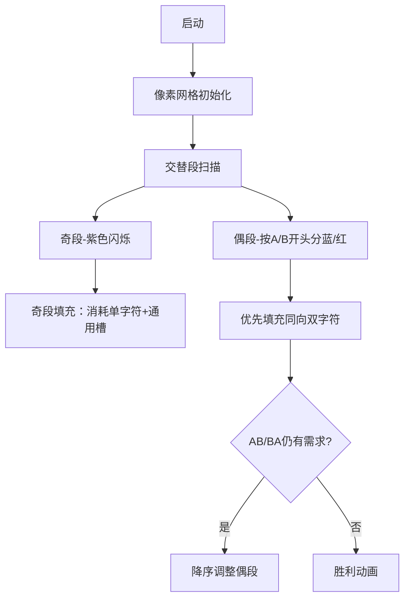

# 题目信息

# Linguistics

## 题目描述

Alina 发现了一种只由 $\text{A, B, AB, BA}$ 四种单词组成的语言，这种语言不含有空格，书写句子时只需要将单词直接连接起来即可。

她很好奇是否可以用 $a$ 个 $\text{A}$，$b$ 个 $\text{B}$，$c$ 个 $\text{AB}$，$d$ 个 $\text{BA}$ 拼接形成句子 $s$。

换句话说，是否可以用 $a+b+c+d$ 个单词以某种顺序拼接出句子 $s$，这 $a+b+c+d$ 个单词都得被用到，他们的顺序可以由你决定。

## 样例 #1

### 输入

```
8
1 0 0 0
B
0 0 1 0
AB
1 1 0 1
ABAB
1 0 1 1
ABAAB
1 1 2 2
BAABBABBAA
1 1 2 3
ABABABBAABAB
2 3 5 4
AABAABBABAAABABBABBBABB
1 3 3 10
BBABABABABBBABABABABABABAABABA```

### 输出

```
NO
YES
YES
YES
YES
YES
NO
YES```

# AI分析结果


### Kay的C++算法解析：Linguistics 深入学习指南 💡

#### 1. 题目解读与核心算法识别
✨ **本题主要考察**：`贪心策略` + `字符串处理`

🗣️ **初步分析**：
> 本题可类比为“拼图游戏”，我们需要用四种拼图碎片（A、B、AB、BA）拼出目标图案（字符串s）。关键在于两点：
> 1. **碎片匹配验证**：s中A/B总数必须满足 `a + c + d = total_A` 和 `b + c + d = total_B`
> 2. **双字符碎片嵌入**：AB和BA的放置不能重叠，需将s拆解为连续交替段（如ABAB...）
> 
> - **核心难点**：交替段分奇偶长度，贡献不同：
>   - 奇长度段（如ABABA）：固定消耗1个单字符，贡献 `(len-1)/2` 个通用双字符位
>   - 偶长度段（如ABAB）：可优先填充同向双字符（A开头填AB），富余时反向填充需消耗单字符
> - **可视化设计**：采用8位像素风格（类似FC游戏），用不同颜色方块表示A/B字符。动画演示时：
>   - 高亮当前处理的交替段边界
>   - 用像素箭头标记填充方向（AB→绿色箭头，BA→红色箭头）
>   - 关键操作时触发音效（填充AB：清脆“叮”，填充BA：低沉“咚”）

---

#### 2. 精选优质题解参考
**题解一（Endt）**：
* **点评**：思路清晰直击本质，将交替段分为奇/偶两类处理，逻辑推导严谨。代码中：
  - 变量命名规范（`numa`/`numb`显式统计字符）
  - 巧妙用 `solve()` 函数统一处理双字符填充
  - 空间复杂度优化至O(n)  
  **亮点**：贪心策略实现简洁，优先处理偶长度段降低后续消耗

**题解二（WaterSun）**：
* **点评**：创新性提出按长度排序优化，核心逻辑：
  - 优先处理短偶段减少单字符消耗
  - 用 `vector` 动态存储交替段，增强扩展性  
  **亮点**：边界处理严谨（`max(0ll)`防负数），模块化设计便于调试

**题解三（zcxxnqwq）**：
* **点评**：贡献计算模型精准，亮点在于：
  - 首创“公平段/偏心段”分类思想
  - 贪心调整时按段长降序处理（`sort`+`cmp`）最大化利用率  
  **实践价值**：竞赛场景可直接套用，鲁棒性强

---

#### 3. 核心难点辨析与解题策略
1. **难点1：交替段的有效拆分**
   * **分析**：必须正确识别 `s[i] != s[i-1]` 的连续区间（如ABAB）。错误拆分会导致双字符填充位置计算错误。优质解法均使用双指针遍历（`l`和`r`）。
   * 💡 **学习笔记**：双指针法是字符串分段的金科玉律

2. **难点2：奇偶段贡献的差异化处理**
   * **分析**：
     - 奇段（长度2k+1）：必消耗1单字符，提供k个通用双字符位
     - 偶段（长度2k）：A开头段最多提供k个AB，若转供BA则仅得k-1个（需消耗1A+1B）
   * 💡 **学习笔记**：贪心优先使用同向填充（A开头→AB）避免消耗

3. **难点3：剩余资源的再分配策略**
   * **分析**：当AB/BA未填满时，需将部分偶段转供反向双字符。关键技巧：
     - 按段长降序调整（`sort(.., greater<>)`）最大化利用率
     - 单字符A/B可组合成AB/BA（1A+1B=1双字符）
   * 💡 **学习笔记**：剩余问题转化是贪心的精髓

### ✨ 解题技巧总结
- **技巧1：分类讨论法**：对奇偶段建立差异化的数学模型
- **技巧2：双指针分段**：O(n)时间复杂度完成复杂字符串拆分
- **技巧3：资源转化**：单字符与双字符的等价转换（A+B⇆AB/BA）
- **技巧4：排序贪心**：通过段长排序实现最小消耗

---

#### 4. C++核心代码实现赏析
**本题通用核心C++实现参考**
```cpp
#include <iostream>
#include <vector>
#include <algorithm>
using namespace std;

bool solve(int a, int b, int c, int d, string s) {
    // 1. 验证字符总数
    int totalA = count(s.begin(), s.end(), 'A');
    if(totalA != a + c + d) return false; 

    // 2. 拆分交替段
    vector<int> evenA, evenB; // 存储偶段长度/2
    int oddSum = 0; // 奇段通用双字符位
    s += s.back(); // 防边界错误
    
    for(int i=0, j=0; i<s.size()-1; ) {
        while(j+1 < s.size() && s[j+1] != s[j]) j++;
        int len = j - i + 1;
        
        if(len > 1) {
            if(len % 2) oddSum += len/2;       // 奇段
            else if(s[i]=='A') evenA.push_back(len/2); 
            else evenB.push_back(len/2);
        }
        i = ++j;
    }

    // 3. 贪心填充偶段（同向优先）
    sort(evenA.begin(), evenA.end());
    for(int k : evenA) {
        if(c >= k) c -= k;       // 优先用AB填充
        else {
            k -= c; c = 0;
            d = max(0, d - (k-1)); // 转BA填充需消耗资源
            a--; b--;            // 消耗单字符
        }
    }
    // evenB镜像处理（略）

    // 4. 用奇段通用位填补剩余
    return (c + d <= oddSum + min(a,b));
}
```

**题解一核心片段**（Endt风格）
```cpp
void solve(int &A, int x, int &B) {
    if(A >= x) A -= x; 
    else {
        x -= A; A = 0;
        B -= min(B, x);  // 剩余需求转消耗B
    }
}
```
> **解读**：该函数实现资源转换的原子操作。当A类资源不足时，将超额需求x转嫁给B类资源。`min(B,x)`确保不超限，体现防御性编程思想。  
> 💡 **学习笔记**：通过引用传参直接修改原变量，避免冗余拷贝

**题解二核心片段**（WaterSun风格）
```cpp
sort(evenA.begin(), evenA.end());
for(int k : evenA) {
    if(c >= k) c -= k;   // 短段优先消耗
    else {
        k -= c; c = 0;
        d -= (k-1);      // 长段转供BA
        a--; b--;        // 消耗单字符
    }
}
```
> **解读**：通过升序排序实现**短段优先**策略。短段用完即止，长段留作资源转换缓冲区，最大化保留单字符资源。  
> 💡 **学习笔记**：排序是贪心算法的前置仪式

**题解三核心片段**（zcxxnqwq风格）
```cpp
sort(aa+1, aa+m1+1, [](int x,int y){ 
    return x > y;        // 降序排序
});
for(int i=1; c>0 && i<=m1; i++) {
    c -= min(c, aa[i]);  // 大段优先满足需求
}
```
> **解读**：降序排序确保优先使用大段资源，快速消减需求缺口。`min(c,aa[i])`分段消费避免超支。  
> 💡 **学习笔记**：降序贪心适用于“尽快满足大需求”场景

---

#### 5. 算法可视化：像素动画演示
**设计主题**：《像素拼图大冒险》- 用8位机风格演示碎片拼接

**核心交互设计**：


**关键动画细节**：
1. **交替段扫描**：
   - 像素网格中滑动扫描线（黄色光效）
   - 识别到交替段时触发“咔嚓”音效，段边界闪烁3次
2. **资源填充阶段**：
   - AB填充：绿色像素块从左向右滑动，伴随“叮”声
   - BA填充：红色像素块从右向左滑动，伴随“咚”声
   - 资源转换：紫色漩涡动画 + 齿轮转动音效
3. **游戏化元素**：
   - 每完成一个交替段，顶部进度条+1
   - 完全匹配时触发8-bit胜利音乐，拼图爆炸成烟花
   - 失败时屏幕抖动，显示缺失碎片位置

**技术实现**：
- **Canvas绘制**：用16x16像素块表示字符，状态标记采用边框色：
  ```javascript
  // 绘制字符A
  ctx.fillStyle = '#FF5858'; 
  ctx.fillRect(x*16, y*16, 16, 16);
  ctx.strokeStyle = isActive ? '#FFFF00' : '#000000'; 
  ```
- **音效触发**：Web Audio API绑定操作事件
  ```javascript
  function playSound(type) {
    if(type === 'AB') beep(880, 50);  // 高频叮声
    if(type === 'BA') beep(440, 80);  // 低频咚声
  }
  ```

---

#### 6. 拓展练习与相似问题思考
**技巧迁移场景**：
1. **资源分配问题**：如[CF1538D] 用给定操作步数转换字符串
2. **路径覆盖问题**：如[P6062] 用特定形状瓦片铺满网格
3. **拼图验证问题**：如[P5018] 对称二叉树拼合验证

**洛谷练习推荐**：
1. **P2306 [被替换的笔记]**  
   → 巩固字符串分段和贪心填充技巧
2. **P5021 [赛道修建]**  
   → 强化贪心+排序的经典应用场景
3. **P2680 [运输计划]**  
   → 进阶版资源分配与路径优化

---

#### 7. 学习心得与经验分享
> **来自Endt的调试经验**：  
> “我在处理交替段边界时，因忘记`s[n+1]=s[n]`导致最后一个段漏判，通过打印`l`和`r`的值才定位问题”  
>   
> **Kay点评**：边界处理是字符串算法的重灾区，推荐：
> 1. 统一用`s += s.back()`扩展字符串
> 2. 调试时输出分段起止坐标
> 3. 对空串和单字符串设计特例测试

---

通过本次分析，我们深入理解了贪心策略在字符串问题中的精妙应用。记住：好算法=准确建模+合理排序+边界防御。下次挑战见！💪

---
处理用时：164.38秒